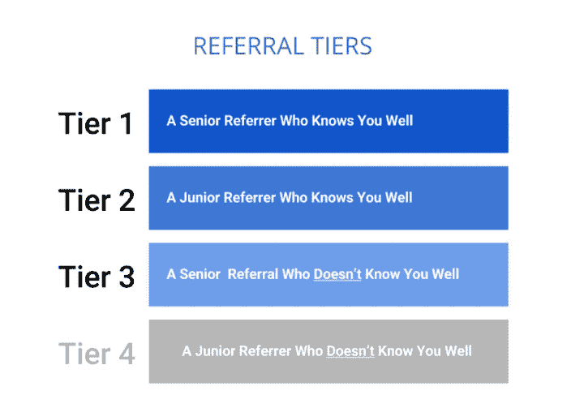

# 优质推荐的力量

> 原文：<https://medium.com/swlh/power-of-quality-referrals-2b51b0eee0b2>

内部推荐背后鲜为人知的事实

# 我自己的故事

那是 2003 年。我刚刚从德雷克塞尔大学毕业，获得了计算机网络博士学位。我有一份不错的学术出版物清单，但没有行业经验。我不认识任何顶尖科技公司的人。我向许多地方投了简历，但是没有得到回应。我失业了 3 个月，最后才得到微软的面试机会。幸运的是，我在西雅图找到了那份工作。

快进 3 年。由于家庭原因，我需要从西雅图搬到匹兹堡，并听说谷歌即将在那里开设办事处。所以我联系了一些从微软跳槽到谷歌的朋友，请他们投递我的简历。接下来的一周，我接到了谷歌的电话。几个月后，我成为了谷歌匹兹堡的首批成员之一。

又过了 10 年，有了几个机器学习项目，我仍然愉快地在谷歌工作。与高管团队关系密切的人把我的名字给了初创公司 Sumo Logic，他们找到了我。几周后，我加入了他们，担任他们的机器学习主管。

乍一看，我的旅程可能会让一些人得出结论，拥有更多相关经验有助于一个人找到工作。这是真的，但对于目前正在找工作但没有相关经验的人来说，这似乎不可行。“你告诉我更多的相关经验会有所帮助，但我无法很快增加我的经验，所以这个建议对我没有太大帮助。”我们以前都从沮丧的求职者那里听说过这种“第 22 条军规”,无论是应届毕业生，还是想要尝试不同事物的有经验的专业人士。

那么，让我们深入了解一下。在这里我们能找到什么**可操作的**见解吗？

是的。这里隐藏的知识是质量推荐的**力量。这是可行的。**

# 为什么推荐很重要？

谷歌每年会收到超过 100 万份简历。根本没有办法让所有这些简历都被人审阅。大多数简历被简单地分析，存储在数据库中，再也不会被查看——只有极少数会被发现。

推荐所做的是增加你的可发现性。

想象一下。在机场登记时，

*   A 线有 1000 人在等待，还有 5 名安保人员。
*   B 线有 50 名等候人员和 20 名保安人员。

你喜欢哪一行？

在上面的例子中，A 行代表所有自我申请公司的候选人，而 B 行代表所有推荐的候选人。你可能会问，为什么公司 B 线招聘人员多？如果 B 线更短，把一些招聘人员挪到 A 线不是很有意义吗？

答案在于组织效率。

对于这家特定的公司，假设今年的需求是雇佣 100 人。这是一个优化问题，这里的目标是最小化实现招聘需求所需的资源/努力。对于任何优化问题，解决方案总是在于将更多的精力放在系统中更高效的部分。在这种招聘系统中，推荐会更有效率，因为候选人会经过现有员工的初步审查，因此，平均而言，他们的验证成本会比在线自我提交更低。

因此，众所周知，谷歌 50%的员工来自推荐，在许多其他公司也观察到类似的数字。

# 所有的推荐都是平等的吗？

你可能会说，“好的，明白了。我会在那家公司里找个人把我的名字写上去。”但是，等等，还有一个更重要的话题要讨论。并非所有的推荐都是平等的。

在我的职业生涯中，我与许多招聘人员和招聘经理合作过。根据我的经验，有一个共同的主题:推荐是分层次的。

第一层:非常了解你的高级推荐人

最强有力的推荐是由一家公司的资深成员完成的，他非常了解你，会为你说好话。

例如，如果一个主管为你推荐一个人，并说，“非常优秀的工程师。我很乐意雇佣这个人加入我的团队，”这让你在面试中排在第一位，随后，在最终的雇佣决定中有很大的分量。

第二层:非常了解你的初级推荐人

并不是每个人都认识公司的高层，所以很难获得一线推荐。如果做不到这一点，你应该找一个职位较低但仍然足够了解你的人。

例如，如果一家公司的初级成员为你推荐一个人，并说“我和这个人一起工作了两年，可以担保他/她的执行速度和质量”，你很可能会很快接到电话。

第三层:不了解你的高级推荐人

如果在那家公司没有人足够了解你，但你可以设法找到一个拥有高级职位的社会熟人，你仍然可以在获得电话面试中有一些优势。这是因为招聘团队很可能会尊重一位资深人士的判断，即使这位资深人士只与你有过有限的互动，只是简单地说:“不太了解这个人；只随便聊了 15 分钟”。

第四层:不了解你的初级推荐人

如果你无法从上述层级中找到推荐你的人，一家不太了解你的公司的初级推荐人可能仍然会提供一些价值，尽管你在这里的机会不会很高。如果这样的推荐被招聘团队忽视，不要太惊讶。

# 你的第一次推荐很重要

现在你可能会说，“嗯，我现在没有任何 1 级推荐，但我有一个 4 级推荐。现在放入我的第四层推荐人没有坏处，如果我以后找到第一层，我可以再问一次。”

其实也不尽然。

事实是，你的第一次推荐很重要。很多时候，有人向我寻求推荐。我同意并填写了那个人的姓名和简历。然后一名招聘人员给我发来一封电子邮件，说“这个人以前被许多其他初级成员推荐过，但被拒绝了。”在这一点上，我没有办法反驳。

但如果我是这个人的第一个推荐人，招聘人员有所怀疑，我可以说，“做一个电话筛选可能仍然值得更好地评估，”这可能会导致一个电话。

请注意，早期无效的推荐可能会破坏未来有效的推荐。所以试着让你的第一次推荐有价值。

# 我的故事，重温

现在让我们回到本文开头我自己的旅程，应用我们所知道的关于推荐的知识。

当我刚毕业时，我没有推荐人，获得任何面试或工作机会都是一场巨大的斗争。我在微软找到第一份工作需要很多运气。

当我从微软转到谷歌时，我得到了第三级推荐。谷歌的一名员工工程师推荐了我，尽管他只在社交上认识我。这让我很快打了第一个电话。

当我从 Google 转到 Sumo Logic 时，我得到了一级推荐。一个非常资深的人向管理团队说了我的好话。我一路被快速跟踪，并在一周内得到了这份工作。

## 这篇文章发表在《创业公司》杂志上，这是 Medium 最大的创业刊物，有 316，638 人关注。

## 订阅接收[我们的头条](http://growthsupply.com/the-startup-newsletter/)。

