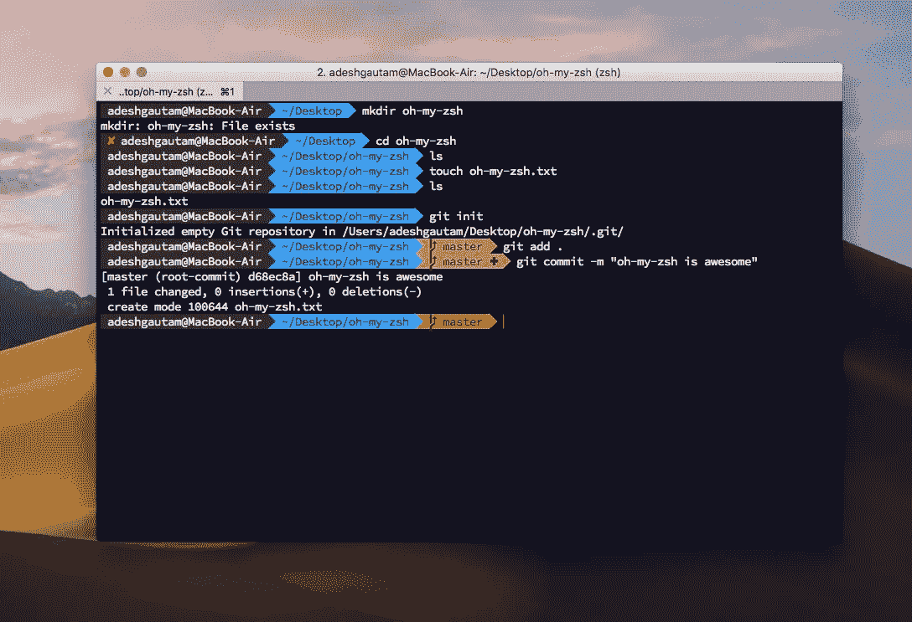
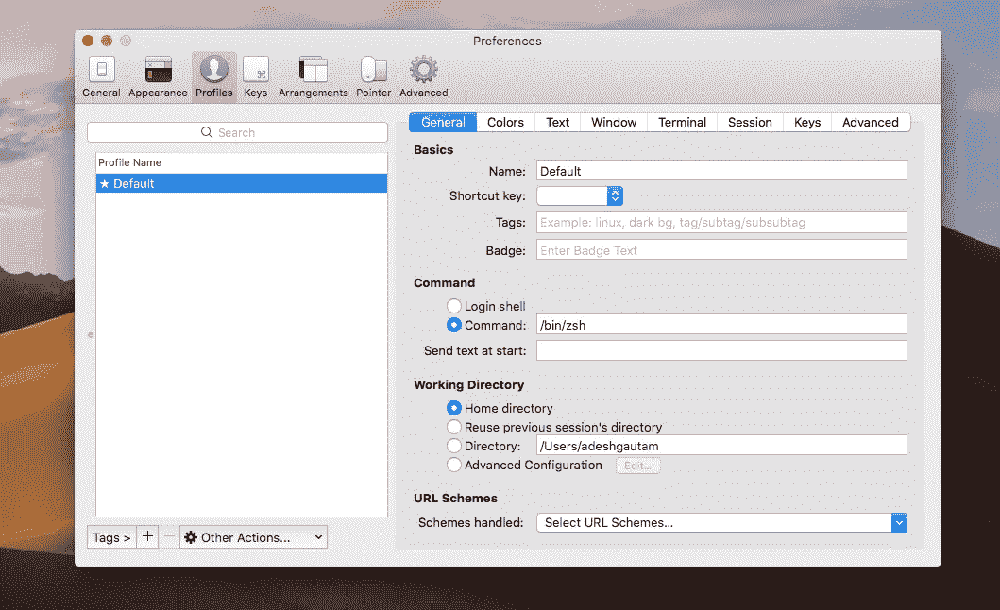
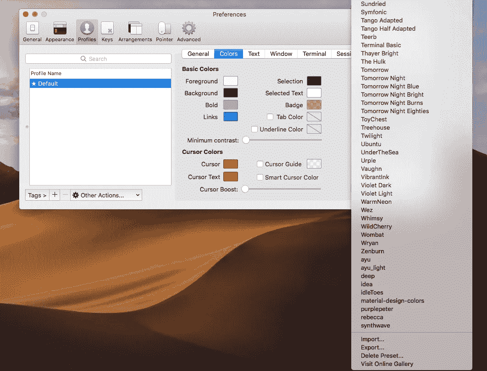

# 使用 Oh-my-Zsh + iTerm2 给终端加电

> 原文：<https://medium.com/swlh/power-up-your-terminal-using-oh-my-zsh-iterm2-c5a03f73a9fb>



# 想让你的终端看起来像上面那个一样酷吗？是吗？所以让我们开始吧！

# 1.首先，我们将使用自制软件安装 zsh。

如果你还没有安装家酿软件，在你的终端上粘贴下面几行来安装。

```
xcode-select --installruby -e "$(curl -fsSL https://raw.githubusercontent.com/Homebrew/install/master/install)"
```

# 2.现在安装 zsh

> Z shell(也称为 zsh)是构建在 bash(MAC OS 的默认 shell)之上的 Unix shell，具有额外的特性。

使用以下内容安装它:

```
brew install zsh
```

# 3.安装哦我的 Zsh

> Oh My Zsh 是一个开源的、社区驱动的框架，用于管理 Zsh 配置。它有许多定制终端的功能和许多可用的主题。

在您的终端中执行它:

```
sh -c "$(curl -fsSL [https://raw.githubusercontent.com/robbyrussell/oh-my](https://raw.githubusercontent.com/robbyrussell/oh-my)-zsh/master/tools/install.sh)"
```

# 4.安装 iTerm2

为了定制和安装主题，我们需要一个比 mac 上的默认终端更好的终端。

从[这里](https://www.iterm2.com/downloads.html)下载并安装。

# 5.将 zsh 设置为默认终端环境

a.前往 iTerm2 偏好设置。

b.转到配置文件->常规。

c.在命令文本框中粘贴 */usr/local/bin/zsh* ，重启 iTerm2。



Add /bin/zsh

# 6.安装主题

在这里 下载 [**的 zip 文件，将 zip 文件中 ***schemes*** 文件夹下 iTerm2(见右下角下面)的所有文件导入。**](https://github.com/mbadolato/iTerm2-Color-Schemes)



# 7.安装电力线字体

> 这些字体会让你的终端字体更好看。

将以下内容复制粘贴到您的终端中，重启您的终端并选择您喜欢的字体(电力线字体)。

```
git clone [https://github.com/powerline/fonts.git](https://github.com/powerline/fonts.git) --depth=1
cd fonts
./install.sh
cd ..
rm -rf fonts
```

**恭喜**👍 😃！！！您已经成功地在您的系统上安装了 Oh My Zsh。

现在您先前的设置被存储在**和*中。位于主目录的 bash_profile*** 未激活。所以要激活这些设置，打开 ***。bash_profile*** 文件，并将内容复制粘贴到 ***的末尾。zshrc*** 文件(是 Oh My Zsh 的设置文件)位于主目录下。重启终端，它就完成了。

这里有许多插件[](https://github.com/robbyrussell/oh-my-zsh/tree/master/plugins)**可以进一步增加您终端的功能。**

> **我的设置:**
> 
> **主题:阿尔戈瑙特**
> 
> **字体:电力线源代码专业版(14 磅)**

**[](https://medium.com/swlh)**

## **这个故事发表在 [The Startup](https://medium.com/swlh) 上，这是 Medium 最大的创业刊物，拥有 339，876+人关注。**

## **在这里订阅接收[我们的头条新闻](http://growthsupply.com/the-startup-newsletter/)。**

**[](https://medium.com/swlh)**