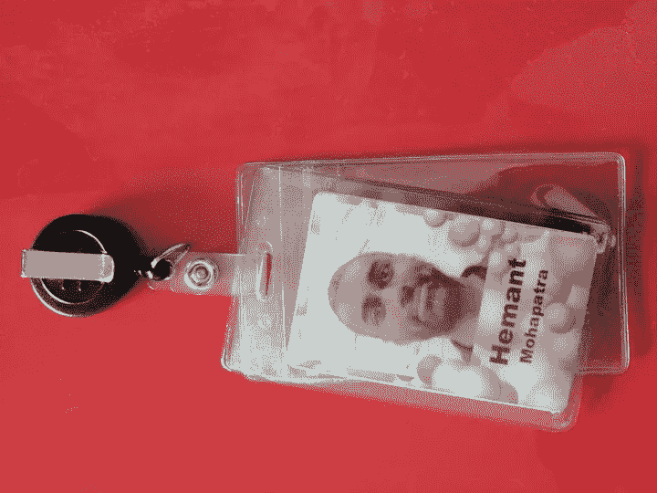

# 我在谷歌 5 年的职业实践经验

> 原文：<https://medium.com/swlh/practical-career-lessons-from-my-5-years-at-google-ba254e40b7f1>

## (2017 年发布的旧文章—转载自我的 [linkedIn](https://www.linkedin.com/in/hemantmohapatra/) )

我离开[谷歌云](https://medium.com/u/4f3f4ee0f977?source=post_page-----ba254e40b7f1--------------------------------)加入[安德森·霍洛维茨](https://medium.com/u/df45fd4a749d?source=post_page-----ba254e40b7f1--------------------------------)尝试成为一名硅谷风投已经一周了。谢谢大家的贺电！许多人问我是如何做出转变的，我在谷歌做了什么决定来发展我的职业生涯，等等。如果你对此感兴趣，请继续阅读。在开始一些对我有效的具体行动之前，我先列出一些“基本事实”:

# **地面真相:**

1.  职业生涯是一场漫长的游戏:在我进入谷歌之前，我失业了 8 个多月，被很多公司拒绝过，而且，非常接近我的英国签证过期。如果你在就业市场，放松，不断学习，不断会见潜在的雇主。不要为小事烦恼！
2.  你不能单独做这件事:我得到了许多人的帮助。我的朋友保罗-安德烈·雅米斯让我免费住在他那里；剑桥大学的大四学生菲利普·冯·比伯斯坦帮助进行面试练习；谷歌的凯茜·戈登(Cathy Gordon)和郑在中(Jae Jung)给了我一次机会，尽管我不是这份工作的最佳“人选”;剑桥法官商学院的朋友和老师的精神支持，等等。一旦我进入谷歌，这个名单就更长了。转发吧！

# 现在，我们来看看什么有效:

1.  建立一个你熟知的清晰、简单的实践。我的原则是:我不会留下任何未回复的信息。每一个请求，每一封电子邮件，每一条即时消息——不管来自谁，我都会在 24 小时内回复。
2.  做一些有人赌上自己职业生涯的项目。他们的赌注可能小到奖金/晋升，大到声誉。
3.  在你真正工作的早期选择你真正的“工作”。作为一名商业交易撮合者，我可以打赌每年会有几笔大交易成交，但都可能失败，或者我可以专注于做 10 笔可能都成功的小交易。我选择了前者，并被认为是一个不会碰小交易的人。这场赌博对我来说很好。
4.  出现在餐桌上。身体上。尽可能经常。我在谷歌的头两年，我骑自行车、走路、坐飞机或跑步穿过校园，亲自去参加会议。出现并和那些你有一天可能需要影响、反对、学习或需要帮助的人握手。
5.  关注你的优势，而不是劣势。我纠结于此。作为一名前工程师——而且是一名不错的工程师——我总觉得自己有点被排除在谷歌的行动之外。然而，我很快意识到我永远不可能成为世界上所有工程师中的前 0.0001%。但作为一名商业交易撮合者，似乎触手可及(时间会证明)。
6.  最终，坚持是唯一重要的事情。大多数难题需要很长时间。坚持解决问题，致力于解决问题，只有这样你才会进步。

最后，这是非常重要的一课，它不在列表中。

一切都是为了人民。

在一天结束的时候，我们都想高高兴兴地回家，与家人和朋友一起进餐。从长远来看，如果你不能给这种动力增加任何积极的东西，那么在你从中拿走一些东西之前离开。人们会忘记事实、数字、图表和几乎所有关于你的事情，但他们永远不会忘记你给他们的感觉。

## 这篇文章发表在《初创企业》杂志上，这是 Medium 最大的创业刊物，有 322，555 人关注。

## 订阅接收[我们的头条新闻](http://growthsupply.com/the-startup-newsletter/)。

