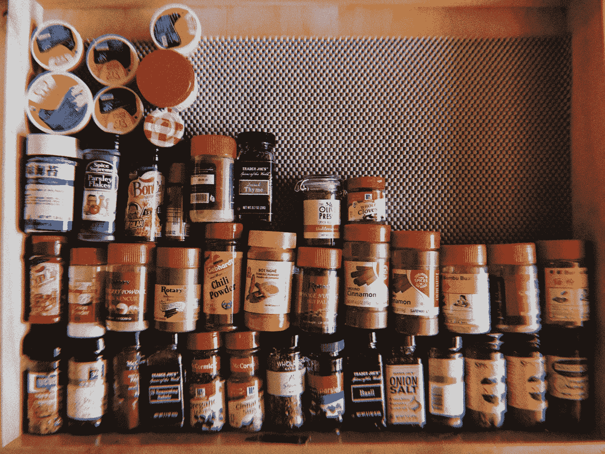
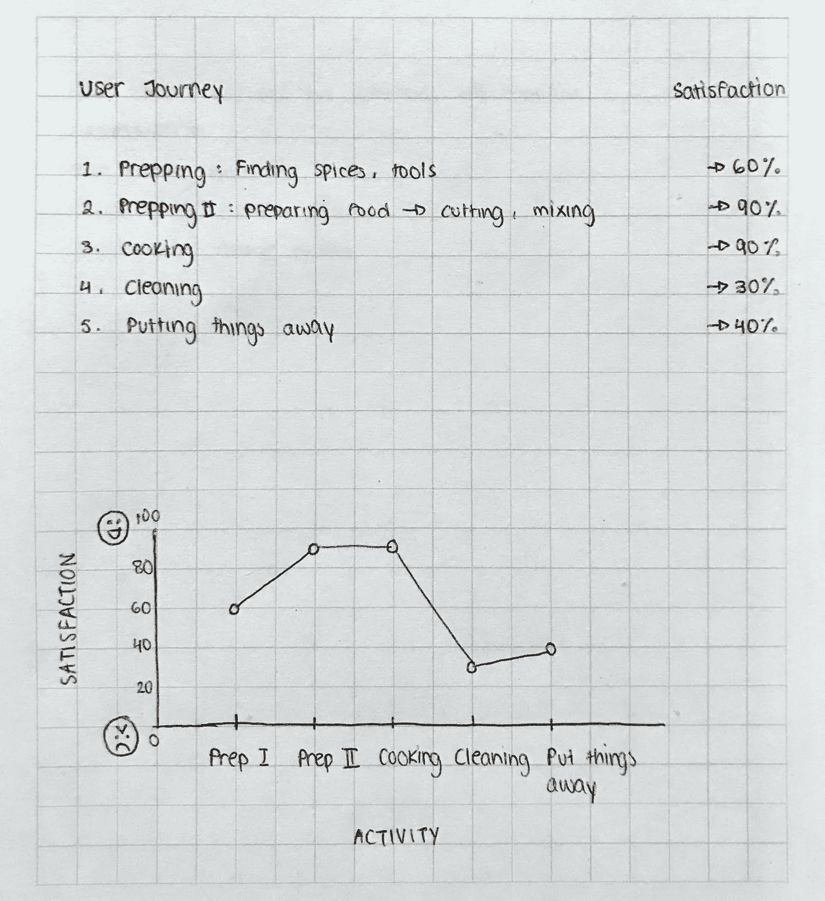
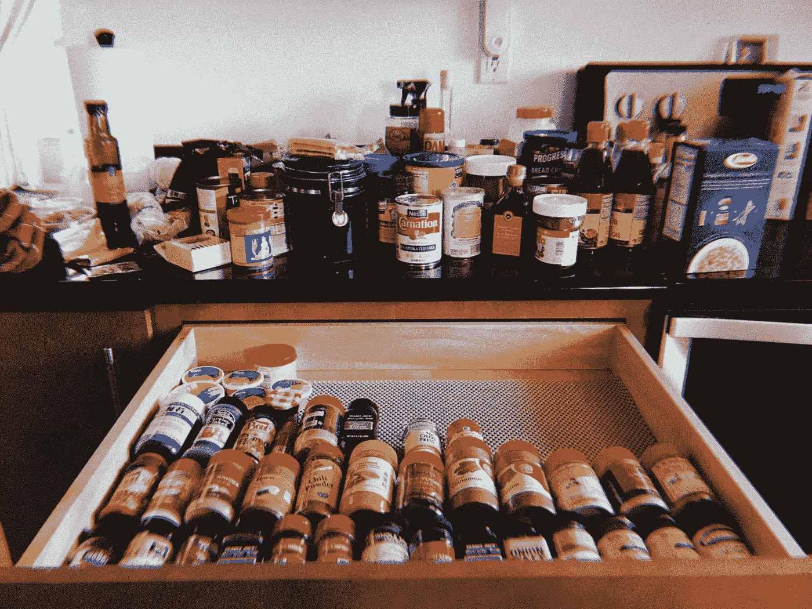

# 在厨房实践 UX 和无障碍设计

> 原文：<https://medium.com/swlh/practicing-ux-and-accessibility-design-in-the-kitchen-74f6481ca69>

回家会让你发现你在平常看不到的东西。就我而言，我回家后意识到我们的房子没有什么条理。

在我返校前短暂的在家时间里，我一直在努力让自己的时间变得更有成效——无论这意味着处理我的文件夹、简历还是兼职项目。但在家也意味着我可以实现自己的 Pinterest 梦想，并参与家居装修项目。很自然地，我决定着手我们家最有问题的部分——厨房。我和妈妈讨论了重组厨房的想法，她马上就同意了。

我收集了厨房组织的灵感，看看哪些适合我们的厨房，哪些不适合。我想了想我们的问题出在哪里。我考虑了解决厨房具体问题的最有效方法。我考虑了如何利用我们的资源，在现有的基础上再接再厉，而不是从零开始。

在把我们的垃圾抽屉改造成香料抽屉的过程中，我意识到我在考虑的事情和我在解决 UX 问题时会考虑的事情是一样的。作为一名设计师，我已经非常习惯于为屏幕设计，我认为记录将同样的 UX 原则应用于实际目的的过程会很有趣。我认为回归基础，学习将同样的技能应用到不同的领域是有价值的——即使这听起来有点傻。我认为重要的是用你所拥有的任何方法去学习，并从中获得乐趣。

与此同时，我一直对学习如何设计可访问性很感兴趣。这是一个需要设计师考虑身体残疾和环境因素的领域，这些因素可能会阻止人们使用某种技术，我认为这提供了一个完美的机会来学习如何在小范围内考虑可访问性。

3-minute research, written on the nearest notepad I could find

## 用户洞察

在我意识到想要记录这个过程之后，我决定更进一步，收集一些快速的见解。我抓起最近的记事本，列出了烹饪的主要步骤。之后，我让我妈妈评价她通常在执行每一步时有多开心。

## 目标用户

我妈妈是我们厨房的主要居民。她身高 5 英尺 2 英寸，精力充沛。她每天都做美味的食物，而美味的烹饪需要大量的香料。她非常喜欢烹饪，但她讨厌打扫卫生和收拾东西这种单调的工作。

我继父也是厨房的常客。他不怎么做饭，但他确实喜欢时不时地做些玉米片之类的小吃。他通常负责收拾碗碟。因为他很高，他是唯一能够到某些东西的人。

## 问题

香料碰巧存放在我们最上面的柜子里。我妈妈身高 5 英尺 2 英寸，她很难找到香料，所以每次她必须寻找时，她都会危险地爬到柜台上。我妈妈实际上站在柜台上，因为香料是无法获得的。

因为她讨厌清理，她倾向于把所有东西都扔进柜子或抽屉里；眼不见心不烦。随着时间的推移，这积累成一个巨大的混乱。

注意:我之前提到的垃圾抽屉太糟糕了，我在一系列厨房工具中找到了四个过时的电视遥控器、两个没用过的充电器和一个耳环。

## 解决方法

我想确保一切都井井有条，便于使用。我把厨房里常用的物品放在触手可及的地方，而不常用的物品放在较远的地方。同时，我希望我们的厨房仍然感觉熟悉和直观，所以我决定保持现有的流程。

我还想确保我不是通过简单的清理来修补问题；相反，我专注于修复整个系统，以便解决方案是可持续的。虽然这是一项需要立即完成的重大任务，但它有望获得长期成功，就像重新安排整个信息架构一样。

例如，我没有简单地清理调料柜，也没有让妈妈费力地去拿，而是把所有的调料都放进了一个更容易拿的抽屉里。这样，她可以很容易地找到她的香料，并能很快地把它们放好。

While we reorganized the spices

我还考虑过把更常用的杯子和更常用的盘子放在同一个柜子里，这样更容易拿取，但是我父母反对这个想法，理由有两个。出于一致性和美观的原因，我妈妈想把所有的杯子都放在同一个柜子里。我的继父不同意，并认为新的橱柜位置实际上会使它更难接近，因为我们的洗碗机的位置。当洗碗机的门打开时，会妨碍轻松接触某些橱柜。所以盘子和杯子留在原来的地方。就像 UX 一样，我必须摆脱我的假设，根据用户需求解决问题。

也许这个清理过程中最关键的部分是扔掉我们不需要的东西。我妈妈必须仔细检查每一件物品，决定哪些应该扔掉，哪些应该放在车库里。这很难，但却是必要的，这让我再次想起设计是如何让我们不断经历这个过程的——考虑每一个设计决策，只保留有用途的东西。

## 包裹

我们仍在重组厨房。这是一项很大的任务，很容易失去动力，但这就是为什么有可以帮助你的队友和你可以交流想法的队友是很重要的。

将我的设计思维技能应用到与我家人日常经历如此相关的事物中，令人耳目一新。虽然听起来很老套，但设计无处不在，我相信我们戴上的 UX 设计帽子应该超越我们的工作生活。

## 这篇文章发表在 [The Startup](https://medium.com/swlh) 上，这是 Medium 最大的创业刊物，拥有+367，690 名读者。

## 订阅接收[我们的头条](http://growthsupply.com/the-startup-newsletter/)。

