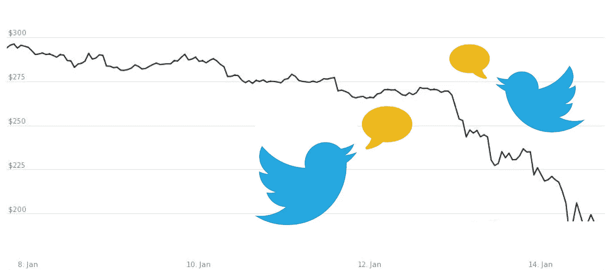
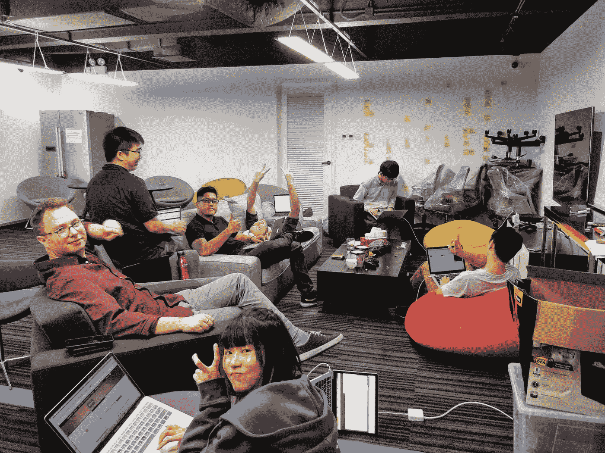

# 通过阅读推文预测比特币

> 原文：<https://medium.com/swlh/predict-bitcoin-by-reading-tweets-87e99d251fe6>

不久前，比特币证明了自己是最不稳定的加密技术。谁不知道呢，对吧？每个人都这样。这里没有意义:P

但是，我可以肯定地告诉你，由于我们周围突然发生的快速变化，事情变得不稳定。让我们试着想一想，是什么东西每天都在快速变化，影响着所有行业的一切？

> 你猜对了！社交平台。

人们在几毫秒内不断发推特、发帖和分享信息，这影响了他们的决定，是搬家还是不搬家、换工作、加入俱乐部，以及在我们的情况下买卖比特币。

了解到这一点，我们*的意思是* [*世界第一*](http://worldfirst.com/) *牛逼团队*开始思考我们是否可以利用这些信息尝试给人们一个工具，让他们可以尝试预测明天的比特币行为(增加/减少)，并帮助他们更好地理解影响这种行为的因素。所以我们试了一下(我们为这个项目花了一天时间)。

事不宜迟，我将在下一节开始解释我们完成的项目(检查[库](https://github.com/abdrmdn/BitcoinPrediction))。

## 该项目有 4 个主要部分:

*   核心，也就是机器学习部分(Python)
*   连接它们的 Api(PHP)
*   客户端部分(ReactJS)
*   运行繁重工作的 scraper 基础设施(Docker-swarm、GoogleCloud、一些 nodejs)

## 在深入研究细节之前，我先解释一下一般过程

用户将看到一个用户界面，将被提示输入(一些标签，标签代表用户希望算法基于其信息的池)，网站将向我们的预测 API 发送一个请求，该 API 将依次调用 2 个主要服务:tweets scraper 和机器学习脚本。刮刀将获得与用户提供的标签相关的所有推文，然后机器学习算法将基本上获得数据，对其进行预处理，并根据给定的数据做出预测，该值在第二天会增加还是减少。

现在，如果你真的想阅读更多关于这些过程的细节，你会在下一节后感到满意，否则那里会总结所有:)，不要忘记关注和鼓掌更多像这样有趣的文章。

# 现在让我们深入细节来满足我们极客的一面😄

## 1.核心，也就是机器学习部分

代码将基本上获得推文，推文同期的比特币价值，以及一个决定推文是否带来良好效果的字典。之后，它将处理这些推文，并检查推文中这些字典关键词的频率，并试图在这些频率值和第二天比特币的价值之间建立一种模式，这种模式将成为我们的模型。(目前该模型是线性的，因此可以对其进行改进，以使预测更加灵活)

使用这个模型，我们可以带来今天的推文，并预测明天的比特币价值。这将依次显示该值是减少还是增加。

## 2.连接它们的 API(PHP)

我们在 Lumen(Laravel 的一个微框架)和 Slim 微框架开始的时候就在想，这两个框架都很瘦，但功能强大且易于使用。这两个框架的文档都有很好的记录。

我们使用 Laravel 框架已经有一段时间了，它有点像 Lumen 之父，所以我们决定尝试一些新的东西，我们决定使用 Slim PHP 微框架。

我们的第一个方法是就 API 契约达成一致，然后我们继续为我们的消费者创建端点，这是我们的 web 客户端应用程序。

Web 客户端发送一个带有#hashtag 参数的 GET 请求，然后我们处理该请求，并向我们的另一个名为 Scrapper 的服务发送一个 POST 请求。Scrapper 然后施展魔法，从 Twitter 获取所有数据，并将其存储在我们的数据库中，然后我们向 Scrapper 发送另一个带有#hashtag 的 get 请求，以从数据库中获取所有数据，我们以 CSV 格式存储结果，并将其输入到我们的机器学习服务中，机器学习服务将执行魔法，并返回结果 0 或 1。
— 0 表示加密货币稳定或走低。
— 1 表示上涨。
基于这个结果，我们将按照我们的 API 合同把响应返回给我们的 web 客户端。

## 3.客户端部分(ReactJS)

正如您在资源库中看到的，您可以看出我们使用了 ReactJs，因为它现在非常流行，这是我们使用如此酷的框架的一个好机会。
检查[仓库](https://github.com/abdrmdn/BitcoinPrediction/tree/master/hackathon_frontend)。

## 4.负责繁重工作的铲运机基础设施

你可以看到我们使用了 Docker-swarm、GoogleCloud 和一些 nodejs 来实现这一点。
更多详情请参考 [*文档*](https://github.com/abdrmdn/BitcoinPrediction/tree/master/hackathon_twitter)

# 摘要

这就是这个伟大想法的全部，你可能仍然会争论这是否会带来完美精确的结果。但是，这不是这个快速黑客马拉松的重点。这一点是为了证明社交媒体确实在影响这些事情的发展方面发挥了作用。希望你喜欢这篇文章。

买一个那些[程序员贴纸](http://tidd.ly/8f345c71)，它们太棒了😍。

请继续关注我的媒体，获取更多像这样有趣的文章。

**特别感谢**([Michael Favila](https://www.linkedin.com/in/michaelfavila/?lipi=urn%3Ali%3Apage%3Ad_flagship3_search_srp_top%3BdFrhMda5Swq9ce5WlLhTzA%3D%3D&licu=urn%3Ali%3Acontrol%3Ad_flagship3_search_srp_top-search_srp_result&lici=JDL5yd0tQDyEics2zrpL3Q%3D%3D)、Leon Cheung、 [Tim Mohrbach](https://www.linkedin.com/in/tim-mohrbach-a9b3805b/) 、Joe NG、 [Swodha Jha](https://www.linkedin.com/in/swodha-jha-5114b517/) 、Sandra Zhao、 [Jenson Cheung](https://www.linkedin.com/in/jenson-cheung-7b874519/) )帮助建设这个项目。