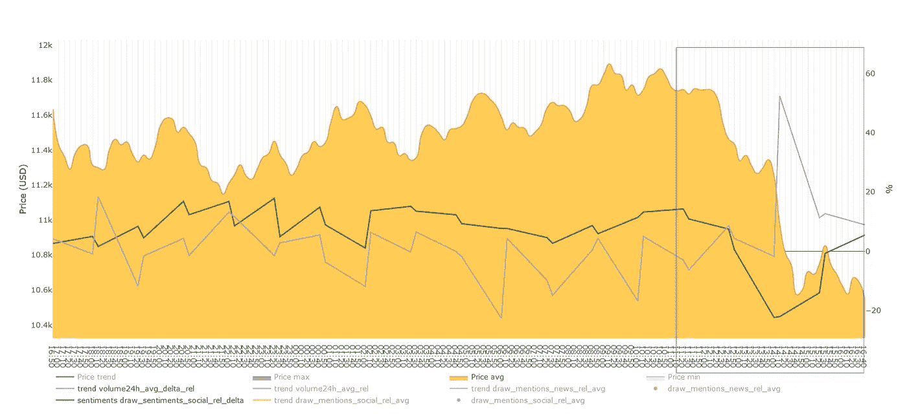
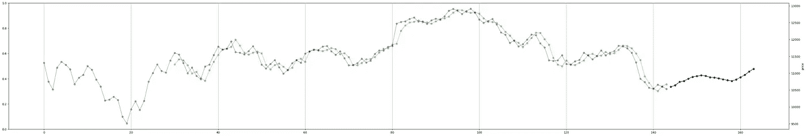
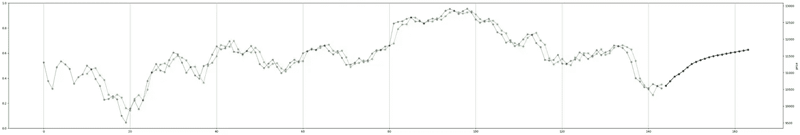
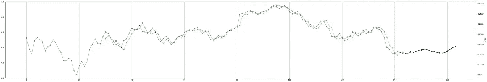
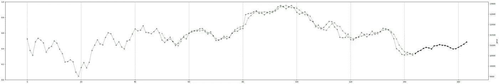
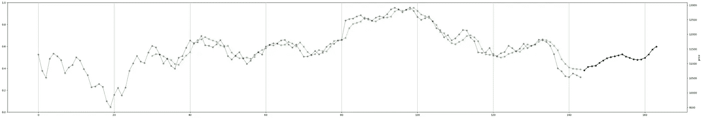
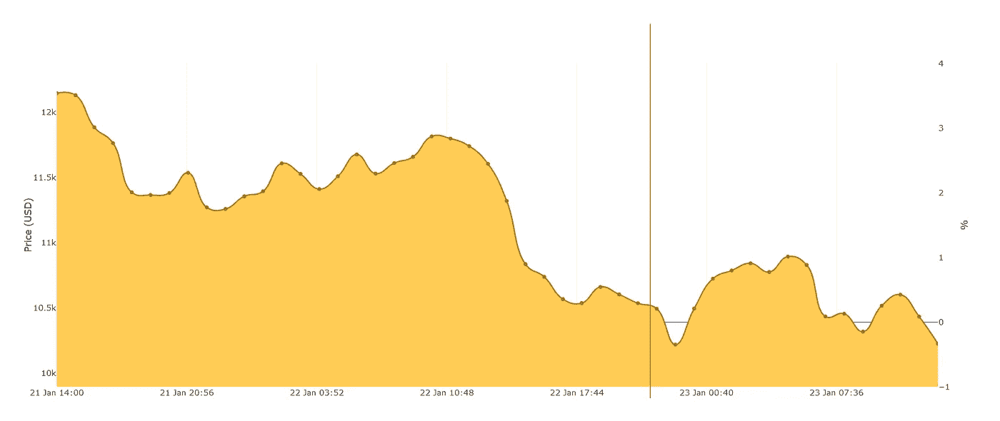
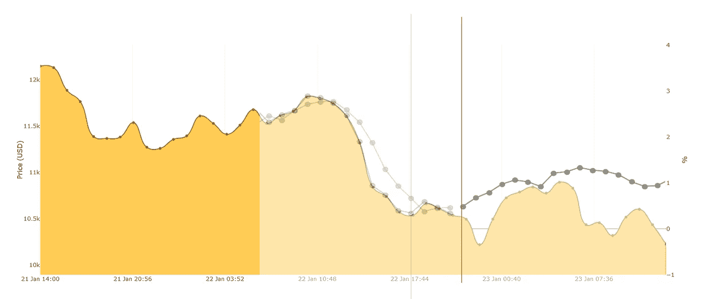

# 使用历史价格、交易量和社会炒作预测比特币价格

> 原文：<https://medium.com/swlh/predicting-bitcoin-price-using-historial-price-volume-and-social-hype-b0feb1eba940>

2018 年 1 月 21 日——几天前，我在情感分析算法中添加了一系列新词和表情符号。现在，我绘制了过去 24 小时内每隔 10 分钟的价格、成交量和情绪图:

对我来说，情绪(绿色)和音量(紫色)之间的关联程度令人震惊。我可以回顾整个情节，每个小时讨论一次，但我会把自己限制在蓝色矩形内。在某个时候，价格急剧下降(从 11.8k 下降到 11.4k)，同时社交媒体上的情绪也下降了(更多负面情绪)。但随后在最低时，交易量达到非常高的峰值，情绪开始上升(人们开始购买——以更低的价格购买)。所以现在情绪在稳步上升，所以我想知道这是否会使价格在接下来的几个小时内上涨或下跌。

PS:一旦我有了更多的体积数据，我会把它作为一个新的参数添加到机器学习算法中(&做一些预测)。

在 2018 年 1 月 22 日晚上，我使用三个参数做了一些预测:价格、绝对炒作数字和 24 小时成交量:

这些照片拍摄于 2018 年 1 月 22 日格林威治时间+1 点 21 分 30 秒。明天我会将这些与真实值进行比较。

【2018 年 1 月 23 日 —让我们看看我们对 BTC 兑美元价格的预测。下面是真实数据的图表。红线之前的一切都是昨天用来做预测的。而红线之后的一切都是新累积的数据: (红线是在 2018 年 1 月 22 日 21:30 GMT+1 点整画的)。

下面是我将预测放在真实数据之上的图像列表:
[https://i.imgur.com/5ns5xAs.png](https://i.imgur.com/5ns5xAs.png)
[https://i.imgur.com/mLZcrnC.png](https://i.imgur.com/mLZcrnC.png)
[https://i.imgur.com/73peYbj.png](https://i.imgur.com/73peYbj.png)
[https://i.imgur.com/jvNlRBv.png](https://i.imgur.com/jvNlRBv.png)
[https://i.imgur.com/sGpo9xf.png](https://i.imgur.com/sGpo9xf.png)

IMHO 这是最准确的预测:

它没有预测到 23:00(第二个预测点)的谷底，但对于接下来的 7 个小时/点，它是一个相当准确的预测(直到价格在 07:00 下跌)。给极客们一些提示:

*   每个点代表一个小时间隔。
*   这些预测使用了三个特征:价格、交易量和炒作。
*   所有的预测都使用了 LSTM 中的 2 个神经元。
*   唯一的变化是:LSTM 批量大小和输入序列长度。
*   训练时间为 144 小时(= 6 天)。但是，对于该卷，我只有 2 天的数据。在数据丢失的情况下，我通过使用屏蔽输入层让它忽略零值。

如需更多内容和来自其他论坛成员的反馈，请访问我的官方论坛-线程在这里:[https://www . blackhatworld . com/SEO/cryptocurrency-analysis-and-predictions-using-ai-and-big-data . 998766/](https://www.blackhatworld.com/seo/cryptocurrency-analysis-and-predictions-using-ai-and-big-data.998766/)

祝大家有美好的一天！:)
——伊利亚·内沃林

## 这篇文章发表在 [The Startup](https://medium.com/swlh) 上，这是 Medium 最大的创业刊物，拥有 289，682+人关注。

## 在此订阅接收[我们的头条新闻](http://growthsupply.com/the-startup-newsletter/)。

