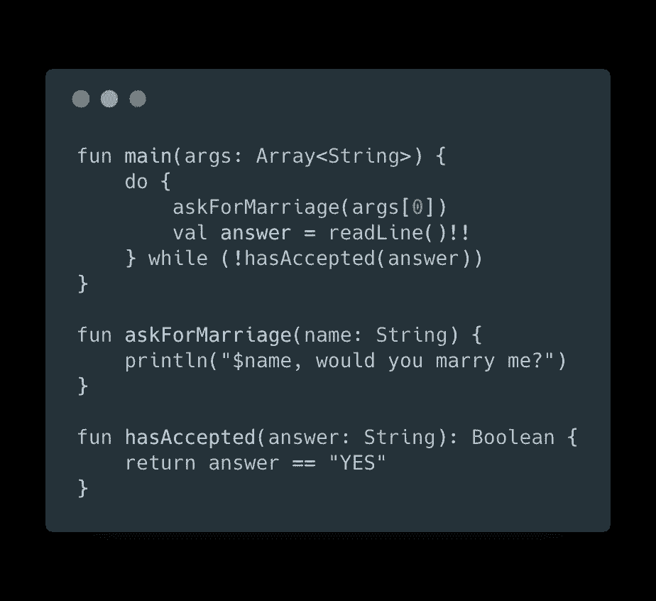
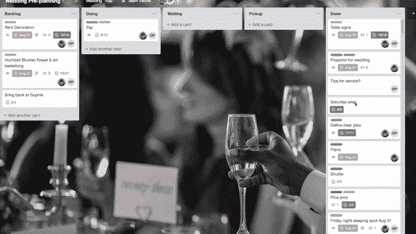
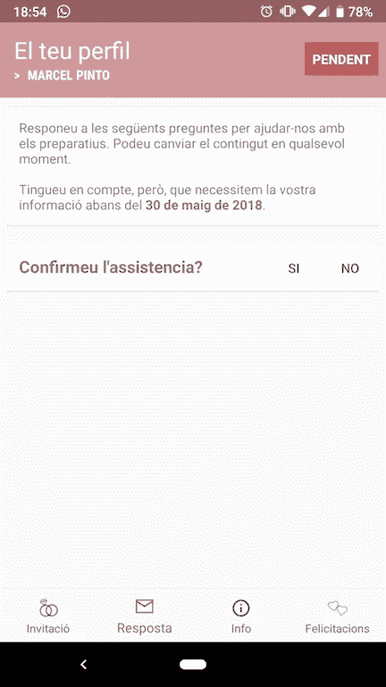
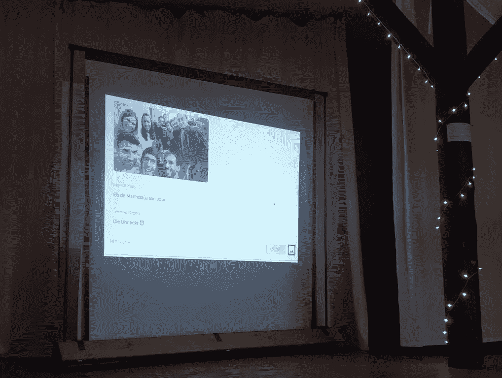
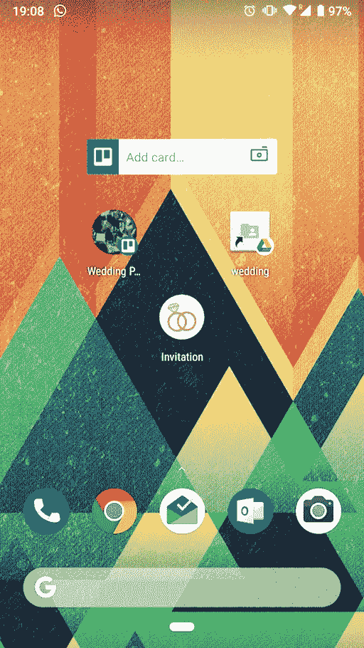

# 像 Android 开发者一样准备婚礼——第 1 部分

> 原文：<https://medium.com/swlh/preparing-a-wedding-like-an-android-developer-part-1-758315073ab7>

她答应了！

嗯……它发生了，我现在是一个已婚男人。那是一段艰难的旅程；我从来没有想过我可以享受筹备婚礼的乐趣。

你想知道诀窍吗？把你热爱和热衷的事情带进你的日常生活任务中。

就是这样！我像对待自己的个人项目一样对待婚礼的准备工作。(归根结底，这是一个项目，实际上是个人项目)

现在一切都结束了，我们享受了一个可爱的婚礼，所以我决定分享我的旅程。我将分几部分来解释:

1.  **准备**
2.  [**建筑**](/@marxallski/preparing-a-wedding-like-an-android-developer-part-2-7b6b1980160f)
3.  **嘉宾入职**
4.  **邀请函**
5.  **婚礼当天**

> 这是技术性的，别担心

# 准备工作

如前所述，我把它作为一个个人项目，但这一次我将与我的合作伙伴一起工作。

在第一部分，我将解释工具、最初的计划和我们的想法。请注意，您可以将这些应用于其他情况。

我们如何以不冲突的方式跟踪所有的任务、活动和想法？

为什么不使用看板实践？

## 特雷罗来救援了

你很可能认识 Trello，他是这类项目的最佳伙伴。

1.  设置一个有四列的公告板，待办事项，正在做，等待，完成
2.  为不同类别创建标签(餐饮、交通、酒店、客人……)
3.  开始用任务和想法填满它

正如你在上面的 gif 上看到的，有很多任务。Trello 可以很容易地跟踪他们，检查谁在做什么，添加一些截止日期等等。

> **额外提示:**添加到 Trello chrome 扩展
> [https://github.com/walteranderson/add-to-trello](https://github.com/walteranderson/add-to-trello)

接下来，我们需要一个地方来存储所有文件，如合同、演讲、信息和想法。

## Google Drive

当你开始得到你想要预订的东西的合同或信息时，情况会变得相当混乱，不仅如此，有时你还需要把事情写下来…

使用云！简单而容易，创建一些文件夹组织自己和共享文件和 excel 文件，两者可以同时编辑。

我们保存了这样的东西:

*   宾客名单
*   斯宾塞纸页
*   酒店预订和信息
*   与 DJ 的合同，地点等。

## 纸质请柬太过时了

我奶奶还在等邀请函，但是我们决定改做一个 App！

为什么不利用我的技能，用完全不同的方式邀请别人呢？

但我们不仅想发送邀请，我们还希望双向沟通，一个动态的应用程序，我们可以提供信息或帮助我们的客人。(我将在下一篇文章中探讨这个问题)

## 火焰基地！

一个完美的工具来启动这样一个应用程序，对于我们将拥有的用户量来说，它将是免费的！

如果你还不知道 Firebase，那就去看看吧

 [## 重火力点

### Firebase 是谷歌的移动平台，可帮助您快速开发高质量的应用程序并发展您的业务。

firebase.google.com](https://firebase.google.com/) 

## 留言簿很无聊

为什么不让它互动呢？

我们希望人们能够在婚礼之前、期间和之后分享他们的愿望、想法和照片，所以我们在应用程序上添加了一个功能，并提供了一个简单的带有聊天式留言簿的网站。

Live broadcast at the wedding

我害怕在婚礼期间直播(你知道…酒精，朋友，尴尬的图片…)但在最后，这是一个伟大的想法。

# 我们开始吧

我们有主要的工具设置；我们对自己需要什么有一个初步的想法。让我们建造它吧！

The home screen is ready!

在下一部分，我将分解应用程序的不同功能，并解释构建它的一些美丽的部分。

 [## 像 Android 开发者一样准备婚礼——第二部分

### 关于使用 Firebase 开发我的婚礼 Android 应用程序的后续文章

medium.com](/@marxallski/preparing-a-wedding-like-an-android-developer-part-2-7b6b1980160f)  [## 马塞尔·平托(@ marxalski)|推特

### Marcel Pintó的最新推文(@ marxallski)。我不怎么发推特，但如果我发的话，也是关于科技或政治的。我的…

twitter.com](https://twitter.com/marxallski) 

## 这篇文章发表在 [The Startup](https://medium.com/swlh) 上，这是 Medium 最大的创业刊物，拥有+385，976 读者。

## 在这里订阅接收[我们的头条新闻](http://growthsupply.com/the-startup-newsletter/)。

