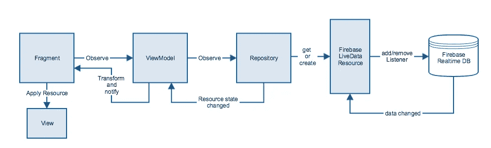
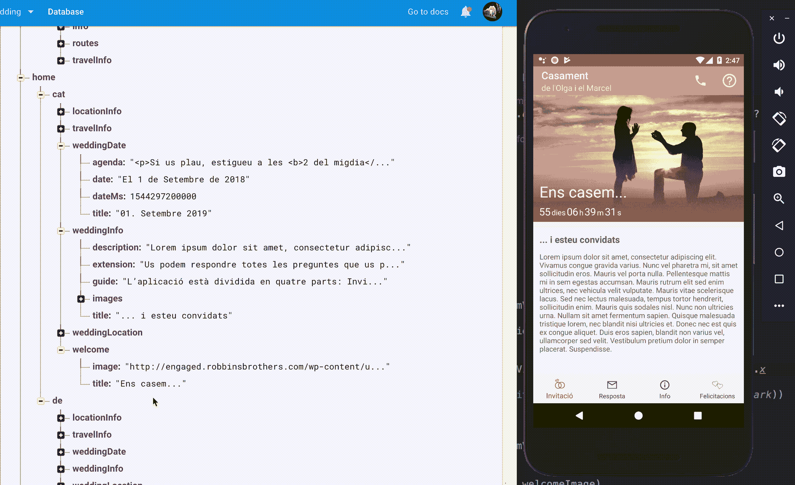

# 像 Android 开发者一样准备婚礼——第二部分

> 原文：<https://medium.com/swlh/preparing-a-wedding-like-an-android-developer-part-2-7b6b1980160f>

在[上一篇](/@marxallski/preparing-a-wedding-like-an-android-developer-part-1-758315073ab7)上，我介绍了如何组织婚礼筹备的工具和一些技巧。在这一部分，我们将重点介绍****App****架构**。**

# **功能**

**我们想要的不仅仅是一个是/否应用程序。首先，我们定义了应用程序中的主要高级功能:**

*   **个性化登录**
*   **邀请主屏幕**
*   **邀请响应**
*   **信息(位置、日程、如何到达等。)**
*   **留言板**

# **制约因素**

**我们需要解决几个制约因素。**

*   **该应用程序将由我们的客人专用。**
*   **它应该很容易安装和打开。**
*   **年轻一代和老一代都将使用它。**
*   **我来自巴塞罗那，我的妻子来自德国。因此，我们需要两种语言。(加泰罗尼亚语和德语)**
*   **一些信息尚未修复，所以我们应该能够改变内容，而不需要人们更新应用程序。**

# **建筑**

**在确定了高级特性和约束之后，我开始设计架构草案。**

*   **100%科特林**
*   **使用新的 Android 架构组件(ViewModel、LiveData 等)**
*   **Firebase 实时数据库**
*   **Firebase 认证**
*   **Firebase 动态链接**

## **被动**

**主要思想是使用 Firebase 将架构组件与反应性概念结合起来。**

****

**上图显示了不同组件之间的流动和交互。我们来分解一下。**

1.  ****片段**是被动的，它们观察**ViewModel**资源。**
2.  ****视图模型**观察一个或多个**资源库**资源。**
3.  ****库**处理 **Firebase LiveData 资源**的创建和缓存。**
4.  ****Firebase LiveData 资源**是一个对象，它扩展了 **LiveData** 并添加或删除了给定 **Firebase 数据库引用**的监听器。**
5.  **当**数据**改变时，该改变被转发给观察者**
6.  **如果需要的话，**视图模型**将转换资源，并将其交付给**片段****
7.  ****片段**最终将给定的资源应用于视图。**

**这个设置中最关键的元素是 **FirebaseLiveData** ，让我们仔细看看:**

**这是一个简单的职业，但是有*【超能力】*。我为什么这么说？因为下面的这个类处理以下内容:**

*   **网络层。**
*   **解析实体。**
*   **没有附加观察器时释放资源。**
*   **保持资源的状态(加载、错误、完成)。**
*   **离线同步。**
*   **反应性变化。当本地或远程发生变化时，观察者会得到通知。**

**所有这一切，都要感谢 **LiveData** 和 **Firebase Realtime** **数据库**的结合，让这个设置*变得“反应式”。***

## **主页**

**为了展示上述概念，我们将看看主页。**

****HomeRepo** 提供了一个获取**主页**资源 LiveData 的公共方法。**主页**是一个简单的数据类，带有显示 UI 所需的字段。**

**在资源库内部，我们使用 **UserRepo** 来获取用户的语言，并创建我们的 **FirebaseLiveData** ，它将基于给定的语言提供主页资源。**

**我们构建数据实体的方式是视图可以直接使用它们来显示 UI(不是在所有地方，而是在大多数屏幕中)。因此，在这种情况下，视图模型只是转发资源。**

```
class HomeViewModel(repository: HomeRepo) : ViewModel() {

    val homePage: LiveData<Resource<HomePage>> by *lazy* **{** repository.getHomePage()
    **}** }
```

**最后，我们只需要实现视图端。在这种情况下， **HomeFragment** 负责观察 **ViewModel** 资源并更新视图元素。**

# **显示优点的东西**

**在下面的 gif 中，左侧是 Firebase 数据库控制台，右侧是主页中的应用程序。每次我们改变一个值，不到一秒钟就会反映在我们的应用程序中。**

****

**这允许我们在运行时修改整个应用程序的任何值，不需要更新，不需要硬编码的值。**

**最重要的是，我们将 Firebase 设置为离线工作，这样一旦用户至少打开一次屏幕，它就不再需要网络来工作了。**

```
val instance = FirebaseDatabase.getInstance().*apply* **{
**    setPersistenceEnabled(true)
}
```

**在下一篇文章中，我们将解决客人登机的问题，敬请关注！**

**[](https://medium.com/swlh)**

## **这篇文章发表在 [The Startup](https://medium.com/swlh) 上，这是 Medium 最大的创业刊物，拥有+385，976 名读者。**

## **在这里订阅接收[我们的头条新闻](http://growthsupply.com/the-startup-newsletter/)。**

**[](https://medium.com/swlh)**