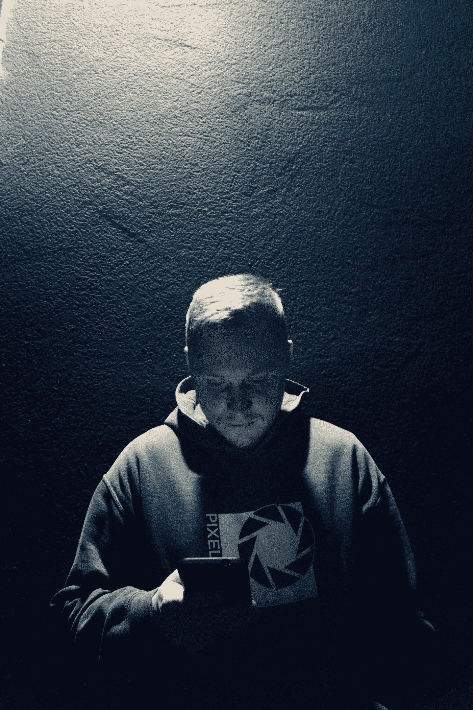

# 做好最坏的打算…

> 原文：<https://medium.com/swlh/preparing-yourself-for-the-worst-4c5929db82e3>

## …不存在。

> 没有黑暗就没有光明，没有悲伤就没有快乐，没有错误就没有进步，没有心碎就没有真爱。把路上的每一次颠簸都看作是更伟大的事情即将到来的信号。-罗伊·彭

Photo by Kyle Stoutenberg

2017 年 12 月 2 日。当时大约是晚上 7 点，在拍摄了整整两天的镜头后，我们刚刚吃完晚饭。我们回家的航班是早上 6 点，所以我们打算今晚就到此为止，上床睡觉。我们走回汽车，我在电话里和我的妻子说话，告诉她和孩子们晚安。我打开出租的舱门，发现有些不对劲。我告诉妻子我会给她回电话，然后挂了电话。

"嘿凯尔，我们把我的包放在后座了吗"，当他走近车边时，我对他说。

“没有人，我们的车被撬了！”，他回答道。

窗户被打碎了，我们很快发现我的背包，凯尔的背包和我们的鹈鹕 1510 箱子不见了。在鹈鹕的箱子里是构成我们生意的大部分摄影设备。这超过了我们公司拥有的实物资产价值的 75%。这是我们团队每周用来为客户制作内容的设备。就在我吃下半块排骨的时候，有人偷走了我花了 4 年时间建造的东西。

经过短暂的尝试，以确保无论是谁干的都能听到我有多生气，我拨打了 911，并开始了 3 个小时的过程，为一起盗窃案提交警方报告，这起盗窃案的规模超过了接到电话的 5 名警察中的任何一名。

当我们回到酒店的时候，我们有 4 个小时的时间，直到我们需要醒来做好准备，并归还租赁的窗户。尽管我很累，我还是不能睡觉。我仍然不得不花时间打电话给租赁公司和我的保险公司，以开始索赔。即使有一次我能把头靠在枕头上，我似乎也无法闭上眼睛。我感觉自己消失了，每隔 15 分钟左右回来一次，看着时钟一分一分地接近我的凌晨 4 点闹钟。

第二天早上，我们把车停在那里，通过了安检，然后跳上飞机回家，开始计划下一步的工作，但在中途停留底特律期间，我们生病了。

周六下午，我终于回到了家，终于找到了睡上几个小时的方法，然后醒来和家人共度了一个晚上，这是当时唯一能让我开心的事情。这是启动复苏进程的重要的第一步。我和我的孩子一起玩，和我的妻子聊天，想着如果 Pixel Labs 因为这个决定窃取我们工作成果的人而被迫关闭，他们会怎么样。我记得我内心有一种感觉，就像开关被拨动了一样。

"我为什么要让这家伙夺走我的一切？"我记得当时我心里想。

我过去解决过一些问题，虽然没有达到这个水平，但也不是不可能。我们有保险，我们有支持，我们有彼此。我有责任尽我所能确保这件事对我们的影响尽可能小。我有责任确保我们继续照常开展工作。这不是任何人的过错，因此，任何人都不应为此受到惩罚。我有责任确保我的家人有饭吃，我们的员工还有工作。我们都聚在一起，在回到办公室的一天内，我们采取了必要的措施来更换我们所有的设备，并在周三之前准备好我们下一次拍摄的所有东西，就在我们的所有东西被拿走后的 4 天多一点。

我们没有时间等待、抱怨、撅嘴、哭泣、生气或担心刚刚发生的事情。我们有客户指望着我们，我们需要确保他们感受不到发生的事情。我们在那个星期二进行了一次拍摄(谢天谢地，我们用剩下的钱拍了一次)，我们在接下来的周末又进行了两天的拍摄，下星期二进行了两次拍摄，两天后的星期四进行了一次拍摄。我们有一个完整的生产计划，是时候看看过去几年我们组建了什么样的团队了。

> "我学到了比任何齿轮都更有价值的东西."

忘记从这个事件中吸取的关于保持我们设备安全和消除这种情况再次发生的可能性的明显教训。我学到了比任何齿轮都更有价值的东西。创业的时候可以做很多准备。你可以为人生做很多准备。你不能做的是做最坏的打算。你可能认为你已经计划好了。你可能会觉得你已经想到了每一个可能出现在你面前的挑战。我向你保证:你绝对错了。

尽管我一直都是一个冒险者，但我通常是一个有计划的冒险者。考虑决策的所有可能结果并相应地权衡选择的人。这并不意味着所做的决定总是正确的，但这意味着我总是觉得我考虑到了各种可能性。在这种特殊的情况下，我记得我花时间把所有东西都搬到深色车窗后面的最后面，确保如果任何绝望的人决定偷看一眼，他们会找到一辆“空车”并继续前进。另外，这只是晚餐，我们很快就会回来。我们又不是出去喝酒喝到凌晨 2 点。我觉得我们做了最坏的打算来排除可能性。我们错了。

生活充满了挑战，不管是什么原因让我们遇到了这种情况，这只是其中之一。这促使我思考我们的业务、我的家庭、员工和客户。这让我怀疑这是否意味着我应该考虑一条不同的道路。这让我想到了因果报应。所有这些想法都给我带来了新的视角，也给我上了非常宝贵的一课:

> 不是你面临的挑战决定了你是什么样的人。它是你如何应对那些挑战，这些挑战决定了你是一个人、一个丈夫、一个父母还是一个企业主。

你在生活或事业中面临过哪些挑战？你是怎么处理的？你是让它拖垮了你，还是在逆境中茁壮成长？在评论中分享你的故事，并提供你自己的建议。

## 这个故事发表在 [The Startup](https://medium.com/swlh) 上，这是 Medium 最大的创业刊物，有 286，184+人关注。

## 订阅接收[我们的头条新闻](http://growthsupply.com/the-startup-newsletter/)。

