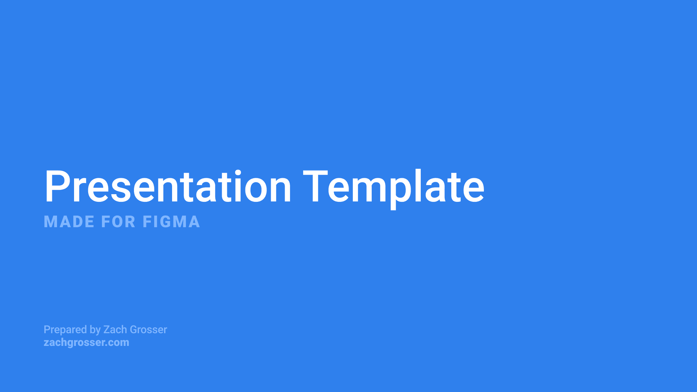
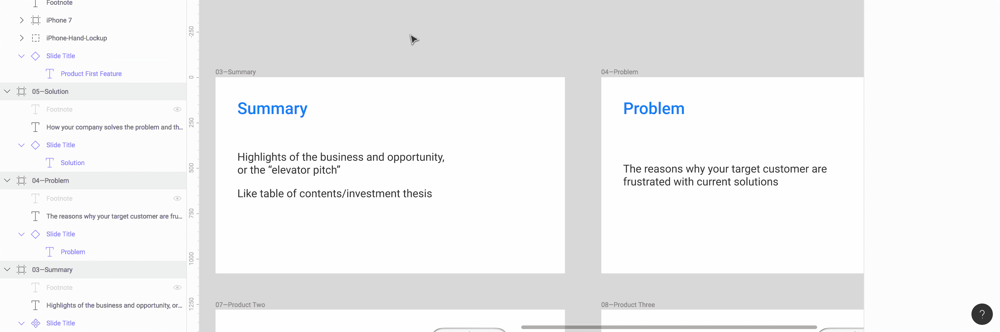
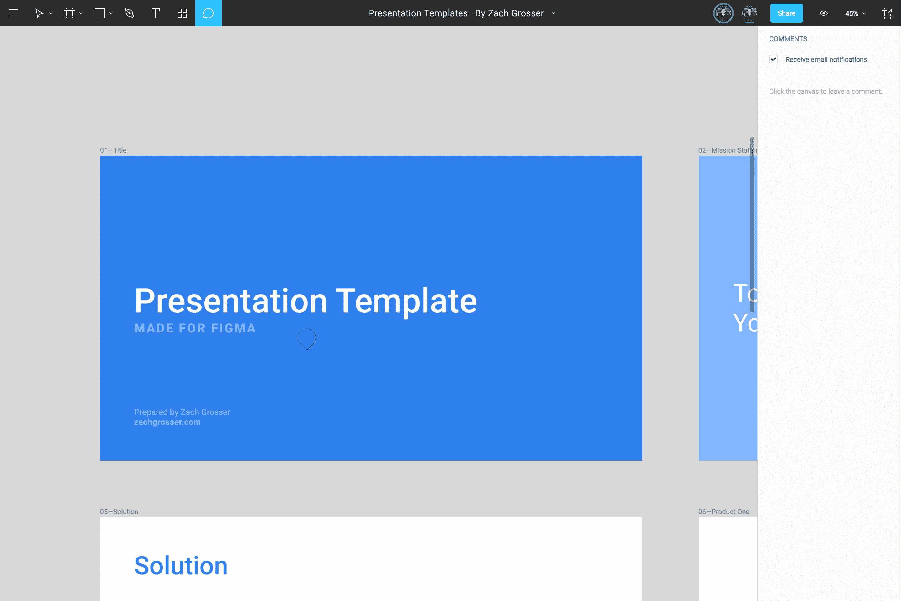

# 开源投资者推介资料

> 原文：<https://medium.com/swlh/presentation-template-for-figma-2b97fdefdacd>

## 为 Figma 设计的模板

我很高兴与您分享投资者推介模板，这是免费的！此幻灯片模板非常适合演示，也适合制作成 PDF 格式，供所有现有和潜在投资者在闲暇时浏览。特别感谢陈明杰的投资者关系见解。我将很快发布一个更加以会议为中心的模板，旨在让幻灯片具有更少的文本和更多的视觉重点。

*下面是关于将该文件作为开源项目的更多详细信息！*

[**下载你的副本**](https://www.figma.com/file/aUqkGdpTk1Sl3olhPMChmSe9/Investor-Pitch-Presentation-Template%E2%80%94By-Zach-Grosser/duplicate)

# 使用此模板

Figma 是为协作界面设计工具而设计的，并作为该工具在市场上销售。我不是一个界面设计师，但我相信 Figma 是我工作中最强大的设计工具，也许也是你的。

正如我在关于[的上一篇文章中探索的那样，使用 Figma 演示](https://blog.prototypr.io/using-figma-for-presentations-26491c6ea0e7)，你可以在**figma.com/mobile-app.**的另一个窗口中镜像一个选定的帧，使用“N”和“shift+N”在帧之间切换，像在演示软件中播放幻灯片一样播放你的帧。凭借这一点，Figma 成为设计和展示幻灯片的强大工具。

你可以使用这个模板并立即开始:只需放入你自己的文本、图像、颜色和图形。而且你可以继续回来[这里](https://www.figma.com/file/aUqkGdpTk1Sl3olhPMChmSe9/Investor-Pitch-Presentation-Template%E2%80%94By-Zach-Grosser/duplicate)，或者 [Figma 资源](https://figmaresources.com)，去抢一个新鲜的。提示:如果您将 **/duplicate** 添加到 Figma URL 的末尾，就像这里的所做的那样，每次单击链接时都会创建一个文件副本。或者，您可以将每种帧类型转换成一个组件，并像在传统演示设计软件中使用主幻灯片一样使用它们。

## 成分

Figma 中的组件(类似于 Sketch 中的符号)允许您复制一个对象，并在该对象的所有副本中同步更改。例如:你创建了一个带有特殊调色板的应用程序，但是你的客户想把你用于所有按钮和标题的红色换成他们品牌的蓝色。使用组件，所有按钮都可以基于一个按钮组件，然后将该按钮更改为蓝色会将所有按钮都更改为蓝色。

这个模板也是如此:用文件中的任何对象或框架制作组件将允许您对整个演示文稿进行更改。

我对幻灯片标题也是这样做的:它们都基于同一个组件，第三张幻灯片的标题“总结”如果您更改“摘要”的颜色、字体或字体大小，您会看到该更改会影响到其他幻灯片。

Components in Figma

# 改善这一资源

## o 笔源

> 形容词`*COMPUTING*`
> 
> ***指原始源代码可以自由获取并可以重新分发和修改的软件。***
> 
> [–谷歌](https://www.google.com/webhp?sourceid=chrome-instant&rlz=1C5CHFA_enUS719US719&ion=1&espv=2&ie=UTF-8#q=define+open+source)

像许多人一样，我认为不仅仅是代码应该开源。和我开源的[地图](/sketch-app-sources/vector-map-template-u-s-454715044f2e)一样，我希望这个展示模板是我们作为一个社区贡献的东西，共同改进和变得更好。

[这里的](https://www.figma.com/file/aUqkGdpTk1Sl3olhPMChmSe9/Investor-Pitch-Presentation-Template%E2%80%94By-Zach-Grosser)也是演示模板的原始版本，支持注释。它对改进建议是开放的，我会尽可能经常地整合反馈。

要对原文发表评论，请访问[文件](https://www.figma.com/file/aUqkGdpTk1Sl3olhPMChmSe9/Investor-Pitch-Presentation-Template%E2%80%94By-Zach-Grosser)，登录 Figma(或注册[免费](https://www.figma.com/pricing))，点击你想留下建议的地方，输入反馈，点击“发布”

Commenting in Figma

# 感谢您支持开源设计和 Figma 社区。🙌🏼

## 如果您是 Figma 的新手，请查看:

 [## 使用 Figma 进行演示

### Figma 是一个非常强大的设计工具。它以实时协作和基于网络的界面而闻名…

blog.prototypr.io](https://blog.prototypr.io/using-figma-for-presentations-26491c6ea0e7) 

## 如果您是演示文稿设计的新手，请查看:

 [## 演示设计，介绍

### 讲故事、简单、一致、层次和乐趣

展示.设计](https://presentation.design/presentation-design-an-intro-faf484c9e6c) 

## 如果您不熟悉投资者推介资料，请查看:

 [## 创建创业推介平台？从这个易于使用的模板开始

### 如果您是一名企业家，您可能熟悉构成典型投资者推介资料的 10–14 张幻灯片…

medium.com](/@founding/creating-a-startup-pitch-deck-start-with-this-easy-to-use-template-f3ee594103eb)  [## 条纹图集:推销你的创业

### Stripe Atlas 向投资者、客户和员工推销早期创业的指南。

stripe.com](https://stripe.com/atlas/guides/pitching) 

***2017 年 11 月更新:谷歌幻灯片现已提供模板:***

 [## 谷歌幻灯片的投资者推介模板

### 非常适合演示，也适合制作成 PDF 格式，供您所有的现有和潜在投资者浏览他们的…

展示.设计](https://presentation.design/investor-pitch-template-for-google-slides-3e56cac21d58) 

## 享受这种资源？

在 Patreon 上支持我，获取更多帖子、独家资源和一对一的演示建议:

 [## Zach Grosser 正在创建演示设计资源| Patreon

### 我已经做了七年多的展示设计师，和所有你喜欢的公司合作，比如…

www.patreon.com](https://www.patreon.com/zachgrosser)