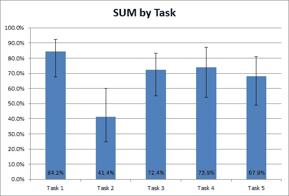

# 展示你的可用性测试结果

> 原文：<https://medium.com/swlh/presenting-your-usability-test-results-46db12f0556c>

所以你已经完成了一轮可用性测试。你和产品团队在一起，然后问题来了，“它做得怎么样？”大多数人可能不会太在意任务完成时间或问卷得分。

> 人们可能想知道它与之前的可用性测试相比如何
> 
> 通过了还是失败了？

这包括将你的结果综合成一个总分，并有意义地呈现给你的观众。

# 基于目标

一种简单的方法是将每个数据点与一个目标进行比较，并根据实现该目标的用户百分比将其表示为一个单一指标。例如，你的目标可能是:在不少于 70 秒的时间内完成 80%的任务。目标可以基于业务目标或与理想绩效的比较。

# 基于百分比

在一个理想的情况下，我们可能有一个比较的目标，但是你如何处理一个没有明确目标的情况。在这里，您可以将每个分数转换成一个百分比，然后进行平均。例如，在测量时间时，您可以将最快的参与者百分比确定为最佳，将最慢的确定为最差。这将成为你比较的基准。根据你的任务，需要稍微思考一下什么是最好的和最坏的。

# 单一可用性指标

Jeff Sauro 和 Erika Kindlund 开发了一个名为[‘可用性记分卡’](https://measuringu.com/sum-2/)的在线工具。这将根据以下数据计算总分:

*   无论参与者是否完成任务
*   每个参与者的错误数量
*   任务时间(秒)
*   任务后满意度评分

生成的总分是针对每项任务的，并提供这些任务的比较。这对于性能数据非常有效。

# 可用性记分卡

可视化地展示测试信息是展示数据的有效方式

*   在两个坐标轴上显示数据时使用柱形图或折线图，例如任务和任务成功
*   在呈现三个或更多指标的摘要数据时使用雷达图。这些将提供一个很好的高层次的观点
*   使用哈维球直观地展示百分比

使用上述方法，我们能够使数据为我们内部的利益相关者所接受。请务必与您的 UX 合作伙伴一起寻找以最简单的格式呈现数据的最佳方式。

*您可以关注我们的* [*脸书*](https://www.facebook.com/monsoonfish)*/*[*LinkedIn*](https://www.linkedin.com/company/13404751/)*/*[*Twitter*](https://twitter.com/monsoonfishy)*/*[*Dribbble*](https://dribbble.com/monsoonfish)

*原载于*[*monsoonfish.com*](http://monsoonfish.com/blog/present-usability-test-results/)

## 这个故事发表在 [The Startup](https://medium.com/swlh) 上，这是 Medium 最大的企业家出版物，拥有 292，582+人。

## 在这里订阅接收[我们的头条新闻](http://growthsupply.com/the-startup-newsletter/)。

