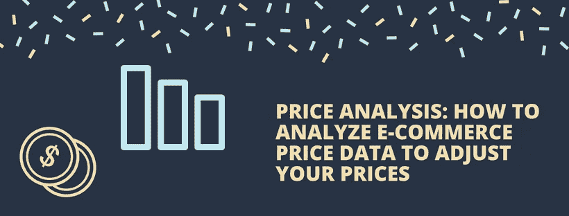
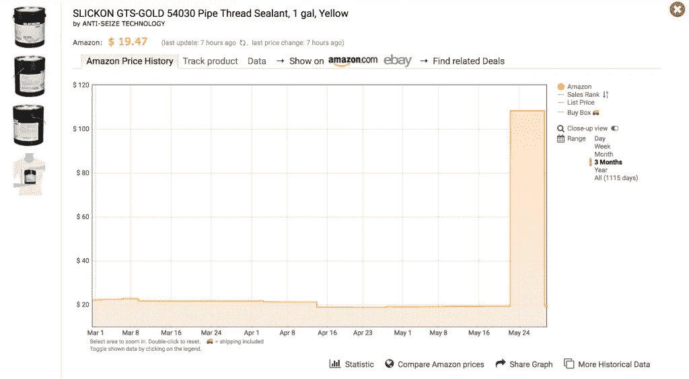
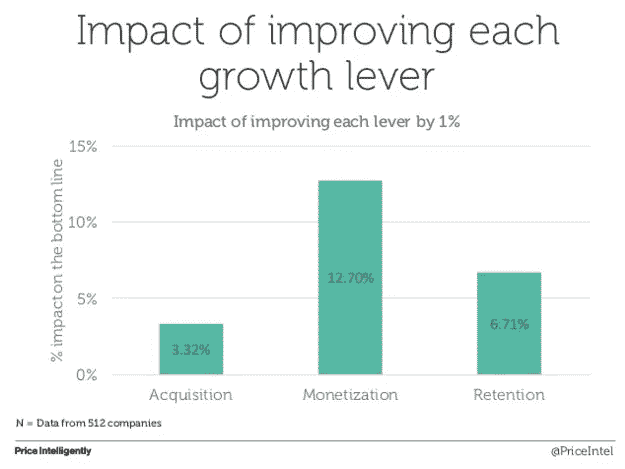

# 价格分析:如何分析电子商务价格数据来调整你的价格

> 原文：<https://medium.com/swlh/price-analysis-how-to-analyze-e-commerce-price-data-to-adjust-your-prices-58919f1477a9>

如果你读过我们的任何内容，你会知道我们是使用数据来设定你的价格的伟大倡导者。

对一些人来说，唯一的问题是你不知道如何分析你的价格或你拥有的数据，无论这是关于你自己的产品还是你的客户。

如果这是你，作为一个电子商务业主，必须处理的事情，你不是一个人。但好消息是，一旦你明白如何正确地分析给你的数据，你就知道如何在正确的时间提高或降低你的价格。

在本文中，我们将带您一步一步地帮助您更好地理解呈现在您面前的数据以及您可以用这些数据做什么。

我们走吧。

# 你能收集什么样的价格数据？

在你开始分析你所拥有的数据之前，了解你可以收集的关于定价的数据类型是很重要的。然而，大体上，它分为两类:

1.  你的定价
2.  你的竞争对手的定价

你可以从追踪你自己的定价开始，看看你过去向顾客收了多少钱。

你也可能(也应该)关注你的竞争对手的定价，让你了解他们在做什么，他们使用什么样的定价策略，以及他们当前的涨价或降价策略。很好地理解这一点将使你从他们的定价策略中获利，从而获得更高的利润，最终获得更高的收入。

当您开始分析您和竞争对手的定价数据时，您将能够受益于:

*   知道如何通过适时调整价格来增加利润
*   增加你的销售潜力
*   让你自己(并保持你自己)在市场中处于竞争地位
*   利用竞争对手的价格与供应商协商更好的成本，使您能够完善自己的成本管理。
*   整合有数据支持的定价策略。

如您所见，使用数据来推动您的定价有诸多好处。许多公司已经明白使用数据的重要性，但不确定如何分析他们拥有的数据，或者从哪里收集数据。

是时候看看策略了。

# 以亚马逊为例

不言而喻，在电子商务的世界里，亚马逊是巨大的。他们拥有巨大的市场份额，这得益于他们的数据源团队。这个团队的主要目标是利用现有的数据来帮助推动他们的快速增长。

虽然亚马逊是这个行业的巨头，但不要被愚弄到认为你需要雇用一个数据增长团队(尽管这样做不会有什么坏处)。

使用像 [Keepa](https://keepa.com/#!product/1-B00LAD9G2O) 这样的工具，你会看到亚马逊上各种商品的价格随着时间的推移会有多大的波动。

作为一个较小的电子商务公司，如果你想获得自己和竞争对手的价格数据，你应该使用价格比较工具。你的竞争对手可能已经在使用这样的工具了，但如果他们没有，它会给你一个领先的机会，并从中获得巨大的投资回报。

# 你应该分析哪些定价数据

分析你的价格和数据的最有效的方法是查看你所能获得的最长时间跨度内一系列产品的数据。

确保使用各种各样的产品(如果不是全部的话),可以让你全面了解你的商店与你的竞争对手相比如何。

查看你所能访问的最长时间跨度的数据将使你对历史价格有一个准确的了解，并为你提供预测未来的最有效的方法。

[来源:](https://prisync.com/demo/panel)

理想情况下，你应该寻找两个关键点:“谁”、“什么时候”和“多久一次”。这将让你更清楚地了解他们的定价策略和定位。

注意:在查看竞争对手的定价时，只关注或跟踪提供类似产品类别的竞争对手是有帮助的。这似乎是显而易见的，但对许多人来说，并不明显。将你的 t 恤价格与竞争对手的 iPhone 手机壳价格进行比较是没有意义的。

理想情况下，您希望寻找以下问题的数据:

1.  在类似或相同的产品类别中，您的主要竞争对手是谁？
2.  他们什么时候改变价格？
3.  他们的价格变动了多少？
4.  他们多久改变一次价格？
5.  他们对你的其他竞争对手的价格变化有什么反应？
6.  根据这些数据，你预测未来价格会有什么变化？
7.  我如何利用这些数据来提升或交叉销售或最大化您的价格利润？

使用数据来寻找这些问题的答案，会让你对你的业务的真正利润潜力有一种可见感，并让你少关注直觉。将分析放在定价策略的首要位置，可以促进快速增长和盈利能力管理。

将所有这些数据付诸行动将使您能够利用您的定价，并让您专注于盈利能力管理。通过使用软件，您可以查看大量不同的定价变量和案例，帮助您分析非结构化数据，以发现数据中的模式、趋势和各种异常。

# 使用定价数据的影响

您知道定价通常是任何电子商务或商业战略中最容易被忽视的部分吗？数据显示，一般公司会花 [6 个小时](https://www.priceintelligently.com/blog/5-steps-to-a-successful-price-increase)(在企业的整个生命周期中)实际规划他们的定价策略。

但你需要记住，专注于你的货币化比保留或收购有更大的影响。也就是说，不寻求提高价格就是把钱留在桌子上。

更重要的是，仅仅改变 1%的定价就可以增加 12.70%的利润。因此，如果你试图增加利润和增长，使用定价数据来改善你的业务货币化的方式。

# 分析你的价格

在网上购物出现之前，如果你想分析你的价格或者看看你的竞争对手在打什么特价，你只需要去他们的商店就可以了。

然而，电子商务世界的发展速度要快得多，如果不使用工具来为您提供高质量的数据，手动价格检查是一项艰巨且通常很困难的任务，尤其是如果您计划使用这些数据来制定自己的策略。

因此，节省手动[竞争对手价格跟踪](https://prisync.com)的时间，使用实时、有效的数据并分析该数据，以利用您的优势。

## 这个故事发表在[的创业](https://medium.com/swlh)上，这是 Medium 最大的创业刊物，有 329，974+人关注。

## 订阅接收[我们的头条新闻](http://growthsupply.com/the-startup-newsletter/)。

