# 原则:你必须尝试的原型工具

> 原文：<https://medium.com/swlh/principle-the-prototyping-tool-you-got-to-try-93ab743fe4ae>

自从丹尼尔·胡珀联系我介绍他的新软件以来，已经过去了 5 个月。他给了我成为早期版本[原理](http://principleformac.com/)的 betatester 的绝佳机会。

很长一段时间以来，我一直在寻找一种好的方式来制作动画，并与我的设计进行互动。

## 我曾经和后效一起工作

其中非常费时的**和非常不真实的*。我过去常常花大量的时间处理缓动曲线，以获得开发人员永远无法重现的完美平滑的动画。***

## ***我尝试了 [Pixate](http://www.pixate.com/) 和 [Atomic.io](https://atomic.io/)***

***但从来没有真正进入它，因为用户界面不是很熟悉。它需要一些实践和时间(我没有)来理解它是如何工作的。所以我放弃了它，浪费了我 30 天的试用期…***

## ***我从来不喜欢 Framer.js***

***我不太擅长编码。在我看来，如果你必须编码来创建一个原型，你还不如学习真正的语言，并腾出一些时间给你的开发人员。(**我在这里夸大了，我知道 framer 有很大的特权，但仍然**)。***

## ***折纸术太难学了***

***很多设计师觉得这很棒。我同意，它看起来确实非常有效和强大，有一个巨大的社区来分享他们的知识。但是补丁环境对我来说很陌生。所以我不能。***

## ***预览窗口把我搞糊涂了***

***这是一个非常强大的工具，但是你每次都必须保存并重新加载你的原型才能看到它是如何工作的，这是一个障碍。虽然有一些非常有趣的功能。***

***在尝试和学习新软件时，我可能会有点懒？我真的很喜欢视觉和快速的工作环境。基本上，从一个软件到另一个软件，当他们不共享相同的概念，名称，用户界面，快捷方式是生产力杀手。
*(我在看你的土坯，怎么在 AE 上按下* ***T*** *)不是为了文字工具？).****

**我不喜欢每五分钟就转换一次思维模式。**

# **我的圣杯叫做原则**

**这个软件是草图、Keynote、Flash 和 After Effect 的巧妙结合(加上一些专门针对交互式原型的额外功能)。**

**第一次使用时给我的印象是，它给我的感觉非常熟悉。如果你熟悉素描，你会跟原理:**

*   **检查员**
*   **图层列表**
*   ****画板(！)****

# **它是如何工作的**

*****首先*** :你创建(或导入)你的资产**

**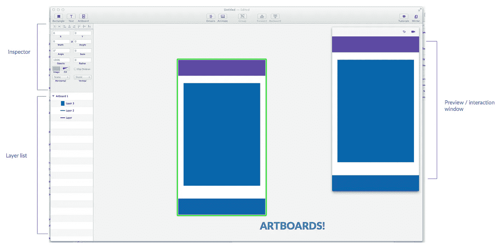**

*****第二个*** :你选择一个资产及其交互**

**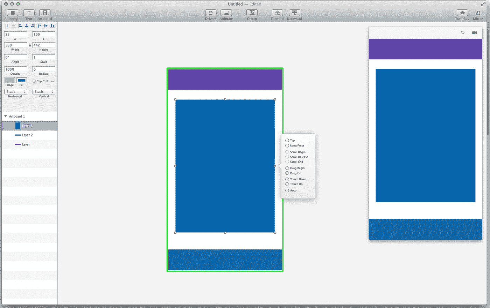**

**Big blue rectangle is selected. I choose a “TAP” interaction**

*****第三个*** :交互复制你的画板，你可以修改每一个资产**

**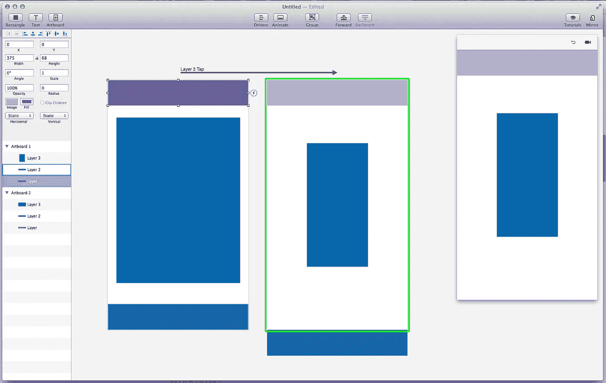**

*****第四个*** :自动生成转场，可以玩原型。**

**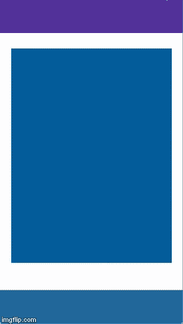**

**创建一个复杂的转换是非常快速和简单的。**

## **在原型制作工作流程中，画板有什么好处？**

**我曾经读到过，制作界面动画就像编舞一样。画布是舞台，资产是舞者。
当从一个屏幕转换到另一个屏幕时，每一个将被动画化的用户界面都需要有意义。**

**在这里使用画板真的是最好的，因为你可以看到你的应用程序的每个状态，每个屏幕一目了然，以及用户界面将如何反应。**

# **关键特征**

**对我来说，轻松创建从一个屏幕到另一个屏幕的 tap 过渡是该软件的核心。**

**但是原则上有很多很棒的特性可以让你的原型更上一层楼。**

## **互动**

**该软件是针对触摸屏应用开发的。所以它可以实现各种各样的互动:**

**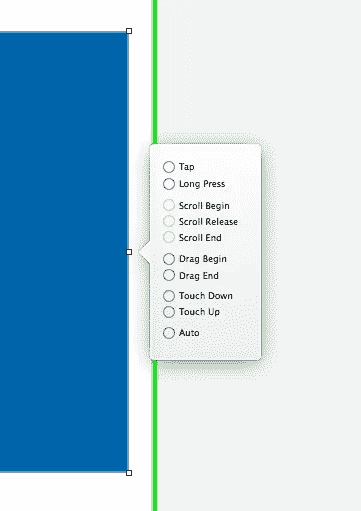**

*   **轻敲，水龙头**
*   **拖**
*   **卷起**
*   **自动动画**
*   **长按**

## **动画面板**

**“每一篇关于动画的文章有什么共同点？
-他们强烈建议永远不要创作线性动画，因为它在现实世界中并不存在。”**

**同样，原则是伟大的。默认情况下，每个动画都将应用一个渐强/渐弱效果，您可以轻松地切换到预定义或自定义的效果。**

**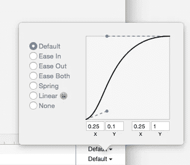**

**此外，该面板允许您更改动画的持续时间，选择哪些资源将首先激活，以及创建有意义的过渡。**

**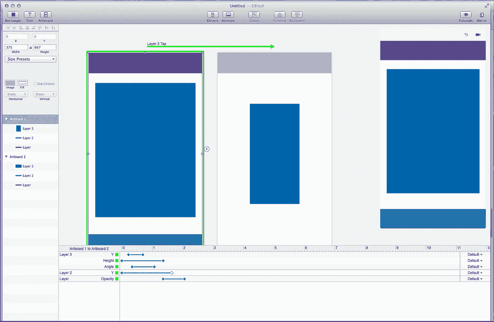**

**动画面板在底部，你可以控制每一个动画(很像 After Effect，但是速度快十倍)。**

**这是具有不同动画设置的前一个动画:**

**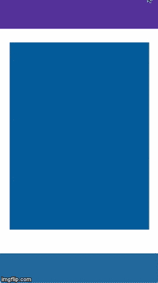**

## **驾驶员面板**

**这个特性花了我一点时间来完全理解，但是一旦你得到了它，你可以在你的原型上做的事情是惊人的。**

**基本上，驱动程序用于滚动或拖动事件，将资产“链接”在一起或在一个项目上添加几个属性。**

**比方说，您希望在拖动资产时出现一个覆盖图，或者希望资产在滑动时旋转(类似 Tinder / Jelly)。**

**这就是驱动程序的用途。还有很多。这是它的工作原理。**

*****首先*** :准备资产**

**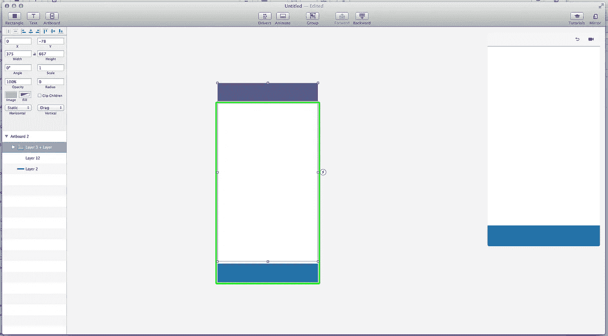**

***紫色矩形位于画板之外，拖动它时，会逐渐出现一个覆盖图。***

*****第二个*** :打开驱动面板(顶部)，选择当前透明的叠加矩形。**

**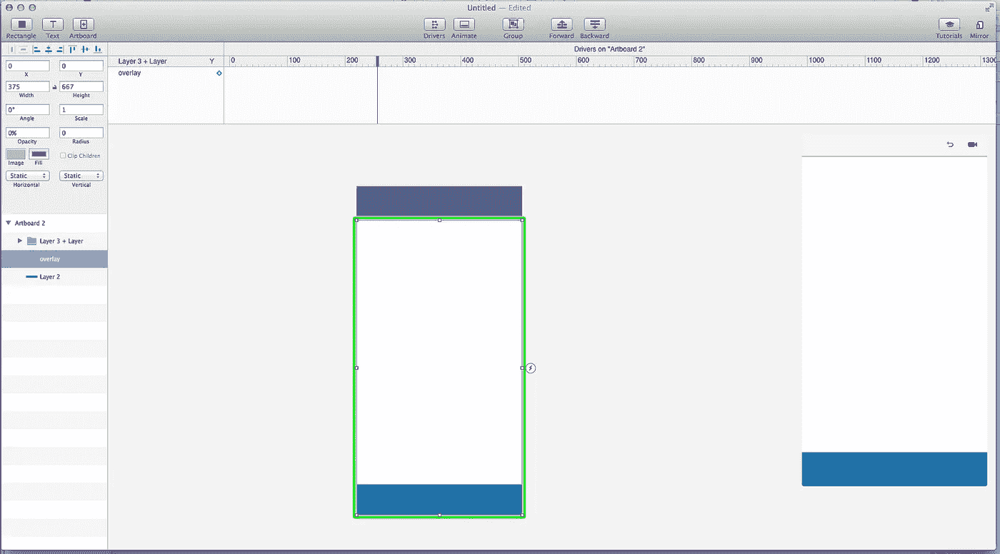**

*****第三个*** :在图层上添加不透明度关键帧，这样，紫色矩形被拖动得越多，叠加层就越暗。**

**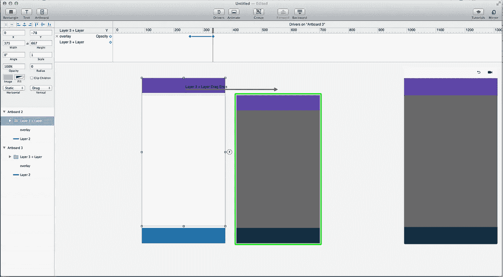**

**原型功能齐全。这个特性需要一些练习，但是一旦你掌握了…**

****

## **还有更多…**

**当然，还有更多的小功能，如遮罩、文本、预设画板……对于你的 Dribbblers 来说，有一个自动 GIF 导出你的动画，去和你的设计师朋友们一起在 pink 网站上拍摄。**

# **还不完美**

**成为原则的测试者真的很棒。我用了 0.2 版的软，立马爱上了潜力。**

**还有很长的路要走。**

*   **没有后效那么多的效果，但仅仅是使用蒙版，X，Y，不透明度，缩放，旋转，就已经能让你做很多事情了，专注于简单。**
*   **草图进口还没有到，但我打赌他们很快就会来。**
*   **嵌入 web 原型尚不存在。**
*   **迭代尚未优化。**

# **但是很有希望**

**我对这个工具的未来非常有信心，因为我看到了 Principle 团队是如何听取用户的反馈并加以实施的。**

**我必须说，原则现在公开了，我有点难过，我将不得不与每个人分享我最喜欢的秘密玩具。
但是我迫不及待地想看到你们将会用它创造出什么，以及伟大的原型工具将会如何影响每一个未来的应用。**

> **[去 principleformac.com 试试吧:)](http://principleformac.com/)**

# **让你的动画知识更上一层楼**

**如果你是动画新手，这里有几篇文章推荐你阅读:**

*   ****UX 编舞(个人最爱)**:[https://medium . com/@ Becca _ u/the-principles-of-UX-choreography-69 c 91 C2 bc2 a](/@becca_u/the-principles-of-ux-choreography-69c91c2cbc2a)**
*   ****动画的目的:**http://jake.ly/journal/animations.html**
*   ****动画的妙用:**[https://medium . com/yummygum-journal/enhance-your-user-experience-with-animated-transitions-a 30267 ca 376 c](/yummygum-journal/enhance-your-user-experience-with-animated-transitions-a30267ca376c)**
*   ****了解缓和曲线:**[https://medium . com/@ sureshvselvaraj/animation-principles-in-ui-design-Understanding-easing-bea 05243 Fe 3](/@sureshvselvaraj/animation-principles-in-ui-design-understanding-easing-bea05243fe3)**
*   ****好的过渡:**[https://medium . com/@ pasql/transitional-interfaces-926 EB 80d 64 e 3](/@pasql/transitional-interfaces-926eb80d64e3)**

## **感谢阅读！**

**如果你喜欢，点击推荐按钮并关注我。**

**我的信息**

**[*behance*](https://www.behance.net/lalalalalalala)[*Dribbble*](https://dribbble.com/benjaminberger)[*portfolio*](http://b-berger.com)[*Twitter*](https://twitter.com/benjamin_berger)**

****

***发表于* **创业、旅游癖和生活黑客****

************

**-**