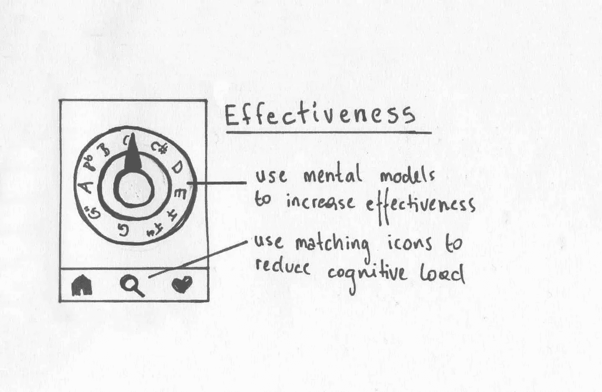
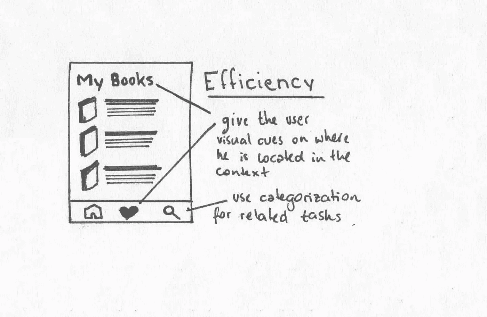
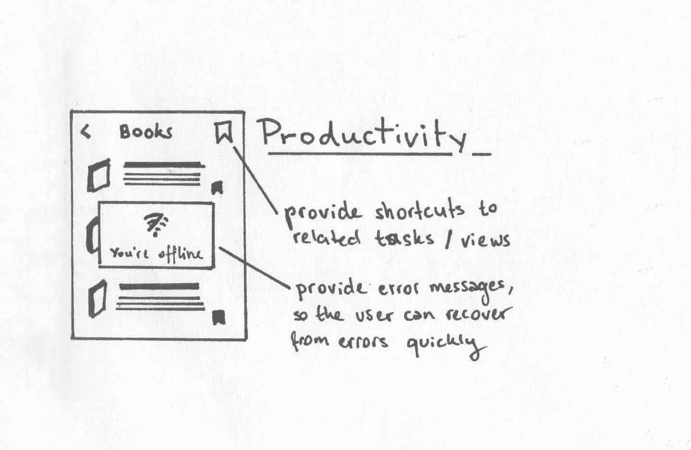
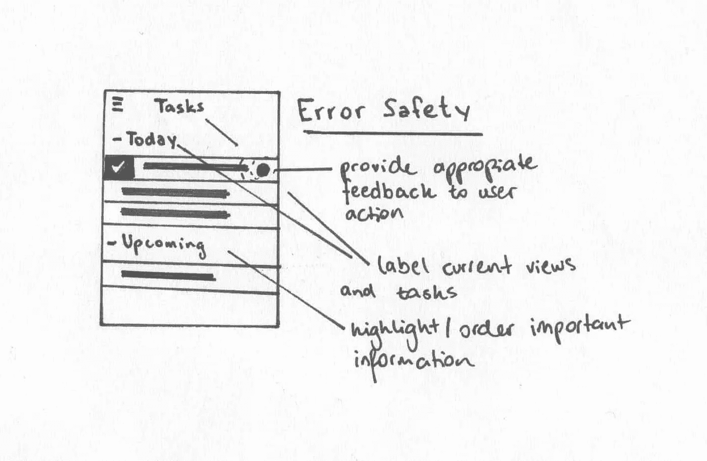
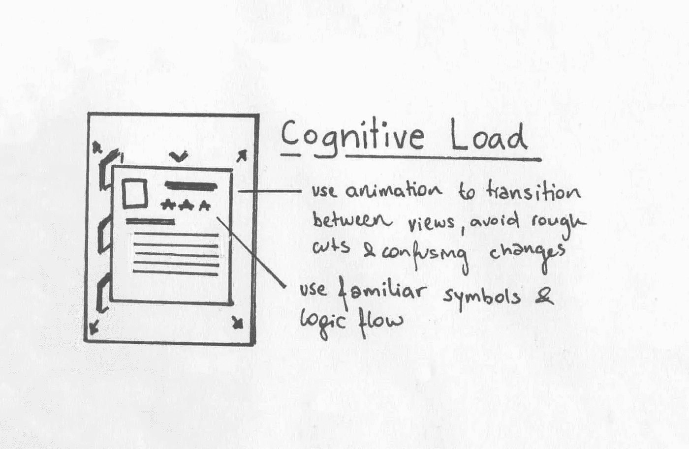

# 移动用户界面原理

> 原文：<https://medium.com/swlh/principles-of-mobile-user-interfaces-94661cca7c16>

去年是全球范围内移动用户首次超过桌面用户。如果我们看一下[全球统计数据](https://www.w3counter.com/globalstats.php)，今天领先的屏幕分辨率是 640x360，超过 22%。

这一点不应该被忽视，虽然响应式和移动优先开发已经存在一段时间了，但移动界面的交互与桌面界面的交互有很大不同。随着 React Native 和 [Progressive Web Apps](https://github.com/TalAter/awesome-progressive-web-apps) 的兴起，开发移动用户界面也将是未来几年 Web 开发的一大部分。

在开发移动用户界面时，简单性对于良好的用户体验至关重要。界面应该是一致的，避免用户认知超载和迷失方向。

为了满足和测量用户交互，本文设计了 5 个可测量的原则[。这篇文章将简要总结这些原则，并通过一些例子来概括我们在创建移动界面时应该考虑的方面。](https://doi.org/10.1016/j.procs.2016.08.014)

# 有效性

有效性描述了用户在使用界面时的有效性。用户以前有来自其他界面和真实世界的经验。在人机交互(HCI)中，这被称为用户为了更容易理解复杂概念而创建的心智模型。我们可以通过受益于用户从现实世界中获得的知识来提高用户的效率。有效性的目标是减少完成任务所需的*行动数量。*

# 一些例子

*   这个 PWA 是一个使用心智模型来提高用户效率的完美例子。通过设计类似于模拟调谐器的数字调谐器，用户可以立即将调谐器的数字版本映射到他在现实世界中的体验。
*   使用匹配和已知的图标来减少认知负荷。把它们和小标签结合起来，减少错误解读。
*   心智模型的另一个例子是一个开关，类似于现实世界中的电灯开关

# 效率

效率描述了用户可以理解应用程序的当前状态以及可以执行的操作的方式。它以每秒*个动作*来衡量，描述用户完成任务的效率。

# 一些例子

*   为用户在界面中的位置提供视觉提示。例如显示视图标题、在表单中提供进度条、突出显示当前选项卡
*   如果界面变得太复杂，设计简单的类别，子任务可以被分配到其中。例如，针对所有用户相关数据的*简档*，针对过去保存的项目的*收藏*，针对新信息的*搜索*。

# 生产力

生产力描述了用户成功完成一项任务需要多长时间。它还描述了用户如何容易地*发现和识别界面提供的功能*。它是用相对于时间完成一项任务所需的动作数量来衡量的。

# 一些例子

*   通过在界面中提供重要任务的快捷方式，减少打字的需要
*   避免误导性标签，例如使用错误的图标
*   提供错误消息，以便用户可以快速从错误中恢复。

# 错误安全

给用户反馈是界面设计最重要的部分之一。通过适当的反馈，可以显著减少误差。我们可以通过计算*每个任务*的每个动作中发生的错误数量来衡量错误安全性。

# 一些例子

*   为用户操作提供适当的反馈
*   突出显示重要/新信息
*   提供教程或工具提示，需要时可以查看
*   显示当前视图/任务/用户的名称
*   当用户犯了错误或系统没有按预期工作时给出反馈，例如表单错误，当某些内容无法上传/处理时发出警报

# 认知负荷

减少用户的认知负荷是让界面感觉良好的关键。我们可以通过对困难的概念使用隐喻来做到这一点，并保持界面简单，以免混淆用户。测量认知负荷的一种方法是通过计算每个视图的*动作*。

# 一些例子

*   提供视图和上下文转换之间的动画，避免粗略剪切和混乱的上下文变化
*   使用熟悉和匹配的符号，使用户更容易导航和完成任务
*   使用逻辑流程让用户快速完成新任务

# 结论

当我们设计一个用户界面时，它的设计重点应该总是放在界面是否能帮助用户完成他想要完成的任务上。在任何界面的设计过程中，你都应该问自己一些问题:

*   我的界面是否允许用户以最简单的方式完成任务？
*   界面是否通过遵循简单性和利用心智模型来减少认知负荷？
*   界面是否向用户展示了他所处的位置，避免了混乱的状态和迷失方向？
*   用户的行为是否得到了恰当的反馈？
*   界面是否考虑了可能的错误并对这些错误提供了反馈？

由于屏幕尺寸小，移动界面非常有限，因此更重要的是保持应用程序简单，专注于用户想要完成的任务。如果接口变得太复杂和混乱，可能是因为它试图满足许多不同的条件，实际上应该在不同的应用程序中分开。通过牢记有效性、效率、生产率、错误安全性和认知负荷，我们可以避免构建看似花哨但实际上并不支持用户完成任务的界面。

# 资源

*   [将 HCI 原则映射到医疗应用中移动用户界面的设计质量](https://doi.org/10.1016/j.procs.2016.08.014)
*   [渐进式网络应用资源](https://github.com/TalAter/awesome-progressive-web-apps)

## 这个故事发表在《T4 创业》上，这是 Medium 最大的创业出版物，有 285，454 多人关注。

## 订阅以接收[我们这里的头条新闻](http://growthsupply.com/the-startup-newsletter/)。

