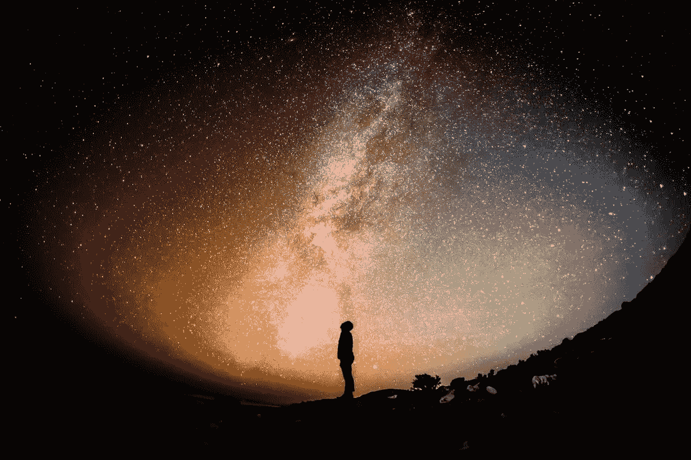
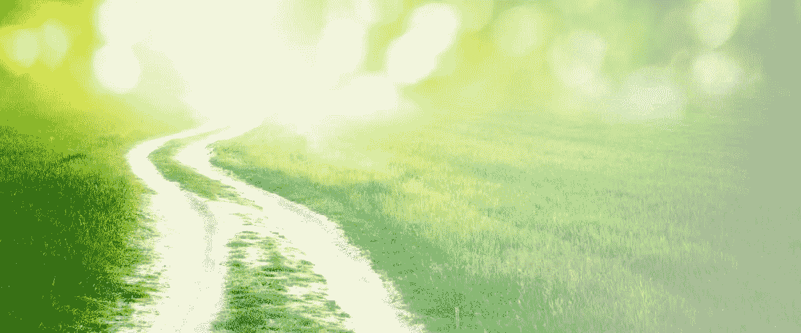

# 注意力拍卖&隐私的破坏

> 原文：<https://medium.com/swlh/privacy-and-the-attention-auction-7659a2a55acd>

## 隐私是人类的朋友还是敌人？

我们不再拥有自己的注意力，我不知道我们是否真的拥有过，但至少我们对它有所控制。相反，我们把它出租或拍卖给最刺激、自我实现、重新肯定或生化/激素诱导的竞标者。我们不仅要求并投票支持它，而且我们绝对喜欢它。或者我们的行为会让我们相信…

在我们混乱的娱乐世界的疯狂中，有一场战斗正激烈地吸引着我们的注意力。这更像是我们的家人、朋友和社会关系之间的皇家狂欢；个人和职业欲望，贪图冒险和刺激；当然还有我们生命中的爱..我们自己。我们有 24 小时的心脏泵送能量和思想来分发，并且有一个竞争者正在从那个馅饼中获取越来越多的一块。技术。

它越来越普遍，越来越有能力消费、消化、预测和操纵我们的行为..这是一股不可忽视的力量。想象一下，我们在页面/屏幕上度过的每一秒钟，我们做出的每一次悬停/点击，甚至我们的体温和这些交互过程中存在的其他生物反馈都被消耗和测量，以再现我们在那一刻的最佳体验和曝光。

听起来像是一个令人难以置信的直觉，令人难以置信的自我重申的确认偏差循环，将我们从所有不像我们的事物的曝光中移除和转移；通过收缩成一个安全、舒适和保障的保护性个人球而深入成长。这是我们正在投票表决的未来，用我们的行动来建设和扩大。

随之而来的是个人隐私、保护主义和自给自足的破坏:我们不想要的一切，但可能是我们需要的。如果我们自始至终所做的每一个决定或自以为做的每一个决定都被人看到或听到，会怎么样..我们会不会进化成更好的人，做出更有意识的决定？有些人非常相信这一点。我们会自然地到达那里吗？

我真的不知道，但我知道这一点…我们的注意力是我们的投票，现在完全在我们的控制之下。

# 一些未经思考的想法

"我并不为我所学到的东西感到自豪，但我从不怀疑它是值得了解的。"—亨特·S·汤普森

世代相传

下一代人将会做和创造出我们看不到甚至理解不了的神奇事物，就像我们和我们之前的每一代人一样；我们应该挑战、培育和服务他们和他们的环境，提供他们成功所需的一切，甚至更多。支持进化过程和对人类的意义。在服务和贡献中，从感恩和无知的立场。

其他人工作更努力

平衡是有用的，对“好”甚至“伟大”都有好处，但是如果你想要社交生活，想要与朋友和重要的另一半都有相当有意义的关系，你就必须接受这样一个事实:外面有更努力工作、更进步的人，他们知道得更多，付出得更多，值得我们关注，或者至少值得我们支持他们的所作所为。不忽视他人的努力和牺牲是我们的选择。

承认你的无知，你的机会

假装比别人知道更多的东西并没有真正的好处。当经验说话时，我们应该 STFU，倾听和学习一些东西。把我们试图描绘的自我、骄傲和虚假身份留到下一天，取而代之的是拥有业余者的角色、学习的过程和你的无知。这是我们最大的机会。

教育的演变

在这里，教师成为最高质量的内容和环境的管理者，而不是通过地理区域或资源的可用性来限制学生。讲座对教学来说很棒，但却是一种糟糕的学习方式。是给谁的？那个学生。

失恋了

困难的部分不是爱上一个人，一个想法，或者你创造的东西..困难的部分是不再爱，不再关心，放弃并摧毁“曾经”的东西，去寻找“现在”或有能力和目的“成为”更有意义的东西的潜力。

## 这个故事发表在 [The Startup](https://medium.com/swlh) 上，这是 Medium 最大的创业刊物，有 296，127+人关注。

## 订阅接收[我们的头条新闻](http://growthsupply.com/the-startup-newsletter/)。

