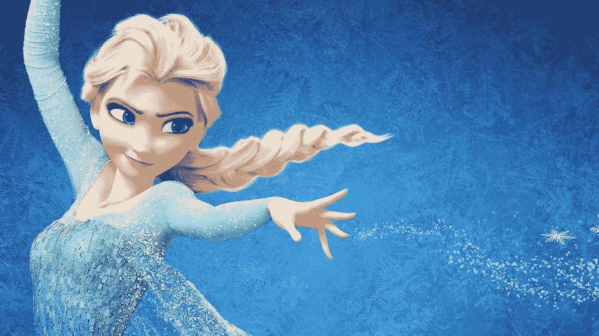
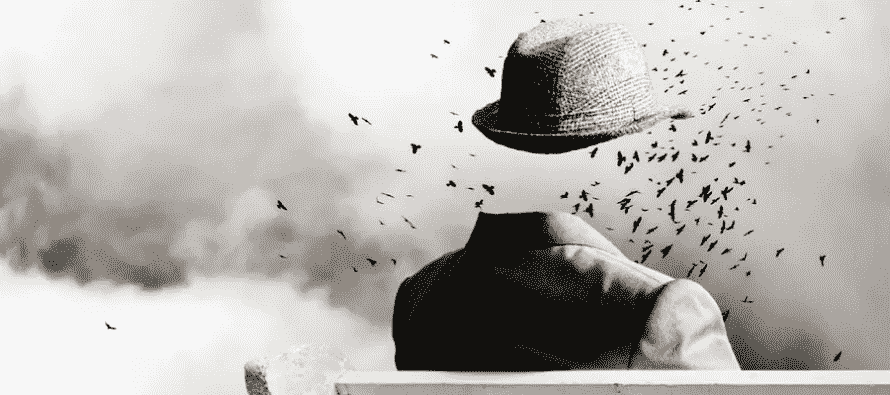

# 隐私被冻结了:让它去吧

> 原文：<https://medium.com/swlh/privacy-is-frozen-let-it-go-ab26c5f1079a>

## 接受重新定义的可能性

隐私正在消亡，也许它应该消亡，所以让我们放弃它，或者至少接受重新定义它是什么以及它应该扮演什么角色的可能性。有一点是肯定的，那就是我们在设备上或外部做的每一件事，比如说，打字，点击或查看，都有可能被记录下来。

隐私是我们创造的一个概念，用来保护我们自己免受我们的决定和行为的后果，以及对它们的错误解释..我们不会轻易放过它。我们需要控制，我们担心我们自己和我们的名声，担心我们不时做出的不合理的，也许是不道德的决定，以及我们会被如何看待。

但是，隐私真的对我们有好处吗？或者它只是让我们在完美的展示和期望中产生膨胀的自我感、权利感和一系列日常身份危机？它是否阻碍了我们变得脆弱和真实？隐私隐藏了责任，那么如果我们变得更好呢？

我们至少必须对我们的言辞、物质和信息消费习惯和来源变得更加小心，以及更加意识到我们所围绕和依附的是什么和什么人。我们会更加意识到我们创造了什么，以及它可能带来的影响。

我们将不可避免地需要更自觉地意识到至少我们是谁，我们代表什么。对无意识的容忍将会大大减少，我们所知道的生活将会转变，变得更加可持续，更加有同情心，更加人性化。

我们准备好接受这种意识、责任感和同情心了吗？我不知道。说“去他妈的成为更好的人”似乎更容易。让我做我想做的事，没有后果。通过保护隐私来保护自己。”

但这是我们想要生活的世界吗？这是我们希望我们的下一代生活的世界吗？支持和支持剥削的人。

我不知道我们要去哪里，但无论如何我都会在那里。

# 原始想法…

> "我们要贡献和完成的不仅仅是成就和贡献."—华莱士
> 
> “关注那些不会改变的事情。”—杰夫·贝索斯

我们怎么玩:我们的 MVP

我们的意义和目的不在于它如何出现，而在于我们如何去发挥它；我们的可持续发展、理念和方法也是如此。通过基本面的精湛技巧，掌握本身出现了。我们的“我们”或“你”的产品永远不会真正完成，但我们应该运送它，呈现它，活出我们最好的版本。成为你自己最简单可行的产品…甚至更多。

有目的地睡觉

我们应该为我们所做的贡献感到兴奋，就像我们醒来时有机会做同样的事情一样。并在我们一天的每时每刻都带着这种能量、兴奋和积极贡献的姿态。我们不得不经历多么不可思议的生活。

智慧被高估了，保持沉默

帮自己和他人一个忙…与其努力变得聪明或做出明智的决定，不如更努力地保持不愚蠢。抛弃你顽固的骄傲，放弃对价值或繁荣的直接认同中的认可和安全感，变得不那么愚蠢，不那么无私，头脑更加简单。你的健康、钱包、世界和人际关系都会因此而感谢你。

试金石

好吃吗？它有用吗？有贡献吗？如果这个决定，它所代表的东西和它的结果——物质的或其他的——伴随着你的余生，与你一生的身份融为一体……你会为此高兴吗？

## 这篇文章发表在《创业公司》杂志上，这是 Medium 最大的创业刊物，有 303，461 人关注。

## 订阅接收[我们的头条新闻](http://growthsupply.com/the-startup-newsletter/)。

