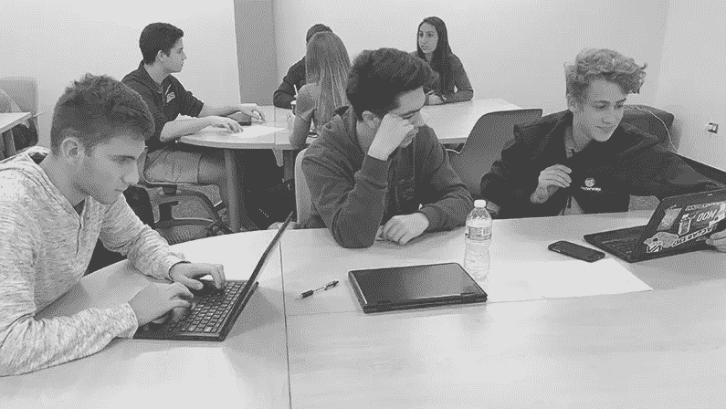
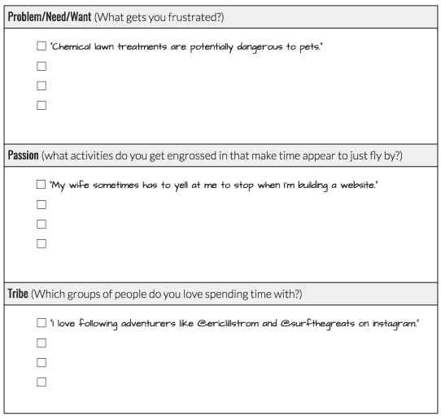

# 问题、激情和部落

> 原文：<https://medium.com/swlh/problems-passions-and-tribes-6771f1505a27>

没有什么比在这一领域接受过一次指导更能让你做好准备，带领你的学生度过创业的构思阶段了。不幸的是，对于第一年的孵化器教师来说，这是不可能的，所以我试图在一篇简洁可行的文章中收集我对这一极其重要的步骤的想法。

# 问题

孵化器课程完全正确，创业企业应该寻找问题来解决。如果痛点足够严重，其他人会付费来解决这个问题。然而，我发现的问题是，学生们很难找出任何问题，更不用说值得创业的问题了。这里有一个简单的解决办法，就是让你的学生在第一天甚至在学期开始前就开始识别问题、需求和愿望。学生需要时间和练习来加强面对挫折或逆境时实现机会的元认知过程。

然而，在这门课上，时间似乎从来都不充裕。“问题/想要/需要”提示通常只会产生以下结果:纠结的耳机、温暖的枕头和缓慢的午餐队伍。

# 激情

除了花时间练习识别问题，我还要求我的学生思考生活中他们最感兴趣的领域。这可以是一项运动、爱好、课外活动、收藏、乐器、电影类型或小批量手工意大利面条艺术。关键是，激情是什么并不重要，只要激情是强烈的。创业是困难的，当学生基于市场机会而不是激情选择一个想法时，这个想法往往会随着时间的推移而失败(有时是很短的时间)。如果你的学生打算创业，他们不妨热爱这个行业！

更重要的是，当一个学生真正对某件事充满热情时，他们会比大多数人更好地理解这个话题，并更好地找到值得解决的问题。有时*【商业话题】*先来，然后由学生们来进行*【问题发现任务】*这可以通过反思和进行一次“*旅行”*——产品设计公司 [*IDEO*](https://www.ideo.com/) *采用的一种做法来实现。*

简而言之，短途旅行是到一个与学生的商业主题相关的地方进行短期实地考察。远足应该在学生自己的时间内完成，可以作为家庭作业(最好是在周末)。在远足中，学生应该计划观察和采访他人，以更好地了解他们的空间。

# 部落

产生想法的另一种方法是让你的学生考虑他们倾向的“*部落”*或人群。他们在 instagram 上关注谁？他们发现自己在 YouTube 上看谁？他们发现自己属于什么样的微观人口统计学？另一种思考方式是，你的学生最乐意为哪一群人服务？就像确定他们热衷的事情一样，如果他们的业务直接影响到他们最关心的人，他们就不太可能失去创业的动力。

# 摘要

这门课程的创意阶段非常重要。具有强有力的、可操作的想法的团队往往参与更多，工作更努力，对课堂讨论贡献更大。虽然*精益方法*从根本上来说是为了帮助审查商业想法而设计的，但你班上第一次创业的人可能会受益于在头脑中考虑这个框架的构思过程。

# 资源

下面链接的是我在第一天发给我的学生的构思工作表，它引导他们完成问题、激情和部落框架。如果你认为它可能有用，请把它纳入你的课堂。

*   [**1.1 —构思工作表**](https://docs.google.com/document/d/1oSf__H32S1-ZO28ojuCo9pYJCgtLhuh-2VwXpQjDg5Q/edit?usp=sharing)

## 这篇文章发表在《创业》杂志上，有 258，400 多人聚集在一起阅读 Medium 关于创业的主要报道。

## 点击这里订阅接收我们的头条新闻[。](http://growthsupply.com/the-startup-newsletter/)

