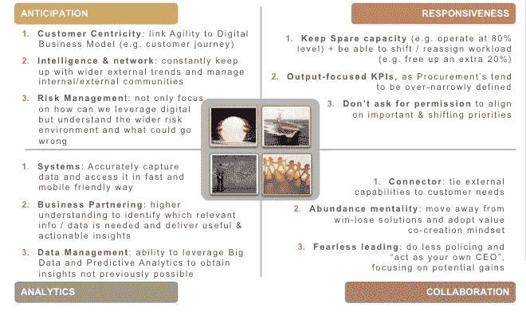
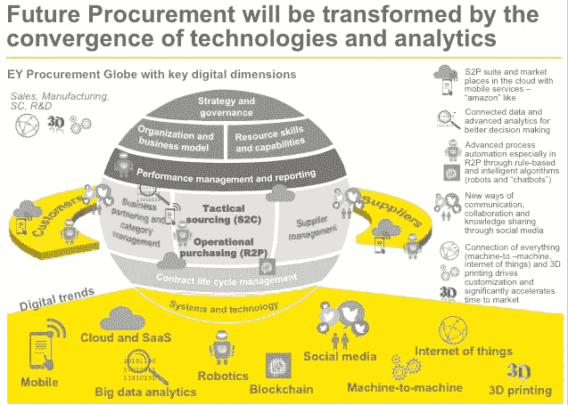
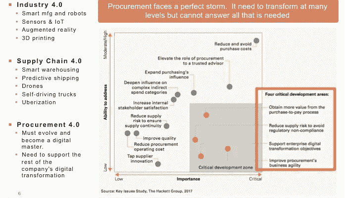
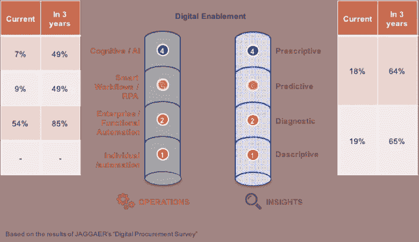
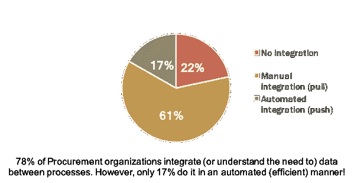

# 数字化时代的采购敏捷性

> 原文：<https://medium.com/swlh/procurement-agility-in-the-age-of-digitalisation-e5b9a71da9dd>

今年是我们举办采购生产力智囊团的第五个年头，在这个智囊团中，我们处理了一些首要问题，如 SRM、创新采购、作为生产力引擎的采购以及下一级采购技能。在此期间，我们对这些重要话题探索得越多，我们就越意识到我们只是触及了一个巨大冰山的一角。

**采购智囊团？**

但是，什么是采购智囊团？你可能会问，这个问题的答案让我们看到了我们工作的本质。在我们整个采购领域的工作中，我们努力创造一个真正学习的环境，并与商业同行就可以在开放交流的环境中深入研究的主题进行互动。这些聚会是会员制的，仅限于 15 家公司，每年聚会三次，在会议期间讨论一个单一的主题。在幕后，我们作为组织者，寻找关于我们正在讨论的主题的见解、指导和最新思想。我们邀请从业者、行业专家、顾问和学者加入我们的智库，以便获得对我们正在审视的问题的最新见解。

本文是今年系列的总结。虽然许多见解、观点和意见来自一小群从业者，并且可能因公司而异；尽管如此，这些见解可以应用于许多组织和行业。

2016 年，当我们结束当年的讨论时，我们的成员敦促我们关注采购效率领域。虽然人们承认提高效率本身就是一个坚实的目标，但为了能够应对即将到来的数字革命，提高效率的必要性强调了这一概念。我们的大多数成员都承认，他们学习和掌握数字工具的能力不足，他们需要时间来准备。

**2017 专注于提高驾驶效率和灵活性**

提高采购效率(用更少的资源做更多的事)和同时掌握技术变化(特别是数字化的影响)是两个截然不同的目标。他们需要不同的资源、不同的思维和不同的领导，这让采购团队陷入了难以维持的困境；需要做出更多的贡献，但没有能力吸收可能解决这个问题的新技术。因此，在 2017 年，我们推出了我们智库系列的第五期“*不断增长的数字化和敏捷性能力推动采购效率”*，与十几家成员公司一起调查这两个伴生问题:

采购敏捷性的燃烧平台是什么？

敏捷性增长的主要方面是什么？

发展数字化能力能解决采购灵活性的问题吗？

深入探讨数字领域的关键话题:1)大数据和物联网技术将如何影响采购活动？2)什么是人工智能，采购如何利用这一机会？RPA 是什么？它会取代大多数采购运营任务吗？

在通往数字化未来的征途上，采购现在处于什么位置？

谁是采购数字化支持的领导者？

如何组装数字路线图？

推动数字化前进需要什么样的人才？

我们整个第一次会议都在探讨敏捷性的问题，以及采购团队需要掌握的关键要素。对敏捷性的深入思考揭示了它不仅仅是关于灵活性，而是一个永无止境的思考-计划-行动的循环，所有这些都在一个下放的批准矩阵中(参见我的博客[Agility——让灵活性看起来像计划](https://tinyurl.com/y8us5cwk))。确定的采购敏捷性的四个支柱是:预期、分析、响应和协作，如下所示:

**Figure 1 — Key Considerations For Procurement To Master Agility**

这场讨论的有趣结果是，数字化的概念没有成为成为敏捷组织的首要活动。相反，该集团认识到，虽然数字化是采购需要掌握的许多要素的基础，但就其本身而言，数字化只是一种敏捷的使能工具。从这个角度来看，变得“数字化”的热潮与其说是狂热地全力以赴去做一些“数字化”的事情，不如说是从一系列最有助于实现商业战略的技术中进行“挑选”。

为了解决数字化问题，鉴于整体成熟度和最佳实践范例的缺乏，我们向该领域的众多专家和公司寻求最新的想法，并与 EY 密切合作，以了解数字化对采购的广泛影响。EY 展示了他们的模型(图 2 ),该模型将新技术将成为作战和战术活动基础的概念联系起来，同时认识到这些概念存在于一个自上而下驱动的世界中，并与职能和组织战略保持一致。

**Figure 2 — Technology in the Procurement Sphere**

人们认识到，获取和吸收这些新技术是一个菜单，采购团队可以根据他们的战略目标，从中选择最需要的技术。

然而，虽然采购的任务是处理范围非常广泛的新技术，它也必须处理其传统的任务。JAGGAER 的“采购数字专家”Bertrand Maltaverne 用他的完美风暴类比(图 3)向小组提出了挑战。随着采购继续向数字化发展，例如采购 4.0，it 仍然必须管理日益复杂的供应链，降低风险，提高效率，扩大影响力，并成为值得信赖的业务顾问。这些任务的艰巨性给采购团队带来了一个难题，即首先解决哪个优先级的问题。

**Figure 3 — The Perfect Storm in the 4.0 Era … Digital Transforms Everything**

这个问题令人沮丧的结果是，采购团队没有在数字技术方面占据领导地位，而是选择成为更广泛的数字技术实施工作即将产生的任何任务的接受者。数据显示，大多数采购组织要么没有做好准备，要么对数字技术采取了“观望”的态度。那些已经起步的组织经常以随意或不协调的方式采用技术。现有技术的数量之多，必须对其有用性进行评估，然后加以实施，这阻碍了采购组织建立有效的前进道路。不知道何去何从使得采购团队无法前进。

当然，这个问题是双重的。首先，采购团队中必须存在关于可用技术的特定知识，其次，领导层了解这些技术以及它们如何在战略环境中相互配合。只有到那时，才能制定出一个框架，对如何以及何时实施所选择的解决方案进行优先排序。如今，大多数采购组织都无法应对这两个领域的挑战。EY 展示了技术解决方案领域，采购团队应该考虑将自动化作为其数字规划流程的一部分。

**Figure 4 - Automation Hotspots In Procurement Source To Pay Activities**

虽然这些技术中的许多正在迅速成为标准，但事实仍然是许多采购团队正在以零敲碎打的方式处理这些技术，或者根本不处理。通常，承诺以最快方式提高交易流程效率的数字解决方案不再属于采购范围。这些活动已经被归入其他更大的业务服务功能中。虽然我们长期以来一直主张将事务性活动转移到其他职能部门，但我们可以看到不祥之兆。采购职权的持续侵蚀加上自动化技术，可以很容易地预言我们所知道的这一职能的厄运。由此产生的逻辑结果是，采购正在向两级职能演变；一种是主要通过数字技术来管理一套增强的运营活动，另一种则更具战略性，管理诸如供应连续性、风险管理、协作价值创造和采购创新等问题。最近的几份报告，包括亨克博士与弗劳恩霍夫研究所的合作及其形成性工作“*采购 4.0，采购 4.0 的数字化*”2016 弗劳恩霍夫 IML 和 BME e.V .清楚地指出了这一趋势。

当然，接下来的问题就变成了一个拥抱数字革命的采购团队如何计划和开发一个有效的路线图，最终让他们(并让他们)掌握采用什么技术以及采用的速度。许多讨论都围绕着这个话题，无论是在智囊团会议上，还是在常规会议之外的成员之间的对话中。从这些对话中，提出了一个模型(图 5 ),该模型显示了组织如何从最低级别的自动化向全数字化环境转变。

该模型试图描述采购组织通过获取新技术和技能所经历的旅程。一条路通向卓越的运营活动，另一条路满足人们对更深刻见解的渴望，以便做出更好的战略决策。

**Figure 5 - Building the Digital Roadmap**

我们的成员强烈要求我们共同构建一个真实世界的模型，来说明组织必须如何构建一条数字化的前进之路。一个特别有用的见解是，没有一个组织能够单独地通过这两座技术塔中的任何一座向“数字天堂”前进。相反，现实世界的道路是不连续的，组织必须从一座塔跨越到另一座塔，因为在一个领域(如运营)获得的知识支持另一座塔的目标(更好的见解的应用)。这意味着，虽然采购团队应该远离执行操作任务，但他们不能脱离采购哪些技术的决策过程。推动未来运营的技术将成为新见解的基础，而新技术作为更好的运营和更好的见解的基础之间的关系将在数字化之旅中一路向前。采购团队必须决定购买哪些技术。

**模型解释**

创建数字前进道路的基础总是从一个基本的“为什么”开始，它由图 5 中的 burning 平台表示。重要的是确定必须解决的战略性数字需求(例如，提高客户满意度、更好的创新、更高的质量、更高的利润……)。只有到那时，一个组织才能开始决定采用什么技术。这里概述了每个塔的渐进步骤。

**一)**运营效率塔

**第一阶段——个人自动化**:在用户层面优化单个“片段”

**阶段 2 —功能自动化**:整合(人员、流程、技术。)在功能/x-功能级别。没有今天的数字产品也能做到这一点

**阶段 3——智能工作流程/机器人流程自动化**:基于模型化和模板，技术执行标准活动，人员控制参数，但对异常情况采取行动

**阶段 4 —认知/人工智能**:自主学习、新知识、决策过程中的主动协作

**b)** **数据洞察塔**

**阶段 1 —描述性:**报告发生了什么？用于检查&控制目的，以及防止欺诈。在大多数组织中，这通常已经外包或自动化了

**阶段 2 —诊断:**了解为什么会发生这种情况？**日益被视为商品**

**第三阶段——预测:**预测将要发生的事情？这开始支持增长和创新，因为它使用数据来寻找新的机会。在这个阶段，采购智能系统在业务智能系统中使用虚线是很有帮助的

**第 4 阶段——说明:**自动决定我们应该做什么？需要通过质量可靠性获得企业的高度认可和用户的高度信任

自动化始于个人或职能层面(操作塔中的阶段 1 和阶段 2)。这允许进行数据收集和分析，并释放资源以将数据用于描述性和诊断性洞察(洞察塔中的阶段 1 和 2)。通过更好的数据，可以开发智能流程和机器人流程自动化(RPA ),释放更多资源，从而提高数据的数量和质量，进而实现预测性洞察(洞察塔的第 3 阶段)。反过来，这允许进一步的进展，以达到双塔的最高水平，这成为认知/人工智能技术之间的持续改进循环，从而实现越来越复杂的规定性见解。在这一点上，我们可以考虑一个真正的数字功能。

**那么驾驶数码需要哪些技能呢？**

***“和大多数颠覆性技术一样，早期采用者不一定会受益。成功属于那些知道如何吸收和管理变化的公司***

很少有采购组织拥有数字化战略和路线图，部分原因是可用技术范围广泛。简而言之，“有太多的数字选项，不知道先解决哪个”。拥有实施数字化转型的人才和领导力的组织就更少了。因此，采购部门必须建立自己的数字化路线图，以符合公司整体数字化战略的顺序格式解决具体技术问题。我们需要了解、招募和发展各级的特定数字技能，认识到高层领导通常是最缺乏的

哈克特集团(Hackett Group)2017 年 2 月出版的最新出版物《*精通数字技术的首席财务官》* Essaides，Willman，Frank 非常清楚地指出了这个问题。采购也是如此。我们完全同意，采购专业人员需要具备四个关键属性来充分接受和推动数字化转型:

**求知欲**:为了提供更快的洞察力并为商业决策建立复杂的模型，分析技能将是非常需要的。除了建模，员工还需要知道如何提出正确的“为什么”问题，发现数据中的模式，找到因果关系，挑战现状。

**精通技术**:专业人员不需要成为数据科学家或程序员，但他们需要熟悉新技术，以便能够与 IT 同行进行智能对话，并快速采用不需要 IT 干预的新工具。

**商业敏锐度**:被指派与企业合作的员工(在某些情况下嵌入业务部门)需要对公司、其运营、其价值驱动力和竞争环境有透彻的了解。在这篇[文章](https://tinyurl.com/ybhjdm4h)中，去年智囊团的成果充分涵盖了商业合作能力的必要性。

**讲故事的技巧**:数据是使数字商业成为可能的机制，但交付机制是一个“故事”如果结果没有以故事、业务问题或解决方案的形式表达出来，即使是最好的模式识别软件也不会改变高管的想法。

**更广阔的视角证实了调查结果**

在许多行业的更广泛背景下审视采购组织当前的“数字化”进展水平，所呈现的画面与今年的结果一致。

这些发现(可在报告“[2017 年数字采购—只是炒作还是新标准？](https://www.jaggaer.com/resource/digital-procurement-study/)")来自于 JAGGAER 于 2017 年 8 月至 10 月进行的调查，该调查收到了来自 168 名采购专业人士的意见，并表明大约一半的人已经掌握了基本知识。他们使用电子采购、电子采购和 SRM 解决方案。他们的下一个投资重点是如何从数字化核心流程中获得更好的洞察力。

这些组织正走在数字路线图模型中突出显示的道路上:

a)从操作塔中的“企业/功能自动化”转移到洞察塔中的“描述/诊断”步骤

b)已经在规划对操作塔技术的下一步投资(智能工作流和 RPA)

c)已经认识到数字化之旅是一项战略计划的产物，该计划将技术和洞察力紧密联系在一起

**Figure 6 — Current vs. Short-Term Levels By Respondents**

数字化流程是一个巨大的机遇，其真正的挑战是以渐进的方式集成技术和见解，并支持旅程中每一步的业务需求。太多的组织将流程自动化本身视为一个终点，而没有从所获得的洞察力中获得战略利益。可悲的是，自动化过程的输出并没有自动链接到依赖它们的战略过程。

**Figure 7 — Integration Of Data Between Processes**

无法“连接各个点”会给采购团队带来巨大的后果。要么他们花费大量时间手动收集数据，要么他们根本不使用他们需要的数据，因为工作量太大。这种影响在许多行业都存在，导致采购效率低下。这在品类管理中尤其重要，因为在品类管理中，决策非常复杂，依赖于多种动态因素和输入。拥有完整、最新、实时的决策信息是实现敏捷的必要条件。比起简单的流程自动化，这才是组织应该以数字路线图为目标的“圣杯”。

**前进的道路**

数字化支持领域非常开放，没有单一的正确答案。然而，有一些方法可以帮助组织规划前进的道路。CPO 必须定义变革路线图，并使其与企业级数字化转型计划保持一致。这是通过三个步骤完成的:

1)定义数字路线图和愿景:战略需要支持组织利用数字技术转变其业务模式的整体方法，并确保对数字功能的每项投资都必须产生有益的业务成果。有利的商业利益将有助于推动新一轮的技术投资，从而创造更大的利益。

2)与组织战略保持一致:就其本身而言，大数据、预测分析或任何其他所谓的“数字”促成因素作为独立的技术都没有价值。结果需要帮助企业做出决策并推动与公司总体目标和数字计划一致的行动。这两者之间的任何差异都会造成“技术孤岛”，并使采购与企业目标不一致。

3)在采购部门建立数字化能力，以理解、掌握和领导数字化工具的优先采购和实施。

**结论**

虽然我们结束了 2017 系列，承认大多数组织都处于数字化之旅的最开始，但它也给我们留下了一个强烈的印象，即采购团队非常希望在组织的整体数字化战略中领导这项工作，而不是成为它的受害者。

在我们 2018 年的智库中，我们将从战略层面深入到一个层面，我们可以研究个人和团队如何构建知识和能力，以将数字见解引入更广泛的生态系统。我们还将探讨采购流程如何在运营层面发生变化的具体主题，包括在“gig”经济中的服务采购。请继续关注，正如我在开始时提到的，这是一座大冰山，我们还有很多东西要探索。

## 这个故事发表在 [The Startup](https://medium.com/swlh) 上，这是 Medium 最大的创业刊物，有 291，182+人关注。

## 订阅接收[我们的头条新闻](http://growthsupply.com/the-startup-newsletter/)。

