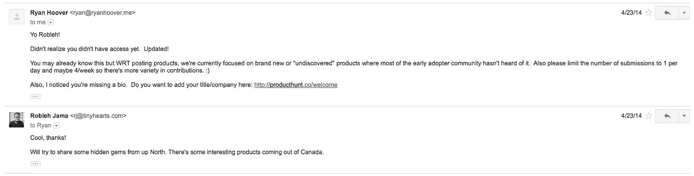
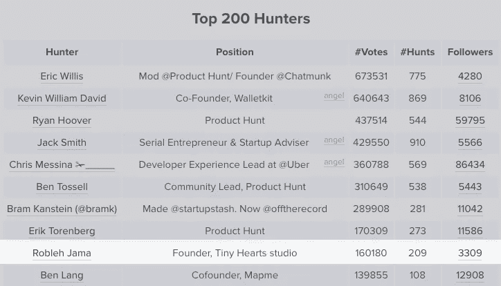
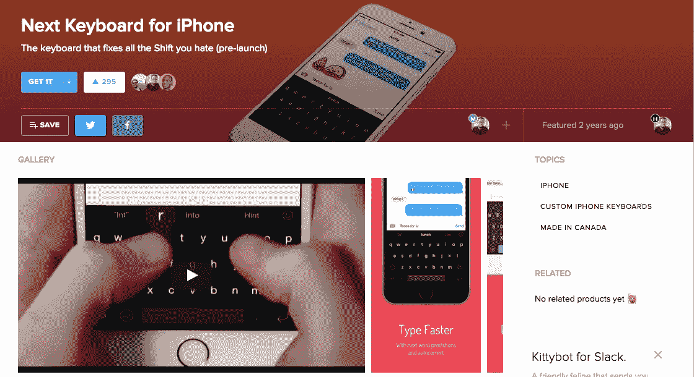
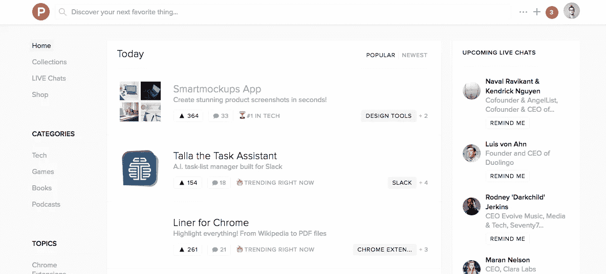
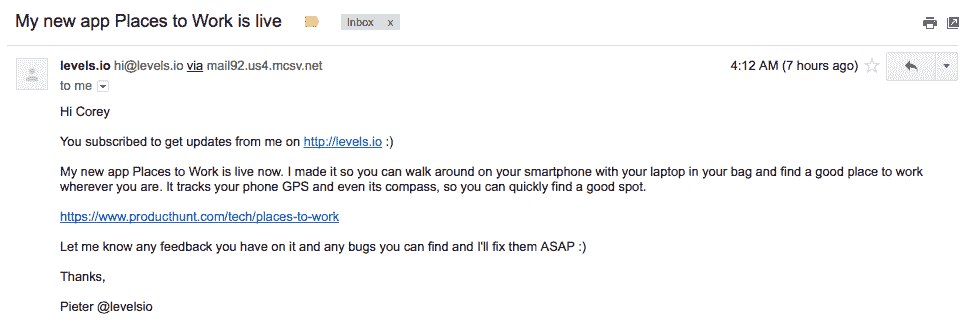
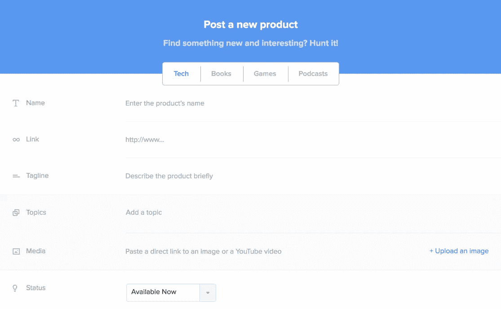
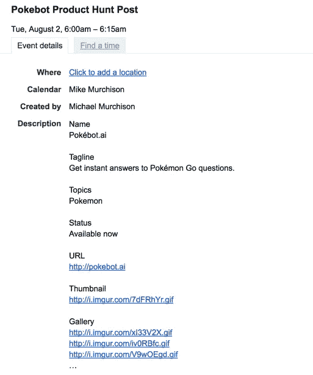

# 产品搜索 101

> 原文：<https://medium.com/swlh/product-hunt-101-426511f03501>

## *顶级猎人关于如何在产品搜索中击败它的建议*

几年前，我第一次听说 [Product Hunt](http://www.producthunt.com) 是通过[瑞安·胡佛](https://twitter.com/rrhoover)，他是我通过他的副业项目认识的，我马上就开始使用它了。对我来说，这是一个了解产品的好方法，也是一个和其他有兴趣分享和发现最好产品的人联系的好方法。如果你一直躲在石头下面，还没有听说过它，在这里查看产品搜索——你会从公司和个人那里获得一些很棒的见解和想法。这是一个非常了不起的社区。

Getting my PH 🔑

一晃两年过去了——产品搜索社区呈爆炸式增长，我仍然几乎每天都在使用它。许多公司使用[产品搜索](/the-maître-journey/how-we-nailed-our-product-hunt-launch-and-made-1-000-in-one-day-397fcce072d9#.jv5tlhy3k)来[发布他们的产品](/inside-birdly/600-upvotes-later-the-story-of-our-product-hunt-launch-6c088d7ec584#.pz2m74z2j)，许多公司已经看到成千上万的用户在一天之内加入/使用他们的产品。

List of the top 10 hunters on Product Hunt

在早期，我喜欢提交产品，并且是一个非常活跃的猎手。我有一种寻找很酷的工具和应用的天赋，其中有几个登上了第一名——这最终让我进入了 Product Hunt 的顶级猎人名单。我目前在[排行榜](https://www.yvoschaap.com/producthunt/)上排名第 9，介于 Erik Torenberg 和 Hiten Shah 之间。由于产品搜索的吸引力和我的个人资料的可见性，我得到了很多关于产品提交的信息。朋友和企业家也经常问我，“我们如何登上产品搜索的首页？”

答案很简单，但需要一些背景知识和对产品搜索工作方式的了解。这是细目分类:

# ***产品寻线是如何工作的？***

Product Hunt 是一个社交新闻网站，社区成员在这里发布有趣的产品。通常是(但不限于)数码产品。这个网站非常受欢迎，并且已经迅速成长为一个相当于黑客新闻的网站。

一般来说，产品会被提交和投票(像 Reddit 和 Hacker News)，社区会讨论这些产品。这是一个发现产品的地方。通过联想，用户还会发现这些产品背后的公司和人物。

TechCrunch 曾经是产品发布的圣杯，但产品搜索很快[给了它一个机会](/@peterbuch/why-we-are-launching-exclusively-on-product-hunt-not-on-techcrunch-e0114cf97ca5#.3dz01ydjt)(也见[这个](/@bramk/how-i-launched-the-2-most-upvoted-product-of-all-time-on-product-hunt-f3772fb20ad8#.6rzkgaml9)和[这个](/@mattsydeworks/how-product-hunt-helped-me-grow-a-list-of-12-989-483-288-valuable-subscribers-and-generated-220k-4406c175add0#.mlp7cyd3y))。

Next Keyboard’s pre-launch Product Hunt post

它已经成为许多公司推广策略的一部分(用于发布、更新等)。有些人也在那里做客户开发，获得真实的、高质量的反馈，就像我们用 [Next Keyboard 获得 beta 测试人员](https://www.producthunt.com/tech/next-keyboard-for-iphone)所做的那样。产品搜索最近甚至扩展到了游戏、书籍和播客。

# ***如何在产品搜索上碾压它(专业提示&最佳实践)***

Product Hunt front page

产品搜索首页获得了大量曝光，但它同样重要，因为顶级产品[会在电子邮件摘要](https://www.producthunt.com/faq)中被挑选和推广。理想情况下，当你在产品搜索上发布某样东西时，你希望它获得足够多的投票，以保持在折叠上方(屏幕上不滚动或点击任何东西的可见部分)，这样你对登陆网站的人总是可见的。算法类似黑客新闻，Reddit 之类的。我建议不要发送直接链接或让来自相同 IP 地址或位置的人投票支持它，否则你的产品有可能被列入黑名单。(解决 IP 地址问题的一个简单方法是让人们通过应用程序或手机数据连接投赞成票。)

你需要一个当前成员的邀请才能对提交的内容发表评论并提交新的内容。顺便说一下，仅仅因为你*可以*提交，并不意味着你应该提交。

## *提交材料*

人们经常试图让顶级猎人提交他们的产品。这是因为顶级猎人有更多的追随者。当他们提交一些东西时，他们所有的追随者都会收到他们提交了产品的通知。你可以在这里找到顶级猎人的名单。

影响者还拥有发帖权限，可以将他们的提交内容直接放到首页。如果你正试图沿着这条路走下去，看看那些提交了很多的人，看看他们的提交是否上了头版。

## *调度*

理想情况下，你希望你的产品在太平洋标准时间早上第一时间发布。Product Hunt 每天大约在太平洋标准时间上午 12:00-12:30 刷新排行榜。住在西海岸或欧洲的人在这方面有优势。我通常在美国东部时间早上 6 点或 7 点左右发帖。到那个时候，通常已经有一些产品得到了一些关注。

选择一周中的一个好日子来做这件事。周末通常比较慢。我更喜欢一周的中间，在星期二到星期四之间。如果产品搜索有点像 Reddit，那么周一至周四可能是流量最大的日子。

## *讨论*

回复一切！这表明你在社区中很活跃，而且你很关心。这也让你的帖子看起来更活跃，这有助于将你的帖子推上主页。

## *赞成票*

不要直接求票。寻求支持、爱、反馈、分享，但不要寻求支持票。(此外，正如我之前提到的，不要给人们发送直接链接。)请求支持最好的方法是不要请求支持。这类似于[的那句风投格言，“要钱，要建议。求教，拿钱。”](http://www.instigatorblog.com/want-to-raise-money-ask-for-advice/2014/01/28/)

A good example of asking for support on Product Hunt

与朋友、朋友的朋友以及你的社交网络分享这个消息。想想脸书集团，Whatsapp 集团等。提前让你的支持者、粉丝、投资者、测试者排队，让他们知道 PH 发布会即将到来。同样，如果你计划发一封电子邮件，不要忘记联系现有客户，让他们知道你在寻找产品。

## *狩猎详情*

Adding your hunt details — Old Flow — New flow is much better 👌🏾

在提交应用程序前填写狩猎详情时，请谨记以下几点:

*   **名称:**挺直白的，你产品的名字
*   **标语:**应该是描述性的— ***而不是*** 你的营销标语
*   **直接网址:**您产品的网址
*   **图片和视频:**分享截图、宣传片视频、营销图片。gif 应该是正方形的，在 3MB 下面。缩略图中的 GIF 有助于帖子脱颖而出。应该首先添加此图像
*   推特:制造商的推特手柄
*   **类别:**这也能让产品搜索用户发现你的产品
*   第一条评论:你应该在文章发布的前一天写下你的第一条评论。这应该是一个简短的广告词，由你这个创造者来写，比如你为什么要开发这个产品，它是为谁设计的，你为什么认为它很棒，以及一个行动号召(比如，“寻找反馈”，或者“如果你注意到任何错误，请告诉我！”甚至可以只是，“谢谢你的检查:)”让你的朋友投赞成票，这样它就会浮到顶部，这样人们就知道你做了这个产品，并对评论做出回应。
*   **收藏:**为了获得更多的长期曝光率，将你的产品添加到与你的产品相关的流行收藏中。这样，更多的人会通过有机搜索找到你的产品。

当你自己提交产品或试图引起顶级猎人的注意时，这是你需要考虑和提供的所有信息。

# ***如何俯仰猎杀者***

大多数顶级猎人都有自己的日常工作，都是超级大忙人。他们还会收到来自其他人的大量投稿，希望登上头版。顶级猎人也喜欢有趣的产品——这就是他们最初加入产品搜索的原因。他们很乐意提交一些能引起社区共鸣的东西。你可以给他们提供这些。然而，你必须在投球(真实地)和发垃圾信息(恼人地)之间小心翼翼。

拿不准的时候，你会想要投出像*那样的音高。寻求反馈，在提出要求之前和对方谈谈，在你需要提交之前引发一场对话。*

*弄清楚谁是顶级猎人，他们在日常工作中可能有什么烦恼，他们对什么样的产品感兴趣，如果可以的话，增加价值。也许给他们发一些你发现的有趣的产品，这样他们就可以提交了。尽管如此，我知道时间有时是一种奢侈。即使你事先没有准备或开始与他们交谈，至少在向他们介绍你的产品时要真实可信。*

*理想情况下，做你的功课，看看你的产品是否是他们感兴趣的东西。产品搜索向你展示他们提交、投票和制作的所有东西。基于这三点，你可以了解一个人很多。*

*如果你没有收到回复，不要把它当成是针对你个人的，因为他们可能正全神贯注于其他任务或优先事项。如果他们选择不代表你提交，这可能并不适合他们。类似地，当你真的想要更多的选票时，不要在产品搜索上给随机的人发垃圾邮件来寻求反馈。(向随机的人发送垃圾邮件与我之前推荐的真诚地询问反馈是非常不同的)。*

*当你打算提交产品搜索，提前计划。当你开始构建你的产品时，你的对话就应该开始了。 ***建立关系，不仅仅是产品。这样，当你准备发布产品时，你就有了一个社区和利益相关者——真正对产品感兴趣的人。****

# ****大样间距****

*我经常被推销。我经营一个工作室，所以我很难对每一个问题做出回应。也就是说，我喜欢伟大的球场——这是一个伟大的球场。*

*Core15 的团队向我发送了一封简短的定制电子邮件，还为我制作了一个视频。他们谈论他们如何喜欢我的应用程序 [Quick Fit](http://tinyhearts.com/quickfit-7-minute-workout/) ，这与他们的应用程序密切相关，他们还在描述中提供了一个推广代码，以便我可以在好奇时尝试一下。*

*我之前不认识 Core15 的联合创始人，但是他们冷冰冰的邮件感觉真的很私人。[我很乐意为他们提交](https://www.producthunt.com/tech/core15)。联合创始人费以评论和产品搜索社区的快速行动者的促销代码开始了讨论。*

# ***日历邀请***

*我发现的另一个超级有用的方法是，让我提交产品的制造商在他们希望发布产品的当天早上给我发一个日历邀请，上面有我发布产品所需的所有细节。这是我的朋友迈克·默奇森最近发给我的一份日历邀请函。*

**

*Calendar invite Mike sent me for a fun side project he was working on*

# ****解构完成****

*既然您已经了解了产品搜索是如何工作的，我强烈建议您亲自查看一下这个社区。深入探索，做你自己，分享你最喜欢的产品。接触其他人，深入产品社区。虽然 Product Hunt 已经建立并拥有许多用户，但我认为它仍处于早期阶段。*

*我们定期在我们的邮件列表中探索[与产品相关的想法。如果你有任何问题，当然，如果你认为你有一个很棒的产品要提交，给我一声。我是推特上的@robjama。](http://bit.ly/1kp6lTN)*

**奖励提示:**

**

*Speaking on a panel at Product Hunt TO meetup in Toronto 🎙*

*使用 Slack 与其他创客和 PH 社区成员联系。如果你是一名创客，你应该考虑加入 MakerHunt，这是一个只邀请创客的 Slack 社区。你也可以在 phglobal.co 的 slack group 和产品搜索会议 IRL>[https://www.producthunt.com/meetups](https://www.producthunt.com/meetups)上与你所在城市的制造商交流*

**

# *如果你喜欢这篇文章，你可能也会喜欢:*

* [## 这是官方消息:我们开始营业了

### 是的，我们做客户工作

medium.com](/p/5db9bffdfa88)  [## 用手思考

### 框架设计初学者指南

medium.com](/swlh/think-with-your-hands-36d703f60164) 

## Robleh Jama 是获奖产品工作室 [Tiny Hearts](http://www.tinyhearts.com/) 的创始人。他们生产自己的产品，如 [Next Keyboard](http://www.nextkeyboard.co) 、 [Wake Alarm](http://www.tinyhearts.com/wake) 和[Quick Fit](http://www.tinyhearts.com/quickfit)——也为 Wealthsimple 和飞利浦等客户生产产品。

## [查看我们的博客](http://blog.tinyhearts.com)和[加入我们的时事通讯](http://bit.ly/1kp6lTN)，了解诸如“如何在 App Store 上被发现”和“如何制造人们喜爱的产品”之类的事情。

**如果你喜欢这篇文章，请推荐，帮助别人找到！**

*