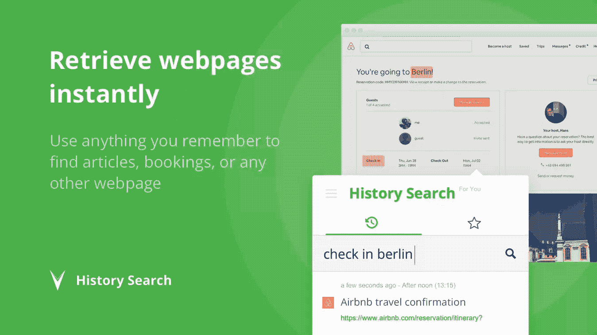

# 产品搜索 101:如何将你的产品从早期创意推广到收益

> 原文：<https://medium.com/swlh/product-hunt-101-how-to-launch-your-product-from-early-idea-to-revenue-c3f01864cdde>

## 我如何在产品搜索上启动[历史搜索](https://historysearch.com)并在 2 天内获得 1000 个注册的一步一步的过程

三，二，一，发射…对吗？不完全是。当你准备开始寻找产品时，你可能已经在这个产品上投入了几个月甚至几年的时间。发布失败将是毁灭性的，而做得好可以给你把你的产品变成生意所需的一切。

这篇文章的重点不是获得更多的投票，而是最大化你的发布的影响。通过关注影响，你将获得对你的长期成功最重要的基础。

一些背景:我总是对跟踪我们每个月遇到的成千上万的网页感到恼火。大约 4 年前，我有了为网络创建一个文件系统的想法。它类似于电脑上的 finder，但会对您访问的网页上的文本进行索引。这样，你可以使用页面上的任何单词来检索它——每当你再次需要一个页面时，节省你大量的时间。

在我们发布之前，我花了大约一年的时间进行测试。你不需要寻找产品来获得你的第一批用户。相反，你实际上需要一个测试版用户的基础才能成功推出。我们有大约 3500 个测试用户，这是我通过联系脸书的产品搜索团队获得的。我用了一个简单的信息:

这种方法的主要好处是，你可以接触成千上万你知道对新产品感兴趣或正在开发新产品的人——因为他们在产品(搜索)组。你会惊讶有多少人感兴趣。

当有人回复时，他们通常会询问更多的信息，所以我确保给他们一个关于什么是[历史搜索](https://historysearch.com)的简要概述。

这实际上是我们的价值主张和销售宣传的第一个版本。然后，我继续与那些愿意/感兴趣的人交谈，并利用这些信息来改进产品和“故事”。在你发布的时候，把你的故事写好是至关重要的。

关于建立早期测试用户群的部分到此结束，因为本文实际上是针对下一个阶段:利用你的产品搜索发布将你的工作转化为业务(获得重复出现的用户和收入)。

***为我效力的群体***

> [SaaS 成长秘籍](https://www.facebook.com/groups/SaaSgrowthhacking/)
> 
> [按压开始](http://pushstart.in)
> 
> [Saas 咒语](https://www.facebook.com/groups/saasmantra/)
> 
> [启动产品发布](https://www.facebook.com/groups/startupproductlaunches/)
> 
> [产品搜寻](https://www.facebook.com/groups/producthunt/)
> 
> [SaaS 产品&营销](https://www.facebook.com/groups/saasproductsandmarketing/)

# 那么产品搜寻是关于什么的呢？

Product Hunt 是一个由技术爱好者和产品制造商组成的社区。每天都有新产品被追逐并获得支持。投票率最高的前 5 个产品会在第二天的每日简讯中被发送给+50 万会员。

在花费了无数的日日夜夜和金钱在历史搜索上之后，我最想知道的是“人们真的需要历史搜索吗？”他们是否愿意为此付费，这样我就可以继续工作——或者我的努力会白费吗？因为这就是你的第一批用户在现实中所做的事情:他们付钱是为了让你继续实现你的愿景。

> 你的第一批用户不是为你的产品付费，而是为你继续实现你的愿景而付费

显然，最好以当天的最佳产品结束，因为这将使你的产品出现在每日和每周的时事通讯中。然而，这并不全是关于在你的产品首次推出时首先进入，而是关于验证和建立一个参与的用户群——他们准备为你的产品付费。因此，只要你进入前 5 名，你就会出现在每日简讯中，你就可以达到目标。

## 我们从发射中得到什么

*   由于我们在 CNET 的[报道](https://www.cnet.com/news/history-search-browser-extension-keeps-archive-websites-you-visit/)(稍后会有更多新闻报道)，我们网站的日平均流量在发布当天从 156 个用户跃升至 2000 个左右，第二天达到 2500 个。
*   在发布日和第二天，我们收到了 1000 个新注册。发布高峰结束后，我们的每日有机增长翻了三倍，从发布前的 10 人增加到发布后的 35 人。
*   在发布当天，我们就有 30-40 个付费转化(我们提供了 25%的折扣)，自发布以来，每天大约有 2 个新的付费客户。
*   我的[产品搜索](https://www.producthunt.com/@martijn_verbove)关注者从不到 500 人大幅增加到近 1000 人(尽管我不知道这是否会对未来的发布有任何帮助)
*   我们目前有大约 650 名每日活跃用户，自发布以来，每天增加约 8-15%。
*   我们目前付费用户的转化率约为 5.8%，高于发布当天的 3.5%。

# 你怎么知道什么时候开始寻找产品？

关于决定何时启动，我的主要建议是，这不是要做什么，而是要做好准备。原因很简单:你的产品在发布时永远不会完美。

[历史搜索](http://historysearch.com)有太多我想改进的地方。例如，我真的不喜欢我们搭载新用户的方式。我觉得真的很棘手，很混乱。但是我们没有再重复两个月，而是在一天之内发布并完成了它。

当你以正确的方式发起时(不关注 upvotes)，你会得到比你想象的更多的问题、建议和想法。在我们的案例中，这给了我们创建入职体验所需的输入，回答了最常见的问题。

当你与人交谈时，你看到它一起倒下。所有这些事情都会出现，因为你实际上有一天可以在**与数百人交谈。在某种程度上，你有数百个头脑与你一起工作——他们告诉你你的产品或信息有哪些不清楚的地方，他们喜欢它的什么地方，甚至是你自己从未想过的想法或用例。这并不意味着你必须开发人们要求的所有东西，稍后会有更多的介绍。**

# **把你的故事讲清楚**

**在考虑发布之前，确保你已经彻底考虑了如何定位你的产品。为什么我们从“你的个人搜索引擎”转向“你的网络文件系统”？这是因为“搜索引擎”让许多人认为它只是公共页面，因此看起来像谷歌。虽然在现实中[历史搜索](http://historysearch.com)在技术上与谷歌做的一样，但是它通过与你的浏览器集成(通过浏览器扩展)来索引你访问的网页——所以这也使得找到登录背后的页面成为可能。**

## **它是什么与它做什么？**

****它是什么**和**它做什么**是两种根本不同的定位方法，你需要两者。在我们的案例中，我们有:**

*   **您的网络文件系统**
*   **回到一百万个网站的方法**

**重要的是不要让太多的人错过，因为它每次都会把你带到不同的方向。我学到的主要东西是，你的产品就是你所说的那样——例如。优步是出租车公司还是交通的未来？**

## **讲述你的故事**

**你的第一次发布其实不是关于你的产品，而是关于你的故事和愿景。写下你是如何走到今天这一步的故事很重要，不仅对外界如此，对你自己也是如此。如果你对自己的故事了如指掌，你就能更好地调整你的推销。这正是我所做的，尽管我花了大约两周的时间犹豫是否要发表，但我最终还是发表了。你猜怎么着？！这是我能做出的最好的决定之一——人们喜欢它，它甚至被初创公司出版了。这里是文章的链接。**

> **市场契合度=你的愿景+相信它的人**

**你的产品在发布时永远不会完美。有了[历史搜索](http://historysearch.com)，我想改进的地方太多了。但首先，这一切都是为了找到支持你并相信你的愿景的人。**

# **准备好发布**

****你需要一个明确的信息。**我们对[历史搜索](http://historysearch.com)的总口号是“回到一百万个网站的方法”但是，我们特意决定不在产品搜索中使用此消息，因为我们知道这是一个更具技术性的受众。**

**你的标语必须恰到好处。选择一个有趣的标语很有诱惑力，这可能会让你获得很多支持，但是:**

1.  **Upvotes 不会给你任何东西，除非他们来自那些真正对你所提供的感兴趣的人。**
2.  **如果你确实基于你有趣或有吸引力的标语获得了转化，你会有非常高的流失率——人们会喜欢它，并认为它很酷一天，但把它想象成 Instagram 照片。你得到了大量的喜欢，但没有持续的成功。在寻找产品的过程中，有趣的产品就是这样。**

****你需要一个现有的用户群。**非常重要的一点是，当你发布时，你已经有一个现有的用户群。它不一定要很大，但你必须有真正了解产品的人。这一点至关重要，原因有二。您需要:**

1.  **他们的反馈。**
2.  **他们的支持。**

**你需要支持。在你发布之前，坐下来想一想:我可以真诚地向谁寻求支持，以便在这一天发布我的发布信息？如果名单上的人很少，就很难推出。因为所有这些不仅仅是一种获得选票的方式，而是为了扩大影响力。为了达到目标，你需要一些支持。所以你需要一群真正相信并支持你所做的事情的人。**

**你需要一个获得媒体关注的计划。这对于第一次下水的人来说，难度极大。如果你读了一篇关于如何接触媒体的文章，大部分都是不正确的。其中大部分是记者写的，他们认为最好的方式是写一封定制的电子邮件——这可能对大品牌有效，但对初创公司无效。**

**在准备[历史搜索](http://historysearch.com)发布时，我给将近 20 个人写了定制邮件。我花了两个半星期研究。**

**有多少记者回答？一个。他只是回复说“我不再写这类服务了。”**

**所以当你联系记者时，你需要记住一些事情。**

1.  **当你给记者写信时，**这不是关于你，而是关于故事。**为什么他们的读者会对阅读这本书感兴趣？所以你需要转换你的视角。**
2.  **当你接触媒体时，你需要群发邮件。但不是像大多数人那样爆炸。不要只买能在网上买到的目录。你需要一份策划好的清单。分析你要向哪些人推销你的故事。**
3.  **给他们发一个你的新闻发布室的链接——不要给他们发新闻稿。**

**在发布前 3-5 天通过电子邮件发送新闻报道。这是我用过的电子邮件:**

****

**如果记者在你推介后 3-5 天没有回复你的邮件，并不意味着他们不会报道你。我建议在你发布的当天晚上发一封跟进邮件——不是同一个推介——告诉你结果。你甚至可以第二天再做，这样你就不会一遍又一遍地用同样的新闻稿轰炸记者。**

**如果你没有得到任何回应，也不要担心。我们的故事刚刚出现在 CNET，但他们从未回复。我发现了这个故事，因为我不明白为什么我们的流量在发布后仍在增加(通常是下降)，我使用[提及](https://mention.com)找到了关于 [CNET](https://www.cnet.com/news/history-search-browser-extension-keeps-archive-websites-you-visit) 的文章。**

****

****请记住:**如果 CNET、Mashable 等出版物的记者*愿意写你。那么他们是在帮助你，而不是你在帮助他们。我非常感谢 CNET 记者 Stephen Shankland 基于我写的故事，决定写一篇关于历史搜索的文章。他可以写十亿种其他的东西，而他选择了我们。***

**如果你不知道该在给记者的电子邮件中写些什么，这里有一些基本的推销公式。我应该说故事而不是推销。**

1.  **从你来的地方开始。你研究这个有多久了？这是什么？**
2.  **你需要付出多少努力才能获得今天的成就。**
3.  **既然你已经付出了努力，你已经解决了一个问题。**
4.  **不要忘记行动号召(CTA)。你想从记者那里得到什么？为什么你需要他或她的帮助？**

**这些都是简单的营销规则，但是我可以保证 100 份发给媒体的声明中有 99 份没有这最后一步(CTA)。**

**就我而言，我是相当真诚的，我愿意创造一个让他们的观众感兴趣的故事。我希望将[历史搜索](http://historysearch.com)推向全世界，并让尽可能多的人接触到它。**

**因此，当涉及到新闻时，要真诚。一个事件和它最好的故事一样好，所以用人们想读的方式讲述你的故事，你就有很大的机会被报道。**

# **发射控制**

## **你的清单:奇迹发生的地方**

**确保你的清单的不同组成部分协同工作非常重要——因为讲述你的故事的空间是有限的。让我们从出现在产品搜索提要中的消息的第一部分开始。**

****

**我们所做的是使用缩略图向某人展示它是如何工作的，并确保标题、标语(不要忘记“标签”例如。生产力)一起工作。你可以看到我们是如何选择生产力作为第一位的——这是因为它是故事的一部分。**

**接下来是你的幻灯片。记住，人们可能会对你的标语感兴趣，但可能仍然不明白如何使用你的产品。这就是为什么我们主要用这个来展示用例。**

****

**然后你可以用你的开场白来介绍你自己，并给出更多的细节，图片太长了，不能在这里张贴，所以我建议你在这里查看我们的列表:【https://www.producthunt.com/posts/history-search】T4 这也会给你一个印象，你会期待什么样的回应和问题。**

****提示****

**尺寸很重要。保持每张幻灯片不超过 2MB，否则对于使用移动设备或网络连接较弱的访问者来说，加载幻灯片会有问题**

**2 评论中的 YouTube 视频。没有多少人知道你也可以在评论区发布视频。所以我会把主幻灯片只放在用例上，并在评论中添加你的视频。**

**3 OG 图像。当人们将您的帖子分享到社交媒体时，第一张幻灯片会自动设置为显示的图像，使其易于加载(小于 1 MB)并在图像中添加更多上下文。**

****

## **发布日:计划一天的基本结构**

**发布日本身是超级忙碌的。你总是会分心。你需要一个计划——不是为了让你完美地坚持计划，而是为了让你在所有的干扰中有所参考。如果你收到一个 bug 或者一封电子邮件或者一条新闻，你必须马上回复，你知道从哪里继续，因为你已经制定了这个计划。**

**我实际上已经把我使用的结构放在了一个飞行桌上(见下文)，这并不花哨，但它是你计划发射所需要的。它的结构如下:**

1.  ****活动。**这些是你在发布日采取的行动。**
2.  ****物。**这是你活动的核心，因为如果你以数字方式发布，一切都与内容有关。**
3.  ****消息传递。确保你在内容、社交媒体和其他地方传达的信息是一致的。****
4.  ****支持。你需要伸手可及。为了达到目标，你需要支持。****

**Copy the base and use it to plan your own launch 👆**

# **发布日**

**第一，**不看排名。**你非常努力地做出了成绩，你不想看到自己成为第三、第四、第五等。在你的发布日——这只会分散你的注意力。**

**用[历史搜索](http://historysearch.com)，办公室的人都看了，我没有。我为这个发布日期做了一个计划。**

**在所有这些活动中，吸引你的观众可能是最重要的。在创业多年后，你可能是你的产品中的阿尔伯特·爱因斯坦，但是你不可能打败一百万个一起思考的大脑。甚至一千个大脑。底线是，如果你有一千个人愿意谈论你的产品，那就和他们谈。**

**首先，得到支持，听到热爱你工作的人的声音，是一种很奇妙的感觉。第二，你会学到你从未想象过的东西。**

**例如:**

*   **有人问“我不明白谷歌和[历史搜索](http://historysearch.com)之间的区别”，这让我想到了我们改进的入职页面上的第一张幻灯片，它可视化了它的工作方式:当你在网站上时，它会索引网站上的文本(即使它在登录之后)，而谷歌或浏览历史不会这样做。**
*   **有人对我们的升级页面提出了很好的观点。**
*   **有人对导入历史感到困惑。**

**你的发布实际上并不意味着你向世界贡献了什么。实际上是你有所收获:你有机会与人交谈并获得反馈。向感兴趣的人学习，也向不感兴趣的人学习，这非常重要。**

****尤其是不感兴趣的人**——这一点超级重要。和那些人谈谈，不要试图说服他们。你真的要深入到他们喜欢或不喜欢你的产品的核心原因。有时，有人会问你一个你没有考虑过的用例，比如有人问我们是否可以使用[历史搜索](http://historysearch.com)而不用自动索引。因为他的提问，我意识到这其实是有可能的。你可以暂停扩展，然后手动选择一个网页——这就是另一个卖点，不需要开发任何新东西。**

> **理解你真正建造的是什么需要时间**

****提示****

**1 上线。早上去直播。社交媒体会通知每个人，并通过你的脸书和 Instagram 粉丝进行宣传。**

**2 坐等胜利。每日产品搜索比赛在太平洋时间 00:00 开始，但我建议你等一个小时，看看谁会发起产品搜索，因为如果是 ex。谷歌推出新的东西，你将不得不与他们竞争。**

**3 不要对 Reddit 或黑客新闻有任何期待。当然，有办法使用这些渠道，但除非你真的建立了一个策略。**

**4 啮合。当人们与你接触时，真正地与他们交谈，试着理解和学习，因为这是你的机会。**

**5 内容上的牵引最要紧。不要链接 dump，最好是在几个群体中瞄准并产生互动，因为几乎所有的社交媒体都只会提升获得大量评论的内容。**

**我参加过的几个小组中有许多支持者和企业家:**

*   **[启动产品发布](https://www.facebook.com/groups/startupproductlaunches/)**
*   **[Saas 的口头禅](https://www.facebook.com/groups/saasmantra/)**
*   **[产品搜寻](https://www.facebook.com/groups/producthunt/)**
*   **[推动开始](http://pushstart.in)**
*   **[SaaS 成长黑客](https://www.facebook.com/groups/SaaSgrowthhacking/)**
*   **[SaaS 产品&营销](https://www.facebook.com/groups/saasproductsandmarketing/)**

# **你已经启动了，下一步是什么？**

**那么我们得到了我们想要的确认了吗？**

*   **发布日的总流量:约 2，000**
*   **CNET 日(第二天)的总流量:约 2500**
*   **我们现在每天大约有 650 名活跃用户，每天增加 15%左右！**
*   **发布当天免费向付费用户的转化率:3.5%**
*   **免费向付费用户的转化率:5.8%**

**一旦你启动了，你学到的东西意味着你再也不能回到你启动前的角度。我最重要的收获是什么？**

1.  ****这与你何时完成无关。关键是你什么时候准备好了。**准备好了就发布，利用这个难得的机会从社区获得反馈来改进您的产品。**
2.  ****重视反馈**。除了向上投票或媒体，最大的价值来自于我们收到的数百人的反馈，他们与我们交谈并帮助塑造我们的产品。**
3.  **你的上市日不是一天。更像是 5 天:前 2 天，后 2 天。相应地计划。**

**那么[历史搜索](http://historysearch.com)的下一步是什么？正如我所说，反馈是我们从发布之日起收到的最有价值的东西。我们正在利用有关入职流程的反馈来改进我们的入职。请继续关注后续文章，深入了解这一过程。**

## **在你走之前…**

**[*关注我的推特获取更多*](https://twitter.com/verbove) *。如果您觉得这篇文章有帮助，请单击❤️或👏按钮或分享关于脸书的文章，这样你的朋友也可以从中受益。***

********

## **这篇文章发表在 [The Startup](https://medium.com/swlh) 上，这是 Medium 最大的创业刊物，拥有+390，426 名读者。**

## **在这里订阅接收[我们的头条新闻](http://growthsupply.com/the-startup-newsletter/)。**

****