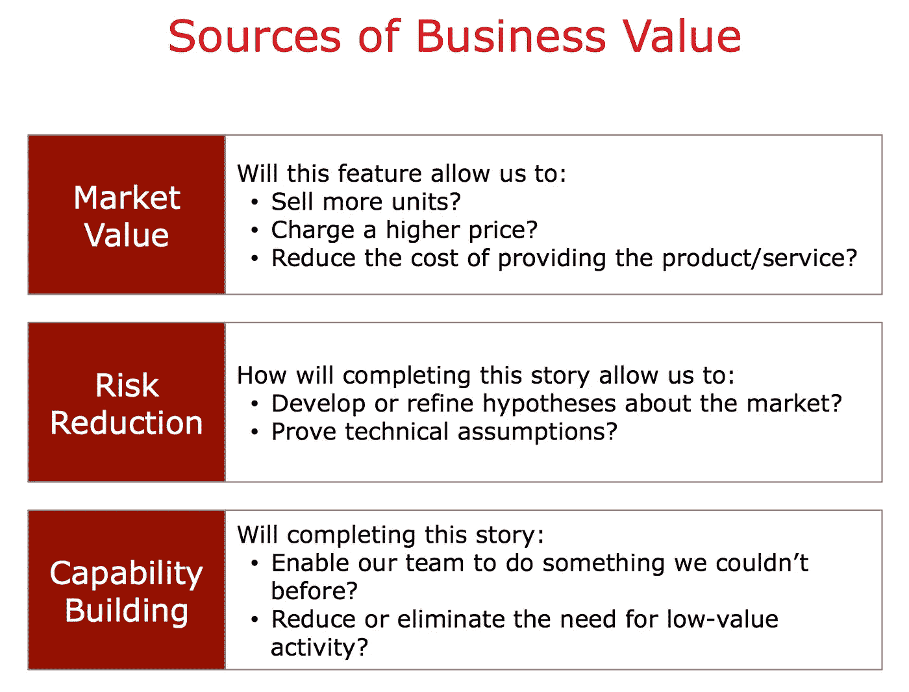

# 产品所有者、开发团队和商业价值

> 原文：<https://medium.com/swlh/product-owner-development-team-and-business-value-54a6f8fa6862>

最近，我读了很多关于敏捷环境中的商业价值的书，我读的最后一本书是这本书[商业价值的艺术](https://www.amazon.com/Art-Business-Value-Mark-Schwartz/dp/1942788045/ref=sr_1_1?ie=UTF8&qid=1515149927&sr=8-1&keywords=The+Art+Of+Business+Value)，我强烈推荐这本书，它让我思考了很多！这就是我写这篇文章的原因。

不管我们过去的工作方式如何，在任何行业工作时，有一点非常重要，那就是对自己所做的事情的主人翁感。我写了这篇文章，所以你可以在这里查看帖子。

如果你想一想，**你**认为什么时候你的工作效率会达到最高？在我看来，我们有两种情况:

1.  当你有很强的内在动力时。
2.  当你对自己正在做的事情有了主导权。

现在我要问一些其他的问题，你认为你的**团队**什么时候达到他们的最大生产力，对此感到满意？在我看来，我们也有两种情况:

1.  当你有很强的内在动力时。
2.  当你对自己正在做的事情有了主导权。

但是，有什么区别呢？区别基本上是，如果你自私与否，在第一种情况下，可能发生的是，只要你编程或你在你喜欢的产品中工作，它可能足以让你同时富有成效和快乐。或者，如果你是公司的所有者，并且你是团队的一员，你也会很开心，因为产品是你的，赚的钱也是你的，我的意思是这两种选择不一定要一起走，一切都取决于环境。

但在第二种情况下，这两件事需要一起进行，如果你希望你的团队成功，人们需要有内在的动力，同时对他们正在做的事情有主人翁感。

现在主要的问题是:

在一个你没有选择的产品和语言中工作，在一个你不拥有的公司里工作，你怎么能有效率并感到快乐呢？

我在读[商业价值的艺术](https://www.amazon.com/Art-Business-Value-Mark-Schwartz/dp/1942788045/ref=sr_1_1?ie=UTF8&qid=1515149927&sr=8-1&keywords=The+Art+Of+Business+Value)的时候，在书上看到了一些让我思考很多的东西，哪怕看起来是常识，记住，*“常识往往不那么常见”*

*“如果我们真的希望敏捷团队负责商业价值的交付，我们需要给予团队对商业发现和解释的所有权，而不仅仅是交付需求的所有权”*

我们知道 PO 角色，这里谁有受尊敬的实体和个人的定义:

**By Scrum.org:** “产品负责人负责从开发团队的工作中获得产品价值的最大化。如何做到这一点可能会因组织、Scrum 团队和个人的不同而大相径庭。

**迈克·科恩:**“Scrum 产品负责人通常是项目的关键涉众。产品负责人的部分职责是对他或她希望构建的东西有一个愿景，并将这个愿景传达给 scrum 团队。这是成功启动任何敏捷软件开发项目的关键。敏捷产品负责人在一定程度上通过产品待办事项列表来完成这项工作，产品待办事项列表是产品的优先特性列表。

注意区别，Mike Cohn 将 PO 和 Scrum 团队称为两个不同的东西，这有点奇怪，但是无论如何，在这两种情况下，我们看到 PO 将一些按价值优先化的工作交给开发团队。

例如，在我的例子中，在 sprint 中，我们有细化，我们检查已经创建的任务，我们试图看看团队是否理解这些任务，看看这些任务是否仍然相关，以及它们背后的内容，所以一旦开始，我们就减少不确定性，基本上目标是理解将要发生的事情，以便我们可以更新，创建新的任务或澄清下一个 sprint 目标所需的任何东西。

然后，在计划中，团队会看到 PO 已经确定了优先级的任务列表，我们可以讨论它们，这样我们就可以确保所有任务都保持一致，然后，sprint 从 sprint backlog 开始。

有多少次你在冲刺阶段听了，冲刺阶段什么都没有了，我能做什么？但是你检查了一下，其他同事正在做其他的事情，但是你问，同样是这个人，如果你是这家公司的老板，你会怎么做？他们肯定会有不同的反应和行为，他们肯定会找到工作。

为什么会这样？因为主人翁的感觉，这就是为什么这句话在*前被强调，“如果我们真的想要敏捷团队……”*让我想了很多。

这些任务的优先级是如何确定的？商业价值可以是很多很多的东西，而不仅仅是投资回报率或 NVP。

如果 PO 只传达愿景和价值，在这种情况下，更经济的数字和 KPI，但不允许写任何任务，会发生什么？为什么如果细化是为了业务部分，那么开发团队可以真正理解需要什么，这样他们就可以调整他们要做的方式。

这张截图来自一个 SCRUMINC 演示:

**市值**基本指的是数字，这样会不会增加收入，降低成本？

**风险降低**基本上指的是，例如，该功能是否能让公司确认他们正朝着正确的方向前进。

**能力建设**有点让人费解，这意味着团队可以做一些以前做不到的事情？减少低价值的活动？

*他们在*之前不能做的事情，比如什么？这应该由谁来定义？谁来决定什么是低价值的活动？

所有这些解释似乎都是在 sprint 规划中完成的，因为任务已经被划分了优先级，但老实说，我没有看到开发团队积极参与优先级划分，有时他们会请求一项任务，可能是为了增加系统的安全性，或者重构一些代码，诸如此类，PO 通常不会对此有所抱怨，因为我猜他们认为:

“如果它来自开发团队，并且他们要求这样做，它一定是重要的”——这只是我的假设，当然并不意味着它是这样的。

又来了，这样对吗？仅仅因为开发团队要求这样做，就意味着它必须排在待办事项的最前面？就像特性一样，仅仅因为 PO 说它很重要，它就必须放在最上面？

我们是否假设 PO 是完全正确的，因为 100%了解利益相关者和最终用户的需求？此外，我们是否假设开发团队完全知道为了系统的利益需要什么？至少开发团队讨论的话题比较多，因为 PO 只有一个，而一个开发团队就是一群人。

关于**商业价值的来源，**我想补充一些新的东西。

**团队和人员成长**，指的是以下方面:

*   有这个特性或者 bug 的团队会做一些结对编程吗？
*   特性 A 能让团队简化特性 B 和 C 的开发吗
*   团队会通过测试覆盖这个特性吗？
*   团队是否会增加测试覆盖率，以便错误不会再次发生？
*   这个特性是否意味着要研究一种新的语言？
*   这个 bug 是否意味着我要和数据工程团队一起寻找根本原因？所以我学习更多关于数据工程的知识？

请注意，这些是我在写这篇文章时发明的一些随机问题，但每个问题对团队、产品和组织都是有价值的，所有这些问题和从中得出的结论都可能是计算某个功能或 bug 修复的商业价值的公式的一部分。

你还必须考虑你的组织的使命和目的，如果你的组织不太关心人，那么“**团队和人的成长”**在决定正在做的事情的商业价值时不会非常重要，这是合法的，每个公司都有自己的优先事项和目标。

我认为我将需要更多的帖子来继续这个主题，但是商业价值并不容易计算，在计算商业价值时有许多方面要考虑，并不都是关于钱的，对我来说听起来很奇怪，我们有一组更接近商业方面的人，他们在很大程度上决定做什么和什么时候做，然后我们在另一方面有执行工作的人，开发团队也可以参与定义商业价值，但在某种程度上是较小的一部分。

我不认为我们可以仅仅期望开发团队会就需要做什么交换印象和意见，我认为，如果我们想要增加所有权的感觉，我们真的需要将执行工作的人与业务部分联系起来，使他们成为构思、发现和解释对整个组织有价值的东西的一部分。

**如何？我不知道，但我正在做一些事情，我有一个可能有用的想法，第一步，很快我会发表它！**

【http://marcos-pacheco.com/ 号

## 这篇文章发表在[《创业](https://medium.com/swlh)》上，这是 Medium 最大的创业刊物，有 281，454+人关注。

## 在这里订阅接收[我们的头条新闻](http://growthsupply.com/the-startup-newsletter/)。

