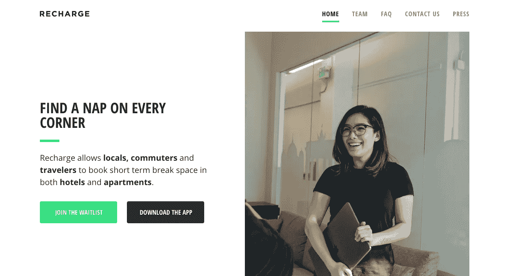
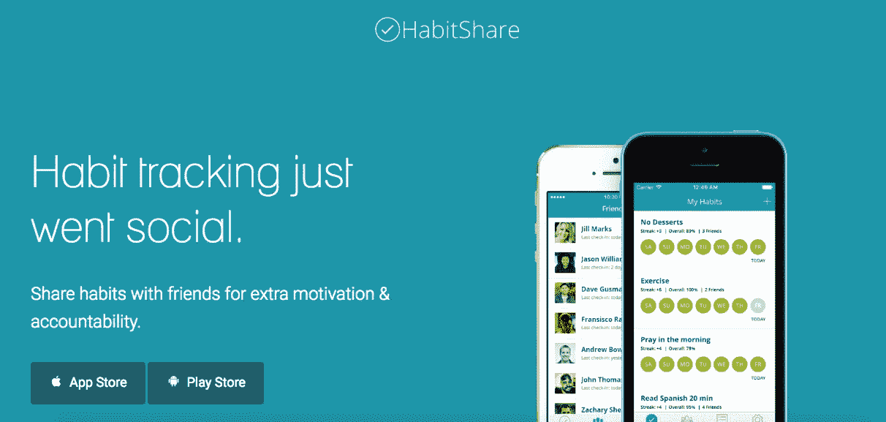
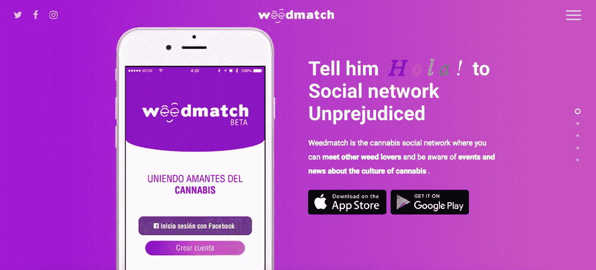
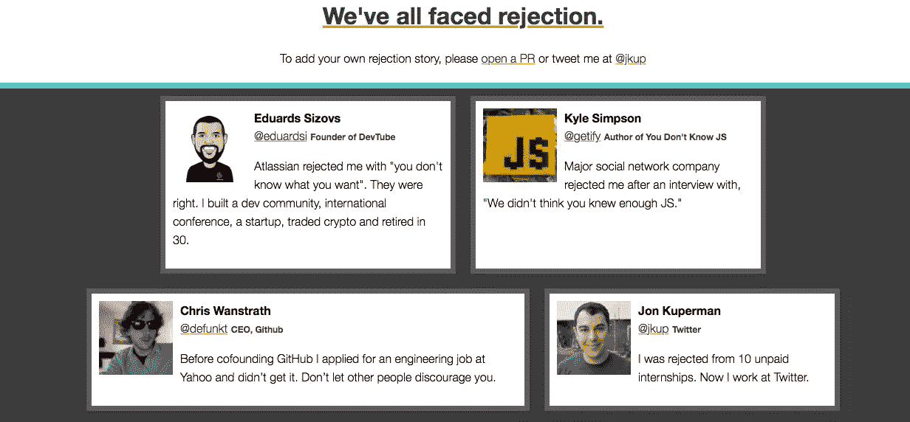
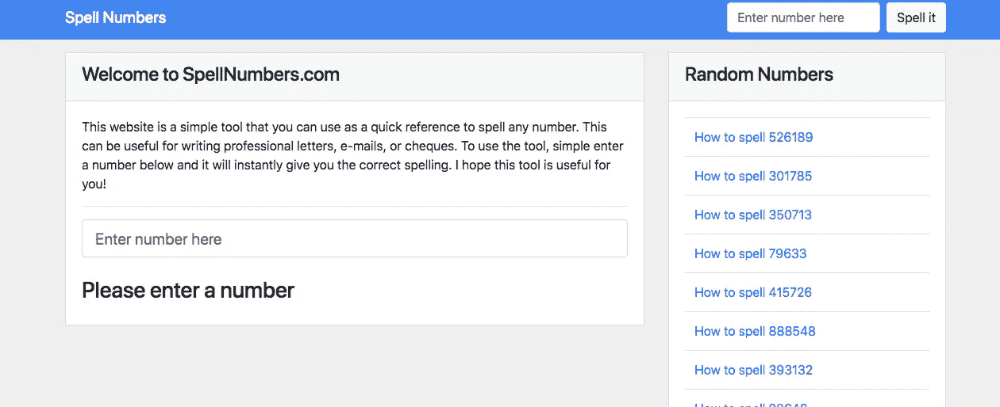
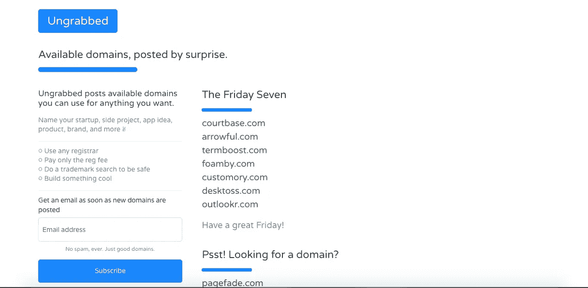
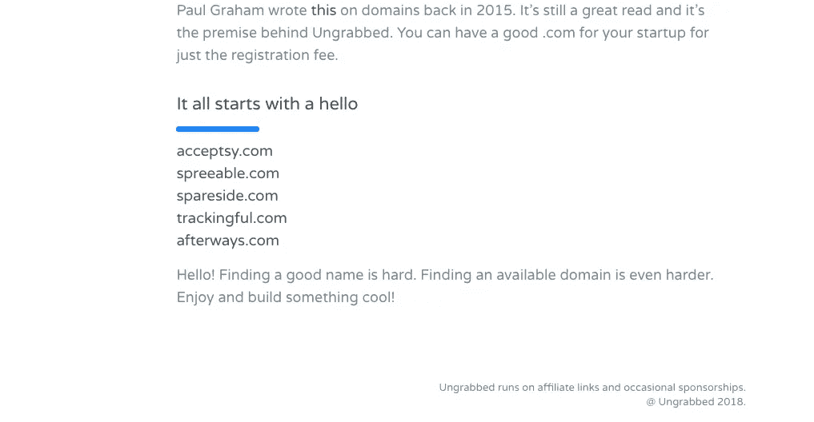

# 产品评论#1

> 原文：<https://medium.com/swlh/product-review-1-98901a379f0f>

## 人们在建造什么，它将如何改变我们的生活方式

Photo by [Adrien](https://unsplash.com/@adrien?utm_source=medium&utm_medium=referral) on [Unsplash](https://unsplash.com?utm_source=medium&utm_medium=referral)

> 一个产品是一系列的设计决策，在头脑中有一个特定的结果。[充值](https://medium.com/u/c030228809f2#)
> 
> 
> 
> Airbnb 来了**扰乱**(这个词又来了🤦🏾‍️)然而，酒店业，充值来支持酒店业，如果他们不推出类似的东西，可能会扰乱 Airbnb。充值可以让人们预订酒店和公寓的短期住宿。
> 
> 有什么不同？你是按分钟收费的，如果人们只需要使用房间一个小时来洗澡或小睡，他们就不必支付整个晚上的费用，而且酒店可以赚更多的钱，大多数酒店不是 100%入住，即使如此，在人们通常中午退房的时间和人们经常在晚上退房的时间之间，通常也会有一些空闲空间。
> 
> ## [HabitShare](https://habitshareapp.com/)
> 
> 
> 
> 我们很少会觉得自己在变平，过着最好的生活，人们常说，没有人是一座孤岛，因为孤独是糟糕的，责任社会化可能会让它更有效。
> 
> ## [Weedmatch](https://weedmatch.cl/#)
> 
> 
> 
> 考虑到大麻在一些地区是合法的，而且需求一直很高，将买家和卖家联系起来似乎是显而易见的。社交媒体网络似乎已经达到顶峰，但在多功能平台中，专注于利基市场的平台之美正在显现。
> 
> ## [Rejected.us](https://rejected.us/)
> 
> 
> 
> 我们生活在一个充满拒绝的世界里，听听别人的故事有助于我们认识到我们并不孤独，以及我们该如何应对。我觉得这个简单又提神。
> 
> ## [Spellnumbers.com](https://spellnumbers.com/?ref=producthunt)
> 
> 
> 
> 一个帮助你知道如何拼写数字的网站，这显然不是一个游戏规则的改变者，但也许是一个很好的东西，并且是一个指标，即使你不太聪明的想法也值得一试。
> 
> ## [未开槽](https://www.ungrabbed.com/)
> 
> 
> 
> > 域是一个用户友好的命名系统，允许人们轻松地浏览 web 服务器和网页。
> 
> 域名是网络上的一个地址，我相信每个人都应该有一个。寻找一个合适的可用域名有时会令人望而生畏，Ungrabbed 可能会成为那些不想强调它，而宁愿为自己的想法查找管理可用域名的人的目的地。

做这个回顾很有趣，它不总是关于软件，但也包括硬件。我希望更经常地这样做，我不认为我想深入分析这些产品是否会成功，甚至成为独角兽(如果它们是商业想法)，我只想品味这些想法背后的动机，以及我们的生活会因为它们而变得如何不同。

感谢 [Producthunt](https://www.producthunt.com/) 和其他让我获得灵感的地方。

## 您最近是否发现或使用过任何您觉得**有趣的产品？请建议一下😊**

## “活在未来，建造有趣的东西”保罗·格拉厄姆

***感谢阅读，希望你从我的帖子中学到一些东西。你可以在任何平台@danieltadeyemi 访问我的*** [***网站***](http://danieladeyemi.com.ng/) ***在那里你可以注册我的*** [***简讯***](http://danieladeyemi.com.ng/newsletter/) ***来获得我的进展或我正在学习的内容的每月更新。***

## 这篇文章发表在 [The Startup](https://medium.com/swlh) 上，这是 Medium 最大的创业刊物，拥有+400，714 名读者。

## 在这里订阅接收[我们的头条新闻](http://growthsupply.com/the-startup-newsletter/)。

