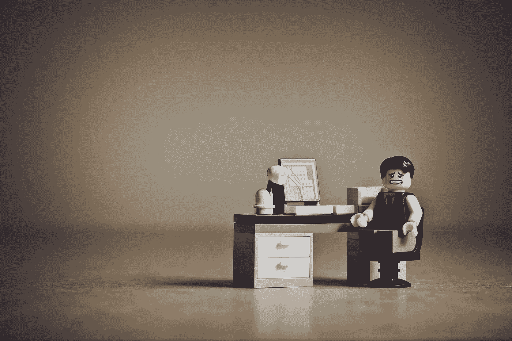

# 生产力、创造力和理智。

> 原文：<https://medium.com/swlh/productivity-creativity-and-sanity-21a8e9f02f62>

# 创造力和生产力；

我开始写关于生产力的文章(在这篇文章底部的生产力下面)，当我在开车的时候纠结于这个话题时，我想到你不能孤立地处理这个话题，如果你只是有生产力，那么你就进入了某种类似机器的状态。

生产力和创造力并不总是在同一个房间里。请任何一位艺术家日复一日地按需提供稳定的艺术品；他们无疑会把你笑出房间，甚至更糟。

创造力是可以被发现的，可以用在任何工作或职业中，它不需要成为你最新的画布上的灵感，描绘了一堆胡萝卜被扔在桌子上。创造力可以是找到一种更快的方法去做别人没有想到的事情(你可以把这想象成花时间在工作上，而不仅仅是在工作上)。我的观点不是“不要努力工作，聪明地工作”，而是你需要找到时间来发挥创造力，不管你的设定或目标是什么。

> 字典对创造力的定义是:运用想象力或原始想法来创造某物；创造性。

如果你最终富有成效，你将永远找不到时间去创造；这不是你待办清单上的另一个项目。

1.  写完文章
2.  支付账单
3.  有创意/横向，以便我可以写另一篇文章
4.  洗碗

创造力是给你自己空间和时间，让你的思想在没有任何结构和目标的情况下漫游。谁知道这对你个人来说意味着什么，也许是修剪草坪，或者坐在摇椅上喝茶，或者只是在办公室的饮水机旁闲逛。如果你是一辆车，你会空转。马达开着，隆隆作响，但齿轮没有啮合，你没有前进的动力(这可能会让生产力上瘾者做噩梦！).

> 总的来说，为了获得最好的结果，你应该调整生产力和创造力之间的比例，直到你本能地对这种平衡感到满意。

当我开始写关于生产率的文章时，我解释了我的“理论拟合”，你会在下面找到。在你开始之前，我想谈谈。

# 头脑清楚

生活有时会变得非常吸引人，专注于你盘子里的东西会变得非常消耗精力。如果你打算完好无损地到达旅程的终点，你需要保护你的理智。

对我来说，我承认每个人都是不同的，所以没有单一的规则或建议，我有我用来减压的工具。我玩电脑游戏或看书(取决于我有多累)。这完全使我失去兴趣。我每天需要大约 1 个小时来做这些活动，以防止自己发疯。通过知道我需要多长时间和我需要做什么，我可以确保我不会内爆或更有可能爆炸。

自知如何关闭对你的理智至关重要。如果你找不到这个必需品，那么事情最终会走向南方的冬天。

我在这里的观点是，作为一个生产力自动机，要成为生产力，你需要保持你的理智和创造力。找到要关掉的按钮，每天按它。

## 在我们开始我的生产力独白之前

总结平衡你的生产力、创造力和理智。

# 我关于生产力的帖子

装进去。就是这样。如果你有点急，你不需要读这篇文章的其余部分；如果你正在读一篇关于生产力的文章，想变得有生产力，你可能就是这样。

如果你有更多的时间，那就牵着我的手，跟着我沿着这条我通常是如何完成事情的深思熟虑的道路走下去。

我真的没有一个系统，我有几个工具用来尝试“适应它”，这个“它”实际上是我需要做的一切。

这是我的工具箱；

记事本和笔；在一天工作开始的时候，我会写下我想做的每一件事。我用一支漂亮的墨水笔(用它写字感觉棒极了！)和用好纸做的好看的点点笔记本。用钢笔和墨水书写的过程让一切都放慢到一个有分寸的速度。我注重清单的整洁；

# 感觉这样做给了我时间去思考什么是真正重要的，并在缓慢的过程中记住这个清单。

这是另一件事，我有很多事情要做，不仅仅是需要做的事情，还有许多我认为必须做的事情，这就是创新和不断改进的意义所在。根据你的直觉，优先考虑那些推动你前进的事情，而不是那些(简单地)需要注意的事情。

无论如何，为了捕捉所有这些东西，我完全是电子化的，把事情提交到一个“云”任务清单上(我用过一些；2do 一度是最好的，但我已经决定使用 Todoist，因为它可以在 iOS、Windows 和在线上运行，这是关键(对我来说)，因为我想把东西放在我手头的任何东西上，我的手机、笔记本电脑、iPad 或任何可以上网的东西。我每天都检查我的电子的、有标签的和有优先顺序的长长的清单，来制作我的日常用笔和墨水清单。

所以我保留了一个很长的列表，这样我的记忆就不会失败，我就可以捕捉到那些突然出现在我脑海中的直观的东西。

以及我那天要做的事情的简短清单。(大部分没搞定)。

但除了组织工具集，我做得最多的是试图捕捉做事情的小瞬间。把东西放进去。这不是火箭科学。事实上没有科学。

我不是富有成效的优步队长，不管那是什么，我只是一个想做事的普通人，不断前进，但允许生活在我周围发生。管制是重要的，或者称之为自我调节，但是除此之外就是适应(你经常听到这个；我瘦了！，我很敏捷！).生活就发生在你的周围；没有人知道那只狗需要去看兽医，或者你的公司里有人想辞职，因为他们失去了集体方向感……所以只要有机会，你就需要准备好尝试做日常工作。

为你的 iPad 准备一个键盘，或者在你的背包里准备一台小型笔记本电脑，或者在你的 iPhone 上安装合适的应用程序来做事情。通过不做“无所事事”来捕捉小时刻，当你可以处理一些任务，让你继续遛狗，闻花香，和你的伴侣享受生活。

所以，保持有组织，但不要强迫生产力。强迫自己好好利用时间，否则这些时间会被那些不会让你放松、不会让你在工作中前进或者不会创造更好的人际关系的琐事占据。

所以…把它放进去。没有科学依据，没有人会因为没有把清单上的所有事情都勾掉而责备自己(你应该勾掉最重要的事情，但是不要为剩下的事情流汗)。活在当下，享受事物，与同事交流，激励自己，充满活力。

(PS；我写这篇文章的时候，我 2 岁的儿子正在看 Peppa Pig，我们刚刚洗完澡，刷完牙，度过了最美好的时光。完全符合这个！).

## 这篇文章发表在《创业公司》杂志上，这是 Medium 最大的创业刊物，拥有 337，320 多名读者。

## 订阅接收[我们的头条](http://growthsupply.com/the-startup-newsletter/)。

