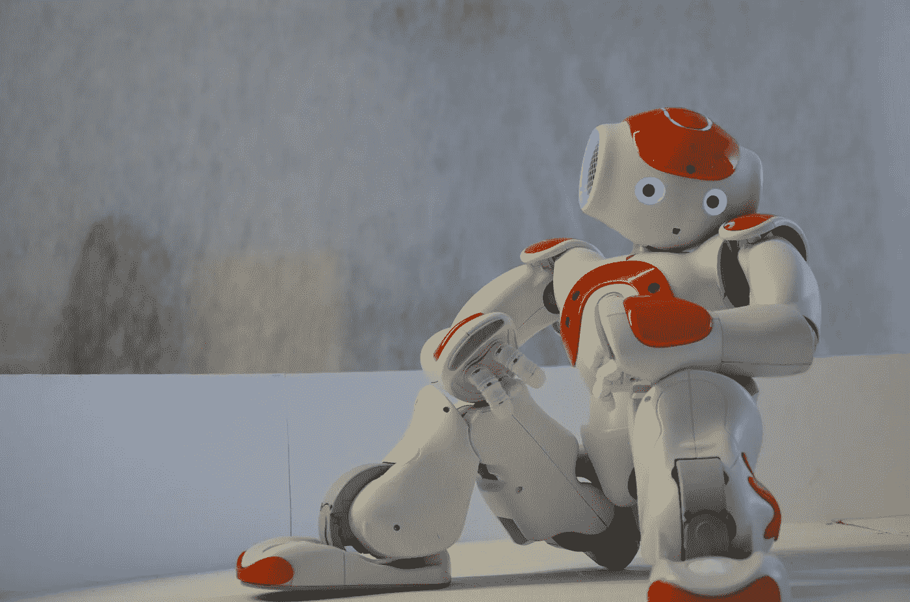

# 生产率被高估了

> 原文：<https://medium.com/swlh/productivity-is-overrated-7bd003860614>

## 更糟糕的是，它已经成为我们最新的嗜好。

Photo by [Erhan Astam](https://unsplash.com/photos/yLcK3Itx6ok?utm_source=unsplash&utm_medium=referral&utm_content=creditCopyText) on [Unsplash](https://unsplash.com/search/photos/robot?utm_source=unsplash&utm_medium=referral&utm_content=creditCopyText)

总有一天，你和我都会死。不，我们不喜欢去想它。现在我已经为人父母了，光是想到死亡就比以前只有我一个人的时候可怕得多。但是死亡是不可避免的。

正因为如此，我想了很多，在我生命的尽头，我想给我的女儿什么…