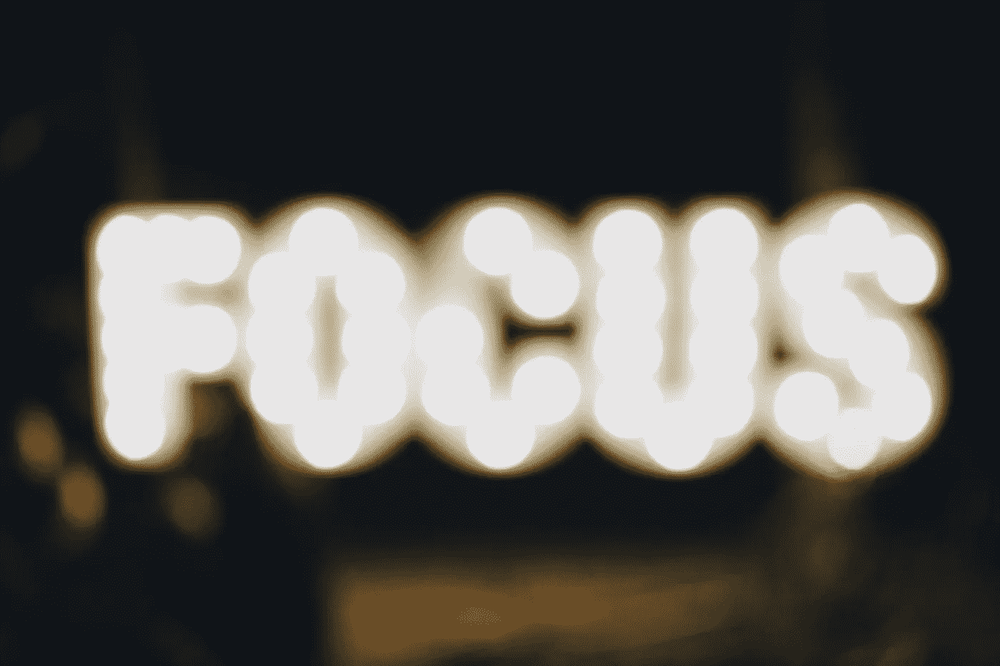

# 生产力与技巧和黑客无关。这是选择的问题。

> 原文：<https://medium.com/swlh/productivity-isnt-about-tricks-and-hacks-it-s-about-choices-8db3281433fd>

## 确保你从起床到一天结束都在做正确的事情的 17 种方法

Which way will you go? Photo by [Kyle Glenn on Unsplash](https://unsplash.com/@kylejglenn)

可以肯定地说，我们都希望事半功倍。

是的，我们在谈论生产力——效率和专业知识的难以捉摸的结合，让你可以勾掉待办事项，以不可思议的速度实现庞大的目标。

这是一个理想主义的工作日愿景，但很少有人能真正实现。我们没有花几个小时毫不费力地朝着目标努力，而是陷入了繁忙的工作中，被会议和电话分散了注意力，并且偏离正题去解决其他人的问题。

那么，我们该如何改变这种情况呢？

在他的书 [*更聪明更快更好*](http://charlesduhigg.com/books/smarter-faster-better/) 中，作者查尔斯·杜希格将生产力简单地定义为“以特定的方式做出特定的选择”，这将我们的注意力从“仅仅是忙碌”转变为“真正的生产力”。

我会更进一步说**生产力是关于选择把你的时间花在有意义的工作上，然后像母狮保护她的幼崽一样保护这些时间。**

在本指南中，我将涵盖选择、编辑和管理你一整天所采取的行动的技巧和策略，以帮助提高你在工作场所的生产力，并确保你不只是做更多的工作，而是做正确的工作。

*这篇文章的更长、更容易浏览的版本* [*可以在这里找到*](http://blog.rescuetime.com/2017/10/17/productivity-in-the-workplace/) *。看看吧，我会定期更新的。*

# 第一步:如何知道你在做有成效的工作

Photo by [Maria Molinero](https://unsplash.com/photos/8z8lEG_N_q4?utm_source=unsplash&utm_medium=referral&utm_content=creditCopyText) on [Unsplash](https://unsplash.com/?utm_source=unsplash&utm_medium=referral&utm_content=creditCopyText)

> “如果你能衡量它，你就能管理它。”

虽然这句话可以追溯到 16 世纪，但它是现代职场生产力的口头禅。

如果不清楚什么样的工作能让我们更接近目标，下面所有的生产力技巧、策略和建议都是无用的。这就是为什么我们培养更有成效的工作习惯的第一步是从问一些关于我们工作的高层次问题开始的。比如:

我们可以测量什么来找到我们的生产力基准？

什么工作实际上让我们感觉良好，有助于满足感？

这里有一些技巧可以帮助你发现什么样的工作对你来说最有效率:

# 1.培养对什么工作推动结果的自我意识

要发现什么工作对你的目标最有成效，首先要给自己合适的工具来衡量生产力。因为，正如著名顾问和作家彼得·德鲁克所说:

> 最没用的事莫过于高效率地做一些根本不应该做的事

幸运的是，你工具箱中最重要的工具也是最简单的工具之一:[反馈](http://blog.rescuetime.com/2012/08/22/feedback-loops-your-secret-weapon-for-productivity-in-the-workplace/)。

无论是你的待办事项列表、时间管理应用程序，甚至只是与团队的会议，你都需要一个工具或资源来提供一种整洁的方式来查看你已经完成的工作，衡量其影响，并建议更好的前进方式。

像这样的反馈循环可以衡量你的产出，并给你自我意识，为有意义的工作做出正确的选择。不像硬性的、快速的、一刀切的目标可能感觉完全无法实现，一个好的反馈循环会告诉你现在你在哪里*，*，并允许你对你的工作方式做出小的改变，随着时间的推移，这些改变会带来大的改进。

*下面来看看* [*如何为你的日常工作建立一个反馈回路*](http://blog.rescuetime.com/2012/08/22/feedback-loops-your-secret-weapon-for-productivity-in-the-workplace/) *。*

# 2.承诺一个现实的工作时间表

为了让自己的工作周富有成效，我们需要了解自己的局限。

尽管我们尽了最大努力(也有成百上千“拼命工作”的企业家的建议),但我们不可能不停地工作。事实上，我们做得越多，工作就越差。

相反，我们需要通过承诺一个现实的工作时间表来设置质量的护栏。这自然回避了这样一个问题:“我们一周应该工作多少小时？

不幸的是，答案并不完全清楚。虽然研究人员发现每周工作超过 40 小时确实会提高生产率，但这只是在一定程度上。

一旦我们超过 49 小时，我们的工作质量就会稳步下降。也就是说，你每周辛苦工作 70 小时，很可能并没有比普通工人每周工作 40-50 小时更好的结果。

这并不是说你应该简单地争取每周 49 分。

不管你工作了多少小时，这都取决于你的努力能力——你可以花多少小时积极地朝着更大的目标努力。如果不是为了一些有意义的事情，在办公桌前度过的时间并不重要。所以尽一切办法记录你的时间，只要确保结果与努力相符。

# 3.寻找一个支持性的环境，不要为了个人健康而过度工作

最后，因为我们实际上只能每周工作固定的时间，但仍然保持高效，所以我们需要处在一个尊重这些限制的环境中。

在团队或公司环境中，这意味着对截止日期要现实，不要把工作安排在你最有效率的时间之外。

如果你为自己工作——截止日期和辞职时间可能会模糊得多——这意味着优先考虑自我保健，定期休息，并为不可避免会出现的问题留出每日缓冲。

# 第二部分:让自己度过富有成效的一天

Photo by [Flemming Fuchs](https://unsplash.com/photos/5WN6hlX2ZP0?utm_source=unsplash&utm_medium=referral&utm_content=creditCopyText) on [Unsplash](https://unsplash.com/?utm_source=unsplash&utm_medium=referral&utm_content=creditCopyText)

一旦你知道什么类型的工作最重要，是时候看看如何在这些任务上花更多的时间了。这意味着建立日常惯例和安排实践，优先考虑有意义的工作，同时对总是出现的干扰保持现实。

以下是一些开始的策略:

# 4.测试并完善你的晨间计划

你如何度过早晨决定了一天余下的时间。

《Vogue》主编为安娜·温图尔打扮、[以一个小时的网球](https://www.inc.com/bill-murphy-jr/23-morning-routines-of-the-most-extraordinarly-successful-people.html)开始了她的一天，而作家村上春树[在早上 4 点](https://jamesclear.com/daily-routines-writers)起床，工作 5-6 个小时，然后去跑步或游泳。

无论你选择如何度过最初的几个小时，一个清晰的早晨惯例让你从一开始就设定好你的优先事项。这不仅能让你保持动力，还能帮助你远离分心，并在你试图陷入无意识的忙碌时保持一整天的工作效率。

为了最大限度地利用你的日常生活，确保将这些品质融入其中:

*   通过增加晨间活动、洗脸、出门或听欢快的音乐来克服睡眠惰性
*   以某种积极的方式开始你的一天，无论是阅读一些鼓舞人心的东西，记录你的一天，还是回顾你的目标清单
*   在个人的事情上获得一个“小胜利”,激发你一天的动力

# 5.少喝点咖啡因

多年来，咖啡和含咖啡因的饮料一直是生产力的助推器。看看 19 世纪的法国作家奥诺雷·德·巴尔扎克，他声称 T2 每天要喝 50 杯咖啡来维持生命。

你可能知道谁能和巴尔扎克一较高下。然而，如果你的最终目标是富有成效的一天，你可能要减少咖啡的摄入量。

研究咖啡对生产力影响的研究人员发现，虽然小剂量的咖啡确实能增加精力和警觉性，但它同样会引起焦虑和神经过敏。虽然我们与咖啡有着复杂的关系，[大多数研究认为](http://www.ncbi.nlm.nih.gov/pubmed/20888549)咖啡最适合完成重复性任务，而不是需要更高洞察力和创造力的工作。

如果你每天摄入咖啡因是你日常生活的一部分，那么一定要坚持下去。只是不要指望兴奋剂会取代其他提高生产力的更健康的方法，如外出、锻炼或休息。

# 第三步:保持专注，保护你的生产力

Photo by [Stefan Cosma](https://unsplash.com/photos/0gO3-b-5m80?utm_source=unsplash&utm_medium=referral&utm_content=creditCopyText) on [Unsplash](https://unsplash.com/?utm_source=unsplash&utm_medium=referral&utm_content=creditCopyText)

现在可能很清楚，当谈到生产力和做有意义的工作时，时间是我们最宝贵的资源。这意味着不仅要找到有效的方法来管理我们一天的时间，还要建立流程和策略来保护时间不受干扰。

让我们来看看几个让你的工作时间保持神圣的方法:

# 6.每周和每天划出时间专注于富有成效的工作

没有什么比在一天结束时反思，没有任何可以让你留名的东西更能消磨你的动力了。然而，我确信我们都不止一次处于这种境地。

忙碌通常是偷走我们工作效率的罪魁祸首。像电子邮件和聊天这样的简单事情估计会占据你工作日的 29%，也就是一周差不多一天半。

为了保持一周高效的工作，我们需要学会如何保护我们的时间，并把它用在正确的 T2 任务上。正如企业家和著名的励志演说家吉米·罗恩所说，“要么你驾驭一天，要么一天驾驭你。”(有时感觉就像一天用压路机碾压你一样)。

《T4 深度工作》一书的作者卡尔·纽波特提倡的一种方法是把你最有效率的工作提前一个月安排出来(T9)，这本书致力于在纷乱的世界中寻找专注的时间。

> “在任何时候，我都应该在下个月左右安排深入的工作。这四周的准备时间足够长，以至于当有人要求我花费大量时间和注意力时，我几乎可以肯定已经为这段时间预留了我的深层工作模块。
> 
> 因此，我可以满怀信心地在剩下的任何时间安排这一请求。"

如果你不想一次花上几个月，纽波特的技巧也可以每天使用，安排更大的[“创造者时间”](https://crew.co/blog/makers-and-managers/)——一天中你专注于项目的部分，这些项目依赖于专注，如写作、编码或战略思考。

有了这些预先安排好的“创造者”时段，你就可以在剩下的时间里自由地承担任何其他任务。

# 7.为你的一周创建注重生产力的模板

并非所有的工作都允许提前几周安排长时间不间断的工作。如果你正在管理团队或者同时处理多个项目，那么坚持如此严格的时间表似乎是不可能的。

相反，尝试[创建模板，这些模板严格定义*如何*和*何时*工作](http://blog.rescuetime.com/2017/05/11/weekly-roundup-organizing-your-calendar/)，但足够灵活以适应您不断变化的日程。

这样，你就可以反过来工作，而不是围绕突然出现的事件和会议安排工作。

以下是超级预定 CEO 丹·梅尔的日程模板的样子，包括预定的工作、电子邮件和会议时间:

看看他的一天是如何安排那些他知道会转移他注意力的事情的？

您可以根据自己的具体需求修改此模板，但目标是创建一个反映您理想工作日的模板，并留出合理的时间用于有意义的工作、通话和会议。

另一个更简单的选择是为你的一周创建一个模板。这个想法来自自由设计师杰西卡·希斯奇，她让周一没有截止日期，只专注于行政工作:

> “如果我给自己一天时间来处理大部分的电子邮件/面试回答/文件整理/日程安排等工作，我会对在工作周的剩余时间里长时间忽略所有这些事情感到不那么内疚。”

*阅读更多关于如何* [*管理你的一天*](http://blog.rescuetime.com/2017/05/25/weekly-roundup-manage-your-day/) *和* [*在这里*](http://blog.rescuetime.com/2017/05/11/weekly-roundup-organizing-your-calendar/) *整理你的日历。*

# 8.使用“定位框”在正确的时间完成正确的任务

如果把生产时间打包的想法似乎根本不适合你(而且很难坚持这些时间表)，最后一个选择是尝试“位置打包”——一种只在特定位置完成特定任务的技巧。

这里有一个例子:当 RescueTime 首席执行官 Robby Macdonell 发现他在编码、设计和交流之间切换有问题时，他决定在不同的地方尝试做不同的任务:

> “当我需要真正专注于一项任务时，我发现咖啡店有点分散注意力，但对于一系列简短、重复的任务来说，它们非常棒。“我可以一边享受拿铁咖啡，一边处理邮件，否则我会一整天都在看邮件。”

当你不能移动到另一个地方时，你也可以试着使用不同的设备来完成不同的任务，就像作家格雷戈里·奇奥蒂所做的那样。作为一名作家和营销人员，奇奥蒂花了很多时间阅读和写作。但他不再拘泥于一种设备，而是将作品“打包”到不同尺寸的屏幕上:

这看起来很简单，但是不要低估这种小变化的力量。将特定任务与特定地点联系起来的做法在培养新习惯方面非常有效，甚至被用来帮助治疗失眠患者。

# 步骤 4:有效沟通和协作的策略

Photo by [Vladislav Klapin](https://unsplash.com/photos/SymZoeE8quA?utm_source=unsplash&utm_medium=referral&utm_content=creditCopyText) on [Unsplash](https://unsplash.com/?utm_source=unsplash&utm_medium=referral&utm_content=creditCopyText)

虽然有意义、有成效的工作通常是个人的，但我们不能否认沟通在现代工作场所的重要性。在办公室里，电子邮件、聊天和会议是你保持联系和有效合作的方式。而如果你是一名自由职业者或远程工作者，清晰的沟通可以让你与团队的其他成员保持一致，并致力于正确的任务。

然而，想办法保持你的开放和定期交流的能力，同时还能真正做好工作可能是困难的。

无论是电子邮件、空闲时间、电话还是会议，这里有一些方法可以在处理必要的沟通和协作的同时保持你的工作效率:

# 9.尽可能自动化你的交流

在安排电话或会议时，没有什么比没完没了的来回邮件更不利于高效工作了。虽然在沟通中保持个性化是成功合作的一个关键方面，[在寻找对每个人都合适的会面时间时，采取更自动化的方法也是不错的](http://blog.rescuetime.com/2017/06/27/four-communication-hacks-that-help-me-survive-as-an-introverted-ceo/)。

一个建议是使用像 [Calendly](https://calendly.com/) 这样的服务来自动化这个过程，这解决了两个主要的生产力杀手:

1.  只有一封电子邮件，这意味着你不会花不必要的时间来回奔波
2.  你可以避免匆忙做出错误的决定，保护你的“深度工作”时间

设定会议时间并不是你工作日中唯一可以自动化来保持工作效率的部分。以下是 RescueTime 首席执行官 Robby Macdonell *提出的其他沟通建议。*

# 10.使用有效的笔记技巧，让会议更有成效

> “你要么开会，要么工作。你不能两者兼得”

虽然管理顾问彼得·德鲁克的上述说法可能是对的，但无法想象没有会议的生活。然而，这并不意味着你不能让他们更有效率。

最简单的方法之一就是简单地[做更好的笔记](http://blog.rescuetime.com/2017/02/28/notes/)。

适当的笔记可以让你记住会议期间讨论和决定了什么，这样工作才能真正完成。

你可能会认为这不是问题，但研究表明，我们记笔记的大多数常见方式——在笔记本电脑上打字、突出文档中的部分、强调重要事实— [实际上不起作用](https://zapier.com/blog/better-note-taking/)。

相反，这里有一些你可以尝试的有效的笔记方法:

*   **手写笔记:** [一系列研究](https://www.theatlantic.com/technology/archive/2014/05/to-remember-a-lecture-better-take-notes-by-hand/361478/)对比了用笔记本电脑记笔记的人和用手写的人，发现使用纸笔可以提高信息回忆。
*   使用项目日志:要让记笔记有用，你需要能够快速找到并参考你写下的内容。[子弹日记法](http://bulletjournal.com/)使用一组简单的键和符号来分类和组织你所写的东西。
*   **画笔记:**对于那些更有艺术头脑(或倾向于涂鸦)的人来说，画笔记也被发现有助于提高信息回忆。查看[迈克·罗德的“素描笔记”方法](http://rohdesign.com/sketchnotes/)寻找灵感。

# 11.驯服不断涌入的电子邮件

最后，我们不能在不谈论电子邮件这个庞然大物的情况下谈论富有成效的交流。

电子邮件和其他替代方式如 Slack 或 HipChat 已经成为将我们的工作日联系在一起的粘合剂。我们可以联系任何我们需要的人，整天分享信息和猫的 gif，谈论我们午餐吃了什么…你知道我们要去哪里了。

这些工具对生产力既有利也有弊，这使得它们特别危险。

不断的上下文切换，就像在 Slack 中写代码和回答问题之间跳跃，会对我们高效工作的能力造成严重伤害。一项研究发现，在短暂的分心之后，员工可能需要 23 分钟才能回到正轨并集中注意力。

我们已经写了一长串处理电子邮件的技巧和工具，但是这里有一些简单的建议可以开始:

*   优化你的收件箱以支持良好的习惯，比如只显示你标记为重要的邮件
*   设置指标来衡量你花在邮件/空闲时间上的时间(你可以用 [RescueTime](https://www.rescuetime.com/) 来衡量)
*   关闭通知，只检查你的电子邮件和预定时间。也就是说在你的手机上。

# 第五步:在工作日保持动力

Photo by [Jonas Svidras](https://unsplash.com/photos/Hx2YqZB4Dwc?utm_source=unsplash&utm_medium=referral&utm_content=creditCopyText) on [Unsplash](https://unsplash.com/?utm_source=unsplash&utm_medium=referral&utm_content=creditCopyText)

到目前为止，我们已经讨论了如何计划和保护你的时间来做有成效的工作，但是当一天快结束的时候，你感觉你的注意力在下滑，怎么办？

下面是我们发现的一些方法，可以帮助你保持一整天的动力，并对抗那些让你分心的事情:

# 12.和有成就的人在一起，用积极的强化来快速激发动力

虽然[动机](http://blog.rescuetime.com/2017/07/18/motivation/)是一个复杂的主题，但研究发现了一些[有趣且看似简单的方法，可以在你需要的时候给你快速的提振](http://blog.rescuetime.com/2017/09/28/weekly-roundup-easy-ways-to-boost-motivation/)。当你想挤出几个小时的高效工作，但感觉注意力在下滑时，把这些看作你的生命线:

1.  与成功人士呆在一起:虽然我们并非都有竞争的天性，但与那些在我们想要的领域取得成功的人呆在一起仍然是一种强大的动力。研究人员发现，更有动力的是，当我们看到有人因为我们自己即将实现的成就而受到公开表扬时，我们会受到来自同龄人的压力。
2.  **回忆积极的经历:**研究发现，通过重温积极的经历，你可以给自己一个动力来度过难关。虽然研究人员并不完全确定为什么会这样，沃顿商学院教授亚当·格兰特认为这是因为“欣赏感是工作中最持久的动力。”

# 13.用网站拦截器对抗外部干扰…

对抗干扰我们动力的最简单的方法之一就是简单地摆脱它们。

脸书、Twitter、Reddit、chat——问题是，现代世界中几乎所有的东西都是为了抓住你的注意力。如果你觉得你的意志力和注意力让你失望了，也许是时候使用一个网站拦截器来让你在专注的工作时间保持在正轨上。

[*你可以在这里*](http://blog.rescuetime.com/2014/06/19/getting-the-most-out-of-rescuetimes-website-blocking/) 阅读如何使用 RescueTime 的网站屏蔽 FocusTime 功能。

# 14.…以及自言自语和正念带来的内部干扰

不幸的是，分心不仅仅来自外部来源。[《聚焦:卓越的隐藏力量》的作者丹尼尔·戈尔曼解释说，我们分心的主要原因之一是我们自己的思维](http://blog.rescuetime.com/2017/06/20/the-fight-against-distraction/):

> “最大的干扰不是我们周围人的喋喋不休，而是我们自己内心的喋喋不休。”

这种分心的事没有快速解决的方法。然而，许多人已经看到了练习正念、学会不被自己的想法冲昏头脑以及使用积极的自我对话而不是纠结于未完成的工作的好处。

# 15.开始戴隔离头盔

早在 20 世纪 20 年代，作家兼发明家雨果·根斯巴克受够了日常生活中的干扰，发明了隔离器——一种让你陷入完全沉默和黑暗的头盔，除了两个小眼孔外的可见内容。如果这还不够的话，氧气通过一根管子泵入，让你保持警觉并处于最佳状态。

我们当然是拿这个开玩笑了！但这只是显示了一些人为了保持动力和做有成效的工作而经历的疯狂。

# 第六步:放松下来，为富有成效的明天充电

Photo by [Vibhav Kapoor](https://unsplash.com/photos/G9kU5t4S0Kg?utm_source=unsplash&utm_medium=referral&utm_content=creditCopyText) on [Unsplash](https://unsplash.com/?utm_source=unsplash&utm_medium=referral&utm_content=creditCopyText)

如果你已经做了你的尽职调查，安排好了你的一天，保护你的生产时间不受干扰，并保持动力，那么生产力难题的最后一块就是让你自己明天再做一遍。

这里有一些结束一天的建议，得到足够的休息，并为你的认知能量储存补充能量，以迎接富有成效的明天:

# 16.建立一个富有成效的日常工作

研究发现，以坏心情开始一天工作的员工往往会一直如此。

造成消极早晨的最大原因之一是没有在前一天晚上做好准备。你可以把它想象成烹饪时将所有的食材切碎并准备好，和当锅在炉子上烧开时试着切菜之间的区别。在生产中，像烹饪一样，准备是关键。

首先把[放在一起，一个简单的结束一天的例行程序](http://blog.rescuetime.com/2017/06/08/weekly-roundup-last-hour-of-your-workday/)围绕着写下你第二天的待办事项清单(或者填写我们之前讨论过的模板)。

为了增加生产力，做一些你可以在早上马上投入的未完成的任务。这最后一步之所以有效，是因为一个叫做[蔡加尼克效应](https://en.wikipedia.org/wiki/Zeigarnik_effect)的心理学原理，它描述了如果我们没有完成某件事，我们的大脑是如何不让它过去的。这种扣人心弦的方式是克服第二天开始工作的障碍的好方法。

# 17.给自己无聊的时间

从电影到应用程序再到游戏，我们有如此多的消遣方式，以至于一想到生活无聊就觉得可笑。

然而，[积极寻找一点无聊的事情对我们准备有成效的一天是非常有益的。](http://blog.rescuetime.com/2017/09/19/boredom/)

不要用活动、阅读或社交来填满你的休息时间，留出一点时间让你的思维自由驰骋。

这个过程被称为酝酿，是创造性思维的组成部分之一。它允许以前不相关的想法聚集在一起，形成新的想法、发明或问题的解决方案。

正如德克萨斯 A&M 大学心理学家希瑟·伦奇解释的那样:

> “无聊变成了一种寻求的状态。你现在所做的并不令人满意。所以你在寻找，你订婚了。”

# 18.优先获得足够的休息

虽然我们在这里已经关注了如何最大限度地利用我们的工作日，但我们也需要谈谈什么时候停止工作。

根据工作与家庭研究所的数据，不到一半的美国雇员休完了所有的假期。而职场满意度网站 Glassdoor 发现 [61%的员工在休假期间工作](https://www.glassdoor.com/blog/average-employee-takes-earned-vacation-time-glassdoor-employment-confidence-survey-q1-2014/)。

休息——无论是在假期、周末，还是仅仅在工作日之间——[对于保持我们的能量和保持我们的工作效率是非常重要的。休假不仅给我们的身体充电，也给我们的精神和创造力加油。](http://blog.rescuetime.com/2017/09/12/rest/)

在一项对近 1400 人进行的研究中，发现休闲时间可以鼓励更积极的心态，降低临床抑郁症的水平。约克大学和佛罗里达大学的一项研究发现，我们 40%以上的创意都是在休息和停工时产生的。

所以不要跳过停工期。一开始这可能看起来很尴尬，但确保你让自己休息而不是不停地工作，从长远来看会有助于你的生产力。

尽管有各种各样的调查、研究和轶事证据，要想在工作和生活中变得更有效率，仍然没有简单的答案。找到适合你的方法需要实验，一旦你认为你已经想通了，一些重大的变化就会出现，让你重新思考一切。

也许这就是我们对生产力的痴迷的来源:事实上，没有一劳永逸的方法，而是我们一生中开发的过程和技术。

***咻，真厉害！如果你喜欢这篇文章，可以在*** [***的博客***](http://blog.rescuetime.com/) ***上查看更多。***

## 这个故事发表在 [The Startup](https://medium.com/swlh) 上，这是 Medium 最大的创业刊物，拥有 275，554+人关注。

## 在这里订阅接收[我们的头条新闻](http://growthsupply.com/the-startup-newsletter/)。

