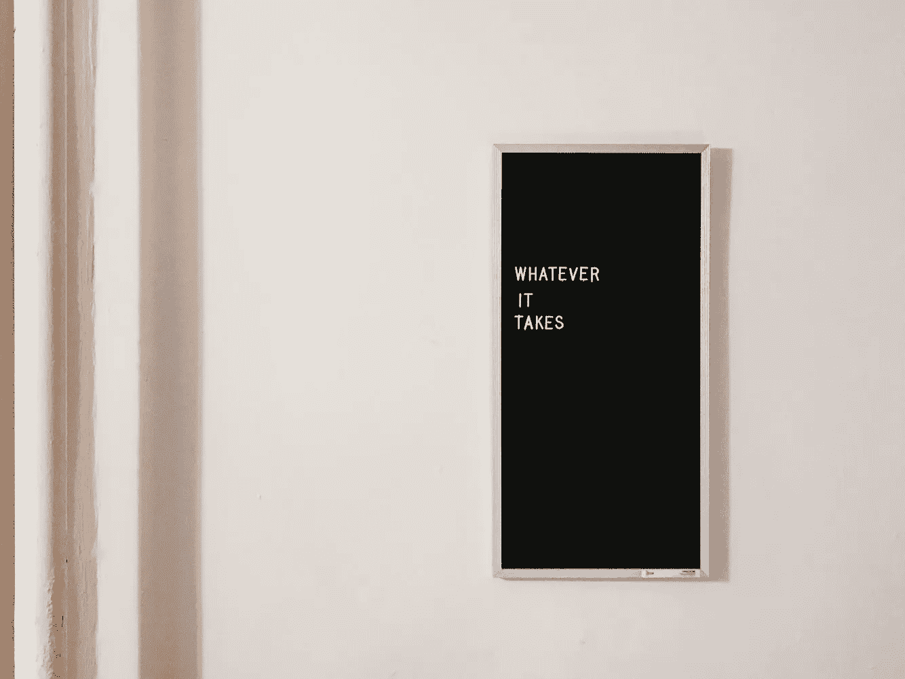

# 生产力:它是为了什么？

> 原文：<https://medium.com/swlh/productivity-what-is-it-for-e13725c2dde0>

## [作者:艾丽达·米兰达-沃尔夫](http://www.alidamirandawolff.com/)

Why do we need to do whatever it takes all the time?

我们在拼命工作。

我们知道为什么吗？

在 [*吃药*](https://www.netflix.com/title/80117831) 这部纪录片中，一位来自高盛(Goldman Sachs)的匿名年轻金融分析师强调了这一点，这部纪录片聚焦于美国在高度竞争的文化中使用处方兴奋剂作为实现最佳表现的手段。

他的同事在筋疲力尽引发癫痫发作后被送进了医院，他的父母恳求他辞掉每周工作 80 到 100 小时的工作。他试图继续在医院工作。

高盛拥有超过 35，000 名员工。一个初级分析师在做什么如此重要以至于值得冒生命危险？

我们生活在一个这样的故事司空见惯的社会里。我可以数出我认识的五个有类似情况的人。我是其中之一。

就在去年，我遭受了疲劳诱发的昏厥。我的公司当时资源不足，我觉得无论如何都有责任实现我们的目标。但是在一次特别严重的摔倒后，我停下来问了自己一个问题。为什么？

这归结于对失败的恐惧、社会压力和骄傲的结合。

是的，骄傲。

> 科技文化推崇“喧嚣”、“磨砺”和“10 倍”那些跟不上的，就叫软弱，格格不入，不投入，干脆就是小众。这不是我想要的身份。

但是我也想不出一个好的理由来解释为什么我会如此努力。事实是，我所做的大部分工作是“最好拥有”而不是“必须拥有”我相信我认识的几乎所有面临类似工作需求的人都是如此。

正是这种认识让我第一次发表了我对美国过度工作问题的全面分析，发表在一篇名为“[要发展才能，不要走得太快，弄坏东西——慢慢来，把它们建起来](https://blog.usejournal.com/dontmovefastandbreakthings-697e6a5b3d7a)”的文章中

这篇文章分析了过度工作是如何对工作表现、记忆力、士气和个人健康产生负面影响的，但是留下了一个问题没有回答:**我们的生产力是为了什么？**

# **问题**

这些是事实。

与 1978 年相比，美国人一年总共多工作了四周，但收入并不比那时多多少。薪酬过低迫使人们从事零工和“副业”，从而延长了工作日。

过度工作给美国工人带来压力，约占 80%的医生就诊量和每年 5 . 5 亿个工作日的损失。30%的员工睡眠时间少于 6 小时，长期的压力和疲惫状态导致了大约 50%的自愿离职。

[Dr. Ronald Ricker and Dr. Venus Nicolino](https://www.huffingtonpost.com/author/dr-ronald-ricker-and-dr-venus-nicolino) argue that Adderall is the most abused prescription drug in the U.S.

为了跟上进度，美国成年人正在服用通常用于治疗注意力缺陷多动症的处方兴奋剂。 [4%的成年人服用哌甲酯](https://fivethirtyeight.com/features/dear-mona-how-many-adults-take-adhd-drugs/)，哌甲酯是 Concerta 和利他林中的活性成分。

Adderall 的使用甚至更高，占 ADHD 市场的三分之一。事实上，一项对 1100 万美国工人的研究发现，在药物测试中，处方兴奋剂的出现率仅次于大麻。Adderall 中的活性成分是安非他明，长期使用会上瘾并有危险，特别是对肝脏。

所以，我还是回到我的问题。为什么？

失业率处于历史最低点，这让工人们占了上风。技术进步消除了许多耗时的任务(和工作)，理论上解放了工作日的时间。[甚至有证据表明，员工没有足够的与他们自己的角色和职责相关的事情可做](http://www.theatlantic.com/business/archive/2014/12/the-wasted-workday/383380/)。

> 我们的生产力是基于恐惧的——害怕被认为低人一等，害怕被社会排斥，害怕失去我们生活所需的钱和我们围绕工作建立的身份。

千禧一代是劳动力中压力最大的一代，最有可能服用处方兴奋剂，最有可能谈论“工作生活一体化”而不是“工作生活平衡”。

这一代人经历了大萧条，知道这个世界是一个高度竞争的地方，学生贷款是正常的，但稳定的收入来源却不是。

我们伴随着教练、导师、课外活动、SAT 预备班和激进的标准化考试长大，这一切都是为了让我们进入大学，然后找到工作。我们并不认为这是理所当然的，我们也不想在竞争中胜出。

> 但是如果在工作中，我们不是逃离恐惧，而是奔向希望呢？

如果我们的生产力是基于目的的呢？

# **生产力的另一个愿景**

> “我们驾驶和被驾驶
> 但时间的步幅——
> 认为它失去了
> 的永恒。
> 
> 所有匆忙的事情都会很快过去；只有徘徊不去的东西给予我们信任。"

–从雷尼尔·玛丽亚·里尔克的十四行诗到俄耳甫斯的《22》

在阿尔多斯·赫胥黎的乌托邦想象中，他把虚构的国家帕拉描绘成一个每个人都工作的地方，但只是为了自我实现和维持一个更健康、更幸福、更政治稳定的社会。

结果是对人和劳动的不同态度。

在小说中，开明的罗伯特博士告诉英国主人公:

> “你首先想到的是在尽可能短的时间内获得尽可能大的产量。我们首先想到的是人类及其满足感。换工作并不能在最少的几天内获得最大的产出。但是大多数人喜欢它胜过一辈子做一种工作。如果要在机械效率和人类满意度之间做出选择，我们选择满意度。”

在 Pala，工作人员不会做同样的重复性任务——顺便提一下，处方兴奋剂的使用之所以流行，是因为它能够让这些任务不那么无聊——而且经常在活动之间切换。他们根据自己的需求和愿望选择工作，国家仍然收获他们劳动的回报，尽管如果他们只专注于一种工作形式，可能不会那么快。

他们也花更多的时间通过家庭、友谊、冥想、体育活动和其他与幸福相关的领域来实现自我，而不是工作。

换句话说，对于个人来说，工作是寻找目标和自我认识的整体战略的一部分。对于这个国家来说，这是一场长期比赛的一部分，当每个人都健康、快乐、适应良好、平和并积极参与社会活动时，现在会更少，但以后会更多。

# **如何实现目的驱动的工作**

事情是这样的 Palanese 系统之所以有效，是因为员工和雇主都同意工作应该是有目的的。个人可以管理优先事项，设定界限，并在一定程度上追求目标。然而，当面对公司的需求时，他们控制这些因素的能力下降了。

> 这就是为什么公司需要问和员工一样的问题。也就是说，这种生产力实际上是为了什么？这种生产力真的重要吗？

如果你的工程师每周额外工作 10 个小时来开发一个功能，你能确保这意味着更多的收入会涌入，客户不会转向竞争对手，或者一个主要问题会得到解决吗？你能证明你的初级团队所做的工作被审查并被用来推动有意义的改变，让世界变得更好吗？

这是雇主和雇员之间需要持续进行的对话。如果我们必须生活在一个过度工作的系统中，最起码我们应该知道这是为了什么，为什么它很重要。

正如 [*的作者集体天才*](https://collectivegeniusbook.com/) 在他们的研究中发现:

> “人们愿意面对创新带来的个人挑战，在这种情况下，他们觉得自己是社区的一部分，从事的事情比他们个人更重要，也比他们单独完成的事情更大。”

尽管如此，我认为我们*不应该生活在一个过度工作的系统中。*

成功的公司已经在实施一些策略，在激励员工提高生产率的同时，仍然将员工满意度置于机械效率之上。这些策略包括:限制工作时间，削减目标，奖励健康的行为。

## *封顶工作周时间*

[研究表明，工作 50 小时后生产率急剧下降，工作 55 小时后几乎完全停止。期望员工比这更多地工作不仅对他们的整体健康和幸福不好，甚至没有意义。他们更有可能犯错误，受伤，交出糟糕的工作，甚至根本不工作。](http://ftp.iza.org/dp8129.pdf)

Basecamp CEO Jason Fried keeps a 40-hour week; the average CEO works nearly 60 hours a week. (Photo by [Marc Garrett](https://since1968.com/) for [The Great Discontent](http://thegreatdiscontent.com/interview/jason-fried))

项目管理和团队沟通软件公司 [Basecamp](https://basecamp.com/) 因强制执行[每周 40 小时工作制，以及夏季的 4 天工作制](https://www.inc.com/kat-boogaard/basecamps-ceo-limits-himself-to-40-hour-workweeks-and-he-thinks-you-should-too.html)而闻名。这一规则强调时间的结果，并导致了可持续文化的发展和盈利公司的发展。

立式桨板制造商塔桨板公司，通过[鼓励员工每天工作 5 小时](https://www.fastcompany.com/3063262/what-happened-when-i-moved-my-company-to-a-5-hour-workday)，进一步延长了每周工作时间。对生产力的期望保持不变——用更少的时间完成同样多的工作。员工们奋起迎接挑战，公司呈指数级增长，成为 Inc. 5000 增长最快的公司之一。

## *削减目标*

> 公司不应该自欺欺人——一名员工每周工作 80 小时并不等同于两名员工各工作 40 小时的生产率。一个人完成得少，更快筋疲力尽，更有可能离开。那不是省钱；它正在失去它。

那么有两个选择:雇佣更多的人，或者减少每个人的要求数量。公司领导人必须清楚地了解他们需要实现什么才能成功，以及什么只是额外的。

问两个简单的问题将有助于突出重点:

> 如果这很容易，会是什么样子？
> 
> 为了做出最大的改变，我能做的最小的事情是什么？

**公司需要与员工一起每天问这两个问题，并确定推动公司 80%业绩的 20%目标。**

## *奖励健康行为*

最好的管理者和领导者是教练。正如丹尼尔·科伊尔(Daniel Coyle)在《天赋法则》(The Talent Code)中发现的那样，教练“通过教授爱来创造和维持动力。”

为了让员工发挥最大的生产力，领导者需要提供鼓励，教会他们热爱工作，这将增加做好工作所需的动力。这意味着当员工值得奖励时就奖励他们。

> 在员工被迫做出不健康工作决定的文化中，领导者有责任奖励做出健康选择的人。

表彰工作出色的员工*和*下午 5:30 下班带孩子去练习足球，鼓励刚刚完成一个重大项目的团队休息一天，在全体会议上关注那些在更短时间内找到解决问题的方法的人，这些都是如何为可持续工作环境提供指导的好例子。

# **临别赠言**

在一个特别疯狂的夏天，我从周六上午的继续教育班走出来，去我的办公室记录额外的时间。我的朋友陪着我从教室走出来，我一口气说出了我需要做的各种工作。

她平静地说:“我要给你几年前我的气功老师告诉我的建议。今天，给七成。”

这个建议感觉如此违反直觉，如此不可思议。我不应该每天都付出 110%的努力吗？

但是付出多于拥有是站不住脚的。为了未来的生产力，可持续的生产力，有时你需要少工作，多关注生活的其他方面。

**那么，今天，为什么不给 70%？**

M O R E →要成长才能，不要动作太快，弄坏东西——[动作慢一点，把东西造出来](https://blog.usejournal.com/dontmovefastandbreakthings-697e6a5b3d7a)

*Alida Miranda-Wolff 是 Ethos 的创始人兼首席执行官，Ethos 是一家为科技公司提供人才战略的公司，专注于通过塑造人才和发展文化来推动公司业绩。跟着她上* [*Twitter*](https://twitter.com/AlidaMW) *和*[*VentureBeat*](https://venturebeat.com/author/alida-miranda-wolff-hyde-park-angels/)*。*

## 这篇文章发表在 [The Startup](https://medium.com/swlh) 上，这是 Medium 最大的创业刊物，拥有 314，601+读者。

## 在这里订阅接收[我们的头条新闻](http://growthsupply.com/the-startup-newsletter/)。

