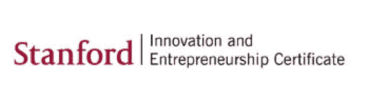
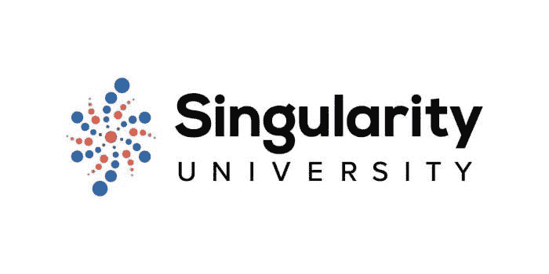
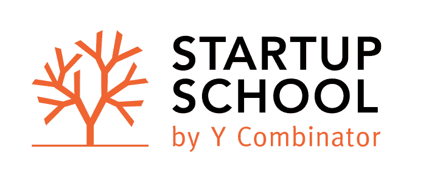

# 项目评论——牛津金融科技公司、斯坦福创业公司、Dan Lok、Mindvalley、Jumpcut、奇点大学、YCombinator、Russell Brunson

> 原文：<https://medium.com/swlh/program-reviews-oxford-fintech-stanford-entrepreneurial-dan-lok-mindvalley-jumpcut-7848254c05f0>

在过去的一年里，[我在不同的个人发展和商业项目上投入了大量的时间和金钱](https://banking2startup.com/2018/11/27/how-i-did-a-180-on-mindset-in-6-months/)。这是一个分享我个人经历的帖子。

# 牛津金融科技

自从我考虑转行以来，牛津金融科技项目是我报名参加的第一个项目。对我来说，作为一名曾在[工作过的金融专业人士](https://banking2startup.com/2018/11/20/how-i-got-into-investment-banking-without-an-ivy-league-degree/) , [金融科技是一个自然的发展](https://banking2startup.com/2018/12/03/fintech-and-the-reality-at-banks/)。我亲自去过牛津几次，真的很喜欢那里的学术风景，所以我很高兴能够在牛津做一个项目，尽管我不能亲自去那里。

该计划是来自金融科技专业人士的大量视频，对金融科技生态系统和机会集进行了很好的概述。有一个小组项目，小组必须提出一个金融科技的商业想法。这是我第一次接触到思考一个商业想法，所以对我来说，这是相当大的眼界。

我个人的观点是，如果你正在简历上寻找一个品牌，希望更好地了解金融科技生态系统，并希望提出自己的金融科技商业想法/创业，这是一个很好的项目。我知道人们在这个项目中设法见到了他们的共同创始人。

# 斯坦福企业家证书

在牛津金融科技公司(Oxford Fintech)让我接触了创业之后，我想还有什么地方比斯坦福大学更适合学习创业呢？于是我四处寻找，找到了这个在线程序。

我实际上只学了证书中的一门课程，但对我来说，这又是一次大开眼界。这让我接触到了企业家的心态。作为一名企业家意味着什么，他们在想什么，技术世界，问题和挑战，机遇，扩大你的业务，风险资本，股票期权等等。

它告诉我企业家精神实际上是可以教授的。我了解了一些概念，如 10x，精益创业，跨越鸿沟，雅虎！案例研究。所有这些都让我很感兴趣，并开始为我专注于成为一名企业家铺平道路。

# 丹·洛克

在开始思考成为一名企业家的可能性后，我开始四处寻找更多的灵感，我遇到了 Dan Lok 和 High Ticket Closing (HTC)项目。

再说一次，这是一个让我大开眼界的项目，因为丹是第一个教我改变心态的人。在银行业工作了 10 多年，我有很多负面的想法。还有，我天生是个悲观的人。丹能够说出我的许多恐惧和限制，正是和丹在一起，我的心态开始改变。

尽管我意识到我真的不喜欢在项目结束后成为一个亲密的人，但我把我最初的心态变化归功于丹。我仍然每天做他的三个冥想。

# 明德谷

在理解了心态的重要性之后，我开始探索更多的东西，并遇到了 Vishen Lakhiani 的 Mindvalley 项目。

同样，这是一个让我大开眼界的项目，因为它进一步改善了我的思维方式。维生教授了用你的头脑工作的具体技术，这将需要几年的时间来掌握，我看到自己一有时间就继续查阅这些资料。

> 如果你想深入了解心态，这是**程序。**

# 跳切

Jumpcut 是我偶然发现的一个程序。他们提到了财务自由，并放弃了朝九晚五的工作，这和我很合得来，所以我试了试。

这是第一个让我接触到信息产品和渠道的项目。它涉及许多具体的步骤和过程，这是非常有用的。我也从他们的报告和演讲中学到了很多，这些报告和演讲的重点是讲故事。你最终会觉得你是杰西和孔的朋友，他们看起来真的很酷。

> 我会把它推荐给**任何希望追求自己的激情、生产自己的信息产品并以辞职为目标的人**。

# 奇点大学

我做这个项目是因为我不是一个技术人员，所以想了解更多关于最新技术的知识。总的来说，他们的材料相当惊人，因为他们谈论了很多我没有听说过的前沿想法和业务，但老实说，他们的交付有点平庸。

我没有看过很多他们的 Youtube 视频，但我怀疑你可以从看他们的 Youtube 中学到同样多的东西，所以可能真的不需要加入这个项目。

# y 合成器

这是一个免费的程序。实际上我最初没有被录取，但是他们搞混了，最后接受了所有申请的人。

他们每周在 Youtube 上有 3 个视频，反正你可以在 Youtube 上看。但对我来说，如果不是正式入学，我也不会每周都勤勤恳恳地看完所有的视频。

对我来说，这些视频真的很好，因为他们有成功的校友谈论他们的经历，我从中学到了很多。

事实上，这也让我觉得自己有点老了，因为大多数演讲者看起来都很年轻。

我还意识到，我并不是真的在追求一家科技初创公司。

他们每周提交一次更新，如果你对他们的 1 万美元资助感兴趣，你必须提交。

我还结识了我团队中的一些创业伙伴，我们一直保持着联系。

# 拉塞尔·布伦森

因为 Jumpcut 使用的 Clickfunnels，我遇到了 Russell Brunson。

我真的很喜欢罗素，因为他的主张真的让我产生了共鸣。找到你的信息，建立一个部落，创造一个大众运动，在没有风险投资支持的情况下从第一天开始赚钱，不断成长以做出贡献，创造大量价值。

他帮助我把迄今为止学到的很多东西联系起来。

我现在一直把他的书《专家的秘密》放在包里。

## 这篇文章发表在[《创业](https://medium.com/swlh)》上，这是 Medium 最大的创业刊物，有+397，714 人关注。

## 订阅接收[我们的头条新闻](http://growthsupply.com/the-startup-newsletter/)。

