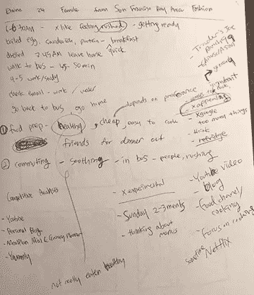
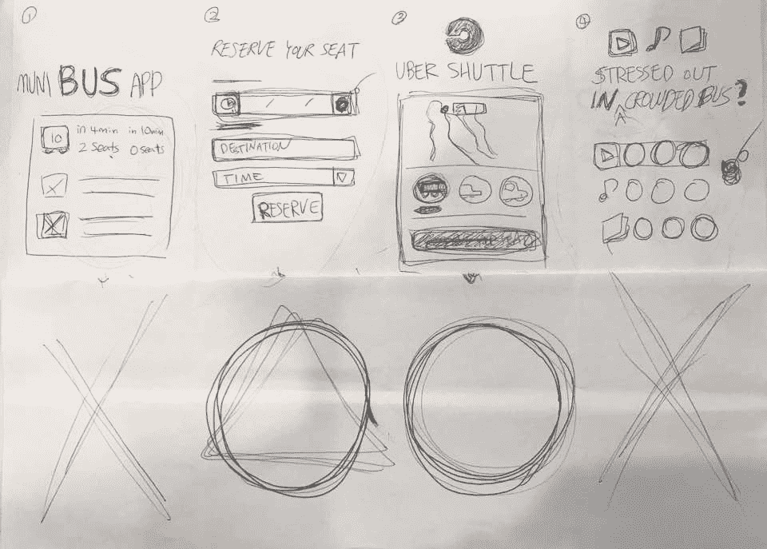
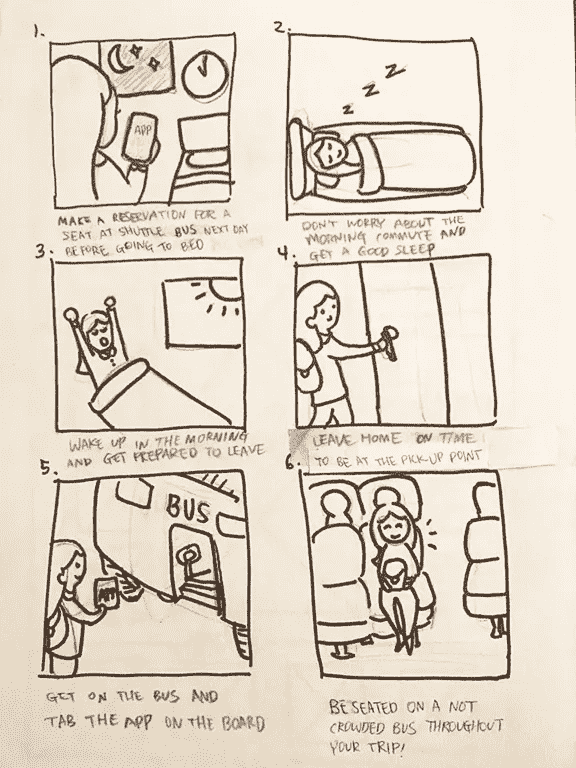
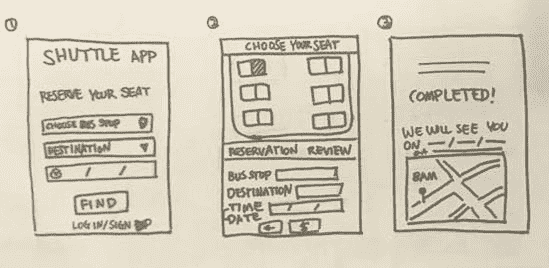
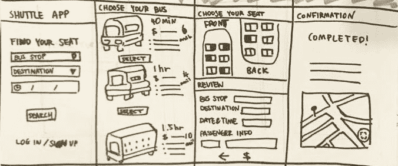
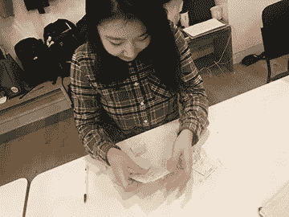
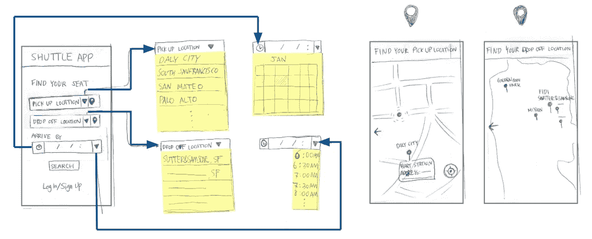
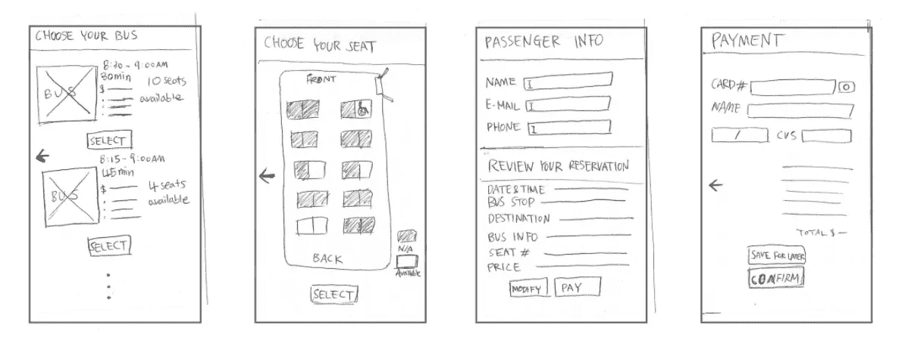
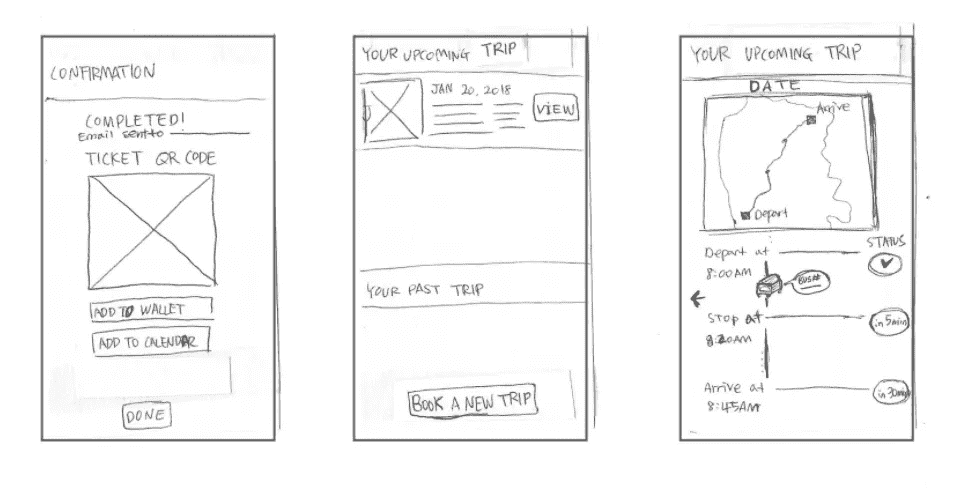
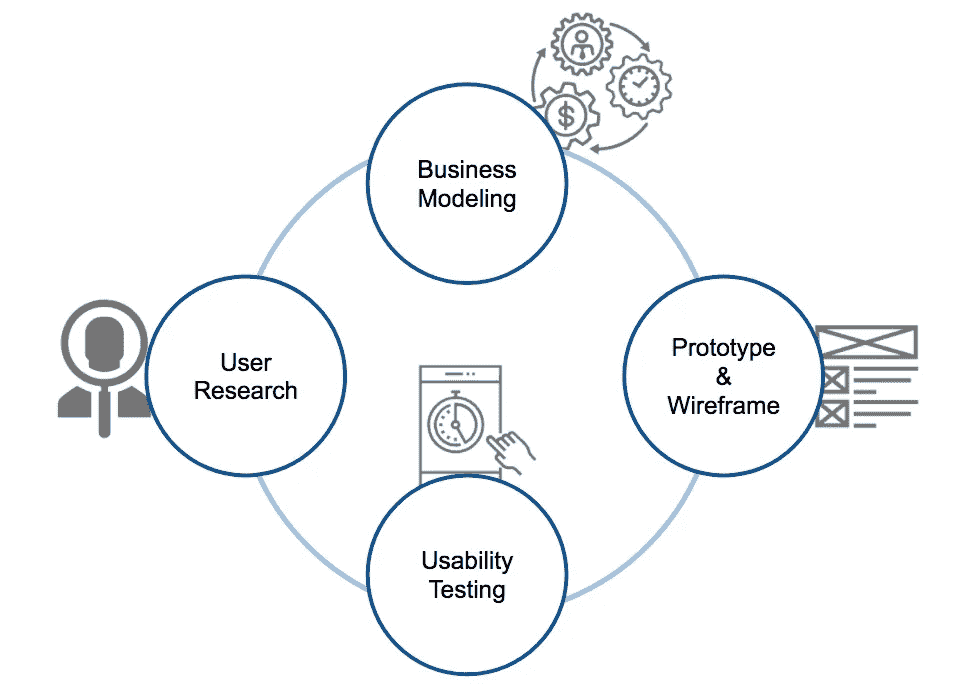

# 项目 1:根据用户情况设计手机应用

> 原文：<https://medium.com/swlh/project-1-designing-a-mobile-app-based-on-users-situation-8026f2e3e070>

*作者神话·古*

# 介绍

项目范围:这是苏珊·沃尔夫指导下的大会 UX 设计沉浸式项目的第一个项目。学生们分成两人一组，仔细询问彼此的兴趣，并找到一个可以通过设计一个简单的移动应用程序来解决的问题。该项目引导我们探索各种 UX 设计方法，包括用户访谈、竞争对手研究、快速构思和纸上原型。

工具:纸、钢笔、铅笔和剪刀

持续时间:3 天

# 步骤 1 —用户访谈

在听了关于如何进行有效和信息丰富的用户访问的讲座后，我有机会与我的指定合作伙伴 Elain Lok 交谈。首先，我让她描述一下自己的日常生活，尤其是在采访进行的前一天。她详细描述了她从早到晚的日程安排，这让我发现了她遇到的两个问题——早上通勤和做饭。由于现有的一些做饭应用程序既高效又简单，我决定为她设计一个移动应用程序，以减轻早上通勤的压力。

Notes from the user interview

Elaine 早上通勤的主要问题是，她必须乘坐非常拥挤的公交车 45-50 分钟从戴利市到旧金山才能到达 GA。尽管压力很大，她还是乘公交车上下班，因为这是最便宜的，而且能让她准时到达目的地。因此，我的项目目标是设计一个移动应用程序，提供一种不拥挤但负担得起且及时的替代交通工具。

# 第 2 步——竞争对手研究

我对竞争对手进行了调查，以了解其他运输服务提供的服务以及它们的优势和劣势。研究结果的总结是，对于 GA 学生用户来说，优步和 Lyft 等拼车移动应用程序太贵了，而且在通勤时间上经常被延迟。此外，BART(地铁)比市政巴士略贵，有时会因信号问题而延误。

# 步骤 3—构思和故事板

基于用户访谈和竞争对手的研究，我想出了几个可以帮助 Elaine 的设计想法——每天早上在拥挤的公交车上呆 45-50 分钟——并画了几幅草图来听取她的反馈。

Sketches for rapid ideation and design development

Elaine 更喜欢关于移动应用程序的想法，该应用程序允许她通过选择最近的上下车地点以及座位和到达时间来预订班车服务，这样她就可以享受舒适的旅行并准时到达目的地。在创建一个新的应用程序和在优步增加一个班车服务之间，我选择了设计一个新的应用程序，因为它给了我更广阔的界限来为我的用户定制功能。讨论完这个想法后，我创建了一个故事板，讲述这个应用程序如何解决早上的通勤问题。

Storyboard describing how the mobile app could solve the user’s situation

# 步骤 4—纸上原型和设计迭代

我为 shuttle 应用程序制作了纸质原型，包括关键屏幕和主要功能。然后，这些视觉材料帮助我与用户交流，了解她喜欢这个应用程序的哪些方面，以及需要改进的地方。此外，通过反馈会议，我发现了几个设计问题，并考虑进一步的设计发展。下图显示了如何根据反馈会议进行设计迭代。

Initial draft of the paper prototypes

Second draft of the paper prototypes

Picture from the feedback session

# 步骤 5 —最终确定纸质原型

最终的纸上原型是在设计迭代之后创建的。第一个屏幕显示用户如何开始查找他们的上车和下车地点以及到达日期和时间，以预订班车服务。接下来的屏幕将允许他们选择特定类型的公共汽车，从慢车到快车，从便宜到贵。用户还可以选择他们的座位，并接收二维码作为车票，以及在支付和预订会话完成后的公交车跟踪服务。这是展示这些过程的纸原型的最终版本—

Final draft of paper prototypes

# 后续步骤

我想说，这个项目的下一步可以是 UX/用户界面设计的迭代过程以及业务建模和分析，以实现 shuttle 应用程序的设计和业务计划。除了原型和线框化的进一步步骤之外，还需要持续的用户研究，这将成为进行可用性测试以开发最终上市产品的宝贵资产。

# 项目反馈

通过项目 1，我能够学习各种 UX 设计技术并实践这些方法。特别是，反馈会议进行得很好，听取了其他人的意见，而没有关注我自己的思考过程。下次我会更仔细地进行用户研究，因为对我来说，在谈话继续的时候，不要向用户提出是或否的问题是很有挑战性的。项目期间最令人惊讶的一件事是面对人们的各种意见和反馈，这让我理解了人们如何以不同的方式思考。在演示会上，我觉得我是通过了解个人的生活方式、爱好和兴趣来了解对方的。

## 这个故事发表在 [The Startup](https://medium.com/swlh) 上，这是 Medium 最大的创业刊物，有 295，232+人关注。

## 订阅接收[我们的头条新闻](http://growthsupply.com/the-startup-newsletter/)。

