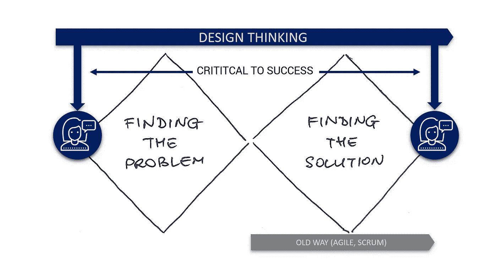
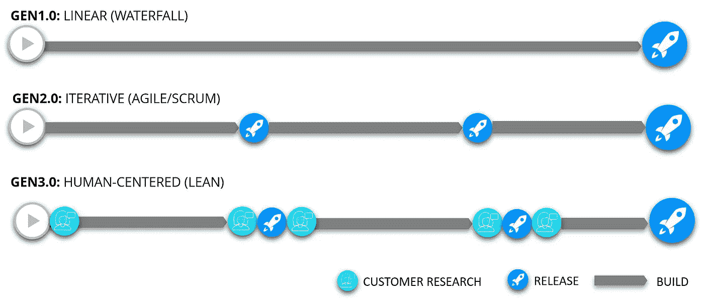
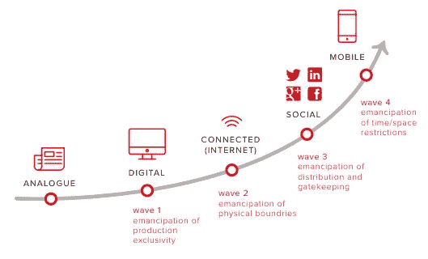
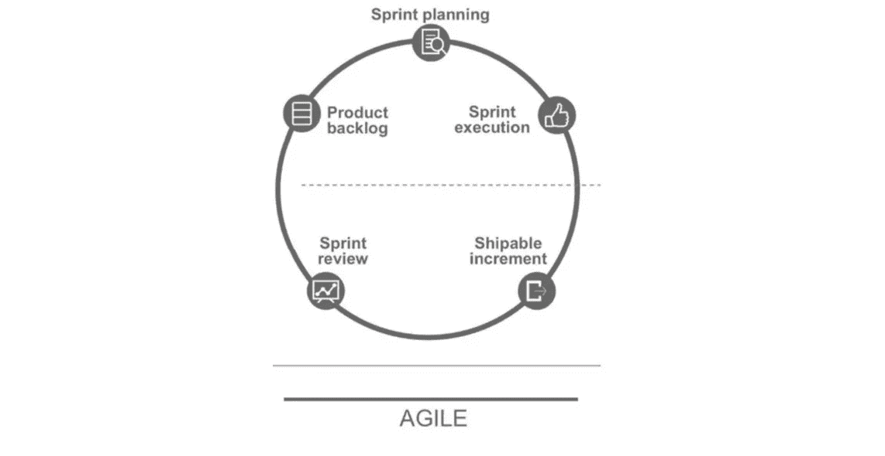
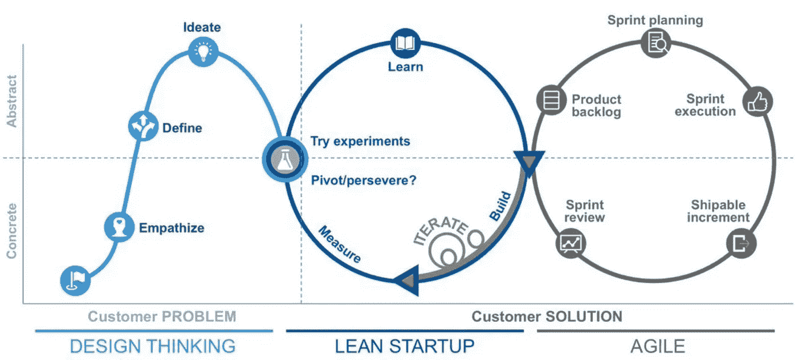

# 为什么设计思维是管理的未来

> 原文：<https://medium.com/swlh/project-management-3-0-why-design-thinking-is-the-next-gen-5be78e509103>

# 为什么公司和领导者应该重新考虑他们当前的项目管理哲学，为什么他们不能忽视设计思维对他们组织的价值！

设计思维和精益创业非常受欢迎，尽管这些实践已经存在多年了。 [Gartner IT research 估计，到 2021 年](http://www.gartner.com/smarterwithgartner/why-big-companies-need-lean-startup-techniques/)、**超过 50%** 的知名企业将在其业务层面利用精益创业技术来加快业务转型的步伐并取得成功。像 IBM 或宝洁这样的行业领导者已经用设计思维训练了他们的整个组织，使他们变得更具创新性，尤其是以客户为中心。

有明显的迹象表明，组织尤其是运营正在向更加以客户为中心的方式转变。设计思维和其他以人为中心的方法，如精益创业或精益 UX，已经变得成熟。在这篇文章中，我将探讨管理实践，以及为什么我们相信一个**新时代已经开始**。

# 数字颠覆存在于每个行业！

移动设备、社交网络、认知计算和物联网等技术正在改变公司设计、制造和交付几乎所有产品和服务的方式。它还大大加快了整个业务的变化速度，要求组织变得更加敏捷。

这当然会对产品开发和创新整体产生破坏性影响。具有主导市场地位和商业模式(人为保持高价格)的传统行业在数字世界中不起作用，产品开发周期更短、更频繁，全球竞争和免费增值服务的兴起。

客户和用户现在通过社交媒体联系在一起，这使得人们可以在几秒钟内更新他们对产品、服务或公司的体验。越来越多的消费者将他们的购买决定依赖于声誉和评论。Shitstorms 可以在几天内毁掉营销部门多年来建立起来的品牌声誉。

数字化迫使组织应对全新的挑战和市场先决条件。我知道这不是很高级的研究，但我想强调一下企业及其组织的新要求和新环境。

# 为什么数字化转型应该受到更多关注

数字化转型是几乎每个公司都会听到的流行词汇之一，尽管每个组织的转型都不尽相同。
你可以将其定义为将数字技术整合到企业的所有领域。

> 你可以将数字化转型定义为将数字技术整合到企业的所有领域。

它会导致:

*   企业运营方式以及向客户交付**价值的方式发生了根本性变化**。
*   这种文化变革要求组织不断挑战现状，经常进行实验并**得到** **坦然面对失败。**
*   组织和实践的改变，远离公司赖以建立的长期业务流程，支持仍在定义中的相对较新的实践。

为了应对这种变化，许多不同的管理方法应运而生，并声称是最好和最有效的方法。公司已经明白，像**瀑布**这样遵循顺序和线性开发过程的线性方法是行不通的。这种模式起源于制造业和建筑业，这两个行业都是高度结构化的环境，在这种环境中，变革可能代价太高，有时甚至不可能。

随着开发过程中对更短产品生命周期和更高灵活性的需求，敏捷项目管理已经成为管理项目的标准方式。**敏捷指的是 17 个软件开发人员在 2001 年 2 月发表的宣言**，他们必须讨论轻量级开发方法。它基于一种增量的、迭代的方法，而不是像瀑布一样在项目开始时进行深入的规划。随着时间的推移，需求会不断变化，我们鼓励最终用户不断提供反馈。每次迭代的目标是生产一个工作产品。

虽然敏捷传统上是为软件开发而创建的，但它也可以用于许多其他项目和行业。敏捷中的许多实践，像站立会议和可视化管理，是如此普遍，可以应用于任何行业。重要的是要记住敏捷软件开发诞生于精益制造和组织学习的原则。

敏捷也有子集，比如 **Scrum** ，这是实现敏捷最流行的过程框架之一。它遵循一套永不改变的角色、职责和会议。但是作为敏捷，scrum 在考虑和整合客户问题和需求方面也有其局限性。

# 以人为中心的(精益)管理

在我采访 SAP、宝马、汉莎航空等领先企业的过程中，我了解了他们进行数字化转型的理念。“我们的技术团队正在应用**敏捷**，产品团队正在尝试整合**精益**，随着以客户和用户为中心的需求日益增长，我们希望将一切与**设计思维相结合。”**

## 但是哪一个是最好的呢？

虽然敏捷和 scrum 帮助团队获得了灵活性、速度和持续改进的能力，但这一代项目或产品管理在团队活动中理解和整合客户的能力是有限的。以人为中心的开发方法为任何公司活动的成功增加了最重要的维度——客户！

**把客户放在一切的中心**——如果你正努力与团队保持一致，关注客户价值。定期问自己:

*   我们如何知道我们运送的是用户关心的东西？
*   我们怎么知道呢？
*   这对我们优先考虑的事情有什么影响？

## 为什么设计思维和精益创业已经成为现实

设计思维有助于团队强调客户问题和需求，而精益创业有助于其构建-测量-学习循环，以确定最适合已确定问题的解决方案。请注意，这些方法中没有一种单独使用是足够的，只有结合使用才能充分发挥它们的潜力。

如今成功的公司既不是因为他们最高效的生产而脱颖而出，也不是因为他们最好的工程师、销售经理、营销广告或其他什么。**更多的是他们对了解客户的奉献，以及他们对解决客户问题和满足客户需求的坚定承诺。**

*亚马逊*是 [**完美执行这一实践**](https://www.salesforce.com/blog/2013/06/jeff-bezos-lessons.html) 的最佳范例，这帮助他们实现了同类最佳的[客户满意度](https://www.statista.com/statistics/185788/us-customer-satisfaction-with-amazon/)，并使他们也能够主导多个市场(电子商务、云网络服务、电子书阅读器)。随着越来越多的公司了解客户洞察的真正价值，他们就能更好地瞄准产品开发、营销或总体战略等业务活动。

正确应用以人为中心不仅有助于公司在产品开发中变得更加敏捷或灵活。**它还可以减少开发错误产品的浪费，并有助于避免将资金和资源投入到不需要的解决方案中**。我们相信以人为中心有机会展示每个组织的全部潜力，尤其是他们的员工。这有助于他们按照客户价值调整团队，从而创造成功的产品和服务。*这就是为什么我们认为未来没有一家公司能够忽视客户的相关性，避免在组织中使用以人为本的方法。*

对公司来说，设计思维、精益创业、敏捷或用户体验(UX)都不新鲜。我认为，要想在未来取得成功，关键在于公司如何将所有这些实践结合起来。效率将通过团队对客户的共同理解来衡量，因为这使他们能够更准确地将工作目标对准期望的结果。设计师团队可以创建更好的用户概念，开发团队可以根据客户价值更好地优先考虑功能，经理在采取正确措施时会更有信心。

仍然悬而未决的问题是，设计思维如何产生对如此琐碎和不复杂的用户需求的解释，以至于团队可以在进一步处理敏捷模式中建立这种洞察力。设计思维和敏捷之间的接口是可以想象的吗？它允许一个简单的计划，并使顺序处理成为可能。

**有好消息**——[——**先锋**](http://pyoneer.io) 要建这个界面了！

> Pyoneers 将为那些希望提供解决实际问题的产品的创新者打造一个 SaaS 解决方案。您可以在 pyoneer.io 上注册，让 insider 先看看产品和我们即将发布的更新。

# 感谢阅读！请发表评论，帮助我们分享我们的故事！如果你喜欢，给它一个❤奖🐠

## 这篇文章发表在 [The Startup](https://medium.com/swlh) 上，这是 Medium 最大的创业刊物，拥有 274，559+读者。

## 在此订阅接收[我们的头条新闻](http://growthsupply.com/the-startup-newsletter/)。

