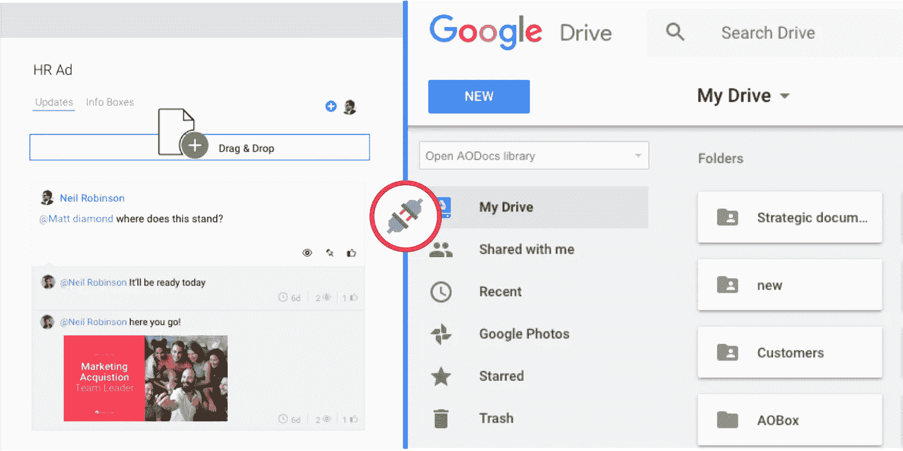

# 项目管理自动化:5 SaaS 软件把你的项目自动驾驶仪

> 原文：<https://medium.com/swlh/project-management-automation-5-saas-software-to-put-your-projects-on-autopilot-e7f1c8c85a10>

什么是项目管理和项目管理自动化？在[维基百科的定义](https://en.wikipedia.org/wiki/Project_management)中，你可能会了解到它是发起、计划、执行、控制和结束你团队的工作。然而，在我看来，**项目管理就是关于沟通的**。

项目运行中的大多数问题都是由于合作方之间信息交流不畅或不频繁造成的，无论是内部的还是基于团队-客户关系的。

通过解决这个问题，您应该能够解决大多数与项目管理相关的问题，并且使用适当的工具是成功的关键部分。

# 自动化项目管理？

Monday.com 是 SaaS[众多项目管理应用](https://picksaas.com/blog/what-is-saas-software/)之一。我最喜欢它的是过多的可定制元素。

想要创建文章发布日历吗？只需选择和调整模板。寻找一种方法来可视化你的里程碑的截止日期？在内置的 Gant 图表上向您的团队展示。

定制才是王道👑随着你的业务增长，你会发现在一个应用程序中运行所有类型的项目是无价的，不会对团队的沟通产生负面影响。

在我开始使用项目管理应用程序后不久，我发现我倾向于在项目中包含来自其他应用程序的信息，因此**自动化不同应用程序之间的数据流对于提高我的效率变得非常重要**。

那么你能完全自动化项目管理吗？不，但是您可以自动化相关的手动任务，同时保留项目管理人员**。**

不同应用程序之间的自动信息交换肯定可以提高团队的生产力，并对透明度和沟通产生积极影响。

想象一下，每当您做一些与项目相关的事情时，都要通知您的团队成员状态的更新。为什么不把它放在自动驾驶仪上，这样每个人都能及时了解你的工作呢？

# 与 Monday.com 连接的 5 个 SaaS 应用程序可自动化您的项目管理工作流程

## 1.填写好的表格会自动上传到你的周一留言板。

那么你会从你的用户那里收集任何数据吗(如果会，你可能还会检查你的[是否符合 GDPR](https://picksaas.com/blog/gdpr-compliance-checklist?utm_source=blog&utm_campaign=Monday.com) )？将所有信息保存在一个地方以触发任何相关活动不是更好吗？

[Typeform](https://www.typeform.com/?utm_source=blog&utm_campaign=Monday) 是一个简单的应用程序，帮助公司建立设计良好和用户友好的表格，**从他们的用户或客户那里收集数据。**

例如，在[picks as](https://picksaas.com/?utm_source=blog&utm_campaign=Monday)中，我们使用 Typeform app 从 saas 软件供应商那里收集应用程序。这些信息会自动发送到我们的周一应用程序中，然后我们会在 SaaS 研究委员会中处理产品的研究和测试。

**项目管理自动化提示！** 数据从 Typeform 中转出来后，需要设置专人处理，或者为每个客户数据指定一个负责人。

## 2.在 CRM 中销售服务后开始项目

您是否有一个销售团队处理业务的销售部分，然后需要在合同建立后启动特定的操作？为什么不自动做呢？

[Pipedrive](https://picksaas.com/crm/pipedrive?utm_source=blog&utm_campaign=Monday) 和 [Salesflare](https://picksaas.com/crm/salesflare?utm_source=blog&utm_campaign=Monday) 是简单的在线 CRM 应用程序，可以帮助您**管理您的销售流程以及与客户/合作伙伴的关系**

在 picksaas.com，我们已经实现了工作流程的自动化，因此每次销售完成后，我们的项目团队都会在白板上看到新项目的开始。

**项目管理提示！不值得为每个新项目建立一个僵硬的结构。每个项目都有不同的流程，让你的团队灵活地处理它们是值得的。**

## 3.向您的工作组通报时差项目的变化

“哎！我刚刚准备了一份提案。”，“嗨！你已经看过我们新客户的材料了吗？”聊天是件好事，建立个人交流对公司的成功是必要的，但是每个人不断询问的更新问题可能会让你抓狂，所以为什么不自动更新项目，让每个人都了解最新情况呢？

Slack 与周一的集成让你可以在周一通过 Slack 频道将项目中的任何更新发送给你的团队。当某人通过 Slack 自动通知某人他/她被分配到项目时，这是非常有用的。

**项目管理小贴士！** 不要在项目管理应用程序中每次更新都给你的团队发垃圾邮件，因为那样的话，他们会开始忽略通知。选择最重要的板/元素/触发器，这些板/元素/触发器需要在 Slack 中向您的团队发送更新。

## 4.为新项目板自动创建 GDrive 文件夹

在我工作过的所有公司中，项目管理和文档存储之间的差异一直是一个问题。将文档保存在项目管理应用程序中并不总是最佳选择(例如，以后可能很难找到文档)。

我们大多数人已经在日常工作流程中使用 Dropbox 或 Google Drive，因此随着项目的进行，自动化文档管理过程非常方便。**每次你添加一个新的项目板，你可以在你的 Google Drive** 中自动创建一个新的文件夹，将任何文档放入你的在线存储空间。

**项目管理提示！在你的项目管理应用程序中放置最重要的 GDrive 文档的链接是很好的，可以让每个成员轻松访问重要的文档。**

## 5.使用 Toggl 跟踪每个项目花费的时间

你是否向客户或你的经理汇报了你在项目上花费的时间？用 Excel 或纸写下你在每项任务上花费的时间可能不是最有效的解决方案。

Toggl 是一个简单的在线应用程序，旨在**轻松跟踪花在项目上的时间或简单地跟踪你的电脑**。

如果你想测量你在特定活动上花费的时间，把信息保存在一个地方是值得的。你可以把你的 Toggl 应用程序和 Monday.com 的项目管理流程连接起来。在 picksaas 中，我们发现它在按小时收费的基础上与我们的客户合作时特别有用。

**项目管理提示！不要微观管理花在特定活动上的时间。你们都应该知道每个人在特定的项目上花了多少时间。然而，分析每个人在小的子任务上花了多少时间太费时间，可能会挫伤你的团队的积极性。**

# 以最小的工作量节省时间和资源

用周一项目管理应用程序连接其他应用程序并不是最困难的工作。你可以自己动手，使用像 [Integromat](https://www.integromat.com/) 或 [Zapier](https://zapier.com/) 这样的应用程序。然而，设置和更新集成是非常耗时的。

你可能会说这不值得努力，但从长远来看，你会享受到它的全部好处，只要你意识到**自动完成的手动任务越多，你就能更好地运营你的业务**。现在就开始自动化，利用节省下来的时间更快地发展您的业务。🚀

*原载于 2018 年 7 月 20 日*[*picksaas.com*](https://picksaas.com/blog/project-management-automation/)*。*

*在*[*picks as*](https://picksaas.com/?utm_source=blog&utm_campaign=Monday.com)*，我们帮您找到 saas 软件，发展您的业务。*

*与我们聊天，关注*[*Twitter*](https://twitter.com/picksaas)*或* [*订阅*](https://picksaas.us16.list-manage.com/subscribe/post?u=0a811ad254e7cd14718599e3a&id=bdf0cfd955) *获取个人软件推荐，并接收我们每周的 SaaS 软件更新。*

## 这篇文章发表在 [The Startup](https://medium.com/swlh) 上，这是 Medium 最大的创业刊物，拥有 348，974+人关注。

## 在这里订阅接收[我们的头条新闻](http://growthsupply.com/the-startup-newsletter/)。

