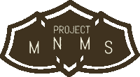

# MNMS 计划:来自创造者的笔记

> 原文：<https://medium.com/swlh/project-mnms-a-note-from-the-creator-a5a3e2642548>

“man running across street with buildings” by [Max Bender](https://unsplash.com/@maxwbender?utm_source=medium&utm_medium=referral) on [Unsplash](https://unsplash.com?utm_source=medium&utm_medium=referral)

[Project](http://Project MNMS) [MNMS](http://projectmnms.org)

Rishabh 在这里，我创建了[项目](http://Project MNMS) [MNMS](http://projectmnms.org) 作为一个项目，以帮助提高人们的意识，即技术，如果没有以正确的方式使用，会对儿童和青少年的身心产生负面影响。对于那些不知道的人来说， [MNMS](http://projectmnms.org) 代表着现代噩梦现代解决方案，这也是这个网站的真正目的。这个网站确实是一个现代的解决方案，它让 MNMS 接触到你，让我们对现代社会的问题有所认识。[**项目**](http://Project MNMS)**[**MNMS**](http://projectmnms.org)**建立在这样一个理念之上:如果我们重新定义我们思考和使用技术的方式，从被动到建设性的能力，我们将否定我们使用技术的有害方式。我是人们所说的技术极客，我更愿意称自己为“你的老套友好的邻里技术支持”。不管你叫我什么，只要知道我的目标是利用技术对抗它对后代的负面影响。 ***“人类创造了计算机，人类让计算机接管了一切”*** 。作为下一代，我们必须明白，这是我们创造出来用来崛起的工具之一，而不是堕落的工具。这个网站有很多你可以大派用场的功能。我们创建了一个名为“安全心理分析”的博客在那里你可以找到许多与你的问题相关的提示和技巧。要访问博客，请点击上面的“了解更多”按钮，或访问下面的专题文章部分。我们还有一个课程页面，在这里我们教你们建设性地使用技术的有用方法。在课程讨论页面，你可以和其他像你一样的人交流。青少年、成人甚至儿童可以在讨论技术未来的同时讨论安全的重要性。不要忘记关注我们的各种社交媒体渠道，链接位于网站菜单附近。享受[项目](http://Project MNMS) [MNMS](http://projectmnms.org) 的成果，如果您对网站有任何建议，欢迎随时联系我们。****

****

## **这篇文章发表在 [The Startup](https://medium.com/swlh) 上，这是 Medium 最大的创业刊物，拥有+383，380 名读者。**

## **订阅接收[我们的头条](http://growthsupply.com/the-startup-newsletter/)。**

****