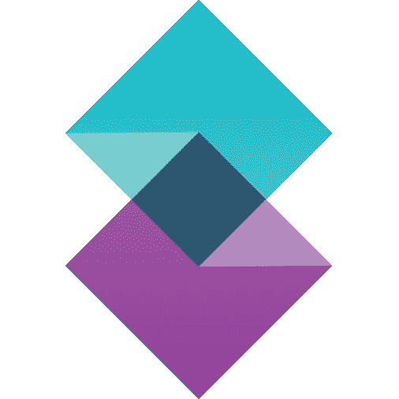
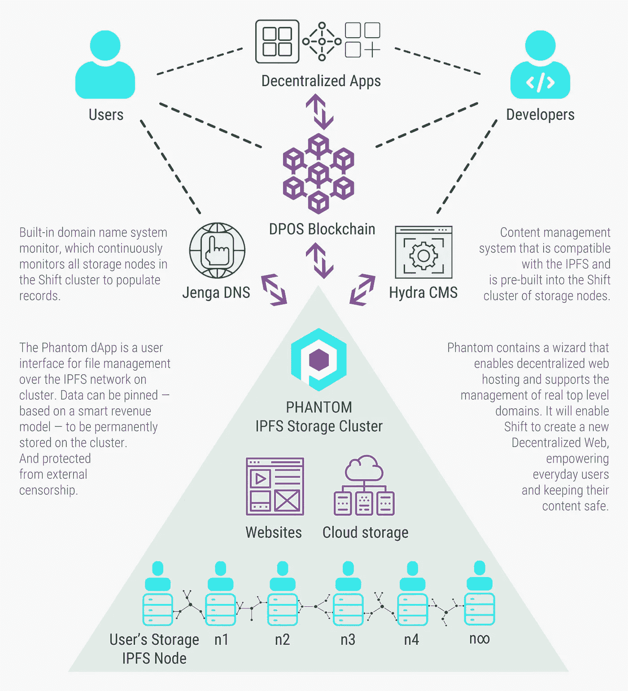
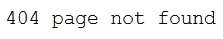

# 项目“转变”——不可阻挡的内容

> 原文：<https://medium.com/swlh/project-shift-unstoppable-content-1f10d0461827>

## [区块链 vNext 系列](/@sgrasmann/blockchain-vnext-a-series-ff5469aa1f22)(第四部分)

## **想象一下有人解决了万维网的主要问题——而我们甚至不会注意到！**

你可能会争辩说:

> “对不起，但是网络对我来说是完美的——我为什么要在乎呢？
> 没有需要解决的问题……”

……我们大多数人可能都会同意这些说法。会出什么问题呢？

但这是一个相当幼稚的观点。事实上，这是很容易拉一些字符串，阻止您的网页内容被发现或可达。这在任何地方都可能发生——甚至在欧洲的民主国家。2017 年，当西班牙政府突然关闭他们的网站时，来自加泰罗尼亚的人们有了自己的经历。

这就是为什么目前的网络内容在本质上无法抵御审查:我们互联网的一个基本假设是每条信息都有一个特定的地址。地址无疑是一个强大的设计概念。它们对定位各种东西很有帮助。这在现实世界中是真实的，在虚拟世界中也是如此。那么问题出在哪里呢？

那么，下面这些呢:

*   如果有人屏蔽了你的地址怎么办？
*   有人声称你的地址就是他的地址怎么办？
*   如果有人开始用大量的查询攻击你的地址，使你的地址对其他人不可用怎么办？(又名**拒绝服务**)

> 当前的网络还没有为这种攻击做好准备。我们的信息自由正处于危险之中。

好消息是:

> [项目转移](https://www.shiftproject.com/)即将改变这一切！

[**项目*转变***](https://www.shiftproject.com/) 用一堆内置了**去中心化**的新组件取代了我们所知的“虚拟主机”的一些基础部分。

> 地址变得不那么重要了。内容为王。

SHIFT logo

好的一面是:我们的用户体验保持不变。如果你希望用户重新学习已建立的互动，那么改变像网络这样的已建立的系统是非常困难的。这种限制是项目转移的核心设计原则:

*   我们仍然使用我们选择的网络浏览器
*   我们不必在浏览器中安装任何晦涩的新插件
*   我们仍然使用 URL 向我们的朋友发送有趣的网络链接

**但是:**一些内容突然被一个强大的新引擎管理，这个引擎**抵制审查**，因为地址不太相关。该引擎不在集中的服务器上存储内容，而是以分散的方式存储。它还实现了一些协议，即使有人试图屏蔽内容，我们也能找到它。然而，我们仍然可以使用我们心爱的网址(统一资源定位器)。

> 更好的是:Shift 的机制并不局限于静态的网页内容，它也适用于动态的网站。

现在你可能会想:

> “听起来不错！但这怎么可能行得通呢？”

所以让我们深入了解一下**项目 *Shift 的技术。***

## 技术

[换档](https://www.shiftproject.com/)由以下主要构件组成:

1.  dApp 层
2.  dPOS 区块链
3.  Jenga DNS 监视器
4.  九头蛇细胞质雄性不育系
5.  虚拟存储集群
6.  IPFS

Source: The Shift project team provided me this overview picture of the plaform upon request

我将尽力自下而上地讨论这些层:

Shift 项目站在“巨人的肩膀上”——在这个例子中是 [IPFS](https://ipfs.io/) ，即**临时文件系统**。你可以把 IPFS 想象成 HTTP 的一个强大的、去中心化的版本。我在这个故事中更详细地写了关于 **IPFS** 的事情。许多当前的区块链项目，如 [d.tube](https://d.tube/) 、 [digix](https://digix.global/) 或 [uport](https://www.uport.me/#home) 都建立在 IPFS 之上作为存储后端(更多细节见[此处](https://github.com/ipfs/awesome-ipfs/blob/master/README.md))——所以这是一个明智的决定。

Logo found on [IPFS homepage](https://ipfs.io/ipfs/QmTgtbb4LckHaXh1YhpNcBu48cFY8zgT1Lh49q7q7ksf3M/)

但是 IPFS 还不是为最终用户建造的。Project Shift 解决了这一问题，并通过以下组件对其进行了补充:

幻影在 Shift 的架构中起着核心作用。它将 IPFS 的力量带给开发者、网站托管者和最终用户。一方面，它是 Shift 的托管服务和底层 IPFS 节点的集群管理器。它还包含一个设置顶级域名的向导。因此，开发人员可以使用 Phantom 来创建和配置基于 Shift 的应用程序的存储后端。另一方面，还有 **Phantom dApp** ，这是一个与存储集群交互的良好用户界面。

移位的网站[https://www.shiftproject.com/](https://www.shiftproject.com/)托管在幻影。它还活着，所以你可以得到它的能力的第一手印象。

**Hydra** 是一个基于 IPFS 集群的分散式内容管理系统。Hydra 处理静态文件，如图像、视频、pdf、文本文件、html 或 javascript 文件，但也处理动态内容。Shift 的网站不太清楚具体是如何运作的。该团队目前似乎投入了大量工作。所以我会把这个留给将来可能更深入的故事…

**Jenga** 是 Shift 的构建模块，将分散的 IPFS 内容无缝集成到 DNS——我们互联网的中央域名系统。 DNS 负责将名称(通常是 URL)解析成 IP 地址。

> 让我们举一个例子:如果我打开我的网络浏览器，导航到我最喜欢的区块链项目之一，我输入[www.wysker.com](http://www.wysker.com/)，我的浏览器要求 DNS 服务将这个符号名称解析为 IP 地址。它得到一个中心 IP 地址，就像本例中的 172.217.21.211，并使用 HTTP 将 Wysker 的内容发送到我的浏览器中。如果你想更详细的了解 DNS，看[这个视频](https://www.youtube.com/watch?v=72snZctFFtA)。但是现在回到项目转移…

你可以考虑将 **Jenga 作为 DNS** 的监视器和插件。Jenga 持续监控我们应用程序的所有 IPFS 存储节点的健康状态。因此，如果一个恶意方试图阻止我们的网站，我们不会看到典型的“拒绝访问”或“找不到页面”的错误。

相反，Jenga 会**自动向 DNS** 注册我们的虚拟集群的剩余健康节点之一，DNS 会正确地为来自未阻塞节点的内容的新请求提供服务。

> **工作中的权力下放。无法阻挡的内容**！

> 这就是转变如何产生对审查的抵制。
> 我认为叠树是 Shift 项目的“神奇部分”。；-)

但是 Shift 生态系统还有一个部分:必须有人托管所有这些组件并提供存储和服务。我们还需要一个激励机制来保持这些主机厂的积极性。这是区块链——项目转变的一部分:集群由令牌驱动的 **dPoS(授权股权证明)区块链**提供“燃料”，这是 [Lisk](https://lisk.io/) 的一个分支。我在[这个故事](/swlh/lisk-a-blockchain-ecosystem-based-on-javascript-ff95b7de7af7)中写了更多关于 dpo 和 Lisk 的内容。[换班令牌](https://coinmarketcap.com/currencies/shift/)作为中央激励机制。Shift 与 [**侧链**](https://hackernoon.com/what-are-sidechains-1c45ea2daf3) 一起工作，使 dApps 彼此分离。因此，可扩展性是平台的根基。

在所有这些层之上，你可以构建和托管你自己的**去中心化应用(dApp)** 。Shift 是为 Javascript 开发者打造的。因此，您可以使用您选择的 Javascript 框架来创建您的前端。

## 提供资金

资金是项目转移中非常有趣的一部分。没有 ICO 或代币销售。尽管如此，自 2015 年底以来，SHIFT coin 已经在 coinmarketcap 上市，并一度位列前 100 名。在我的研究中，我没有发现这个项目最初是如何获得资金的任何历史细节。该团队似乎坚信开源开发。

我在[项目的 FAQ](https://www.shiftproject.com/faq) 中发现了以下有趣的陈述:

> “我们不认为几百万美元是成功的关键。有很多例子说明有大量资金的项目，但是他们似乎没有把事情做好。我们认为让合适的人加入更重要。目前，我们对我们的团队成员非常满意，我们正在不断吸引新的、令人兴奋的人才加入团队。”

在[班次路线图](https://www.shiftproject.com/roadmap)中也有如何不断资助平台进一步发展的计划:团队计划从每 1.1 个块奖励中预留 0.1 个班次，用工资补贴其初级开发和组织人员的劳动。我认为这是一个有趣的想法，可以为团队带来持续的回馈。

## **结论**

当我写区块链项目时，像 Shift 这样的项目最吸引我。每隔一段时间，我就会了解到这样一个隐藏的宝石，我真的很想帮助和传播这个世界。

如果转变达到临界质量，它将有巨大的潜力。如果你明智地使用你的代币经济，激励用户和主机用户，达到临界质量肯定是可能的。但是还有一段路要走。想象一下，像 Wordpress 这样的东西被移植到 Shift 上运行。这可能会变得巨大…

我希望你喜欢这一集[我的区块链 vNext 系列](/swlh/blockchain-vnext-a-series-ff5469aa1f22)关于一个相当不为人知的项目，它具有巨大的潜力和令人印象深刻的成熟度。

我希望得到您的意见:您是否正在参与一个有趣的区块链项目，该项目将是这一系列区块链 vNext 故事的下一个很好的候选项目？如果有:请与我联系。

***免责声明:*** *本文无意成为任何形式的投资建议。如果你打算投资本文提到的某个项目，自己做研究并寻求专业支持。*

## 这篇文章发表在 [The Startup](https://medium.com/swlh) 上，这是 Medium 最大的创业刊物，有 326，962+人关注。

## 在这里订阅接收[我们的头条新闻](http://growthsupply.com/the-startup-newsletter/)。

