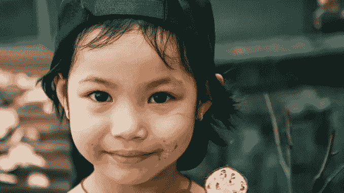

# 推广你的 ICO 或区块链项目——并在这个过程中帮助一个孩子！

> 原文：<https://medium.com/swlh/promote-your-ico-or-blockchain-project-and-help-a-kid-in-the-process-48800461542d>

在 Intellicore Press，我们最近在 Reddit 举办了一个 AMA(向我提问)活动，在 r/icocrypto 子 reddit 中[:社区参与者——也就是说，任何人——都可以向我们提出关于 ICO 的艺术和科学以及区块链白皮书写作的问题。](https://www.reddit.com/r/icocrypto/comments/8r0x0f/live_ama_tech_writing_agency_and_blockchain/)[点击这里查看问题和我们的答案](https://www.reddit.com/r/icocrypto/comments/8r0x0f/live_ama_tech_writing_agency_and_blockchain/)。

现在，同样的机会向你敞开了:任何区块链项目或 ICO 团队都可以在 r/icocrypto 上举办自己的 AMA，在这个充斥着喧嚣和令人讨厌的 ICO 宣传的世界里成为一个真实的声音，而大多数投资者无论如何都不会阅读这些宣传。

只有一个条件:

> *你准备好给联合国儿童基金会捐 10 美元了吗？*

您的捐赠将有助于联合国儿童基金会支持世界各地发展中国家和战争地区儿童生活、照明和教育的众多项目之一。

Photo by [Tong Nguyen van](https://unsplash.com/photos/wXnaknPMpK0?utm_source=unsplash&utm_medium=referral&utm_content=creditCopyText) on [Unsplash](https://unsplash.com/?utm_source=unsplash&utm_medium=referral&utm_content=creditCopyText)

这项提议是 r/icocrypto 版主努力清除子 reddit 中的垃圾广告和诈骗广告的一部分，并为区块链企业家和投资者提供对各种区块链风险投资的真实、可信的见解。

感兴趣吗？[访问 r/icocrypto 子 reddit](https://www.reddit.com/r/icocrypto/) 并联系版主(右侧栏)——或者[联系我们](mailto:hello@intellicore.press)，我们将为您建立联系。

记住:你的 10 美元对世界上某个地方的一个孩子来说会有很大帮助，但它可能只能为你的下一次团队会议买几杯咖啡。

*最初发布于*[*www . intelli core . press*](https://www.intellicore.press/promote-your-ico-or-blockchain-and-help-a-kid/)*。*

## 这篇文章发表在 [The Startup](https://medium.com/swlh) 上，这是 Medium 最大的创业刊物，拥有 337，320 多名读者。

## 在这里订阅接收[我们的头条新闻](http://growthsupply.com/the-startup-newsletter/)。

