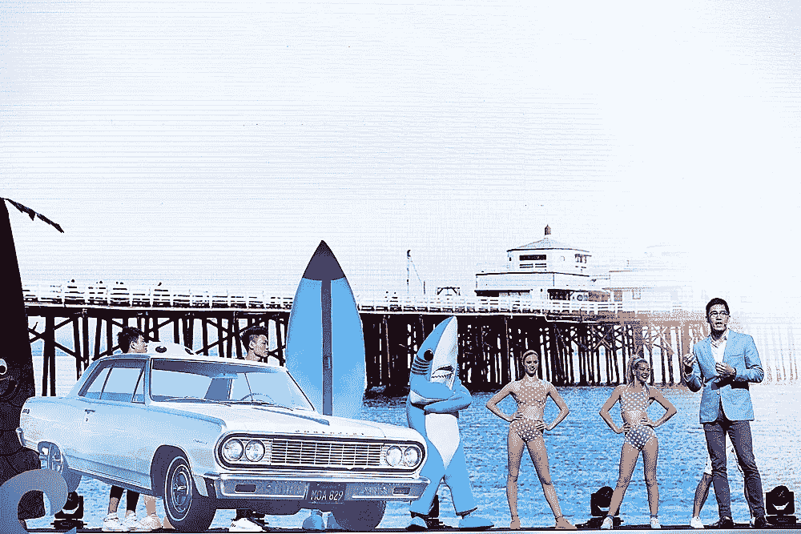

# 对亚裔美国人的公益广告:是时候站出来做一个真正的领袖了。

> 原文：<https://medium.com/swlh/psa-to-asian-americans-time-to-step-up-and-be-a-f-cking-leader-c1f90925dbd9>

Me and Dancing Sharks Giving a Speech in Guangzhou, China

事实:

*   亚洲人和亚裔美国人占五大科技公司(谷歌、惠普、英特尔、LinkedIn 和雅虎)员工的 27%，但仅占高管的 14%。
*   根据 2012 年的数据，亚洲人在《财富》500 强企业高管职位中占 1.5%。

模范少数民族。竹天花板。刻板印象。现状。是啊是啊，我明白了。我从 12 岁起就听过同样的故事。

你可以相信这个故事，让它决定你的生活。或者你可以选择不接受，对现状说“去你妈的”，自己去开拓自己的路。

我是威斯康星州为数不多的亚裔孩子之一。我与你所认为的领袖截然相反。我非常害羞，以至于我深刻地记得我 12 岁时妈妈为我感到最自豪的时刻之一——我给某人打电话并留下语音邮件，在那里我用完整、连贯的句子说话。

在接下来的几年里，我大部分时间都满脸粉刺，坐在电脑前玩游戏。我身高 5 英尺 11 英寸，体重约 115 磅。

大约在我 17 岁的某一天，我决定不再做一个因为眼神交流而焦虑不安的孩子。十年后的今天，在我 27 岁的时候，我已经带领一个 25 人以上的团队从零开始成长为一家七位数的企业。

在这转变的十年里发生了什么？

首先，也是最重要的一点，我决定要做出改变。

> “如果你做你一直做的事情，你会得到你一直得到的。”——托尼·罗宾斯

然后，我学会了如何像领导者一样行动和思考。

作为亚裔美国人，我们不习惯看到像我们这样的强势领导人出现在媒体上。正因为如此，想象自己是注定要成为的领导者更具挑战性。作为一个年轻的成年人，我会不停地寻找一个看起来像我的榜样。那时候，我最好的对手是姚明(除了我没有 7 英尺 6 英寸高，也不是中国人，或者，就此而言，除了我的肤色和头发之外，没有任何与他相似的地方)。

我们需要更多的年轻人，他们将打破现状，成为首席执行官、世界领袖、政治家、作家、演员、运动员、发明家、创新者等等。我们需要更多的埃迪黄，更多的林书豪，更多的史蒂夫陈和亚历山大王。

我认为有很多方法可以成为一名成功的领导者，有很多文章告诉你一堆或多或少描述超级英雄的显而易见的事情。

我不想仅仅列出一个领导者的明显品质，我想和你们分享我生活中的真实时刻，那些决定领导品质的时刻。然后，我还会提供一些可行的方法，让你站出来，成为亚裔美国人社区迫切需要的领导者。

# 1.自我教育。

我的母亲是来自中国的移民，她独自抚养我和弟弟，同时在当地的社区大学兼职上学，晚上在杂货店打零工。她努力工作，靠政府发放的食品券维持生活。

有一个故事一直让我难忘。她谈到她如何从一个男人那里租了一套公寓，因为他知道她不会说英语，所以在搬出去的时候，他没有退还她的任何押金。他知道他可以利用这种情况，而我妈妈对此无能为力。

这对她来说是一个很大的打击，考虑到她已经靠一份又一份的薪水养活自己和她的两个儿子。她希望我们两个华裔美国孩子有更好的生活和未来，他们没有她那样的语言障碍。

她知道，由于她的口音、英语、破眼镜和从旧货市场买的二手衣服，她会被认为是愚蠢的。回过头来看，她后悔所有她本可以申请到、很可能可以获得的奖学金机会，却错过了，仅仅是因为她无知。她告诉我哥哥和我，“努力学习，知识就是力量，如果你很聪明，那么没有人能够利用你。”

一晃几年过去了，我已经上大一了。我努力学习，申请我能申请的每一份奖学金，赢得多项奖学金，并且我的课程都是优等生。知识就是力量，通过最好的成绩和以优异的成绩毕业，我能够获得自信和认可，相信我有好的东西要说，并且我有足够的智力去支持它。

好好学习，才华横溢，能学多少就学多少。没有人想听一个不聪明的领导讲话。

# 2.直面你的不安全感。

如果你想成为一名领导者，你必须克服你不自信的地方。这些都是别人一眼就能看穿的弱点——毕竟，没有人愿意被一个不自信的人领导。

就我个人而言，作为一个来自中西部的亚裔孩子，首先，我是周围唯一的亚裔孩子之一，其次，我太瘦了，以至于我喜欢的一个女孩问我是不是厌食症患者，对此我感到不安全。

我是怎么处理的？

瘦很容易处理。我只需要吃更多的食物，锻炼，加入游泳队。

作为亚洲人有点难。你无法真正改变这一点(尽管人们试图通过做双眼皮手术等方式来改变)。).

直到多年以后，我才开始意识到，身为亚裔美国人让我脱颖而出，变得与众不同。我意识到我能流利地说英语和汉语普通话是多么幸运，这将最终带给我大量的新机会和用双语建立亲密关系的能力。

当我 16 岁的时候，我和我当时的女朋友去中国背包旅行了三个星期。我不明白她父母怎么会让她去旅行。这是我开始热爱自己身份的决定性时刻。我记得 2008 年的北京奥运会，那是我第一次为自己是一名美籍华人而感到自豪。后来 2009 年回国留学，2015 年搬到北京。

# 3.非常乐于助人。

给，给，给。出于你内心的善良去帮助别人，不求回报。给予爱，给予真诚的赞美，给予建议，给予赞美。帮助他人，超越自我，变得真实。一个领导者通过树立伟大的榜样来激励他人和帮助他人。

在我的一生中，我喜欢与他人分享我拥有的任何东西，即使这对我来说意味着损失。我想分享我的好运，我的时间，和更多的东西给更好的人。有时这意味着人们利用我的时间，而我损失了一些钱或时间。

另一方面，更多的时候，它让我与他人建立了牢固的关系，最终我与志同道合的人成为了朋友，从而建立了一个体贴、善良、支持你的朋友社区。

当谈到领导团队时，我总是做我不需要做的事情——给奖金、礼物和其他类型的意想不到的帮助。人们会注意到这一点，并尊重那些做了他们不需要做的事情的人。在我的另一个名为“[大学毕业后做什么](/swlh/what-to-do-after-graduating-college-45fda4a30429)”的博客中有更多关于多做 10%的内容。

# 4.走大路。

作为一名领导者意味着你经常比别人更努力地工作，对你不需要的事情负责。你必须做好选择战斗的工作，知道哪些是重要的，哪些是浪费时间的。

总是走大路。你没时间做琐碎的事情。

到我 18 岁的时候，不知何故，我从一个害羞的失败者变成了主持最大最糟糕的高中毕业舞会的人。这意味着我不得不花费大量的时间来组织和策划这个活动，而其他人却乐在其中。

我们预定了两辆加长豪华轿车去大干一场，这是我们各奔东西去不同的大学之前最后一次酷行。

问题是没有人有很多钱，因为我们是高中生，每个人都很吝啬。当时，我在当地一家地铁站工作，每小时工资 5.5 美元。留给我的是一个巨大的账单，最终我不得不处理，因为我是领导。

当涉及到金钱、时间或其他我不需要负责的压力时，这种情况经常发生。作为一名领导者，你可能会有小的损失，但最终你会取得胜利。通过那次经历，我学会了如何组织，如何计划，以及如何领导一场有很多人参加的活动。

# 5.大声点。

知道什么时候为你的信仰大声疾呼，即使它经常是不受欢迎的决定。这并不意味着你应该是一个乳臭未干的孩子，对每一个随意的小细节都有自己的看法，而是说，当别人害怕的时候，你应该大胆地说出来。

回避冲突是人类经验的一个固有部分，但是真理和进步也在于解决冲突。

每当有困难的情况或需要做出决定时，我是第一个挑战现状的人。我可以接受不受欢迎的观点，只要我能以逻辑和理性为基础。

当我上高中时，我是一个多元文化巡回剧团的成员。我们每天走访 40 多所小学和中学，展示关于性别歧视、种族主义等社会问题的素描。我们的小组是由我们的老师丽贝卡精心挑选的，由 4 名黑人、4 名白人、4 名亚太裔、4 名拉美裔和 4 名种族模糊的人组成。我们的男女比例大约是 50:50。

几个星期后，丽贝卡提醒我们注意，我们的小组很难接受彼此之间的冲突来发现真相。我们彼此之间仍然过于“亲密”，不想挑起紧张局势。这严重地限制了我们相互联系的能力，也限制了我们创作出有意义的草图，在直觉层面上揭示这些问题的能力。

一天，我们在谈论黑人学生和其他学生之间的问题。没有人提出显而易见的问题，因为每个人都太害怕可能由此产生的冲突。

我决定不再废话，告诉人们我的真实感受。

> “每次我坐校车的时候，后面的黑人小孩都会偷我们所有的东西，并殴打其他小孩，这让我感到很难过。我不想成为种族主义者，但我也不能忽视我有这种感觉是有原因的。”

这是几周以来第一次围绕敏感的种族话题进行有意义的谈话。

在我们的课堂上，来自威斯康星大学麦迪逊分校的电影制作人杰里米·哈乐迪(Jeremy Holiday)跟随我们的团队，并记录了一部关于这个名为 [Multico](http://www.imdb.com/title/tt1518220/) 的团队的纪录片。

纪录片和我们课堂的高潮是我倾听自己的直觉，自信地陈述自己的观点，挑战现状的时刻。那一刻引发了一场有意义的谈话，最终导致了小组中每个成员之间更强烈的情感纽带。

机会存在于解决冲突中。“知道什么时候该说出来”是这个故事的寓意。

# 6.变得脆弱。

领导者不必完美无缺；事实上，一个领导者是一个能够承认自己错误的人。自信脆弱——人们会因为你的不完美和值得信赖而接受你。

通过变得脆弱，你也让自己变得更容易接近你的同龄人。这反过来允许你不断地接受反馈循环，最终改善你与他人的关系，因为你的同事会觉得你在倾听。

最近，我和我的团队去了保加利亚，我们做了一本名为*团队的五大功能障碍*的书中的练习。这个练习叫做“个人历史”

本练习的目的是通过为团队成员提供一个以低风险方式展示脆弱性的机会来提高信任度，并帮助团队成员从根本上相互理解，从而避免对行为和意图做出错误的归因。这个练习通常是团队开始建立信任的第一小步。

这个练习由每个人用三个简单的问题做一个“个人历史”组成:

1.你在哪里长大的？

2.你有几个兄弟姐妹，你排在第几名？

3.请描述一个你童年时独特或有趣的挑战或经历。

显然，每个人都可以尽可能地偏离这三个问题，因为它们是开放式的。

我喜欢做的一件事是把一切都摆在桌面上；如果你能做到这一点，让自己如此开放，那么你就不会有任何不安全感。

轮到我的时候，我决定自信地说出我所有最大的失败和不安全感。我已经知道我的问题，随之而来的是强大的力量。

我是被一个靠救济金生活的单身母亲养大的。她生活艰难，饱受虐待、离婚和贫困。我的哥哥有一系列的问题，包括戒毒，我的父亲刚刚从一场巨大的诉讼中脱身，这场诉讼可能会永远毁了大多数人的生活。

我有一个可怕的死记硬背的记忆，这意味着我在不理解事情背后的意义的情况下记忆事情是很糟糕的。我以全班第一名的成绩毕业，但是没有通过 MCAT。

在成长过程中，我是世界上最害羞的孩子，可能是因为我是威斯康辛州少数几个白人占主导地位的亚裔孩子之一。

这样的例子不胜枚举，我可以毫不犹豫地分享所有这些失败，因为它们让我变得更有人情味，更有人情味。人们看到，虽然今天我可能是一个成功的企业家，但我确实来自一个没有鲜花盛开的背景。

敞开心扉——要脆弱，因为如果你自信地分享你的不安全感，你就能改进它，别人也不会发现你没有预先发现的错误。

# 7.要真实。

对于任何想与他人建立深厚关系的人来说，真实是最重要的属性之一。人是观察力极强的群居动物。我们可以很容易地分辨出一个人是在演戏还是只是做自己。

你可以假装成某人或某事，但你骗不了那些经历过并做过那种事的人。换句话说，你可以骗过其他骗子，因为他们已经在对自己撒谎了，但你骗不了真正重要的人。

也许我在伦敦戏剧学院上学期间，以及在表演教练亚伦·斯佩瑟(威尔·史密斯、杰拉德·巴特勒和许多其他人的教练)的指导下进行现场研究时，学到的最重要的事情之一是，区分骗子和专业人士是多么简单。

每天，演员们都来到现场学习，试图成为下一个电影明星。但是对于新生，亚伦总是告诉他们同样的事情:

> 你必须对自己诚实:你是优质产品吗？你真的有那么好吗？如果你不能看着镜子里的自己说，'不，我真的没有那么好，我他妈的很棒！'，那你还没准备好。当我们可以雇佣“她就是那个”的时候，我们为什么要雇佣“她就是那个”？"

年轻演员经常在场景研究中选择场景，亚伦对场景进行评论。一瞬间，任何人都可以看出真正花时间去研究和检查他们性格的每个方面的人和只是带着一点虚假的情绪去背一些台词的人之间的区别。

顶级演员花费数十甚至数百小时的时间创作角色自传并欣然接受。如果你摆了一个场景，不能回答你的角色的家族史是什么，你在哪条街上长大，你的社会经济背景是什么，你的宗教背景是什么，你第一次恋爱，你的英雄是谁，什么让你生气，你觉得幽默，你最黑暗的秘密是什么，那么你还没有准备好。相反，你所做的只是模仿一个角色可能的样子，而不是生活在那个角色的皮肤和世界里。

这种对这门手艺的专注程度将玛丽昂·歌迪亚、威尔·史密斯、维奥拉·戴维斯、丹尼尔·戴·刘易斯、梅丽尔·斯特里普与想成为调酒师的“演员”区分开来。

当谈到真实性时，上面的表演类比适用于生活中的任何事情。如果你想成为一个更好的朋友，那就采取必要的行动去帮助别人；如果你想成为一名更好的领导者，那么花时间投资于你的技能和自我成长。人们会看到你真正关心并花必要的时间做到最好。

练习做任何事情都要真实。你会吸引志同道合的人，看穿那些胡扯。

# 8.取得所有权。

作为一名领导者，意味着在出现问题时承担责任。永远不要责怪他人、过程、无法控制的环境——相反，先从内心寻找原因。

首席执行官对他们有整个公司的影响力。如果别人犯了错误，为什么你没有预料到？如果你没有达到你的年度收入目标，为什么你没有更早地认识到问题并采取纠正措施呢？

在我的公司，当事情变得糟糕，我们没有赶上最后期限，或者成本大大超过了我们的利润率，我没有责怪别人，而是首先认识到自己的错误。

为什么我没有做更多的检查，以了解事情的进展情况？为什么我没有给人们更多的培训或者问更多的问题？为什么我们的流程是以一种不能让我们成功的方式构建的？为什么我没有创造一个激励问责的环境？为什么我的团队在事情走向错误的方向时没有提醒我？

责怪别人很容易，但作为领导，你最终要为所有事情和任何事情承担最后的责任。我选择深入了解并致力于我可以控制的元素，包括为每周的检查会议提供时间，给予人们更多的自主权和更多的责任，创建更好的流程文档，等等。

今天，虽然我们还没有达到目标，但是每个项目我们都朝着正确的方向迈出了重要的一步，因为我对成功和失败都有自己的看法。

# 9.成为关键。

关键人物是一个公司不可或缺的人，一个杰出的人。要成为关键人物并不容易，这也是他们的价值所在。然而，我相信到目前为止我提出的每一点都有助于关键型品质。

Seth Godin 提供了一个很好的例子来说明什么是关键:

> 你的餐馆有四个服务员，艰难时期需要你解雇一些人。三个服务员工作很努力。另一个不错，但也是解决问题的高手。他可以安抚愤怒的顾客，巧妙处理不稳定的电脑系统，并在厨师喝多了的时候安抚他。知道谁的工作最稳定吗？
> 
> 排除故障从来都不是工作描述的一部分，因为如果你能描述排除故障所需的步骤，那么一开始就不会有麻烦了，对吗？故障排除是一门艺术，是故障排除者送给处于困境中的人的礼物。当其他人都放弃的时候，问题解决者会介入，把自己放在危险的边缘，为事业贡献能量和风险。

关键人物是那些能够创造性地解决问题，主动去做别人想都不敢想的事情的人。关键人物身上有一种艺术气质，让他们能够轻松应对困难局面。

这是首席执行官和创始人的典型特征——想想你遇到企业所有者时的任何情况。通常他们有使他们脱颖而出的特殊特征，无论是他们的自我构成方式，还是他们解决问题的方式。这适用于各种行业，从餐馆到其他任何行业。

—

所有的领导者都必须从某个地方开始。对于亚裔美国人来说，无论出于何种原因，我们都很难接受领导特质。这可能是文化教养、大众媒体中缺乏其他可见的亚裔美国人榜样，或者是制度化的偏见。我不确定，但不管怎样，唯一能带来改变的是坚定的自我成长。

我很高兴成为这一代人的一员，他们终于看到更多的亚裔美国人打破传统的职业道路，在体育、娱乐、时尚、科技和其他一切领域担任领导角色。