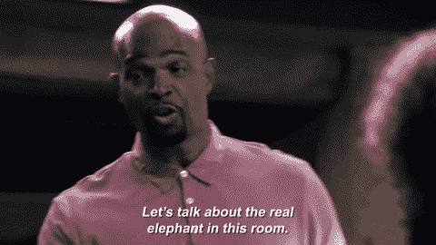
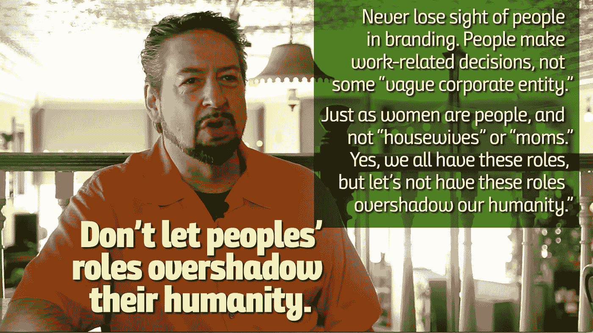

# B2B 品牌神话，在 60 秒内被撕成碎片

> 原文：<https://medium.com/swlh/psst-im-a-human-not-some-demographic-profile-ac5d722829fa>

## 有一个太多品牌认同的神话。它破坏了我们在真实层面上的联系。是时候解决房间里的大象了。

在你把我装进某个轮廓、某个角色、某个“盒子”之前，我是一个活生生的人。

太多品牌忘记的一个小(但至关重要)细节。

作为人，我们被放入一个或另一个盒子中，所有这些都基于一些理论，这些理论应该使我们更容易联系。

“我是一个人”是房间里那些容易被忽略的大象之一，被忽视后只会被一些“人物角色”的废话取代，或者更糟，可怕的 B2B/B2C 营销神话*。*

> 我们中没有人曾经和“个人资料”进行过对话——我们只和另一个人交谈过:一个有着真实的喜欢、不喜欢、爱和恨的人。

那么，我们开始现实一点怎么样？

这是本周《一分钟星期三》的主题。

# 我是个人，不是什么“目标市场”

我的好友特德·鲁宾说得好:“如果你只关注钱……你就有可能完全忽视人民。”

我在我的书 [*品牌干预*](https://www.brandinterventionbook.com/buy-brand-intervention) 中谈到了这一点，谈到了交易关系与建立在共同梦想、抱负和目标基础上的关系之间的区别。

# B2B 是人们花费时间的地方，而不是他们作为人的定义

永远不要忘记人们是独立的个体。做出与工作相关的决定的是人，而不是一些“模糊的公司实体”

正如女人也是人，不仅仅是“家庭主妇”或“母亲”

这同样适用于年轻人、孩子、处于人生成熟阶段的人，以及那些喜欢某些活动的人。

> 是的，我们每个人都有这些角色，但不要让这些角色掩盖了他们的人性。

如果我们真的希望将我们的品牌与我们的产品和服务所服务的人们的生活联系起来，那就不会。

## 点击查看周三一分钟[全集。](https://www.youtube.com/playlist?list=PLpkEFqzZFOZ_aeEt44vIDEGWCO4mUW9Tp)

需要一个品牌故事，与一个在其设计和 DNA 中具有真正真实性的品牌联系起来？咱们[聊聊](http://david@risingabovethenoise.com)。

*原载于*[*www.risingabovethenoise.com*](https://www.risingabovethenoise.com/psst-im-a-human-not-demographic-profile/)

## 这个故事发表在 [The Startup](https://medium.com/swlh) 上，这是 Medium 最大的创业刊物，拥有 327，829+人关注。

## 在这里订阅接收[我们的头条新闻](http://growthsupply.com/the-startup-newsletter/)。

