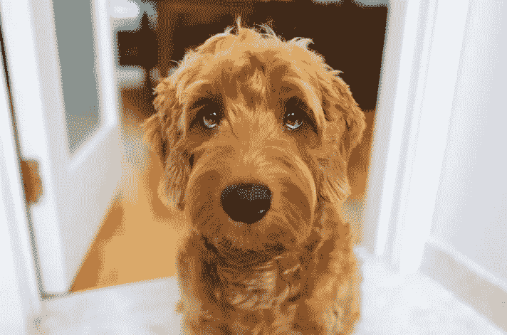
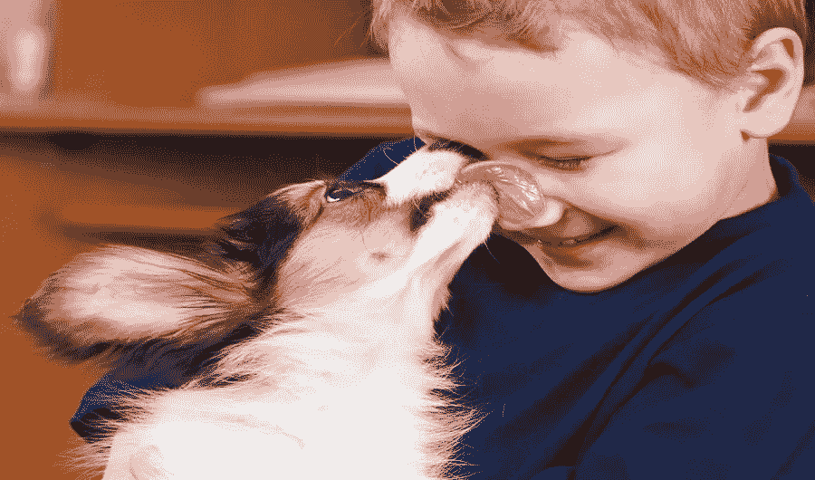
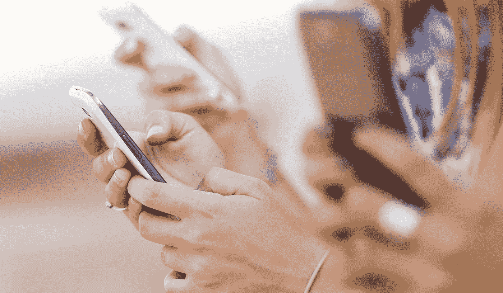
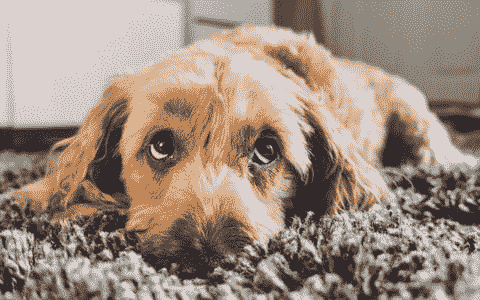

# 智能手机一代的小狗眼睛

> 原文：<https://medium.com/swlh/puppy-dog-eyes-for-the-smartphone-age-53ab8b3fec33>

## 一项新的研究发现，狗会用“小狗的眼睛”来试图与人类交流。这是一种后天习得的行为，是与人同居 30，000 多年的结果。

在此期间，狗已经适应理解基本的命令，并通过面部表情来传达信息。迷因友好的“小狗眼睛”只在有乐于助人的人在的时候使用，但从来不会在狗独自一人的时候使用。

任何在接收端的人都会知道，眼睛通常有预期的效果。他们知道我们的弱点。

# **可爱，但那又怎样？**

嗯，[另一项研究](http://www.sciencedirect.com/science/article/pii/S0003347210001478?via%3Dihub)发现，在空间意识测试中，家犬的表现明显优于其犬科兄弟狼和澳洲野狗。

狗狗们被要求绕过一个透明的障碍物去获得食物，但却很难做到。

家犬、澳洲野狗和狼都是从同一个进化点开始的，但是它们之间的差异已经被前者与人类的同居所标记。

这一区别点，结合研究结果，引起了研究人员的如下怀疑:

> 一旦家犬加入人类，它们可能会失去很多原有的解决问题的能力。

研究也不断出现。在对狼和家犬的比较中，研究人员发现，当狗需要解决问题时，它们会寻求人类的帮助，而狼则不会。

在需要的时候，小狗的眼睛就会出来。

当人们不在身边干脏活时，狗根本无法完成工作。

这并不是说家养的狗不如以前聪明。毕竟，像著名的小狗眼睛这样复杂的形式需要对背景有深刻的理解。

这些也不仅仅是装腔作势；它们是与威廉斯氏综合征[相似类型的基因改造。有人提出，这种超社会性的发展是以狗解决简单问题的能力为代价的。](https://www.insidescience.org/news/rare-human-syndrome-may-explain-why-dogs-are-so-friendly)

还有一个越来越多的共识是，就社会智力而言，狗现在甚至比黑猩猩更接近人类。

[Shutterstock](https://www.shutterstock.com/image-photo/little-dog-licking-boys-nose-72044869)

# 那还是很可爱，但是有什么意义呢？

所有这些研究传达的真正信息是，放弃自力更生对智力有影响。

想象一下没有智能手机的一周。

想象一下，在那一周里，你必须在一个新的城市中穿行，进行一些简单的算术运算，并回忆起亚美尼亚首都的名字。

对许多人来说，这些任务与智能手机密不可分。有了互联网连接和一部基本的电话，所有这些问题都很容易解决。

好消息是，我们还没有长时间依赖技术来进行基因变异。

我们仍然可以使用地图；一个简单的计算可能很费力，但用笔和纸是可行的；而且要求知道亚美尼亚首都真的是相当难得。如果你需要知道，你就会知道。

尽管如此，当我们反复求助于使用技术来找出我们自己可以做的事情时，从长远来看，我们冒着失去一些非常重要的东西的风险。

随着技术的发展使我们的生活变得更加容易，这种可能性变得越来越大。

令人担忧的是，智能手机和互联网是新发明。

然而，我们已经普及了“数字排毒”这样的短语来描述远离人类现代最好的朋友智能手机的强制时期。

Shutterstock

简单的现实是，如果我们不知何故没有智能手机，我们只会选择手动路线，这在当前的背景下永远不会发生。

我们的手机让我们被追踪和锁定，它们是我们履行作为内容和产品的永远热切的“消费者”的角色的媒介。一个人不必是宿命论者，也能看到我们正走向一个连接性更强、速度更快、更依赖手持设备的未来。

# 我们就是我们反复做(或不做)的事情

正如对家犬的实验所揭示的那样，通过社会调节，它们已经丧失了解决问题的能力。

如果说由于我们对技术的依赖，人们会通过代理人走上同样的道路，这是相当牵强的。

此外，说“技术正在让我们变得更愚蠢”是一种极端的简化和无益的说法。这构成了一个夸张的标题(它甚至美化了我的初稿)，但我们需要做得更好。

然而，[本杰明·p·哈迪](https://medium.com/u/5153880ce2ee?source=post_page-----53ab8b3fec33--------------------------------)的文章[“如果你不用它，你就会失去它”](/personal-growth/if-you-dont-use-it-you-ll-lose-it-abe87a3bda94)指出了这个问题的症结所在。

如果我们要确定技术在哪些领域阻碍了我们的认知能力，我们就必须接受流动智能和结晶智能这两个孪生概念。

> 流体智能被定义为解决新问题、在新情况下使用逻辑和识别模式的能力。
> 
> 结晶智力被定义为运用学到的知识和经验的能力。—(Study.com 定义)

这两个类别之间有很大的重叠，随着时间的推移，它们相互影响。我们流动的智力可以用于记忆，而我们记忆的能力可以帮助我们解决新的问题。

人类大脑的可塑性使我们能够建立新的联系和学习新的技能，而这恰恰是导致我们失去我们并不使用的能力的因素。

很快，技术正悄悄进入我们生活的越来越多的方面，并伸出援助之手。

我每天都注意到这一点。

就在我写的时候，拼写检查功能会对每一个错别字翻白眼，指引我找到更合其口味的东西。(尽管我坚持认为，embiggens 是一个完美的词汇。)

我们不需要知道任何事，真的。

**我们需要知道的是在哪里可以找到信息，而这些信息通常很容易找到。**

然而，将手机放在身边会降低我们的智力——[，即使我们不使用它们。](http://www.independent.co.uk/life-style/gadgets-and-tech/news/smartphone-reduce-brainpower-switch-off-cognitive-capacity-brain-drain-report-mccombs-school-a7810091.html)

> 我们提供的证据表明，消费者智能手机的存在会对认知能力的两项指标产生负面影响——可用工作记忆容量和功能性流体智力——[http://www.journals.uchicago.edu/doi/10.1086/691462](http://www.journals.uchicago.edu/doi/10.1086/691462)

一项研究发现，“在 2000 年至 2016 年期间，人类的平均注意力从 12 秒下降到 8 秒”，而另一项研究得出结论称，“持续的多任务处理会降低前扣带皮层的灰质密度”，这降低了我们做出准确决定的能力。

这里有一个与人类长期同居对狗的影响相似的例子。

例如，当我们依赖技术导航时，海马体——我们大脑中基于记忆的部分的所在地——就会受到不利影响。

因此，我们记忆信息的能力处于最危险的状态，这将影响我们的空间意识和解决新问题的能力。事实上，已经发生了。

这些正是家犬现在无法成功的领域；不是因为他们从来不能，而是因为他们已经不再为自己完成挑战。

> 伦敦大学 2008 年的一项研究甚至发现，出租车司机比非出租车司机拥有更发达的海马体

对我们的数字霸主的绝对顺从已经开始在我们的大脑中表现出来，尽管这一趋势还太年轻，我们还无法得出全面的结论。

也许，在完全形成的记忆的地方，我们将发展新的技能，就像狗所做的那样。我们的智能手机可以为我们做艰苦的工作；我们只需要知道如何让他们帮忙。

# 这是一件完全消极的事情吗？

不一定。当然，我们是许多技术发展的受益者，这些技术发展导致了更长的寿命和更容易获得一系列有用的服务。

但是，作为一个技术爱好者，仍然有可能质疑技术是否对我们的体力或智力产生了负面影响。

人们很容易得出这样的结论:我们应该保持足够的警惕，不要在开车时睡着，但就连这句话似乎也将失去意义。我们的自动驾驶汽车很可能会鼓励我们休息，同时安全地将我们送到目的地。

这种可能性并非没有陷阱。有一种被称为[自动化悖论](https://www.theguardian.com/technology/2016/oct/11/crash-how-computers-are-setting-us-up-disaster)的现象，它被认为是许多致命事故的原因。

本质上，自动化悖论表明，我们将生活中更平凡的方面的责任委托给了技术。这导致我们失去了我们曾经拥有的能力；如果技术让我们失望，我们将不再能够履行我们曾经做过的职责。缺乏练习导致我们失去锐气。

孤立地看，这些迹象很难辨别，但合在一起，它们编织了一个熟悉而又有点令人不安的模式。我们越依赖技术，我们变得越没有能力；我们变得越没有能力，就越依赖科技。

确凿的证据表明，我们的大脑正在被技术重新连接，这是一个很难(尽管不是不可能)逆转的趋势。

记忆是个人身份的核心基石之一，尤其受到威胁。

例如，这对我们教育自己的方式有着严重的影响。大多数学校系统依赖于对事实、日期和公式的记忆。

有人可能会说，我们从冷酷无情的事实的暴政中解放出来，这总是可以通过在屏幕上点击几下来实现，这释放了我们的创造力。

这一理论很吸引人，但通过调查发现了它的复杂性。我们如何教会自己更有创造力？如果我们不能相信我们在屏幕上看到的信息呢？

一切都表明，未来的速度会加快，内容会变得“一口大小”，注意力持续时间会缩短。

尽管如此，我们还是有理由保持乐观——但如果我们要主宰自己的命运，就需要有意识的努力。

技术本身不是问题，从来都不是。我们选择使用技术的方式可能是有害的，但也可能是有利的。在线教育为更多的人提供了获取深度资源的途径，而且有大量的应用程序可以帮助我们发展新技能。

因此，我们可以说，通过更好地了解我们希望发展的领域，我们可以建立技术来帮助我们更快地实现目标。

如果没有别的，对我们自己想要的未来提出质疑的练习将有助于保持我们的大脑敏锐。否则，我们对技术的依赖将导致我们失去一些至关重要的认知功能。

我们可能会学习新的技能来代替它们，但不幸的是，我不认为我们能开发出一种像狗发明的那样可爱的新技能。

## 这个故事发表在 [The Startup](https://medium.com/swlh) 上，这是 Medium 最大的企业家出版物，拥有 276，798+人。

## 订阅接收[我们的头条](http://growthsupply.com/the-startup-newsletter/)。

