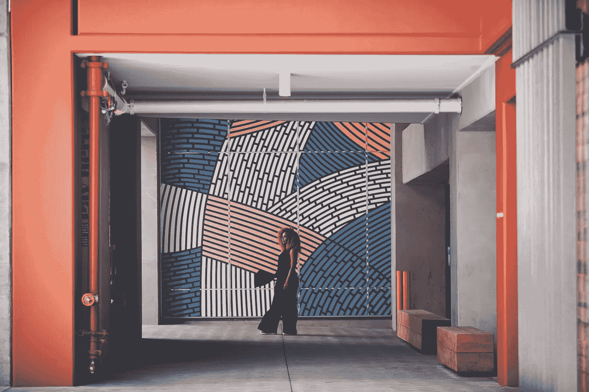

# 把你的想法放出来，让宇宙把它们付诸行动

> 原文：<https://medium.com/swlh/put-your-ideas-out-there-allow-the-universe-to-put-them-in-motion-1f709100fb15>

设计师、视觉艺术家、慈善家惠特尼·阿里克斯访谈

Portrait: [Tom Kubik](https://www.tomkubikphoto.com/patrons-of-progress-portraits)

凭借其时尚、不拘一格的风格、富有感染力的微笑和合乎道德的时尚路线，惠特尼正在改变时尚前沿和社会意识的游戏。

## 做好事对你来说意味着什么？

做好事意味着做一些有益于和提升人类的事情——一些有社会意识的事情。为每个人创造更美好的世界。

## **你会用来描述自己的词语……**

善良，艺术，有创造力。随着年龄的增长，我发现让我快乐并不需要太多，因为我做我喜欢的事情。

## **是什么激发了你的设计创作和你回馈社会的热情？**

我想根据生活经验开发我的设计——我想让我的产品反映我的人生旅程。我想把我世界旅行的布料带到美国。我去过的每个地方都给了我这样的灵感；回馈那些地方对我来说很重要。所以很多公司只拿不回。所以很多时尚线把其他国家的艺术拿来设计他们的衣服，但是他们不回馈。我不同意这种做法，想换一种方式。

我不知道人们是否会喜欢我的设计，但幸运的是他们喜欢。当人们看到你喜欢某样东西时，这是有感染力的——你是在用一种冷静、轻松的方式讲述一个关于布料的故事。

## **你会如何描述你的产品线？**

《反叛公民》讲述了当代人和少数民族的结合；以一种休闲、超级舒适的方式实现现代化。我不想让这条线太严肃——它是关于自由的，而不是结构，它是多功能的。就像“反叛公民”这个名字对我的意义一样——这就是这个品牌应该代表的。

Portrait: [Tom Kubik](https://www.tomkubikphoto.com/patrons-of-progress-portraits)

## **你整个旅途中最难忘的经历是什么？**

最难忘的经历是终于可以用我从线上赚的钱去回馈了。今年是我第一年盈利。一开始总会有损失，因为你要弄清楚人们喜欢什么，不喜欢什么。每年我都有进步。然而，现在能够用我的设计回馈社会才是真正最令人难忘的事情。

## **告诉我们更多关于兄弟会的十字军东征？你是怎么卷进来的？**

兄弟会十字军是一个为孩子们设计课后项目的非营利组织。他们的使命是帮助个人克服阻碍他们追求人生成功的障碍。

这个机会真的落在了我的腿上——我坚信要把你想要的东西放到这个世界上。我说我想在洛杉矶教孩子，我告诉我妈妈，她是巴哈教徒。在巴哈伊教中，你说出你的意图来实现。此后不久，我在一家非裔美国人博物馆遇到一个人，告诉他我的公司和我想教孩子的愿望，他说我应该和兄弟会一起工作。

兄弟会资助教孩子们缝纫的费用(如提供缝纫机、铅笔等)。)，我(通过反叛公民)捐赠布料和说明书。我每周五教 10 -14 岁的孩子。这既有回报又有挑战。

Portrait: [Tom Kubik](https://www.tomkubikphoto.com/patrons-of-progress-portraits)

## 你工作中最有收获的方面是什么？

最有收获的是教这些孩子，同时也了解了自己。真是大开眼界。例如，一名学生说“惠特尼女士，你似乎喜欢白人音乐”。小孩子就是这么直白，让人耳目一新。

## **告诉我们更多关于你在(玩具公司)美泰的工作？**

Mattel 出于诚信工作，关心产品和它们向世界传递的信息。我很幸运，因为我能够为一家拥有与我个人项目类似平台的公司工作——为一个积极诚信的品牌工作。你的日常工作是否快乐真的很重要。找到一份让我开心的工作，这样我就可以在下班后做自己喜欢的事情。

## **有什么重要的建议吗？**

我的建议只是开始。一开始你不会知道所有的事情。你只需要把你的想法放在那里，让宇宙帮你把它放在适当的位置。如果人们不了解你，你必须通过开始来展示给人们看。接受它不会完美的想法。失败得快不如失败得慢。

Portrait: [Tom Kubik](https://www.tomkubikphoto.com/patrons-of-progress-portraits)

在 Instagram 上关注顾客的进展 [@curiositylab](https://www.instagram.com/c_riositylab/)

伦敦赖特-佩格斯的概念+制作，[迈克尔滕南特](https://www.linkedin.com/in/michael-tennant/) + [梅根霍尔茨豪尔](https://www.linkedin.com/in/meghan-holzhauer-29b2733/) //伦敦赖特-佩格斯[的采访](https://www.linkedin.com/in/london-wright-pegs-89282112/) //汤姆库比克[的肖像](https://www.tomkubikphoto.com/patrons-of-progress-portraits)

## 这个故事发表在 [The Startup](https://medium.com/swlh) 上，这是 Medium 最大的企业家出版物，拥有 292，582+人。

## 在这里订阅接收[我们的头条新闻](http://growthsupply.com/the-startup-newsletter/)。

