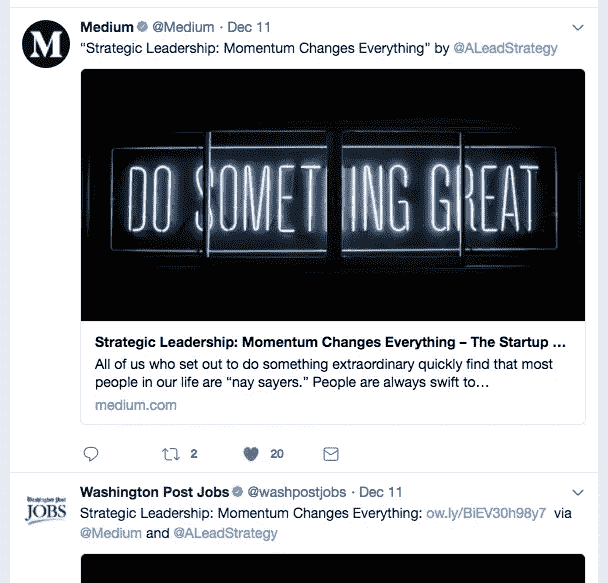

# 让你的文章更有“魅力”

> 原文：<https://medium.com/swlh/putting-more-oomph-in-your-articles-871f9a38bbb7>

你想让别人注意你说的话吗？无论我们是在写文章还是和朋友说话，我们的话语都很重要。通过我们的话语，我们影响着周围的世界；但是如果别人不愿意听我们要说的话，那么我们的话实际上毫无意义。

写一篇能引起读者共鸣的强有力的文章并不容易，但你可能会惊讶地发现，它并没有你想象的那么难。

过去五年来，我一直在研究和思考这个话题。从 2012 年开始在约翰·霍普金斯大学进行为期一年多的全职研究开始，从那以后，我一直在寻找这个答案。我想知道:是什么让我们的话有说服力，我们如何才能让更多的人知道？

我花了几年时间才充分理解这个话题，但我想我已经找到了答案。下面的路线图不仅传达了有见地的想法，还提供了实现这些想法的实用方法。

我没有写太长时间(大约三周)，但是将这种方法应用到我自己的写作中已经让我的文章获得了巨大的吸引力。

我写的第一篇文章被一家拥有超过 25 万订阅者的刊物转载。我的第五篇文章被《华盛顿邮报》和 Medium 员工转发，有超过 230 万粉丝关注。

我这样说并不是为了吹牛(因为我绝不是那种类型的人)，而只是为了表明这种方法是可行的。我希望它对你和对我一样有帮助。尽情享受吧！

# 亚里士多德和伟大媒体文章的路线图

令人惊讶的是，在我所有的研究中，我没有发现比公元前 4 世纪亚里斯多德写的论文《T2 修辞学》更深刻的关于说服的话题了。[1]这部已有 2300 多年历史的著作几乎塑造了关于说服这一主题的所有现代思想，没有人能够取代它。一些作品对其进行了扩展，或者在特定的背景下对其进行了阐述，但没有一部作品取代了它。

用我自己的话说，亚里士多德论证的前提是这样的:

# 我们的信誉很重要

我们写作时需要可信。这意味着要获得他人的信任，我们必须拥有独特的知识或洞察力。这可能来自三个不同的地方:

*   **借来的可信度:**我们研究那些拥有独特知识或洞察力的人说过的话。(例如:我们说“诺贝尔奖获得者詹姆斯·沃森说 DNA 的形状像双螺旋”)我们自己并不是说这句话的权威来源，但我们可以引用某个权威人士的话。
*   **内在可信度:**我们说的东西是内在独特的或者有见地的。我们不需要传达我们的权威来说这些事情，因为任何阅读它们的人都能看到它们的价值。(例如:我们说“设置习惯导致成功的行为”)其他人可以通过他们自己的亲身经历看到这一点的价值，因此，他们会直观地发现我们的话是可信的。
*   **交流的可信度:**我们说的话是由我们个人的研究、分析或数据支持的。当我们这样做时，交流我们如何得到我们的发现使我们成为一个主题的权威来源。(例如:我们说“我从阅读 1000 篇关于……的文章中学到了什么”)我们已经交流了为什么我们有独特的知识或见解。

# 我们给别人的感觉很重要

情感是生命的本质。他们是任何人做任何事情的原因。我一开始并没有意识到这一点，但这完全是事实。有两种方法可以达到他人的感受:

*   **我们必须相信自己说的话:**当我们说自己不相信的话时，别人很快就能看出来。要有说服力，我们必须真诚地相信自己所说的话。

> 以诺贝尔奖得主马拉拉·优素福·扎伊为例，她在塔利班统治下的斯瓦特山谷长大。她因努力争取所有女孩上学而获得诺贝尔奖。15 岁时，塔利班试图暗杀她；她不仅幸存下来，而且今天仍然是这项事业的倡导者。她没有脱离她的信息，她真诚地相信它，当她说话的时候就会表现出来。[2]这就是为什么她的信息如此有力。如果我们想让别人相信我们，我们必须说出我们所相信的。

*   我们必须了解他人的感受:我们不能给予他人感受；我们只能利用已经存在的东西。如果有人经历了挫折、挣扎或问题，作为作家，我们有机会发现并提供解决方案。通过准确描述对方的感受——就像医生诊断疾病一样——我们让他们知道我们理解他们的处境。这通常会为他们打开一扇门，让他们进一步倾听我们要说的话。

> 比如这篇文章开头说“你想让别人注意你说的话吗？”这句话触及了许多作家的一种感受——我们希望每个人都能听到我们说的话。这句简单的话描述了你(和许多其他人)的一种感觉。它引起了你的注意，因此你给了我进一步谈论这个话题的特权。

# 我们所说的很重要

世界上只有这么多的真理，我们都在寻找它们。真理不是被创造出来的，而是被发现的。我们以一种让他人看到其在生活中的应用的方式说话的能力将决定我们话语的价值。

*   **展示其相关性:**我们所说的必须适用于他人的生活。人们专注于对他们重要的事情来度过他们的一天；只有当我们的作品符合他们所关心的东西时，他们才会关注我们的作品。如果我们想让别人听我们的话，那么我们必须向他们展示我们的话是如何有用的。
*   **证明其可靠:**我们必须提供证据，证明我们所说的话会对他人产生效果。观点和事实之间的差异就是证据。当我们通过成功故事、数据或证据展示结果时，人们开始相信我们所说的。
*   **清晰地交流:**我们不需要成为世界上最好的作家，但我们确实需要把我们的信息表达得足够清晰，让其他人能够理解。如果我们做不到这一点，任何方法都行不通。写作是一门需要大量练习的学问。著名的励志演说家金克拉说过:

> "任何值得做的事，都值得做得很差！"他说你必须一遍又一遍地做不好的事情，直到你学会如何做好。[3]在写作方面，这当然是对的，但是如果我们坚持下去，不断练习，永不放弃，我们就会在写作方面变得很棒，就像在生活中我们想做的任何事情上一样。

# 参考

1.  亚里士多德论修辞:公民话语理论。纽约:牛津大学出版社，1991。
2.  《马拉拉·优素福·扎伊——事实》*Nobelprize.org。*诺贝尔媒体 AB 2014，2017 年 12 月 13 日，[http://www . Nobel prize . org/Nobel _ prize/peace/laurents/2014/yousafzai-facts . html .](http://www.nobelprize.org/nobel_prizes/peace/laureates/2014/yousafzai-facts.html.)
3.  “齐格，齐格。”节目#417:任何值得做的事情都值得去做，“Ziglar.com，2017 年 12 月 13 日，[https://www.ziglar.com/show/worthdoingpoorly/#](https://www.ziglar.com/show/worthdoingpoorly/#)

**看看我和妻子创办的这家初创公司，它帮助利用商业作为打击人口贩运的一种方式。我们通过一杯咖啡赋予女性改变世界的力量。公平贸易咖啡杯及制品—**[**allofusmatter.org**](http://allofusmatter.org)

## 这篇文章发表在 [The Startup](https://medium.com/swlh) 上，这是媒体最大的创业刊物，拥有 274，559 多名读者。

## 在这里订阅接收[我们的头条新闻](http://growthsupply.com/the-startup-newsletter/)。

