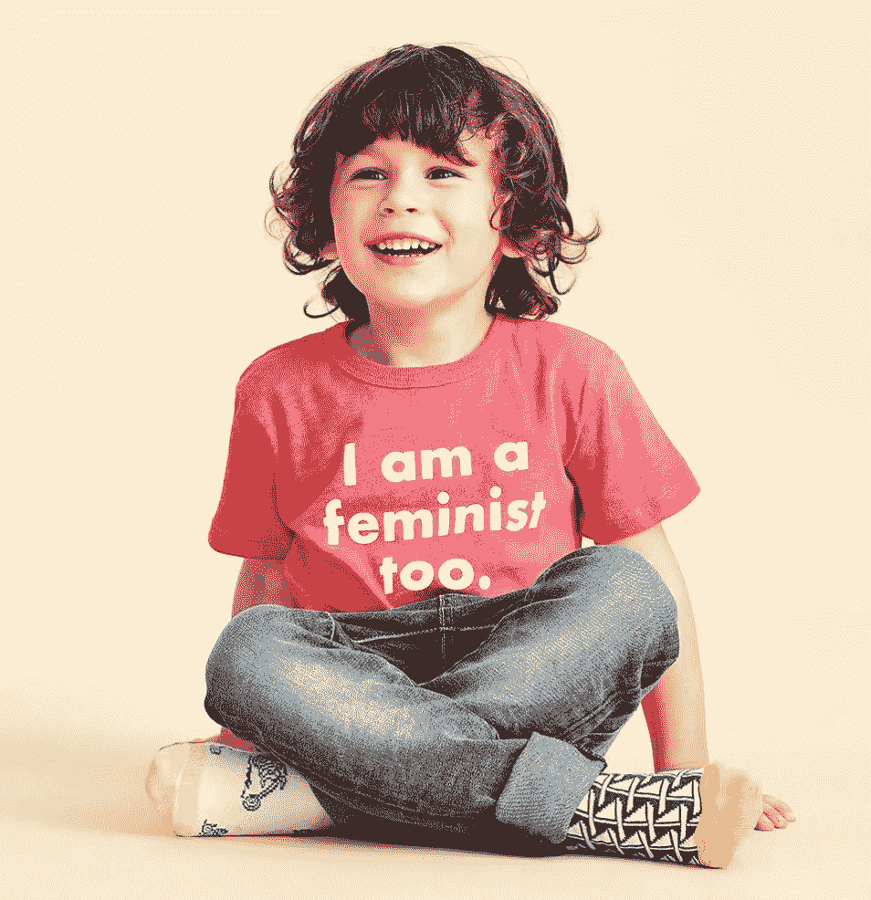

# 把政治强加给孩子

> 原文：<https://medium.com/swlh/putting-politics-on-children-262c20863c8d>

由著名服装公司和专业零售商 J.Crew 制作的广告选择和潜在政治信息引发了一些争议

Photo via J.Crew

在一次明显的营销策略失败中，J.Crew 现在发现自己处于水深火热之中，并处于一场关于其潜在利用儿童促进政治偏见的小争议的中心。

# 人们在谈论什么