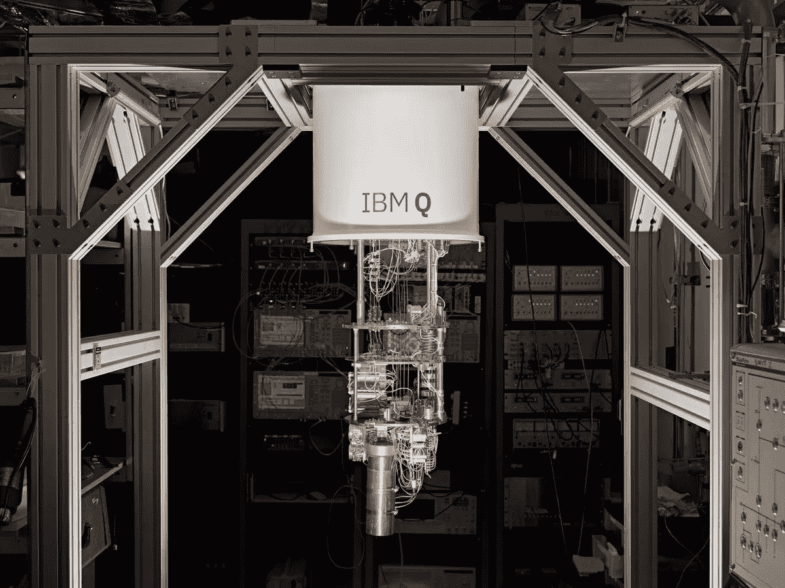

# 量子计算——区块链黑仔？

> 原文：<https://medium.com/swlh/quantum-computing-the-blockchain-killer-3700669af931>

**区块链技术面临的新威胁以及如何应对。**

周末推出的[比特币期货](http://cfe.cboe.com/cfe-products/xbt-cboe-bitcoin-futures)引发了新一轮关于目前威胁加密货币巨头的讨论。既然比特币与传统金融世界有着直接联系，监管者将会迫不及待地将自己的意愿强加于它。CFTC 已经通过代理参与其中，因为他们监管比特币期货交易的交易所。虽然美国证券交易委员会还没有直接参与比特币，但他们最近[已经在加密货币上留下了自己的印记](https://www.sec.gov/news/public-statement/statement-clayton-2017-12-11)。

加密货币社区如此重视监管的部分原因是加密货币的安全性是长寿的关键，因此也是成功的关键。如果监管机构和中央政府能够通过监管或其他手段损害加密货币的安全性，长期可行性将会崩溃。

话虽如此，加密货币的支持者也应该意识到来自其他实体的安全威胁——那些处于类似发展阶段的实体。像加密货币和区块链技术一样，量子计算领域正在走向成熟。

量子计算利用量子力学组件来分析数据。量子计算机使用量子比特(qubits)而不是二进制数字(bit)来存储信息。因此，经典计算机数据点的状态要么是 0，要么是 1，而量子位有一个“叠加”状态，即同时有多个值。结果是量子计算机可以存储令人难以置信的大量数据，并且比传统计算机使用更少的能量。一些量子处理器比目前的同类产品快 1 亿倍。

这与区块链技术和加密货币有什么关系？比特币之类的加密货币使用公钥加密技术。这意味着系统使用成对的密钥来隐藏数据。区块链上的每个人都知道公钥，但私钥只有它的所有者知道。

公钥系统使用复杂的数学将两个密钥联系在一起。这个联系等于一个数的因子，这个数是两个巨大的质数的乘积。因此，要从公开金钥中单独取出私密金钥，骇客必须找出数字的因子，而数字本身就是质数的乘积。因为这些数字太大了，在有生之年破解密码是不可能的，至少用传统的计算机是不可能的。

然而，如果一个黑客或一群黑客使用比当前处理器强大 1 亿倍的处理器，那么只使用公钥来确定私钥是完全合理的。在这种情况下，只共享公钥的区块链是完全可以利用的。

这就是量子计算介入的地方。如果黑客得到了一台量子计算机，他们理论上可以整体入侵加密货币账簿，并控制整个区块链。传统计算机的巨大飞跃对于量子机器来说是一小步？

现在，可以肯定的是，根据《麻省理工技术评论》的采访，这个过程需要大约十年时间。由于加密代码的复杂性、密钥的数量以及区块链技术的发展，加密货币为自己赢得了一些时间。更重要的是，量子计算还很年轻，有许多需要解决的[内部问题](https://www.forbes.com/sites/amycastor/2017/08/25/why-quantum-computings-threat-to-bitcoin-and-blockchain-is-a-long-way-off/%23ef342e288292)。尽管如此，威胁确实在增长。

与此同时，区块链爱好者能做些什么来减轻潜在量子攻击的风险呢？最直接的解决方案是创建量子抵抗分类账。一个[小组](https://theqrl.org/)正在通过一种比质因数分解更复杂的数学方法来产生私人密钥。该协议将使用基于哈希的加密结构来生成私钥，而不是 top 因式分解。在这种情况下，通过计算[强行解决](https://github.com/theQRL/Whitepaper/blob/master/QRL_whitepaper.pdf)是不可能的，而量子计算机可以用传统的区块链来解决这个问题。

另一个选择是开始使用私人区块链。顾名思义，私有区块链与公共区块链的不同之处在于访问权限受到严格控制。参与者必须被邀请加入，并且需要由网络创建者或网络创建者已经实施的协议来验证。在这个意义上，私有区块链本质上是许可驱动的区块链。

这将阻止量子计算机从公钥中确定私钥，因为不存在公钥。然而，主要的贬损者是私立区块链不像公立那样分散和分布。私人连锁店可以利用层级结构，从而为派系和中央集权创造机会。对许多人来说，这违反了加密货币和区块链技术的哲学基础。

幸运的是，加密货币团队和区块链开发者有时间开发和测试解决方案。随着抗量子分类账的创建已经在进行中，量子计算的威胁可能没有最初想象的那么可怕。

我对比特币区块链与量子威胁的看法？因为区块链已经能够在过去的十年里没有任何黑客攻击，所以看起来基础已经非常好了。通过量子计算，即使你黑了 999.999 台电脑，如果只有一台还在用区块链的副本工作(假设是离线的)，那么你就可以检索比特币开始时的一切，并通过网络非常快速地复制/粘贴信息。比特币的发明者为了安全创造了两个密码系统。第一个是椭圆曲线操作，这是一个使用质因数分解数学的单向函数。它确实容易受到量子技术的攻击。然而，第二种加密方法使用哈希算法，即使在量子计算中，我们也没有破解它的算法。椭圆曲线在被声明之前是不公开的。该算法的密钥第一次可用时已经被使用或处理。所以如果有人黑进去，里面就什么都没有了。它几乎什么都不是。

此外，不要忘记量子计算是一个非常复杂的生物，有很多要求…-例如，460 华氏度才能活跃…并且成本不便宜。目前，量子计算机的价格大约是 1000 万美元。

每一个被发明出来的密码算法都有 20 到 30 年的保质期，在此之前很容易被广泛使用的商业技术破解，

这是一场持续的军备竞赛。好消息是，比特币区块链总是可以升级其算法，以抵御量子威胁，并实现抗量子加密。现在，由于这种风险不是一个直接的威胁(也许在 10 到 15 年后，这可能会在商业上有用)，我看不到任何担心的理由。

## 这个故事发表在 [The Startup](https://medium.com/swlh) 上，这是 Medium 最大的企业家出版物，拥有 298，432+人。

## 订阅接收[我们的头条](http://growthsupply.com/the-startup-newsletter/)。

