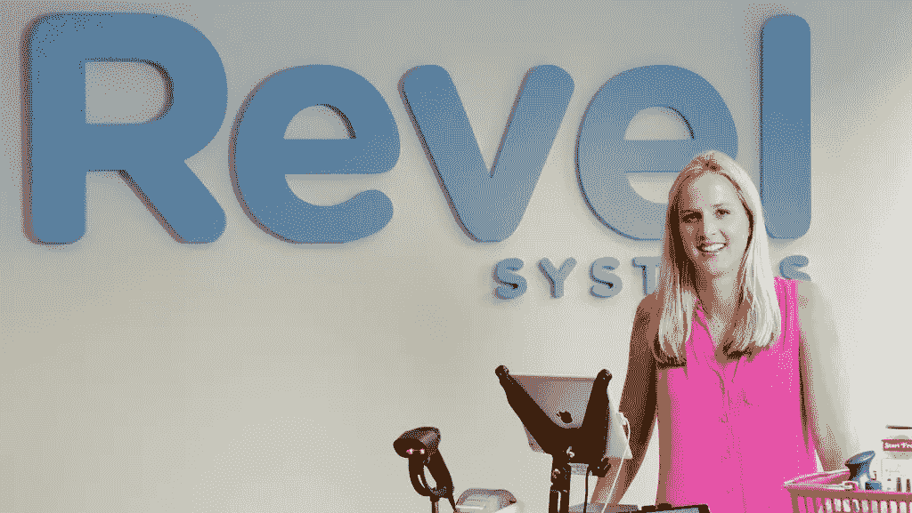

# IT 女王:8 大最新突破

> 原文：<https://medium.com/swlh/queens-of-it-top-8-recent-breakthroughs-e40f1fbc35f9>

随着国际妇女节的临近，详细讨论女性在现代信息技术世界中的角色是很中肯的。考虑到在这个传统上男性占主导地位的领域，女性代表的比例不断增长，这个主题尤其诱人。但是，在一个男人的世界里，试图推进女性事业的第一步要付出什么代价呢？

根据 [500 英里](http://500miles.io/#/home)的研究，如今女性在科技领域的代表在初创公司和[科技独角兽](https://stfalcon.com/ru/blog/post/how-to-make-a-unicorn-application)中占了 30 %以上。此外，与航海业不同，有时人们仍然认为女性在船上的存在会招致灾难，有女性联合创始人的 it 公司似乎在业务上做得更好:根据 2017 年[福布斯统计数据](https://www.forbes.com/sites/victorlipman/2017/04/19/start-ups-with-female-founders-grow-faster/#481efcdb513e)，增长 200 %以上的增长最快的公司有女性联合创始人的可能性高出 75 %。他们是什么样的——里面的女人？让我们来看看最近由女性经营的 8 家最成功的 IT 创业公司。

# 1.希波

Shippo 是一家美国软件公司，它通过 API 和 web 应用程序帮助在线企业和平台整合运输和承运商。它以一种廉价而简单的方式减轻了商家因[发货](https://stfalcon.com/ru/blog/post/transport-logistics-automation-what-is-tms)而带来的巨大痛苦。Shippo 获得了众多奖项的提名，2017 最佳网站奖是最后一个。该公司拥有来自世界各地的约 16，000 名客户。

该公司由劳拉·伯伦斯·吴和西蒙·克罗伊茨于 2013 年创立，是在劳拉开办网上商店时面临的困难中成长起来的。她很快意识到去邮局的时间损失和运输费用是零售商遇到的两个主要问题。因此，他们和 Simon 一起开发了一个运输软件，为小型在线经销商计算最有利的运输选项。这个项目非常成功，自启动以来，他们的业务每年都增长两倍。

但这绝不是一夜成名。劳拉和西蒙创业时，没有任何积蓄，说服投资人也不是一件容易的事。当初创公司第一次筹集种子资金时，他们投了 125 个投资者，得到了 115 个拒绝，这还没有考虑到他们之前面临的无数拒绝。

如今，Shippo 拥有 70 名员工，并且员工人数还在不断增加。劳拉强烈支持公司文化的重要性，认为它是企业的驱动力。她的目标是建立一个世界级的团队。她还关心在公司发展强大的女性同事网络。劳拉认为决心是成功最重要的特征。保持乐观，努力工作，不要放弃——这是她给每一个想发展事业的人的建议。

# 2.坎瓦

[Canva](https://www.canva.com/) 是 2018 年澳大利亚的第一只独角兽，也是 Adobe Photoshop 的主要挑战者。每秒钟在该平台上创建的设计超过 13 个，目前每月下载的印刷设计超过 250 万个。该公司的首席执行官兼联合创始人梅勒妮·帕金斯(Melanie Perkins)是业务达到独角兽地位的最年轻女性。

廉价易用的图形设计平台的想法诞生于 2007 年，当时 Melanie 还是西澳大利亚大学的学生。她和她的团队成员与现有设计软件的复杂性进行了激烈的斗争。因此，Melanie 决定开发一个工具，即使对于不从事专业设计的人来说，这个工具也是可以理解的。这个想法让她踏上了寻找投资者的漫长旅程，最终导致硅谷的重量级人物支持她的公司。

现在，由 Perkins、Cliff Obrecht 和 Cameron Adams 领导的 Canva 已在 190 个国家推出，拥有超过 1000 万用户。它的软件有 100 种语言版本。它提供多种服务，包括专业平面设计师市场以及印刷和递送服务。我们的目标是帮助人们设计任何东西，并在任何地方发布，珀金斯在 CNN 的[采访中提到。](http://money.cnn.com/2018/02/07/smallbusiness/melanie-perkins-canva/index.html)

# 3.五月流动性

[May Mobility](https://maymobility.com/) 是一家创新公司，开发未来[交通工具](https://stfalcon.com/ru/blog/post/transportation-industry-trends):自动驾驶汽车。这家总部位于密歇根州的初创公司由汽车工程师埃德温·奥尔森、阿利辛·马利克和史蒂夫·沃扎尔于 2017 年创立。几个月后，他们在底特律成功试驾了自动驾驶班车。

该团队现在正在向其他城市扩展，拥有一支配备 May Mobility 自动驾驶软件的低速电动北极星 GEM 车辆车队。最近，该公司从包括宝马 I Ventures 和丰田 AI Ventures 在内的投资者那里筹集了 1150 万美元的 sed 资金，用于他们的小型自动驾驶班车。

32 岁的 Alisyn Malek 是 May Mobility 的联合创始人，她曾是通用汽车公司(General Motors)的创新主管。她拥有汽车工程师的经验，曾领导通用汽车 Spark 和 Bolt 电动汽车产品的全球开发团队。2015 年，她因在尖端产品开发和企业风险投资方面的工作，被 LinkedIn 评为 35 岁以下的顶级专业人士。但艾莉森的生活中并不全是科技。她也是底特律当地艺术空间 Corktown Studios 的联合创始人，对创造性艺术和帮助他人发现底特律充满热情。

# 4.Travelshoot

虽然 Canva 的想法是让普通人拥有以前只有精选圈子才能获得的权力，但相比之下， [Travelshoot](https://travelshoot.com/) 的创始人则强调专业方法。这家总部位于澳大利亚的初创公司将游客与全球 80 多个目的地的当地专业摄影师联系起来，并帮助他们以明显比业余智能手机拍摄更具吸引力的方式捕捉记忆。

对于 Travelshoot 创始人兼首席执行官莎拉·皮尔斯(Sarah Pearce)来说，一切都始于 2012 年她和丈夫去纽约的一次旅行。他们的朋友是一名摄影师，他的新网站照片需要模特，并建议他们在日落时沿着布鲁克林大桥拍摄几张照片。这些照片给人留下了深刻的印象，成为旅途中最美好的回忆。这激发了 Travelshoot 的想法:为什么不给游客和专业摄影师一个利用在线平台组织摄影的机会呢？

莎拉和她的兄弟兼联合创始人蒂姆·琼斯一起，花了几年时间在世界各地的不同城市建立和测试一个全球摄影师网络。它结出了果实。在 2015 年全国[鲨鱼池](https://www.tmcc.edu/be-club/shark-tank-competition/)比赛中，莎拉被公认为澳洲最有前途的企业家之一。她一夜成名:在关于就职典礼的电视节目播出后的第二天早上，她的收件箱里充满了兴奋的询问——而该公司仍处于成功的巅峰。

# 5.Revel 系统

Revel Systems 是一个基于 iPad 的销售点系统，成立于 2010 年。它将基于云的技术与苹果 iPad 的移动性相结合，为客户提供了一种简单的支付方式。

Revel Systems 的联合创始人丽莎·法尔宗(Liza Falzone)最初是一名游泳教练。然后，她尝试了几项业务，包括经销巴西泳装和儿童玩具。她的转折点发生在她抬起沙发时椎间盘突出。这次受伤使她卧床将近一年。为了娱乐，Liza 为企业家们创建了一个励志博客。通过她的博客，她认识了未来的商业伙伴克里斯·西亚贝拉。他经常评论帖子，很快他们就成了朋友。到 2010 年，两人决定一起做生意，Revel 就这样诞生了。现在，该公司是销售点市场上最成功的新玩家之一，与 Square 和 ShopKeep 竞争。

丽莎的成就得到了众多著名的[奖项的认可，包括福布斯“值得关注的女性:八大新星”。但是生意并不是她唯一关心的事情。她关心商界的性别平等，鼓励女性从事科技职业。她启动了一个 1 万美元的狂欢学者项目，每年为两名对科技行业感兴趣的女孩提供奖学金。](https://us.money2020.com/speakers/lisa-falzone)

# 6.云耀斑

2018 年[全球最具创新力的公司](https://www.fastcompany.com/most-innovative-companies/2018/sectors/enterprise?utm_content=buffer63d73&utm_medium=social&utm_source=twitter.com&utm_campaign=buffer)之一， [CloudFlare](https://www.cloudflare.com/) 秘密运营互联网，处理所有网络流量的 10%。每月约有 3.9 亿人访问他们的网站，点击量高达 200 亿页，比 Twitter、亚马逊和维基百科加起来还多。它是第一家广泛激活 HTTP/2 服务器推送的公司，这是一种能够更快加载网页和应用程序的技术。该公司还专门保护网站免受 DDoS 攻击。2016 年，它被指派保护当选总统唐纳德·特朗普的网站免受黑客组织“匿名者”的攻击。

CloudFlare 始于 2009 年 1 月哈佛商学院的两个同学 Michelle Zatlyn 和 Matthew Prince 的学校项目。很快就发现它有巨大的潜力。所以，米歇尔和马修搬到了加州，一年后创办了这家公司。米歇尔[记得那段艰难的日子:当他们的同学接受高薪和全覆盖的工作时，他们乘坐 U-Haul 长途汽车一路来到加利福尼亚，自己收拾东西，好几个月没有给自己发工资。](https://www.techrepublic.com/article/cloudfares-michelle-zatlyn-co-founder-cloud-pioneer-limo-driver/)

今天，米歇尔经常被描绘成女性商界最有影响力的代表之一。她被《Elle》杂志评为 2015 年统治硅谷的[女性之一。她是女性在科技领域的坚定支持者，并不断强调女性在 IT 领域可能会做有用和有趣的事情，并取得成功。作为两个孩子的母亲，米歇尔也认为分享平衡母亲和企业家的经验是自己的责任。她说，这是她参与技术多元化运动的方式，并鼓励更多女性加入并留在这个行业。](http://www.7x7.com/elle-magazine-celebrates-10-women-who-rule-silicon-valley-1787172773.html)

# 7.陪伴

[陪伴](https://www.accompany.com/)是一款可以把你的工作日历变成你最重要的工具的应用。该公司由思科最年轻的董事会成员、前谷歌产品主管艾米·常(Amy Chang)创建，可能会成为商界的下一个大热门。陪伴使用[人工智能](https://stfalcon.com/ru/blog/post/5-fascinating-applications-of-deep-learning)和[机器学习](https://stfalcon.com/ru/blog/post/deep-learning-benefits-and-challenges)为你提供一天中你要会见的伙伴的所有必要信息。

Amy L. Chang 获得了斯坦福大学的研究生学位。艾米经营谷歌分析公司七年，使其市场份额从不到 1%增长到超过 70%。在谷歌之前，Chang 在易贝担任产品管理和战略职位。她还在许多公司担任顾问，包括麦肯锡公司、Hubspot、ClearSlide、BloomReach、Origami Logic 和 Datorama。

# 8.佩尔索洛

[Persollo](https://persollo.com/) 是第一个市场内[电子商务](https://stfalcon.com/ru/blog/post/transportation-industry-trends)营销平台，提供从社交媒体帖子、[数字杂志](https://stfalcon.com/ru/blog/post/responsive-ecommerce-sites)和[视频聊天和博客](https://stfalcon.com/ru/blog/post/Houseparty-app-success-story)的点击购买，一步到位。它是由两个在澳大利亚的乌克兰人——Kyrylo medvedeiv 和 Olga Oleinikova——和一个乌克兰神童 Stanislav Prisiazhnuk(公司成立时只有 16 岁)共同创立的。在不到三年的时间里，Persollo 已经将 16 个国家的 750 多家在线企业的转化率提高了 300%,其中包括 New Balance、Marie Claire、Better Homes、Gardens、Cecily Clune 和 Dex。

Persollo 首席执行官兼联合创始人 Olga Oleinikova 的动力来自激励人们做自己喜欢的事情的愿望、对创新的热情以及对商界女性的支持。创办 Persollo 的想法部分受到了她在乌克兰的职业生涯的影响，她在那里通过 TNS Global 为大型快速消费品品牌进行消费者研究。奥尔加认为自己很有创业精神:2012 年，她在没有家人和朋友的情况下来到澳大利亚，仅用了四年时间就获得了博士学位，创办了一家 it 公司，并组建了一个成功的团队。现在，她还在悉尼大学任教，是澳大利亚-乌克兰商会的联合创始人。她是《商业内幕》、《对话》和《基辅邮报》的作者。

# 结论

我们的评论不包括所有成功女性的传记和成功故事。但是我们希望所描述的例子将激励更多的妇女在这一领域发展她们的职业。[Stfalcon.com](https://github.com/stfalcon-studio)祝贺我们[团队](https://stfalcon.com/en/team)的所有女性即将到来的节日，并祝愿她们富有创造力并取得成功！

*原载于*[*stfalcon.com*](https://stfalcon.com/en/blog/post/women-in-IT)*。*

## 这篇文章发表在 [The Startup](https://medium.com/swlh) 上，这是 Medium 最大的创业刊物，有 303，461+人关注。

## 在这里订阅接收[我们的头条新闻](http://growthsupply.com/the-startup-newsletter/)。

