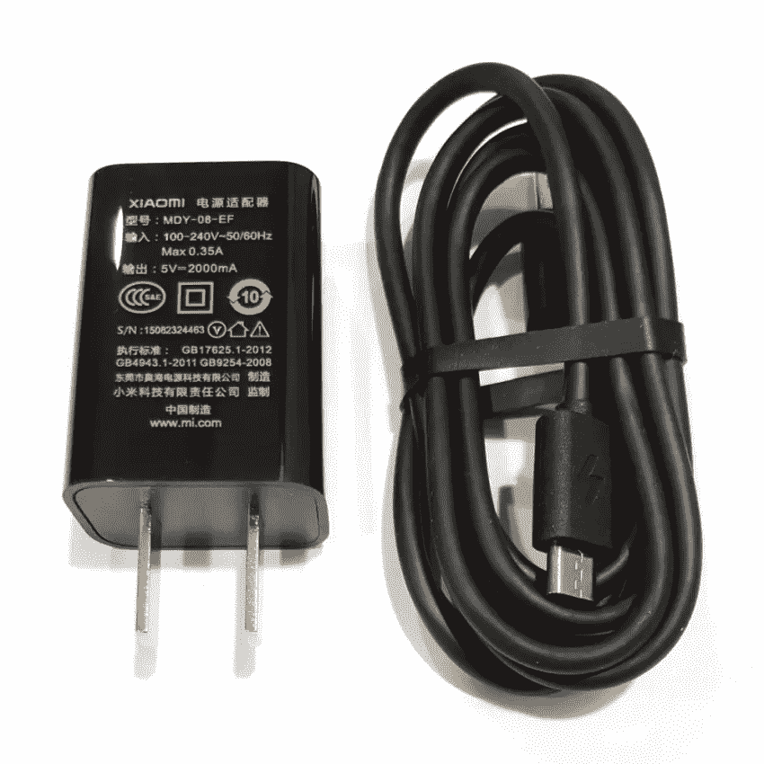

# 寻求快速充电

> 原文：<https://medium.com/swlh/quest-for-fast-charging-5760d982d173>

由[阿洛克·帕马尔](https://medium.com/u/9408b44d35d0?source=post_page-----5760d982d173--------------------------------)和[苏坎特·库拉纳](https://medium.com/u/6d41261644a8?source=post_page-----5760d982d173--------------------------------)

简介
当欧洲议会投票决定在欧洲大陆使用通用电池充电器时，充电器无疑已经成为现代世界的必需品。对于依赖电子产品的一代人来说，充电器是让他们上瘾的药物。印度是世界第二大手机市场，在这样一个国家，印度手机协会计划到 2025 年生产 14.6 亿个充电器，这并不奇怪。

想象一下这样一种情况，第二天早上你必须接受一个电话采访，晚上你插上电话就睡着了。第二天早上你醒来，为面试做准备，就在面试前几分钟，你发现你晚上没有打开电源插头。哇，你只有 15 分钟的时间去面对面试；你准备好了，但你的手机没有。接下来你可以做的是诅咒你的命运，或者想一个充电器，可以在几分钟内为你的手机更快地充电。

考虑到手机是我们生活中不可或缺的一部分，没有什么比一部快没电的手机更让我们焦虑的了，快速充电器是当下最需要的。高性能、低维护、价格合理的充电器是市场的需求。这应该是初创企业创新的金矿。

让我们看看充电器的发展，看看我们是从哪里开始的，并了解一下我们将如何实现超快速充电器。
早期的手机又大又笨重，运行起来耗电很大。许多小时的充电可能导致只有几分钟到一个小时的通话时间。所以，为了让充电简单方便，采用了很多新技术。

随着手机变得越来越小，它们的电池也变得越来越小，但保持电池供电的需求却成倍增长。2000 年，发明家杨文钦申请了一项手机充电器的专利。该设备有一个 USB 接口，一个 DC 转换器和一个移动电话电池充电插头，可以插入电脑以从电脑获得电力。

20 世纪 80 年代，最流行的摩托罗拉 DynaTAC(也称为香蕉手机)使用有毒的镍镉电池，这款手机的充电器在充电 10 小时后只能激活手机约 20 分钟。

当镍氢电池在镍镉电池之后出现时，充电时间显著减少，而且这些电池在单次充电循环中可以让人们通话更长时间。诺基亚 Cityman 900 充电器的正常充电时间约为 4 小时。镍金属氢氧化物，也称为 NiMH 电池，与以前使用的镍镉电池相比，非常轻和薄。此外，充电效率得到了提高，并且由于在制造这些电池时没有使用有毒成分，因此处理这些电池也更加容易。

我们现在正处于经典壁式充电器的时代。经典的壁式充电器使用锂离子电池。可以使用集成电缆进行连接。今天的手机所需的电池被称为锂离子电池。这些电池的功率比老式镍氢电池高 40%。锂离子电池充电时间更短，充电时间也更长。它们比 NiMh 电池更贵，但充电效率更高，充电过程中电池发热更少，这使它们成为镍氢电池的首选。它们也很环保，不用时容易处理。

通过 USB 电缆充电器的电缆，我们不仅可以给我们的手机充电，还可以做多种事情，如数据传输，这增加了它的多功能性。根据充电器的额定值，通过该充电器的平均充电时间约为 3 小时。今天的大多数手机都使用这种技术来充电。这些充电器比以前的版本更加通用

为了满足经常旅行的人们的需求，发明了电力银行。人们可以选择高容量或低等级的便携式电源。与 USB 充电器相比，电源组的充电速度通常较慢，但它非常便携，在旅行时非常有用。

无线充电器技术正在帮助我们摆脱插头和长电缆的困扰。这里使用的技术是感应充电，这是市场上非常新的技术。它于 2013 年推出，但仍然无法在市场上广泛存在。像比撒列 Futura X 这样的无线充电器也比传统充电器更耐用，因为它们防止了电源线通常发生的磨损(由于频繁插拔造成的)。无线充电器可在 2 小时内为您的手机充电，重量通常不到 100 克。我们认为未来将会是无线的，但我们还不确定未来的充电速度会有多快。

在这个拟人化的时代，考虑到生态问题，需要更环保的充电器。依赖可再生能源的现有充电器是否以太阳能电池材料的形式存在更多隐藏的环境足迹还不清楚，但它们在世界一些地区开始受到具有生态意识的千禧一代的欢迎。太阳能充电器是给智能手机充电最安全的方式之一。通过现有的太阳能充电器为智能手机充电所需的平均时间通常为 4 小时。

市场上也有一些快速充电器。高通快速充电技术就是其中之一。快速充电是少数超越标准 5V 2A 充电技术的充电技术之一。一加 Dash 充电器是另一种，与大多数其他充电技术相比，它可以提供大电流来为设备充电。鉴于快速充电的需求，我们认为这将成为一些创新型初创企业的绿色牧场。

这个行业已经走过了漫长的道路，从一个超级笨重的设备到一个光滑的便携设备。当务之急是更好的无线和快速充电器，以及使用比锂更便宜的金属制造的电池。让我们看看未来会发生什么。

— -

关于:

阿洛克·帕玛先生作为公民科学家与库拉纳博士一起工作。

LinkedIn 账户—[https://www.linkedin.com/in/alok-parmar-3412ba57](https://www.linkedin.com/in/alok-parmar-3412ba57)

https://m.facebook.com/alok.parmar1?ref=bookmarks 脸书账户—

Sukant Khurana 博士经营着一个学术研究实验室和几家科技公司。他也是著名的艺术家、作家和演说家。你可以在[www.brainnart.com](http://www.brainnart.com)或[www.dataisnotjustdata.com](http://www.dataisnotjustdata.com)了解更多关于 Sukant 的信息，如果你希望从事生物医学研究、神经科学、可持续发展、人工智能或数据科学项目，为公众谋福利，你可以在 skgroup.iiserk@gmail.com 联系他，或者通过 LinkedIn[https://www.linkedin.com/in/sukant-khurana-755a2343/](https://www.linkedin.com/in/sukant-khurana-755a2343/)联系他。

 [## Sukant khu Rana(@ Sukant _ khu Rana)|推特

### Sukant Khurana 的最新推文(@Sukant_Khurana)。创始人:https://t.co/WINhSDEuW0 和 3 家生物技术创业公司…

twitter.com](https://twitter.com/Sukant_Khurana) 

## 这个故事发表在 [The Startup](https://medium.com/swlh) 上，这是 Medium 最大的企业家出版物，拥有 298，432+人。

## 在这里订阅接收[我们的头条新闻](http://growthsupply.com/the-startup-newsletter/)。

