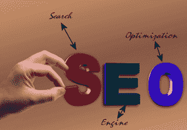

# 你的搜索引擎优化顾问应该能够回答的问题

> 原文：<https://medium.com/swlh/questions-your-seo-consultant-should-be-able-to-answer-40316469da53>

使用搜索引擎已经成为我们日常生活和商业生活中不可或缺的一部分。为了从他们身上榨取最后一滴性能，我们一直在寻找能够处理[搜索引擎优化(SEO)](http://blog.revenuehits.com/blog/seo-experiments-climb-organic-ranking) 的专业人士，以提高我们网站的整体地位，他们的目标流量，关键词，元标签等。最后，并不是 SEO 业务的所有方面都与纯粹的技术细节有关，因为它的性能也会对特定网站内容生成策略的起草过程产生重大影响。因此，挑选一个高质量的搜索引擎优化顾问合作伙伴的过程包括让他们回答一些关键问题，这将有助于你雇佣一个具有你的网站应得的技能和专业水平的专家。

# 在没有水晶球的情况下提问

在不断变化的在线广告趋势的世界中，竞争对手让彼此拿出最有效的 SEO 策略，这将为他们的网站赢得一个恒星谷歌排名。由于这项工作需要及时利用资金和人员，你当然希望只有最好的盟友在你身边。通过向未来的 SEO 顾问提出这些问题来帮助自己，并尝试仔细阅读每个答案，因为在缺乏功能水晶球的情况下，它们是唯一允许你窥视网站未来的东西。

# 1.你打算如何提高我的网站的搜索引擎排名？

首先，SEO 顾问应该诚实地让你了解他们的专业技术，因为透明度是建立高质量合作的第一步。因此，顾问应该能够给你一个关于[为你的网站](https://www.quicksprout.com/2013/04/22/if-i-had-to-start-my-seo-campaign-from-scratch-i-would/)制定的 SEO 策略的概括而又充实的报告。

无论在关键词识别或链接建设方面提出什么策略，你想听到的答案是，顾问明白拥有一个高质量的搜索引擎优化是一个过程，必须从网站的初始搜索引擎优化审查开始。这种方法将允许识别可以立即修复的区域，或者为了解决当前困扰你的网站排名的任何问题。例如，这可以包括处理包含错误或不正常链接的页面。一旦这些最初的步骤都处理好了，你就可以继续改进 URL、页面标题、标签和链接设置了。说到链接，一定要问一个单独的问题。

# 2.你处理链接的策略是什么？

搜索引擎的特点是算法喜欢锁定反向链接。在这种情况下，SEO 顾问将不得不解释他们计划如何为你的网站处理[链接建设过程](https://moz.com/beginners-guide-to-seo/growing-popularity-and-links)，以试图给它应有的排名。这个策略必须从一个前提开始，即反向链接的质量是一个高度可变的类别，就像我们每天在道路和高速公路上所经历的一样。拥有单一质量的反向链接比拥有无数质量较低的反向链接更有价值。

# 3.你和其他利益相关者在页面外 SEO 方面的工作记录如何？

由于搜索引擎优化工作也可以包括离页工作，你的顾问提供的搜索引擎优化策略需要有一个组件来处理你的内容在其他网站上的推广。这是通过与社交媒体合作、参与博客发布或准备公关文件来实现的。现代 SEO 策略应该尝试覆盖所有的基础，与各种利益相关者建立[整体合作](https://www.searchenginejournal.com/outbrain-seo-quiz/210008/)。

首先，你的搜索引擎优化策略师需要证明你理解与社交媒体营销专家以及内容制作者紧密合作的必要性。社交媒体是通过分享向你的网站提供反向链接的天然平台，也是你的内容交付策略有效性的重要指标。

说到内容，检查你的顾问是否理解它在整个 SEO 策略中的重要性是显而易见的，因为它是另一个需要与首要业务目标无缝集成的组件。最后，顾问的搜索引擎优化策略需要包括与公关和品牌专业人士的密切合作，以及与旨在提高您网站/品牌的在线知名度的整体努力保持一致。

图片来源: [Pixabay](https://cdn.pixabay.com/photo/2016/03/29/18/37/seo-1288976_960_720.jpg)

# 4.你有改善本地搜索引擎优化的经验吗？

*全球思考，本地行动*，这可能是一句有点用过头的话，但它在任何 SEO 策略中都有其应有的位置。这对于那些想要提高[他们的网站在与当地相关的搜索中的可见性](https://www.forbes.com/sites/forbesagencycouncil/2017/07/11/15-simple-tips-for-improving-local-seo/#76cb3f261466)的人来说尤其重要，尤其是如果该网站从事任何类型的商业活动。有一个在处理本地化搜索引擎优化方面有足够经验的顾问可以作为他们整体能力的指标。这个人应该能够负责为您的网站提供标签和元描述，这将使它成为搜索引擎的本地列表的一部分，作为特定地理区域的商业目录。

# 5.你使用哪些工具？

当代的搜索引擎优化工具有很多，唯一需要注意的是它们不同的质量。[有些是免费的](https://www.lunametrics.com/blog/2017/01/17/2017-favorite-free-seo-tools/)，有些则需要付费。它们涵盖了 SEO 业务的各个部分，从专用于定制报告和相关指标分析的工具，到用于链接建设和关键字研究的工具。在任何情况下，你的顾问都必须让你相信他们精通完成工作的工具，除非你有个人偏好和经验，使用你认为最适合你的网站的特定软件。这就把我们带到了总结与你的搜索引擎优化顾问的采访的最高问题。

# 6.你将如何衡量你的搜索引擎优化策略的成功？

是的，在这个阶段说说话是好的，但是测试你的顾问在这个领域的勇气需要他/她能够向你展示实施的搜索引擎优化策略实际上可以交付货物。例如，顾问将需要证明他们的努力无疑带来了流量性能的改善，无论是在数量上还是质量上。需要使用谷歌分析等工具来关注网站在搜索引擎排名方面取得的进展，或者吸引流量的链接数量。访问者为了登陆你的网站而使用的关键词也是如此。在任何情况下，让你的顾问清楚地向你介绍他们持续跟踪你的网站的搜索引擎优化性能的方法，并提出你将定期检查数据的时间范围，并确定所使用的搜索引擎优化策略的所有优点和缺点。

# 总结

使用 SEO 策略可以被视为类似于涉足魔术，但它实际上是非常务实的基于策略的工作，具有精确的性能指标，可以很容易地证明其效率或失败。雇佣一个搜索引擎优化顾问需要考虑这两个方面，这反映在对潜在候选人提问的明智选择上。它们应该基于透明度、事实核查和对专业能力的调查。请记住，提出正确的问题和给出正确的答案同样重要。

*最初发表于*[*【blog.revenuehits.com】*](http://blog.revenuehits.com/blog/questions-your-seo-consultant-should-be-able-to-answer?utm_source=referral&utm_campaign=content_distribution)*。*

## 这篇文章发表在 [The Startup](https://medium.com/swlh) 上，这是 Medium 最大的创业刊物，拥有 273，707+读者。

## 在这里订阅接收[我们的头条新闻](http://growthsupply.com/the-startup-newsletter/)。

