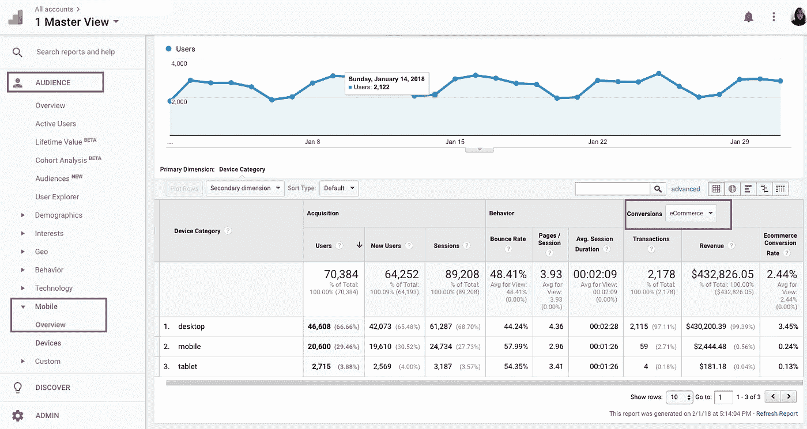
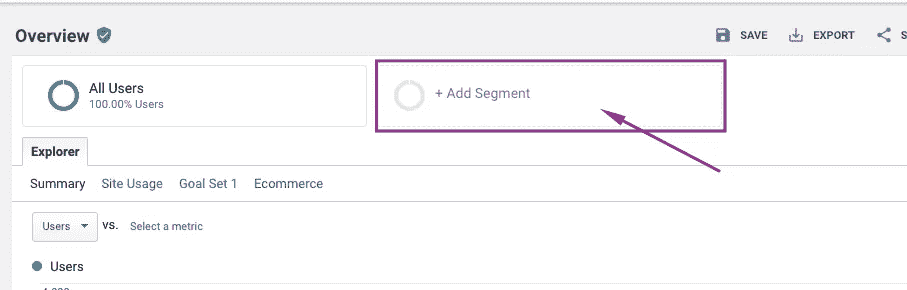
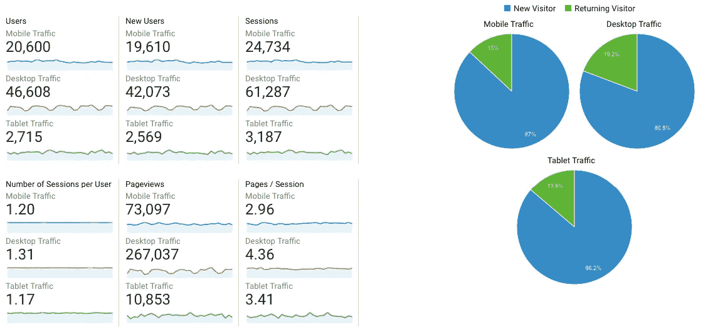
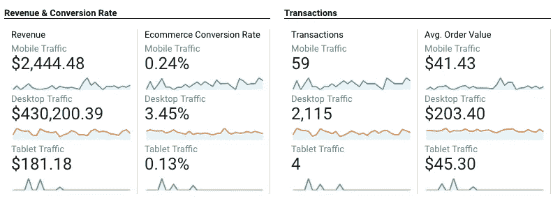
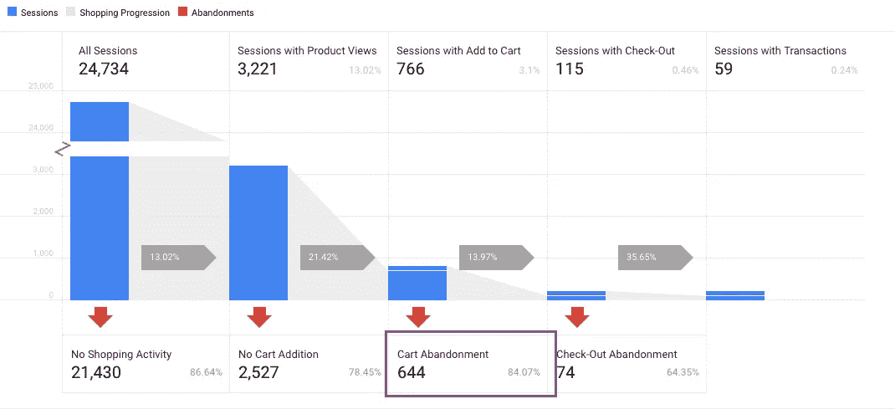
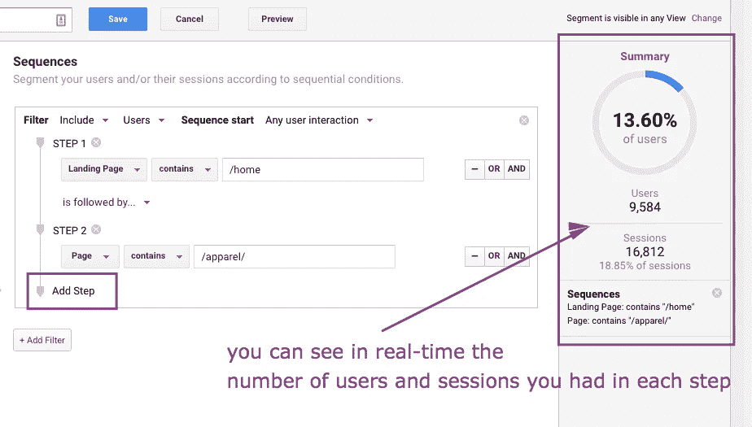

# 为您的电子商务优化转化率—快速介绍

> 原文：<https://medium.com/swlh/quick-intro-into-conversion-rate-optimization-for-your-ecommerce-c7f18070ed88>

管理网上商店时，你总是在寻找从每个顾客身上获得更多销售和更多价值的方法。大约 3/4 的电子商务网站的第一反应是增加网站流量。当然，这是一种方式，但是如果你因为不相关的登陆页面、糟糕的用户体验、破裂的漏斗、不充分的产品信息等等而浪费了将近 70%的流量，那岂不是太可惜了？

你可能会说你的转换率是 4%或 9%或 15%，这比大多数电子商务企业都要高，但事实是你应该一直努力提高你现在的转换率，而不是太关注基准和行业统计数据。你总能比现在做得更好。

也许你正在自己的网上商店开展广告活动，但它们的表现似乎并不像你预期的那样？或者，也许你正在与一个不错的点击付费机构合作，他们确实提供了结果，但他们一直要求更多的钱用于他们的广告支出？为了以最高效和最具成本效益的速度扩展您的电子商务业务，您需要确保您的网站提供最好的用户体验。

不确定具体从哪里开始以及寻找什么？在这篇文章中，我将引导你通过我的电子商务转化率优化过程的一小部分，并与你分享我在几十个网站工作的一些经验。

> **你必须从定义你的业务目标和 KPI(关键绩效指标**开始

思考你未来 3-6 个月的业务目标。他们是为了获得更多的新客户吗？提高你的回头率？扩大你的电子邮件营销？这是具体到你的业务点，将有助于你计划你的优化工作。

谈到电子商务的关键绩效指标，我通常关注以下几点:

# **—电子商务转化率**(公式:交易笔数/用户数 x 100)

重要的是，我们在这里提到的是用户，而不是会话，例如，根据 Google Analytics 的计算，会话不一定是个人及其购物行为的良好定义。当我们在谷歌分析中说用户时，我们指的是浏览器的 cookie。这意味着，如果你从你的电脑上的 Chrome 访问该网站 4 次，并购买一次，你将显示为 1 个用户，但有 4 个会话。因此，你将同一个人视为 4 个不同的人，这将扭曲你对用户行为的理解，以及你应该如何行动。

另一件需要留意的事情是你每台设备的电子商务转换率，以及你在每台设备上获得的流量。我多次看到网站所有者专注于他们的桌面版网站，而实际上，他们在移动端获得了大约 70%的流量，而移动端由于未优化的移动体验而发生了可怕的转变。

你如何找出你对每种设备的转换率？在谷歌分析中，只需选择受众→移动设备→概览，就可以了。确保您在目标部分选择了“电子商务”,以查看您的电子商务转化率。

In this example you can see how mobile devices have 29% of all traffic but bring in 0.56% of all revenue in January

查看每种设备类别的全面指标的另一种方式？从段库中添加段，然后您可以浏览每份报告并查看它们之间的比较。

Click the Add Segment button in the top area of your analytics screen

之后，选择“移动流量”、“桌面流量”、“平板电脑流量”，点击“应用”，您将把这三个细分应用到您的报告中。例如，在我们的受众概览中，您会看到类似这样的内容:

See how your metrics differ from once device to the other and try to identify what could be causing the differences

您应该对浏览器也这样做，并检查您在跨浏览器的转换率方面没有任何异常值。你可能会发现你的结账系统与 Internet Explorer 10 完全不兼容。不查不知道。

# **—平均订单金额** **(公式:总收入/交易笔数)**

为什么平均订单值很重要？首先，它向你展示了你获取客户的成本有多高。在你所做的任何广告努力中，你都会有每次转化的成本或每次行动的成本。如果你的平均订单价值是 50 美元，那么你知道你可以为每个新客户花费 25 美元。这完全取决于你的 COGS(销货成本)、间接费用、利润率等。这个价值也很大程度上受到你的回头客率的影响——我曾经开展过一些活动，这些活动在最初的销售中几乎不赚不赔，因为我知道这些用户会以两倍或三倍的价格再次购买。解决这一问题的 KPI 是客户终身价值，但这本身是一个主题，我将在另一篇文章中讨论。与此同时，如果你想了解这个，我认为[这张信息图](https://blog.kissmetrics.com/how-to-calculate-lifetime-value/?wide=1)是最好的理解方式，而不会感到困惑。

您可以在您的分析的电子商务部分看到您的平均订单价值(确保您的分析视图已启用电子商务)。如果你没有或者由于某种原因不想使用它，简单地从你的销售报告中计算它。一些电子商务平台也在你的仪表盘上为你做这件事，比如 Shopify。然而，你不应该把电子商务数据作为报税的依据，因为你的销售报告中的数据和你的分析中的数据几乎总是有差异的。低于 10%的任何地方都可以接受，超过 10%的任何地方都表明你的跟踪有问题。

This is an example of how the three device segments would look applied to your ecommerce overview in Google Analytics

# **—** **购物车放弃率**(公式:加入购物车的次数/最终购买的次数 x 100)

购物车放弃率很重要，我们将它与电子商务转化率分开来看，因为它很好地表明了我们的购物车性能以及用户对产品、网站、品牌等的信任程度。电子商务转换率向我们展示了所有登陆网站的用户的转换率，购物车放弃率向我们展示了对产品表现出实际兴趣的用户的转换率。

你的产品可能对你的用户很有吸引力，直到他们到达收银台，发现他们需要支付几乎和他们订购的产品一样多的运费。或者他们看到你不接受 PayPal 或 Visa，或者你的支付过程没有适当加密，他们觉得交出他们的个人资料不安全。原因有很多，这就是为什么我们需要审视购买过程中的每一步，并做出相应的优化。

如果您已经安装了增强型电子商务(正确！)你将会看到一份甜蜜的报告，显示你在买家旅程的每一个点，以及在结账过程中的每一个点。同样，如果你有一个 Shopify 商店或使用另一个有增强的电子商务插件的平台，那么你应该可以用较少的努力来安装它，但我强烈建议使用开发者。你做一次，会有点痛苦，但从长远来看，这绝对是值得的。

In the “Shopping Behavior” section of your enhanced ecommerce you will be able to see the drop-offs at each step of the funnel.

如果你没有安装这个，但是你需要在你的漏斗上有一个追溯视图，你可以用手动的方式来完成它。通过为到达漏斗中每一步的用户创建自定义细分，您将能够计算您的下降，并了解您需要首先优化的地方。获取每个步骤的用户数量，然后计算从一个步骤到另一个步骤的下降。

*   所有用户(所有用户，您已经在分析中拥有该细分市场)
*   已查看类别页面(通过正则表达式定义您的类别页面)
*   已查看的产品页面(同样，您可以创建一个序列条件，并查看他们从类别页面到达产品页面，或者离开到达产品页面的所有用户)
*   添加到购物车(最好的方法是在产品添加到购物车时触发一个事件——如果您没有安装 GTM，可以自己解决，请咨询您的开发人员)
*   到达收银台(同样，通过当他们到达收银台时触发的事件。你也可以这样做，因为“页面”等于结帐，但是如果你的结帐有更多的步骤，你必须小心
*   最终购买(感谢页面或活动上的目的地“页面”，取决于您的设置)。

Build a retroactive funnel this way so that you can analyze the past performance of your sales funnel

这在很多方面对你都有好处，但最大的好处是你可以先看到你的网站哪些部分需要关注。你可能会看到人们从登陆页面离开，他们从来没有真正进入下一步。看看你的登陆页面是否与你的流量相关，也许你正在展示鞋子的广告，但是你的用户登陆了你的主页，在那里你正在推销你最新的打折包和帽子。顺便说一句，你真的不应该发送流量到你的电子商务主页。

以下是我在从事的电子商务网站的每个主要步骤中看到的一些重要因素。

**登陆页面**

*   第一个问题是与用户来自的广告无关的内容。

**分类页面**

*   产品图片质量差是转换的头号杀手。如果你的产品图片看起来不好看，没有完整地展示产品，它们就不会引起任何兴趣。
*   过多的混乱会让用户忙于其他事情，而不是点击产品
*   类别页面上没有过滤器——如果你的用户不得不在 500 个产品中寻找他们想要的，他们很可能会放弃
*   产品加载时间长——用户倾向于快速滚动类别页面，因此如果他们在这方面遇到任何摩擦，他们可能会失去耐心并退出
*   不统一的照片——如果您的产品图片有不同的尺寸、布局、背景等。对于用户来说，像在实体店一样浏览会很累，所以他们不会花必要的时间来转换

**产品页面**

*   我不得不再次提到产品图片，因为我刚刚和一个客户一起工作，他的产品和品牌历史令人惊叹，但产品照片却毫无吸引力。结果是，他们在广告上花了相当多的钱，但人们就是不与产品互动。
*   产品信息不足——如果你在卖衣服，你必须提供尽可能多的关于尺码和合身的信息。提及模特照片的大小、尺寸、面料和护理细节。尺寸对于大多数出售的产品来说都很重要，它有助于将它们放在标准尺寸的物品旁边，如椅子、桌子、灯，以及任何与你出售的产品相匹配的物品。
*   模糊的运输细节，如交货时间和价格。根据销售的产品，交货时间会有很大的不同。尽可能地提供免费运输，因为你会惊讶地发现，不收取 5 美元的运费比给价值 10 美元的钱包提供额外折扣更重要。

**购物车页面**

*   显然，信任在这里非常重要。展示你所有的信任印章，加密交易，BBB 认证，以前用户的评论，这是第一波反对意见会出现的地方。
*   用户希望他们的购买是无风险的，所以如果你有退款保证或很好的退货政策，确保它是可见的和容易理解的。
*   另一个让购物车与众不同的因素是改变产品数量的能力。我见过这样的用例，用户必须从购物车中移除所有产品，以便能够添加另一个产品。非常令人沮丧，不用说。

**结账页面**

*   如果购物车是第一波异议，那么结账无疑是异议的海啸。这是你的用户需要拿出他们的钱包，把他们的信息交给你的地方。这是一个非常私人和敏感的步骤，你必须向他们保证这是 100%安全的。使用信任徽章、防病毒/恶意软件扫描、加密、退款保证。不要太夸张，但要足以应对任何异议。

# 关键要点

*   任何好的优化计划都始于对目标和关键性能指标的良好定义
*   总是检查你的实现，永远不要盲目地跟着数字走
*   从识别你的转换漏斗中的主要下降点开始，优化你损失最多的地方
*   细分将帮助您缩小问题范围，更快地找到解决方案
*   只要你留意你的用户在做什么，是什么阻止他们进入下一步，你的转化漏斗的每一步都可以改进
*   A/B 测试你做的每一个重大改变，并根据你自己的情况调整任何框架。有很多最佳实践，但这并不意味着它们在 100%的情况下都有效。

如果您仍然感到困惑或希望其他人为您做这件事，您可以联系我们进行免费、无义务的页面评估，以了解我们如何帮助您实现业务目标。

只需发送电子邮件至 andra@ontrack.agency 或点击我们的[主页](https://www.ontrack.agency/)上的免费评估按钮，我们将在 24 小时内回复您。

## 这篇文章发表在 [The Startup](https://medium.com/swlh) 上，这是 Medium 最大的创业刊物，有 292，582+人关注。

## 订阅接收[我们的头条新闻](http://growthsupply.com/the-startup-newsletter/)。

