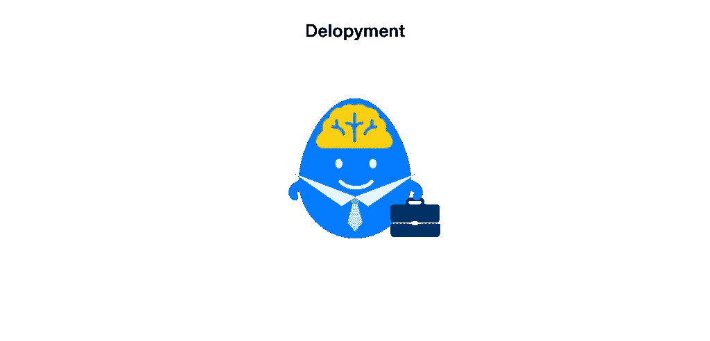

# 面向非技术人员的机器学习快速入门

> 原文：<https://medium.com/swlh/quick-intro-to-machine-learning-for-non-tech-people-d6e14dce459f>

机器学习已经逐渐以不同的方式普及到我们的生活中。例如，你最近从 Spotify 推荐的音乐和网飞的视频。人们一直在谈论机器学习，你可能已经在电视节目、新闻甚至动画中听过几次了。它似乎是解决许多难题的灵丹妙药(当然，它不是😉)

然而，你可能仍然不清楚它到底是什么？这里有一个针对非技术人员的机器学习的简单快速介绍。希望它可以帮助你对它有一个基本的概念，并对机器学习有一个合理的期望，即它可以帮助我们实现什么。

# 什么是机器学习

机器学习是计算机科学的一个领域，它赋予计算机在没有明确编程的情况下进行学习的能力。然后，他们可以应用从现有数据中学到的知识来预测未来的行为、结果和趋势，以解决问题。比如可以用猫的照片训练一个算法来识别猫；同样的算法也可以用自行车照片训练识别自行车，不用改一行代码。

# 两个主要类别

有两个主要类别——监督学习和非监督学习。今天，机器学习的大部分实用价值来自监督学习。监督学习和非监督学习的区别很简单。对于监督学习，您有输入变量(X)和输出变量(Y ),您使用算法来学习从输入到输出的映射函数，以获得 Y = f(X)。您正在尝试了解数据之间的关系。对于无监督学习，你只有输入数据(X)，没有对应的输出变量。目标是对数据中的底层结构或分布进行建模，以便了解更多关于数据的信息。无监督学习就像你给机器一些数据，并告诉它“我不知道那边发生了什么，只是试图弄清楚一些事情~祝你好运！”

# 机器学习过程

简而言之，机器学习项目通常包括 4 个主要步骤:准备、训练、测试/评估和部署。这里打个比喻简单一点:你需要有人帮你做一个任务。然而，你现在唯一的劳动力是一些什么都不知道的人。为了完成这项任务，你需要把这些人送到学校接受培训。然后，毕业后，他们将有能力承担这项任务。

下面一个一个说步骤。

# **1-准备**

***准备教材，挑选你想送去学校的人***

你想使用机器学习是有原因的。启动一个机器学习项目，你需要明确这个原因:你想达到的目标是什么，你想解决的问题是什么。然后，你可以做一些准备工作，包括准备数据和选择合适的算法。

**准备数据**

为训练准备数据集就像准备教科书一样。有这么多的知识，你可以让你的人学习。在他们真正学会之前，你必须在课本上把知识清晰地组织起来，并以一种可理解的方式呈现出来。现实世界中的知识可以是分散的、无组织的。类似地，原始数据通常是嘈杂和不可靠的，可能有许多缺失值。使用这样的数据会产生误导性的结果。为了让数据集为机器学习做好准备，你需要对数据集做一些预处理和清理工作。

**选择算法**

使用哪种算法取决于要训练的数据集；你有多少时间和资源；你想用算法做什么等等。每个算法都有自己的天赋领域，有的擅长处理图像，有的擅长处理自然语言……世界上的算法数不胜数，新的算法频繁诞生。你需要根据不同的考虑来确定最合适的。

# **2-训练**

监督学习的训练过程就是算法从数据中学习的过程。根据您想要解决的问题以及您选择的数据集和算法，算法可以学习如何做一些简单的事情，如识别一只猫、决定一个句子是肯定还是否定，以及复杂到决定贷款的欺诈风险等。

# **3-测试/评估**

现在你已经训练好了你的算法。但是你不知道它是否真的学会了你想让它们做的事情。那你会怎么做？在学校，学生将参加考试。同样，在机器学习项目中，需要使用一些测试数据集来测试/评估经过训练的算法。如果测试结果不满意，就像学生考试不及格一样，需要重新进行培训。

# **4-部署**

现在，经过所有准备、训练和测试的艰苦工作，您的算法已经准备好接受任务并为您创造价值！它可以作为 web 服务部署，放入应用程序中，等等。就像任何其他非机器学习项目一样，在我们完成了核心部分的工作后，仍然需要做大量艰苦的工作，才能使它真正达到生产水平:-)

当然，在现实生活中做一个机器学习项目要比这个简单的四步介绍复杂得多。有许多问题需要考虑，各种挑战需要克服。这里有一些阅读材料可以帮助你了解更多关于机器学习的知识:

吴恩达的书稿: [***机器学习向往***](http://www.mlyearning.org/) 教你如何做出组织一个机器学习项目所需的众多决策

微软 Azure 的文档 [***什么是机器学习***](https://docs.microsoft.com/en-us/azure/machine-learning/studio/what-is-machine-learning) 一个很好的文档，可以帮助你学习一些机器学习术语。

介质上的博客 [***机器学习的非技术性指南&人工智能***](https://machinelearnings.co/a-humans-guide-to-machine-learning-e179f43b67a0) ，其中包括许多网关，供您自己探索更多关于机器学习和人工智能的内容。

如果你有任何反馈，请留下评论~ :-)如果你能帮助我写更好的博客，我将非常感激。谢谢~

> 其他一些参考资料:
> 
> [【1】](#_ftnref1)[维基百科-机器学习](https://en.wikipedia.org/wiki/Machine_learning#cite_note-1)
> 
> 【2】[什么是机器学习](https://docs.microsoft.com/en-us/azure/machine-learning/studio/what-is-machine-learning#what-is-machine-learning)
> 
> [【3】](#_ftnref4)[准备数据](https://docs.microsoft.com/en-us/azure/machine-learning/team-data-science-process/prepare-data)
> 
> [【4】](#_ftnref5)[算法选择](https://docs.microsoft.com/en-us/azure/machine-learning/studio/algorithm-choice)

## 这个故事发表在 [The Startup](https://medium.com/swlh) 上，这是 Medium 最大的企业家出版物，拥有 295，232+人。

## 在这里订阅接收[我们的头条新闻](http://growthsupply.com/the-startup-newsletter/)。

