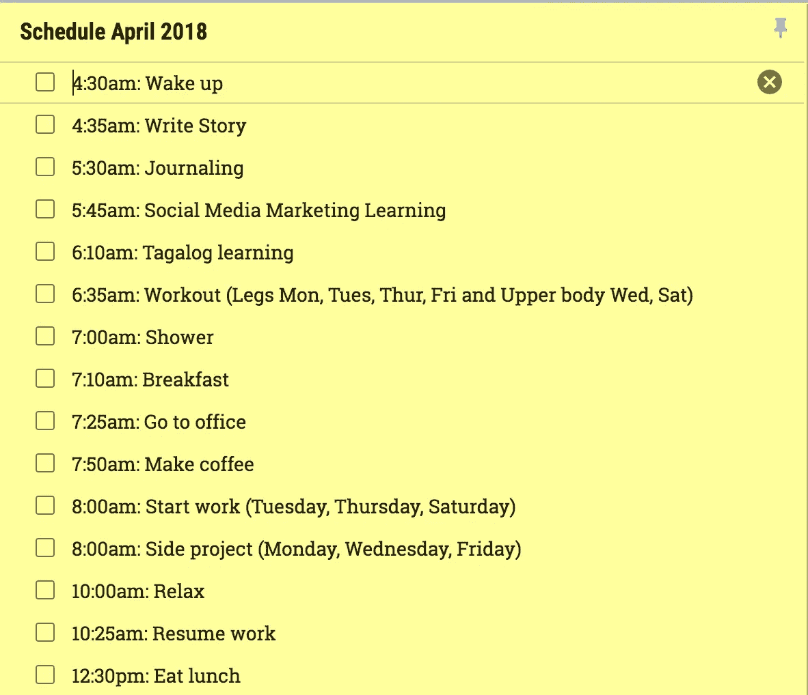
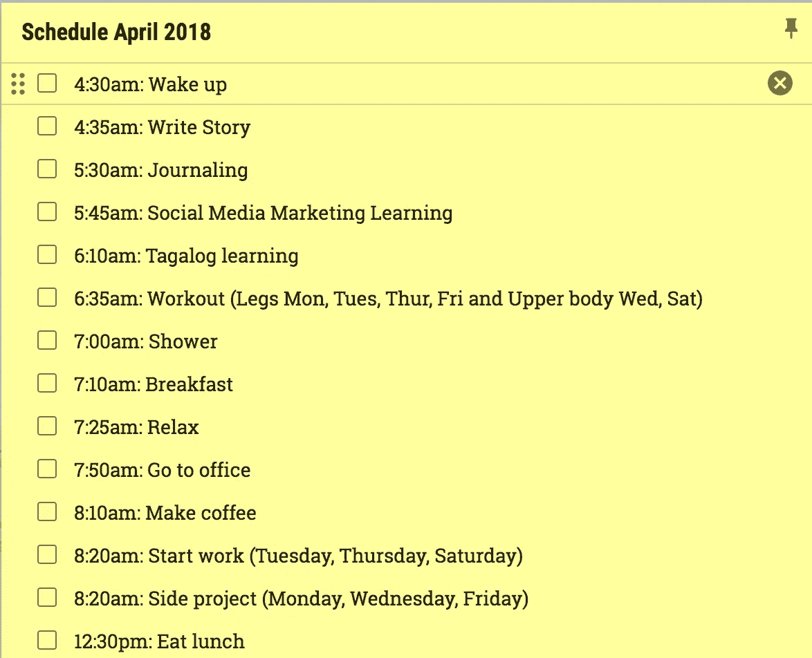

# 当你醒得很早时，如何在白天保持清醒的快速提示

> 原文：<https://medium.com/swlh/quick-tip-on-how-to-stay-awake-during-the-day-when-waking-up-really-early-f950eabe33d0>

Photo by [@chrisjoelcampbell](https://unsplash.com/@chrisjoelcampbell) on [Unsplash](https://unsplash.com/photos/kFCdfLbu6zA)

## 我如何在早上 4:30 醒来，直到晚上 7 点还能保持高效率。

我每天早上很早就醒来，执行我早上的例行公事。

现在，我意识到像我这样的超级早起并不适合每个人，我也不会说服你需要早起才能成功。

> 如果有什么不同的话，我会说起床时间很难成为“成功”的标准。找到/拥有不受干扰的专注时刻，无论是在早上、下午、晚上还是晚上，都是最重要的。

在这个故事中，我将把重点放在清晨，因为 1)这是最适合我的，2)这可能是最常见的，晚上紧随其后。

# 丹尼，你早上的时间表可真够长的！

这句话我已经听过很多次了。或者至少是它的变体。不过，听到这个我一点也不惊讶。以下是我这个月的早晨日程安排:

注意到在我开始工作之前有多少事情已经完成了吗？

这是我不需要通勤上班时使用的另一个变体:

很激烈，对吧？

# 你如何在一天中保持高能量水平？

注意到两个变体的“放松”部分了吗？嗯，就是这样。

我曾经把“小睡”或者“强力小睡”放在里面，但是我发现有时候这并不总是我所需要的，虽然它是最频繁的。

所以是的，我早上会小睡一会儿。有时甚至在开始工作之前。

*   你知道有多少人会这么做？
*   听起来有点疯狂，不是吗？

好吧，回顾我生命中最有成效的几个月，尤其是在早期锻炼时，总是在我的核心工作之前或之后不久小睡一会儿，我才能够更容易地进入心流状态。也许不是在午睡后，但肯定是 15-20 分钟后。

# 结论

所以这是我给你的小提示:

> 在开始最艰苦的工作之前，小睡一会儿或放松一下，你整个上午都会处于最佳状态。

我看到了令人震惊的结果。一旦你掌握了强力午睡(这是一种技能)，就把它变成你的优势，不仅仅是在早上，而是在你需要恢复精力的任何时候。下午我会睡第二个午觉。

所以你有它。如果早起是你想做的事情，但是因为害怕白天没有足够的能量而很难醒来，试试这个建议吧。记住当你的闹钟响起时，这不是你一天中唯一睡觉的时间。

这需要习惯，但是一旦你掌握了它，你一整天都会很有效率！

你能做到的！

**感谢阅读和分享！:)关注我更多类似的故事！**

要获得生产力方面的更多帮助，请访问 dannyforest.com 的。

## 这篇文章发表在《T4》杂志《创业》(The Startup)上，这是 Medium 最大的创业刊物，有 314551 人关注。

## 在这里订阅接收[我们的头条新闻](http://growthsupply.com/the-startup-newsletter/)。

