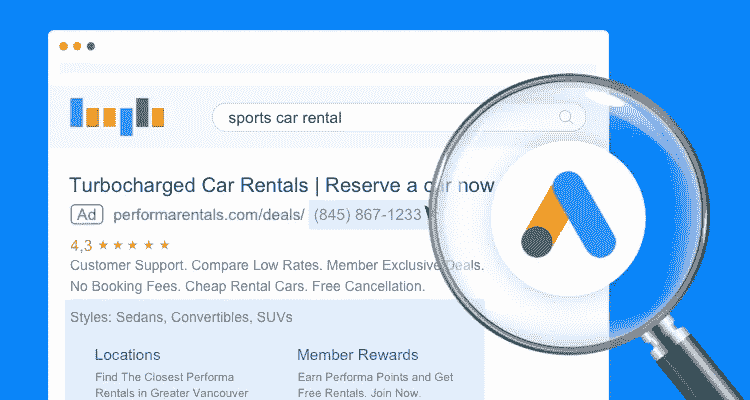
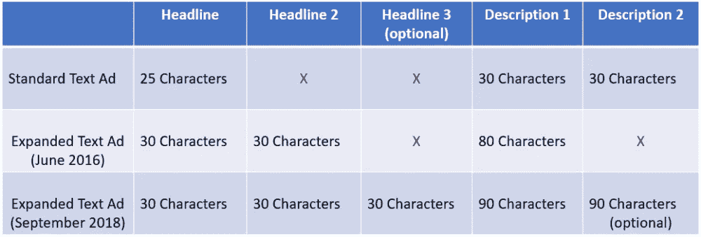
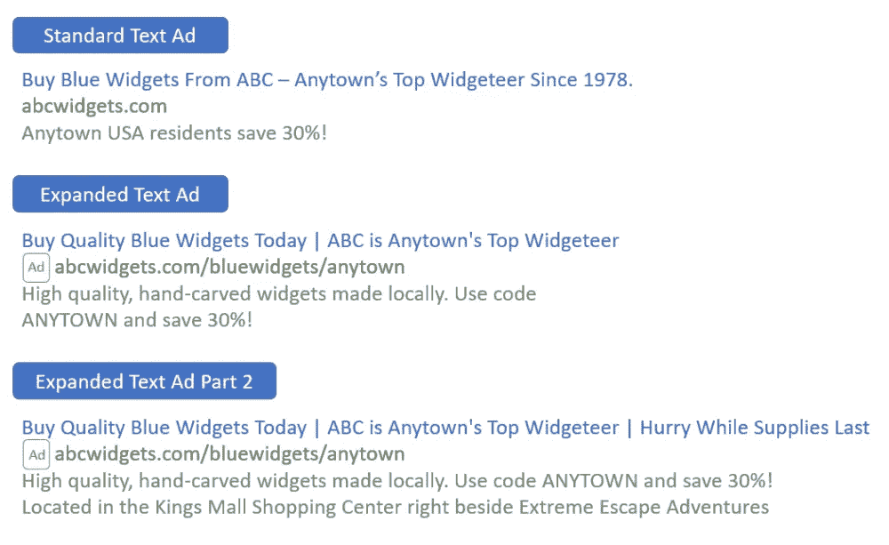
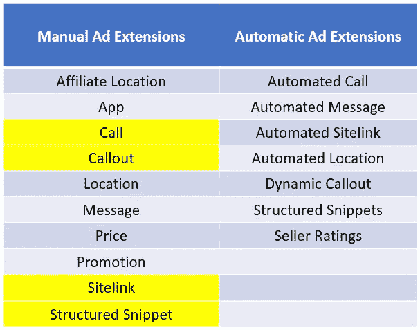
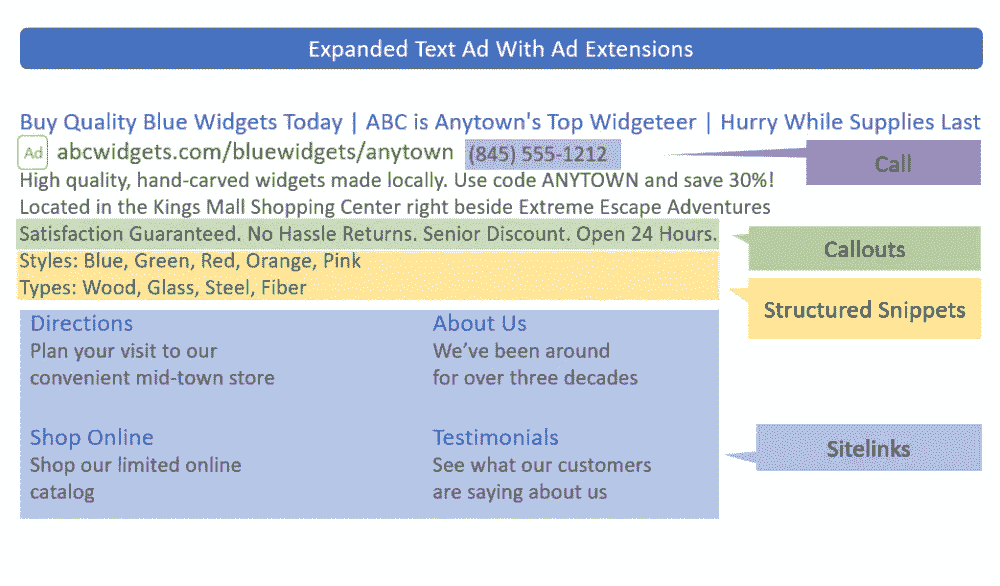
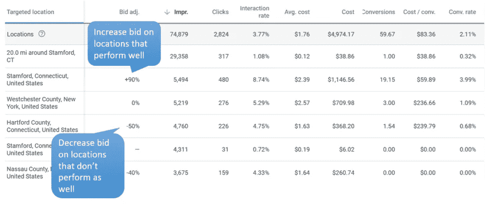
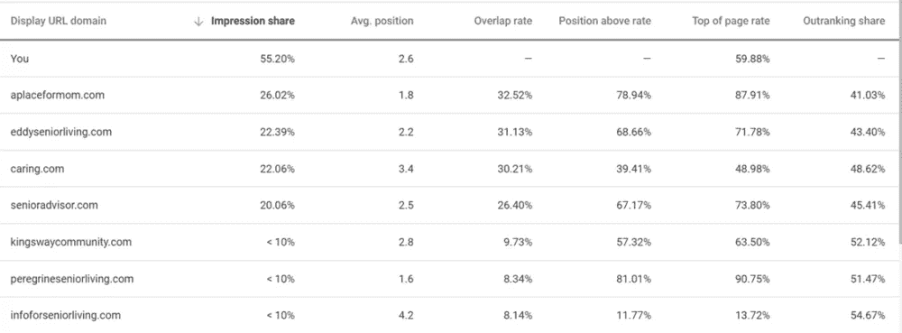

# 让你的谷歌广告从竞争中脱颖而出的快速方法

> 原文：<https://medium.com/swlh/quick-ways-to-make-your-google-ads-stand-out-from-the-competition-a91bd9005323>

*由* [*瑞安·古尔德*](https://unbounce.com/author/ryan-gould/) *担任，发布博客撰稿人，战略副总裁&营销服务于 Elevation B2B 营销*

谷歌广告为这个搜索引擎巨头带来了数十亿美元的收入，但是你的收入呢？

在这个竞争激烈的——让我们面对它吧，混乱的——环境中脱颖而出对广告商来说是一个巨大的挑战，尤其是如果他们刚刚起步的话。毕竟，搜索结果页面上的空间有限。

随着我们进入 2018 年假日季，**是时候好好审视一下你的陈旧广告了。是时候给他们注入新的活力了。**

考虑到这一点，以下是专业人士用来在竞争中脱颖而出的特征:

# 最新的扩展文本广告

谷歌在 2016 年通过引入扩展文本广告(eta)使他们的标准文本广告变得更大。字符数的增加对广告商来说是一个福音，因为它使信息能够反映更多的广告商的关键动机。

尽管谷歌直到 2017 年 1 月才要求他们转换，但专家们立即接受了这种新格式。即便如此，广告商仍可以继续发布标准的(较短的)广告，但他们不能编辑或推出新的广告。

有些人犹豫了，但与那些立即转向新形式的广告客户相比，那些转换缓慢的广告客户处于劣势。因为 eta 被证明比标准广告有更高的点击率(CTR ),所以干将们最终获得了巨大的领先优势。

(好的点击率=好的质量分数=更低的每次点击费用=更好的广告定位。)

> 现在你又有这个机会了！

[8 月](https://support.google.com/google-ads/answer/7056544?hl=en)，Google 进一步扩展了他们的文字广告格式——*扩展*扩展文字广告？—但是利用这些新的字符限制仍然是可选的(提示:您应该使用它们)。

扩展文本广告的最新版本在所有文本栏中引入了第二个标题和更多字符，使得文本广告更加突出。以下是最新消息:

*   最多 30 个字符的附加可选标题
*   附加的可选描述行
*   两个描述行现在最多可以包含 90 个字符(从 80 个字符增加到 90 个字符)

这是三种广告形式的比较:

Google’s expanded text ads give you more space to connect with prospects.

这些较长的字符数听起来可能不多— *哦，天哪，还有十个字符*！—但它们加起来会对你的广告外观(以及如何转化)产生重大影响。自己看看这三种类型的广告是如何并排比较的:

An example of how these ads appear in the search results.

新的 ETAs 比原来的“标准”格式多 218%的文本。正如所料，搜索专家已经在更新他们的广告，以利用最新的变化——这次你也应该这样做！

尽管额外的标题和描述不会一直出现，但它们会让广告本身变得更大，从而帮助你脱颖而出。第三个标题也给你额外的 30 个字符，在你的广告顶部突出显示蓝色文字。

# 广告扩展

广告扩展是用户可以添加到广告中的可选文本片段。早在 2009 年，谷歌就推出了第一个扩展——site links。这些短链接出现在广告下方，将搜索者引向广告商网站的不同页面。

但是为什么就此打住呢？现在**有十种不同类型的手动扩展和六种自动扩展**，广告商可以用它们来吸引更多的点击:

Google ad extensions are free to implement and often improve your ad’s CTR.

平均而言，**一个广告的点击率有潜力每扩展**[**10–15%**](https://support.google.com/google-ads/answer/6167131?hl=en)。除了增加功能之外，扩展还增加了布局的表面积，并且可以自由实现，所以它们是显而易见的。

尽管每个广告扩展都有潜在的用处，但有四个(上面用黄色突出显示的)是你**必须**使用的(如果你还没有)。这是因为它们很容易实现，而且它们允许你展示关键的激励措施和关于你的企业的信息，否则这些信息会占据有价值的广告文案。

## 1.网站链接

站点链接是有价值的，因为它们允许你深入链接到你的站点。与您的广告相关的站点链接数量从 2 到 8 不等。一个很好的技巧是为每个站点链接创建专业的登陆页面，这些页面是面向目标的，并且是为链接定制的。您也可以在广告组级别定制站点链接，使它们与特定搜索更加相关。

> **专家提示:**[Unbounce Builder](https://unbounce.com/ppc-landing-pages/?utm_medium=referral&utm_source=medium&utm_campaign=blog-post-ryan-gould-google-ads&utm_content=lp-ppc)是一款优秀的工具，可以快速创建与你的广告站点链接相匹配的登陆页面。

## 2.插图的编号

每个标注扩展名最多可包含 25 个字符，并且不可点击。他们宣传你的业务的特点、优势和卖点。这也是一个很好的方式来突出你的业务的具体品质，你没有空间在你的主要广告文案中展示。例如， *250 个五星评价，5 个便利的位置，所有信用卡都被接受*等等。

## 3.呼叫分机

呼叫分机可以添加电话号码，而不会浪费任何主号码。在移动设备上，呼叫扩展允许人们点击一个按钮直接呼叫您的公司。实施呼叫扩展既快速又简单，因此您应该将它们包含在所有适用的广告中。

## 4.结构化片段

这个扩展让用户可以选择在他们的广告下包含一个产品或服务列表。结构化片段包含类别标题(例如，服务)，后跟项目列表(例如，宠物美容、宠物看护、狗训练、脱毛)。

使用所有这些片段是区分你的广告和竞争对手广告的好方法。你也可以变得有创造力。例如，如果您是一个 B2B 数据库主机，您可以列出您的服务中包含的功能(例如，云自动化、高级安全性、易于使用的数据浏览器)。

不过，值得注意的是，当谈到你可以选择的类别时，你只能选择谷歌的预设列表。片段类别(标题)的完整列表可从[这里](https://support.google.com/google-ads/answer/6280012?hl=en)获得。以下是基于不同示例的其他一些结构化代码片段示例:

*   便利设施:免费 WiFi、桑拿、提前入住、礼宾服务、欧式早餐
*   品牌:城市衰败、bareMinerals、倪克斯、Tarte、Too Faced
*   课程:金融培训、投资银行、商业经济学、筹资

**使用一些可用的扩展可以创造更多的机会来吸引潜在客户的注意力。**它甚至可以将你的竞争对手推得更低！

下面是一个例子，展示了如果上述所有扩展名同时显示，广告会如何出现:

An ad with structured snippets, call, callout, and sitelink extensions enabled.

> **专家提示:**并非所有的广告扩展都会一直出现，它们在移动设备和桌面上的出现方式也有所不同。谷歌的系统试图将最合适的扩展匹配到最相关的搜索。

# 地理定位和其他重要设置

实现广告扩展和最新的 ETA 格式肯定会给广告商带来更多的点击。然而，这可能是一把双刃剑，因为(可悲的是)我们大多数人都没有无限的预算。

幸运的是，你可以(也应该)使用一些设置和功能来减少不合格流量的点击。我们要关注的设置是出价修饰符、地理定位、搜索广告的再营销(RSLA)、广告时间安排和负面关键词列表。

## 投标修改量

竞价修正器，或者谷歌称之为的[调整，可以让你根据人们搜索的时间和方式来增加或减少竞价。出价修饰符可以应用于设备、位置、广告时间安排等等。广告商按百分比向上或向下出价。](https://support.google.com/google-ads/answer/2732132?hl=en)

例如，如果你想在移动搜索上更积极地竞价，你可以将移动设备的竞价调整到+30%。同样，如果你想出现在桌面搜索中，但又想为这类点击支付更少的费用，你可以将桌面设备的出价调整为-30%。

> **专家提示:**使用谷歌的报告工具来测试你修改后的细分市场表现如何，并定期调整出价。您可以从 Google Ads 主界面按位置、受众、设备、时间等来查看表现。

An example of locations segment (via Google Ads)

## 地理定位

地理定位不仅仅是在你想要的位置显示你的广告。您还可以通过排除某些位置和地区来优化广告的显示位置。你也可以通过使用出价修饰符来增加或减少你的目标区域的出价。

地理定位通过最大限度地减少不合格潜在客户(例如，服务区外的人、收入低于某个阈值的社区等)的点击来提高您的投资回报率。).因此，花时间进行设置和完善是非常值得的。

## 广告时间安排

也许你周末不营业。也许每天晚上 8 点以后都没有人在操作电话。也许你广告支出的最大回报发生在每天上午 10 点到下午 1 点之间。一旦你确定了一天中广告出现的最佳时间，你就可以使用时间表来选择广告出现的确切时间。当你的预算有限时，这是一个特别好的功能。

## 搜索广告的再营销(RSLA)

再销售不再仅仅是展示广告了！这个功能允许你将搜索广告定位到已经访问过你的网站的人。当他们在谷歌上搜索你竞价的关键词时，你的广告就会出现。您可以将 RSLA 列表添加到现有的广告组中，或者创建只显示广告的广告组，前提是搜索者在您的再销售列表中。谷歌为[提供了建立 RSLA 战役的详细说明](https://support.google.com/google-ads/answer/7068417?co=ADWORDS.IsAWNCustomer%3Dtrue&hl=en)。绝对值得花时间去阅读。

## 负面关键词列表

通过创建[负面关键词列表](https://support.google.com/google-ads/answer/2453983?hl=en)并在账户、活动或广告组层面应用它们，您可以确保您的广告不会被不良关键词触发。新的谷歌广告界面使得创建和分配负面关键词列表变得简单。创建主题列表(如竞争对手、地点、常用术语)，并根据客户绩效或结构进行分配。

> **专家提示:**查看[谷歌的搜索词报告](https://support.google.com/google-ads/answer/2472708?hl=en)，看看人们在看你的广告时到底在搜索什么，然后利用这些信息建立你的负面清单。

# 我们只是触及了表面

**好消息**是你可以(也必须)做一些事情来让你的品牌脱颖而出，并确保它到达最合格的潜在客户手中。

谷歌给了你一些强大的工具来帮助你提高广告的点击率，这有助于更高的质量分数。反过来，更高的分数有助于降低你的每次点击成本，给你更高的印象份额，并使你的广告比你的竞争对手更有可能出现。他们甚至可以帮助你的广告出现在搜索结果的顶部。

不言而喻(但我们还是要说),你应该用不同的广告文案(和扩展)测试所有的广告，然后根据实际表现进行优化。

有效的广告——甚至那些加载了广告扩展的广告——也只是一个好的 PPC 策略的一部分。[登陆页面优化](https://www.elevationb2b.com/blog/marketing-technique/graphic-design/heres-landing-page-stops-converting-visitors-leads)、跟踪、 [A/B 测试](https://unbounce.com/landing-page-articles/what-is-ab-testing/)是成功营销活动的关键实践。设定明确的目标也很重要。

通过查看竞争对手的广告、登录页面和激励措施，了解竞争对手的动向也很有帮助。谷歌的[拍卖洞察报告](https://www.elevationb2b.com/blog/marketing-technique/graphic-design/heres-landing-page-stops-converting-visitors-leads)可以让你看到谁在和你竞价，以及他们与你相比的印象份额。确保你每月或每季度回顾你的竞争数据。它可以帮助你计划和修改你的关键词和广告文案策略。

An example of an auction insights report (via Google Ads)

SEMRush、KeywordSpy 和 SpyFu 等行业工具也提供竞争信息，并使您能够自动监控。它们值得一试——你可以肯定大多数专家都在使用它们！

然而，即使您没有深入挖掘竞争数据，实施上述设置和广告扩展，以及利用最新的扩展文本规范，也将使您在竞争中领先。所以今天就开始吧！

*原载于 2018 年 12 月 13 日*[*【unbounce.com】*](https://unbounce.com/ppc/quick-ways-to-make-your-google-ads-stand-out-from-the-competition/?utm_medium=referral&utm_source=medium&utm_campaign=blog-post-ryan-gould-google-ads)*。*

## 这篇文章发表在 [The Startup](https://medium.com/swlh) 上，这是 Medium 最大的创业刊物，有+399，714 人关注。

## 在这里订阅接收[我们的头条新闻](http://growthsupply.com/the-startup-newsletter/)。

