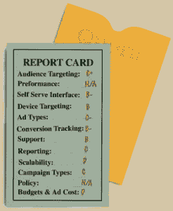
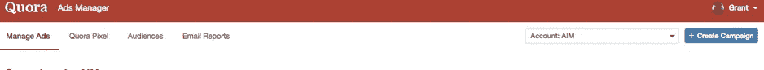
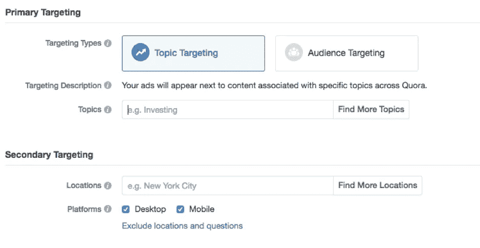

# Quora 广告评论:关于 Quora 广告你需要知道的 12 件事

> 原文：<https://medium.com/swlh/quora-ads-overview-b64c70b4b6bd>

# 你应该利用这个新的广告平台进行多样化吗？

多样化。

不要把所有的鸡蛋放在一个篮子里。变化是生活的调味品。

我们知道这些陈词滥调。

我们被教导要多样化生活中的大多数事情。我们的投资。我们的生活方式。改变你的锻炼。从食物金字塔和你所喝的食物中获得均衡的饮食。我倾向于记住这个建议:我从不只喝一种啤酒，偶尔品尝一种新的朗姆酒。

如果你是一个农民，你会使你的农作物多样化。如果你是一家企业，你会开发一系列产品，并找到多种渠道来销售它们。随着汽车取代了马，你不会想做马鞭生意。一鸣惊人遇上网飞。

但是专业化也是有好处的。通过专注于我们的核心竞争力，我们可以脱颖而出，创造竞争优势。

壁龛里有财富。专注于一个明确的目标市场会比试图过于宽泛获得更好的回报。你不可能取悦所有人，也不应该尝试。

在集市生意中尤其如此。我们不卖玉米片，我们倾向于远离主流。我们在边缘寻找我们的观众，寻找与众不同的想法和建议的人。我们最好的想法天生就是两极分化的。我们采取一种立场，并乐于接受大多数人不喜欢它。但是如果积极响应的人数足够多，我们最终会拥有一个更强大的终身客户。

即使你确实多样化了，80/20 法则(帕累托法则)也可能适用。你可能会发现一两种产品占了你销售额的大部分。一个分销商或商店将产生你的大部分客户。你的大多数购买者将会符合一个核心人口统计。我通常喝 Sol 啤酒和 Flor de Canya 朗姆酒。

折中的办法是“集中多元化”。

数字营销世界也不例外。

邮件没有死。互联网蟑螂仍然是我们在集市的主要销售渠道。

AdWords 和脸书广告是提供大部分库存的首选平台，我们在那里获得了大部分收购。

因此，将大部分预算和注意力投入到这些平台上是有意义的。明智的做法是让专家花大部分时间学习窍门和技术，让你的钱发挥最大效用。专家能够及时了解不断变化的算法和新功能，帮助您赢得更多数字拍卖，并产生更多线索和客户。

但是只依赖两个名字来源是不健康的。上周的 Agora 营销大师 MasterCast 报道了广告平台 slap，以及如果谷歌或 FB(或两者)一夜之间关闭你的业务会对你的业务产生什么影响。Colm 在他关于你最重要的数字资产的文章中把 SEO 和 Slap 相提并论。

我们在 9 月份的“打耳光”网络研讨会上讨论的一个关键策略是多样化。有几种类型的多样化可以帮助脸书和谷歌。首要的一点是活跃在多个广告平台。

有很多成熟的平台试图与“两大巨头”竞争。必应在搜索市场的份额很小，但很重要，尤其是在美国。雅虎可以提供不错的搜索结果。本土广告平台也在升级游戏，像 [Outbrain](https://readyfireaim.eu/paid-search/outbrain-custom-audiences/) 、Revcontent 和 Taboola 等更大的玩家在争夺你的数字广告预算。

这些都是 [Agora 企业](http://theagora.com/)已经证明可以运作的平台。他们值得你的关注和你的一些预算。随着 FB 和 AdWords 的竞争不断加剧，多元化是有益的。不仅仅是准备一巴掌，而是扩大你的收购来源。一些平台也允许不同的创意、策略和产品来吸引新客户。

但是，多元化也带来了挑战。你冒着把自己分散得太开的风险，把你的注意力放在奖励上，浪费预算。当一个新的、未经测试的广告平台上市时尤其如此。

这是我今天要介绍的平台之一。

**Quora。**

他们是数字广告领域的新人。

我和其他人一样喜欢新玩具。但我也对他们抱有健康的怀疑态度。当我还是个孩子的时候，我对这些试图取代盒式磁带和专辑的闪亮新 CD 持怀疑态度。我从来不是第一个排队买最新款 iPhone 的人。我更愿意等一等，让歇斯底里平息下来，然后做出明智的决定。

因此，当一个新的数字广告平台上市时，我会异常谨慎。

但我们在 AIM 的部分工作是开辟一条道路…帮助你做出更明智的决定。所以，我决定为团队做一件事…带着 Quora 兜一圈，看看引擎盖下面。去试水。

几个月前，我写了我对 LinkedIn 广告的试驾。LinkedIn 的广告并不新鲜，但它们经历了重大变革，值得重新审视。

# Quora:问答引擎

Quora 本身也不新鲜。它自 2010 年以来一直存在，并作为一个良好的社区驱动的问答引擎获得了良好的声誉。他们建立了一个“专家”网络，本质上是众包一些问题的最佳答案，如[2017 年在线广告市场将如何变化？](https://www.quora.com/How-is-the-online-advertising-market-changing-in-2017)

Quora 的用户统计数据令人印象深刻。4 月底，他们宣布在过去的一年里，他们的月用户数几乎翻了一番，从 1 亿增加到 1.95 亿。这使得他们介于 Pinterest 和 Twitter 之间。

但他们的用户基础并不像真正的社交媒体平台那样重要。Quora 是一个搜索引擎，而非社交引擎。他们不需要你注册就可以使用，并且每月有超过 2 亿的独立访客。他们最近推出了西班牙语和法语版本，随后是德语和意大利语。

我很少直接去 Quora，但经常在谷歌上搜索时看到他们的结果。这是这个频道最让我兴奋的地方。谷歌对 Quora 内容的排名如此之高是一个好迹象。我们知道搜索意图有多强大。这是在正确的时间向正确的人传递正确信息的绝佳机会……当他们积极寻找的时候。

我的研究发现许多(非 Agora)企业和博客将 Quora 列为他们最大的有机流量来源。并声称这是高质量的，转换生成，交通。但是潜在的容量证明了为 Quora 投入资源的工作和承诺是合理的吗？

可能吧。与 SEO 一样，有机会解决围绕你的品牌和编辑出现的负面评论或问题(和答案)。在 Quora 上搜索，看看人们对你的企业有什么看法。

然而，Quora 仍然相对未经证实。当我在寻找如何有机地使用这个平台的机会时，请关注这个空间。

与此同时，你可能在寻找一种更快、更可衡量的方式来利用 Quora。广告通常是快速获取数字糖的最佳方式。

# Quora 广告评论:引擎盖下的一瞥

Quora 还没有提供广告选项…直到最近。

事实上，他们确实在 2016 年推出了广告，但只是针对少数精选的广告商进行了封闭测试。对于像你我这样的普通人来说，我们必须保持火药干燥。那么，这值得等待吗？

简短的回答是……也许吧。

对任何广告平台的真正考验是结果。你能得到什么样的销量…以什么样的 CPA…你最终能得到什么样的广告支出回报？

老实说，我不能给你任何关于 Quora 结果的重要见解。至少现在还没有。

在 Agora，我们依靠数据发展壮大。我们需要大量的数据来做出具有统计意义的决策。我们并不总是只关注 CPA，尤其是 lead gen(两步)。我们有一些非常酷的报告，允许我们查看下游数据。我们希望看到，一旦新名字进入我们的漏斗，并对我们的电子邮件营销做出回应，它们会如何赚钱。

但是我们也非常善于利用我们的经验和直觉来感受我们认为某件事有多大可能会发生。

我相信 Quora 会被证明是一个不错的平台，但它还有很长的路要走，而且它很可能永远不会成为大公司的有力竞争对手。但我确实相信，它会给你带来一系列额外的、高质量的收购。因此，在没有太多硬数据的情况下，让我们来看看机械原理…深入了解它的潜力和易用性。

# Quora 广告:成绩单

Quora Ads: Report Card

几个月前，我浏览了一下 Quora 的广告。从那以后，他们做了一些小的改进，看起来进展缓慢但稳定。下面是我对 Quora 新广告平台的评论。

**自助服务界面:B-**

对于这样一个新平台来说还不错。它非常直观且易于使用。

你可以[在这里](https://www.quora.com/ads/account)访问它，它看起来像这样:

其工作流程与 FB 相似，这并不奇怪，因为他们的创始人都是前 Facebookers 用户。

添加一个用户来访问你的账户很容易，但是他们需要一个 Quora 账户。

**活动类型:C**

目前他们提供两种选择:转换或应用程序安装。在这里，您还可以设置您的预算和可选的时间表。

**受众定位:C+**

对于这样一个新平台来说还不错。他们提供了一个像素，让你可以重新营销自己的网站流量。否则，目标是使用主题，类似于 AdWords 上的广泛匹配关键字。(如下图)。他们有一个工具，可以让你找到更多的话题来扩大你的潜在影响。他们也有按国家、城市或地区定位的功能。

对我测试的美国目标来说，潜在影响看起来不错。在其他几个地方，这个数字要低得多，但我预计这个数字会增长。

**设备定位:B**

您可以选择桌面、移动或两者都选。

**报告:C**

令人满意。通过电子邮件发送报告的功能很不错。但是，查看单个主题的性能，而不必将它们放入自己的 Adset 中，这将是非常有用的。

**广告类型:C-**

他们目前只提供文字广告。我可以想象他们最终会把这个扩展到图片。

**转换跟踪:B-**

他们提供了两个基于 url 或事件的像素选项(同样，类似于 FB)。

**支持:B**

我还没有用过它，但是他们有一个不错的在线常见问题解答和知识库。

**:D**的预算和广告费用

预算和广告成本是 Quora 新广告平台的一个明显弱点，至少如果你在美国的话。建议的 CPC 出价非常高，许多主题通常在 2-6 美元之间。如果你的目标只是移动，它可以大幅降低这些建议的出价。你可以出价低于建议的范围，但从我的经验来看，这已经导致零印象。你将被置于拍卖中，就像 FB 和 AdWords 一样，并不是最高价的出价总能胜出。我的活动获得的 CPCs 低于我的出价金额，但它们仍然在可能让许多人望而却步的范围内。

对于美国以外的一些地方，大的建议急剧下降。英国和澳大利亚略低。巴西的出价区间约为美国的四分之一。我在阿根廷和印度看到了 10c 以下的出价推荐，主题是“比特币”。然而，潜在的影响力看起来很低。

**扩展性:D**

目前，除了高出价，这可能是它最大的弱点。质量很好，但是目前数量不足。例如，针对美国的“比特币”主题显示每周潜在浏览量约为 80，000 次。在英国，这一比例约为四分之一。换成巴西也才 3000 左右。

**性能:不适用**

陪审团还没有出来，我只用了很少的预算，只是大部分时间在玩界面的机制。我会汇报结果。

**政策:不适用**

他们有非常明确的政策方针。它们相当标准，但我不知道它们的监管或执行有多严格。一般来说，我对这种新的和更小的平台的方法是从我想要使用的副本开始。大多数新平台都相当宽容，可能会给你一个改正任何问题的机会。更糟糕的情况是，如果他们让你关门大吉，无论如何也不会影响你的业务。很可能你可以很容易地创建一个新的广告账户。

**总体评级:C+**

如果你想换个环境，可以花很少的钱去看看或者测试一下。

# 后续步骤

不要放弃 [FB 和 AdWords](https://readyfireaim.eu/services/paid-search/) 。Quora 可能永远也不会成为一个能与大男孩相匹敌的大玩家，但是在你的营销策略中加入 Quora 广告值得吗？尝试一点点，让你的脚趾接触水是有益健康的。当 FB 第一次出现时，没有人认为他们会是一个严重的竞争者。但我们中的一些人受益于先发优势，在竞争中占了上风。

我认为 Quora 会是下一个 FB 吗？不。但这值得测试吗？大概吧。你应该一直寻找其他的收购来源吗？绝对的。

我会继续品尝一些新啤酒。我甚至会继续尝试新的朗姆酒，尽管我知道我可能永远也找不到比我心爱的 Flor de Canya 更好的了。当新的广告平台上市时，我会继续测试它们。

让我们知道你在 Quora 广告上的状态，并在这里分享任何想法或反馈[。](https://www.facebook.com/groups/agoramarketingmasters/permalink/163315624219103/)

干杯，

格兰特·佩里
副出版人
AIM

## 这篇文章发表在 [The Startup](https://medium.com/swlh) 上，这是 Medium 最大的创业刊物，拥有 275，554+人关注。

## 订阅接收[我们的头条新闻](http://growthsupply.com/the-startup-newsletter/)。

