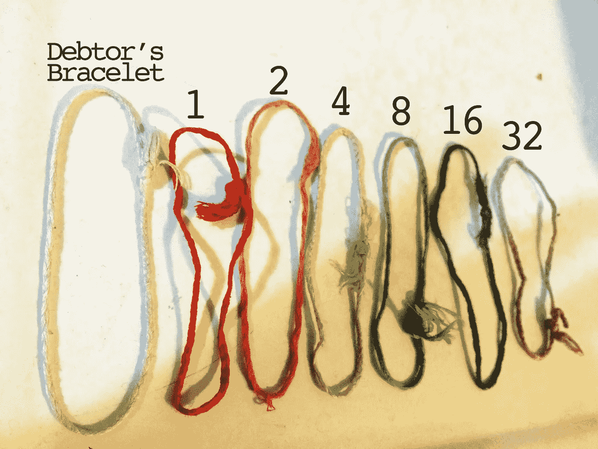
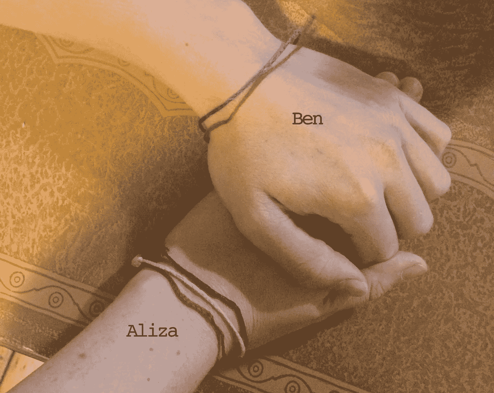
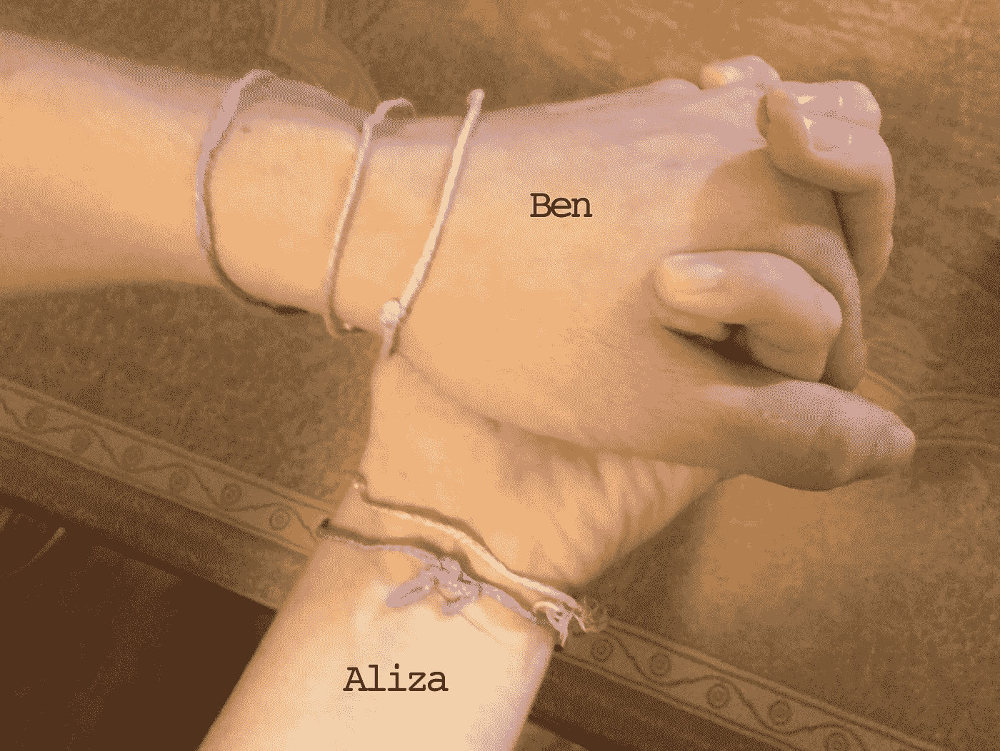
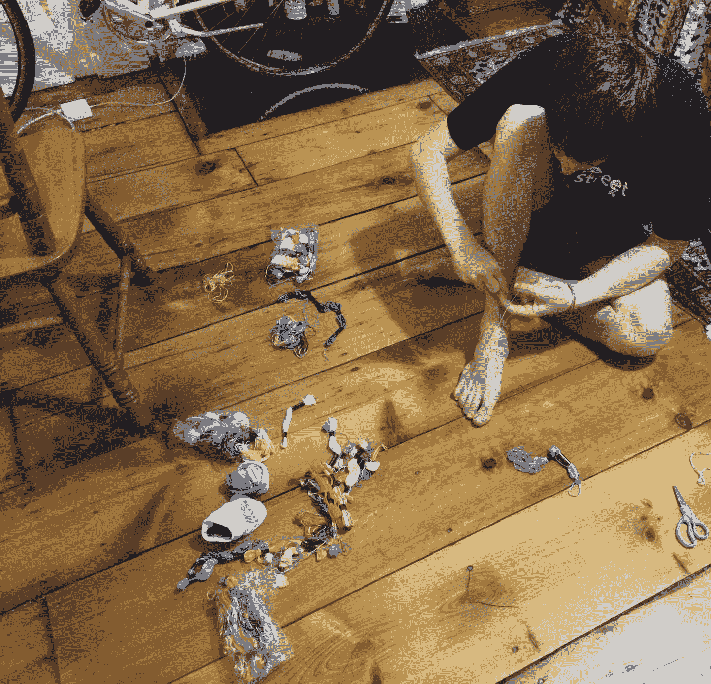
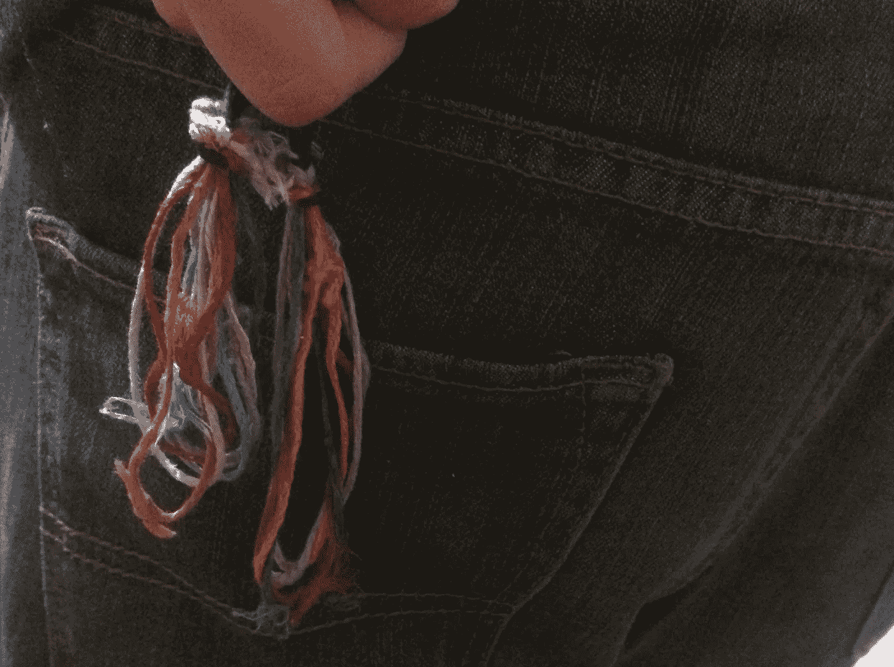

# 彩虹，二元，债务友谊手镯

> 原文：<https://medium.com/swlh/rainbow-binary-debt-friendship-bracelets-24b04caf3479>

## 或者，一对现代布鲁克林夫妇如何时髦而精确地记录开销。

像许多现代夫妇一样，本和我喜欢平摊费用:餐馆、杂货、饮料、出租车，以及布鲁克林定期从我们钱包里取钱的所有其他神秘方式。

与许多现代夫妇不同，我和本用彩虹、二元、债务友谊手镯记录开销。

## 你说什么？彩虹，二进制，债友手环？

我们设计了一个有趣、数学和时尚的系统来记录我们欠对方多少钱。很简单:**我们有代表二进制的前 6 位的手镯，如果你有债务，还会多戴一个手镯。大多数情况下，当我们欠对方钱时，我们会戴上代表欠多少钱的手镯。**

**这个系统是这样运作的。**

我和 Ben 做了 1，2，4，8，16，32 这几个数值的手环，这几个数值是二进制的前 6 位。有了这些手镯，我们可以有高达 63 美元的债务。我们发现这对于我们的常规成本很有效。(对于更大的开销，比如美国国家铁路客运公司或者飞机票，我们绕过了手环世界，彼此只用贝宝支付)。

为了帮助我们记住每个数字对应的颜色，我们使用了 ROY G BIV 彩虹顺序。所以红色= 1，橙色= 2，黄色= 4，绿色= 8，蓝色= 16，紫色= 32。(我们跳过了靛蓝，因为靛蓝到底是什么？有人知道吗？)

我们还有一个白色手镯，当一个人欠另一个人的债时戴上。

我们考虑过一个有珠子的系统，但是不确定在逻辑上我们如何在珠子不使用的时候保存它们。这似乎是形式和功能的完美结合。

除了付款，我们有时会下小赌注。最近，我和本打了一个红色的赌(1 美元)，赌我临产的朋友会生个男孩。我输了。说到红色，如果我只戴了一个红色手镯，人们有时会问这是不是一个[卡巴拉手镯](https://en.wikipedia.org/wiki/Red_string_%28Kabbalah%29)和“卡巴拉手镯是怎么回事？”我不知道答案，所以相反，他们最终学习了二进制。

## **下面是一些二进制的做法！**

1.在这种情况下，我们穿着蓝色和红色，我也有白色。我欠本什么？

On the cool antique table my Aunt Lois gave me

红色=1，蓝色=16。将它们加在一起得到 **17** ！

2.现在本拿到了白色，所以他欠我一个紫色和一个黄色。那是什么意思？

**36** ！你猜对了！

3.**高级:**我提到我们的债务可能高达 63 美元。为什么会这样？

那是所有手镯的总和！干得好，你正在学习二进制。

## 我们遇到的困惑

我们已经向人们解释这个系统将近一年了，出现了一些常见的问题。我将在这里解决它们。

**你为什么不……**

**…只要有一个人欠了钱就戴上手镯？**我们喜欢搭配手镯。这就是“友谊”的一部分。看着我的手腕，知道本也戴着同样的东西，感觉真好。我们有白色的“债务人手镯”来记录谁欠谁的钱。
**…用 Venmo 还是 Splitwise？这些都是伟大的产品，也旨在承担公平分担费用的苦差事，并让它变得更有趣。(这么多寿司表情符号送给我的同事当午餐。)但这里简单回答:本没有智能手机。即使有一天他真的屈服了，我还是更喜欢这种两个人分担很多费用的制度。
**…就用信用卡平摊支票？有机会时，我们会这样做。我们不是不讲道理。但是我们最喜欢的布鲁克林老店，像面条布丁和阳光餐厅都只收现金。如果我们在杂货店或食品杂货店，只有一个人付钱才有意义。
**……就这样权衡付出就称之为好？**我们尝试了一段时间，但我们每晚的晚餐可以从[荞麦面汤面](http://aliza.aufri.ch/tig/5-noodles)到前述面条布丁的多道菜活动。没有一种简单的方法可以在不记起很多东西的情况下，做出取舍，感觉我们实际上已经接近平衡了。这解放了心灵。
**……就像我们其他人一样以 10 为基数算？**这需要更多的手镯。****

不要再这么布鲁克林/书呆子/狡猾了。？是的，是的，我们知道。我们喜欢这样。

## 问完问题了吗？想自己用这个系统？以下是如何做到这一点:

1.找一个对古怪狡猾的财务管理系统感兴趣的伴侣。

2.一旦这个简单的步骤完成，去你当地的工艺品商店，给自己买一包彩色的刺绣线(友谊手链线)。或者从网上订购。

3.决定你希望你的系统支持多少债务。(我们的涨到 63 美元。只需多一个乐队，你就可以增加到 127 美元。)然后选择一个好记的配色。我们发现彩虹非常简单。选一种颜色代表债务人手镯。

4.留出大约一个小时来制作你的手镯。我们做了简单的辫子，但是[如果你想做更复杂的](http://cdn.honestlywtf.com/wp-content/uploads/2011/06/friendship82.jpg)，留出更多的时间。

Ben making bracelets on my floor.

5.把手镯互相系上。在第一个上调整尺寸。你会想要选择一个可以穿的尺码，但是你也可以很容易地脱下来。(我们发现最好在淋浴或洗碗前把它们拿掉……否则它们会变得又脏又湿。)我们发现，如果你握拳，一个好的尺寸是你指关节周围的距离。

6.委托一个人保管手镯。一个人要么把它们放在钱包里，要么一直放在口袋里。

We looped them around hair ties and keep them in Ben’s back pocket.

7.一个人付了钱后，确定另一个人欠多少钱，然后戴上手镯。

那你就可以到处穿了！

A recent wedding. Debt bracelets, on.

试过了吗？做了一些修改？我们很想知道进展如何！

发表于*[**# SWLH**](https://medium.com/swlh)**(***《创业》、《流浪癖》、《生活黑客》)**

******