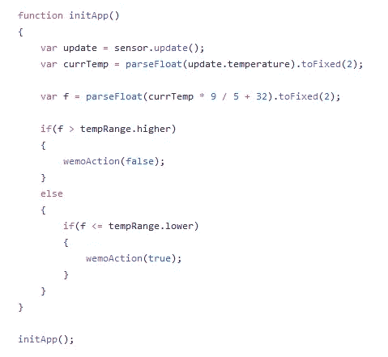

# 用 JavaScript 养育小鸡

> 原文：<https://medium.com/swlh/raising-baby-chicks-with-javascript-5bff92e4f94c>

几年前，我决定开始养鸡。那时我有甲虫、蠕虫、蛇和青蛙；你说吧！但是饲养这些可爱的黄色金块完全是另一回事。

起初，这听起来很有趣。你所要做的就是在网上买一打，然后按照说明去做。但我不知道的是，你的整个经历是由你的雏鸟的存活率决定的。

所以请确保你已经准备好为他们的幸福而努力。做鸡主不容易啊！他们中的许多人就在你面前走进光里。

事实上，掌握光线是养育幼鸟最重要的工具。灯提供持续的热量，调节他们的体温。它必须保持在 95-100 度，尤其是在头两周。

我用普通温度计和热灯养了一打。我注意到有时候小鸡会变冷，抱成一个大球，但在这个过程中会压扁一些。

但是当温度升高时，一些雏鸟会出汗并经常生病。

这一次，我知道控制热量会帮助小鸡度过最初的两周。我必须找到一种方法来控制光线和测量温度。

硬件入侵最简单的方法是使用**无线传感器标签。**它自带 JavaScript 云功能，开箱即用。

你所需要的只是**无线传感器标签(带温度)**和控制灯光的装置。

【https://store.wirelesstag.net/products/wireless-tag 

这是真的，它们非常小，只有 700 英尺的射程和 1 年的电池寿命。我已经用了好几年了。

**无线传感器标签**与 **Belkin Wemo 开关**集成，控制电器电源。

你可以在这里或者电子舱上购买 Belkin Wemo 开关

[https://www.belkin.com/us/p/P-F7C027/](https://www.belkin.com/us/p/P-F7C027/)

两者都有了之后，你所要做的就是将标签管理器插入你的路由器并设置 Belkin **Wemo 开关**，它就可以工作了。

这是市场上最简单的设置之一。

然后，去[http://my.wirelesstag.net/](http://my.wirelesstag.net/)为你的标签管理员创建一个账户。在那里你可以把它和你的 **Wemo 开关**联系起来。点击左上角的 **+关联**按钮即可。

设置好之后，你应该在**无线标签列表**中同时拥有**灯**和**传感器**:

1)现在，点击 **Kumo 应用**来设置你的应用

2)在右上角选择安装

3)点击此图标

4)在搜索中开始输入“**当温度过高时，开启 Wemo，当温度恢复正常时，关闭 Wemo(有延时)**”并选择。我们将使用这个应用程序作为开始。

5)在“**配置 App** 屏幕中选择您的传感器，切换&选择延迟 5。单击应用

Kumo 应用程序列表中应该有一个应用程序设置

7)展开并点击**查看代码**

8)花点时间研究一下代码，你会发现这个程序相当简单。它由两个主要功能组成。**we moaction**&**sensor . temperature cross**

> 所有 **KumoApp** API 调用的详细描述:
> 
> [http://wirelesstag . net/kumoapp/17/tags-kumo sensors-kumo stats](http://wirelesstag.net/kumoapp/17/tags-kumosensors-kumostats)

**sensor . temperature cross**—标签启用过热/过冷监控时执行。该边界被配置为传感器配置的一部分。

该程序然后调用 **wemoAction** 来打开或关闭 **Wemo 开关**。

这应该已经足够好了，但是我发现当 **Wemo 开关**与互联网断开连接时 **KumoApp** 无法按预期工作。支持 **WIFI** 的设备会出现这种情况。

**温度下降**事件会执行，但我的 **Wemo 开关**无法接收该事件。我决定用一种更主动的方法重写这个程序。

我不需要等待来自传感器的**温度下降**回调，我需要让程序 ping 传感器，看看加热灯是否需要打开。

9)继续将以下代码复制粘贴到应用程序中，并点击**创建/更新应用程序**。我将在下面解释它是如何工作的:

10)点击开始按钮！

让我们检查一下代码。

一开始，我添加了应用程序使用的初始属性。

*   **updateFrequencyMin** 是一个非常重要的参数。它表示程序向传感器询问最新温度值的频率。您查询传感器的频率越低，其电池寿命就越长。事实上，在制作程序时，我已经消耗了 50%的电池电量。因为在测试过程中，我每隔几秒钟就要检测一次传感器。
*   **温度范围**是温度范围。小鸡在头两周应该有 95-100 度。之后，每周减少 5 度，直到小鸡一个月大。我把我的设置在 95-98.5 之间。

**KumoApp。Log** 只输出传递给它的最新消息。所以我添加了**console . log**&**console . flush**方法，让调试更容易。每个 **console.log** 消息都会被附加到 ***console.str*** 中，然后传递给 **KumoApp。当 **console.flush** 在程序结束时执行时，记录**。

这简化了我的调试。

我更改了 **wemoAction** 方法，以确保 **Wemo 开关**已连接。程序用 **wemo 测试 wemo 开关的最新属性。ReloadProperties()**

然后添加了应用程序初始化例程 **initApp()** ，在这里我更新了最新的传感器温度。它会计算出加热灯需要打开还是关闭。这只在程序启动时执行一次。

从传感器逻辑中删除了**温度下降**事件。修改了逻辑以使用 **KumoApp.setInterval** ，它经常执行。我们每 5 秒钟执行一次这个逻辑。

每次 **setInterval** 执行时，都会重新加载传感器属性，如 **updateFrequencyMin** 所示。然后，它使用**温度范围.更高** & **温度范围.更低**热范围值来确定是关闭还是打开加热灯。

# 结论

经过第一晚的测试，我认为我的程序是成功的。

这是没有程序的温度，我关掉和打开加热灯。温度在 79-110 度之间波动。

这是程序控制下的温度，在 93-99 度之间波动。

> 更新:经过两周的测试，小鸡的存活率提高了 50%以上。我之前有 11 只小鸡死了，而这次只有 5 只。

## 查看我的开源框架 QQ:

[https://github.com/jsmuster/qq](https://github.com/jsmuster/qq)

# 查看我的其他文章

 [## 探索用普通 Javascript 作出反应—第 1 部分

### 就在几年前，我希望有人能告诉我 React 是什么，而不用向我介绍 ES6、JSFX…

medium.com](/@jsmuster/exploring-react-with-vanilla-javascript-a20fbe9fd394)  [## 从零开始了解减速器

### 最近改变了我们构建 UI 应用程序方式的核心概念之一是 reducer。

medium.com](/@jsmuster/understanding-reducers-d0f934aceccd)  [## 使用 Redux 独立版

### 在我之前的文章“从头开始理解减速器”中，我已经介绍了减速器的概念，并扩展到…

medium.com](/@jsmuster/using-redux-standalone-497aa85981c1)  [## 出色的 ES6 功能示例

### 许多 Javascript 开发人员对 ES5 非常熟悉，但是在一系列采访之后，我意识到…

medium.com](/@jsmuster/awesome-es6-features-by-example-58974b356955) 

## 这篇文章发表在 [The Startup](https://medium.com/swlh) 上，这是 Medium 最大的创业刊物，有+ 371，663 人关注。

## 订阅接收[我们的头条](http://growthsupply.com/the-startup-newsletter/)。

